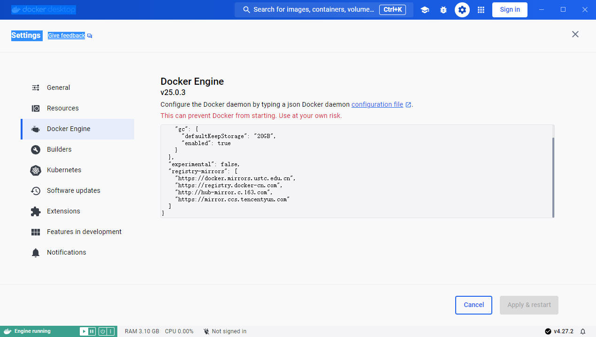

# 基本理论

# Docker 概述

> [!note]
> **问题**： 开发的成果需要在其他机器上部署，配置运行环境很恶心

[Docker](https://www.docker.com/) 对上述问题给出了解决方案：**发成成果时，直接带上环境**。


- **守护进程：** Docker 为 `Server-Client` 模式，守护进程就是 Docker 的 `Server` ，用于管理容器运行、管理镜像包等。
- **镜像：** Docker 打包成果和运行环境（操作系统 + 依赖库）得到的安装包
- **容器：** 所有镜像都运行都在自己的容器内，相互隔离，互不影响。**但是容器不是一个操作系统虚拟机，而是主机上一个模拟操作系统的进程。**
- **仓库：** 存储镜像包的应用市场，官方仓库 [Docker Hub](https://hub.docker.com/)


# 安装

## 下载

根据 [官方文档](https://docs.docker.com/get-docker/) 文档可以快速进行下载安装。

> [!note]
> [WSL2](https://learn.microsoft.com/en-us/windows/wsl/install) 在安装好「内核」后，推荐安装 [Docker Desktop on Windows](https://docs.docker.com/desktop/install/windows-install/)。在 `WSL2` 中能直接使用 `windows` 版的 Docker


```term
triangle@LEARN:~$ docker version 
Client:
 Cloud integration: v1.0.35+desktop.10
 Version:           25.0.3
 API version:       1.44
 Go version:        go1.21.6
 Git commit:        4debf41
 Built:             Tue Feb  6 21:13:00 2024
 OS/Arch:           linux/amd64
 Context:           default

Server: Docker Desktop
 Engine:
  Version:          25.0.3
  API version:      1.44 (minimum version 1.24)
  Go version:       go1.21.6
  Git commit:       f417435
  Built:            Tue Feb  6 21:14:25 2024
  OS/Arch:          linux/amd64
  Experimental:     false
 containerd:
  Version:          1.6.28
  GitCommit:        ae07eda36dd25f8a1b98dfbf587313b99c0190bb
 runc:
  Version:          1.1.12
  GitCommit:        v1.1.12-0-g51d5e94
 docker-init:
  Version:          0.19.0
  GitCommit:        de40ad0
```

## 换源

修改配置文件即可

```json
{
	"registry-mirrors": [
        "https://docker.mirrors.sjtug.sjtu.edu.cn"
    ]
}
```

> [!note]
> 采用 `WSL2` 方案，国内仓库镜像地址只能配置一个，否侧无法下载镜像。


- **Windows**




- **Linux**

```term
triangle@LEARN:~$ sudo vim /etc/docker/daemon.json
```

- **查看源**

```term
triangle@LEARN:~$ docker info 
...
 Insecure Registries:
  hubproxy.docker.internal:5555
  127.0.0.0/8
 Registry Mirrors:
  https://docker.mirrors.sjtug.sjtu.edu.cn
 Live Restore Enabled: false
...
```

## 运行

```term
triangle@LEARN:~$ sudo systemctl start docker // wsl2 配置好就已经启动，不用执行
triangle@LEARN:~$ docker run hello-world
Unable to find image 'hello-world:latest' locally # 会从镜像仓库下载
latest: Pulling from library/hello-world
c1ec31eb5944: Pull complete
Digest: sha256:d000bc569937abbe195e20322a0bde6b2922d805332fd6d8a68b19f524b7d21d
Status: Downloaded newer image for hello-world:latest

Hello from Docker! # 运行成功
This message shows that your installation appears to be working correctly.
...
triangle@LEARN:~$ docker images // 查看镜像
REPOSITORY    TAG       IMAGE ID       CREATED         SIZE
hello-world   latest    d2c94e258dcb   10 months ago   13.3kB
```


