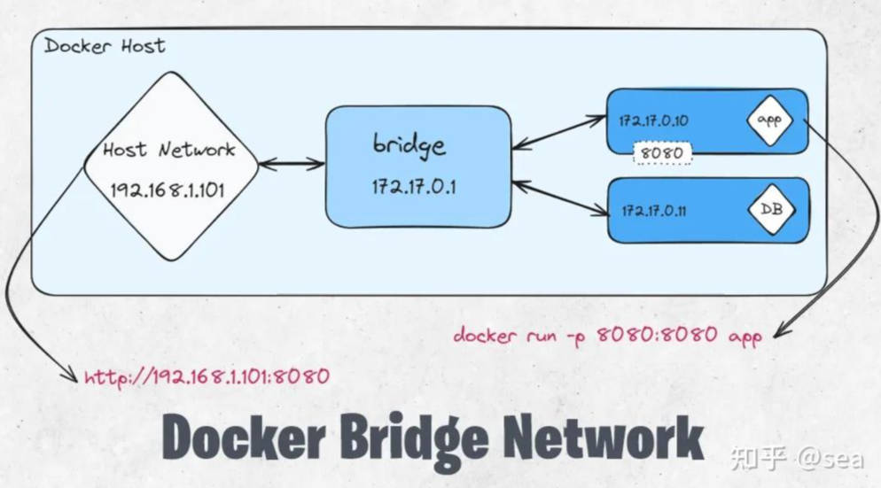
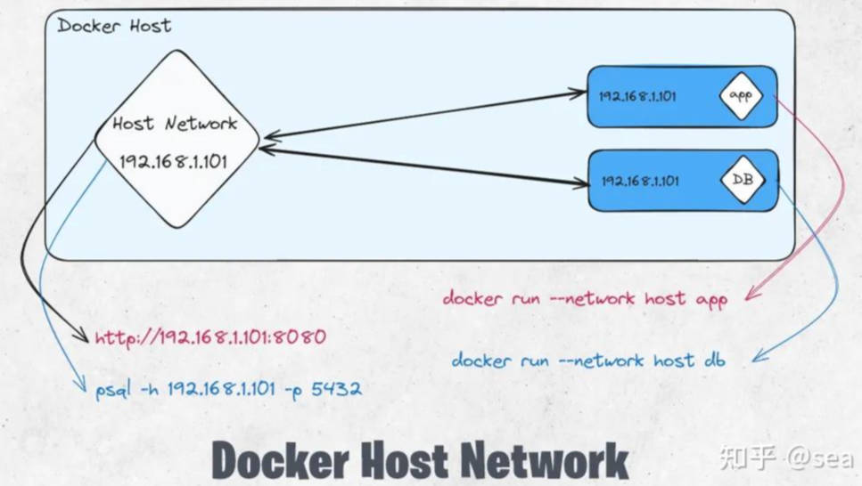

# Docker 网络

# 网络模式

- [详解五种Docker容器的网络模式](https://zhuanlan.zhihu.com/p/682597159)

## 桥接网络



所有容器有各自的 ip 地址，然后把主机当路由器进行网络通信。

```term
triangle@LEARN:~$ docker ps // 创建了两个容器
CONTAINER ID   IMAGE     COMMAND       CREATED          STATUS         PORTS     NAMES
0ff2b963d278   centos    "/bin/bash"   9 minutes ago    Up 9 minutes             centos2
0ef15ae15a6d   centos    "/bin/bash"   59 minutes ago   Up 9 minutes             centos1
triangle@LEARN:~$ docker network ls
NETWORK ID     NAME      DRIVER    SCOPE
5dee61b2893f   bridge    bridge    local    # 默认桥接网络
7bb7cffe8f0c   host      host      local    
e157916b530f   none      null      local
triangle@LEARN:~$ docker network inspect 5dee61b2893f
    ...
            "IPAM": {
            "Driver": "default",
            "Options": null,
            "Config": [
                {
                    "Subnet": "172.17.0.0/16",      # 网关
                    "Gateway": "172.17.0.1"         # 路由地址
                }
            ]
        },
    ...
            "Containers": {                         # 容器网络
            "0ef15ae15a6d170e262c6bdf7ef8dbd95844f2219d43129aec55a5a88332f437": {
                "Name": "centos1",
                "EndpointID": "bee4413f074f998aa88650e0b481b77ec245ca22e383c63604b472a46b95c302",
                "MacAddress": "02:42:ac:11:00:02",
                "IPv4Address": "172.17.0.2/16",
                "IPv6Address": ""
            },
            "0ff2b963d2788834af0111d8becf4d6c50b85f5cac1298ec07b469f752dfedef": {
                "Name": "centos2",
                "EndpointID": "679a549ed90cdc840c85b343d8b4a87e5ea84741e0dac1233001f99303c96a36",
                "MacAddress": "02:42:ac:11:00:03",
                "IPv4Address": "172.17.0.3/16",
                "IPv6Address": ""
            }
        },
    ...
triangle@LEARN:~$ docker exec -it centos1 ping 172.17.0.3 // 容器间通信
PING 172.17.0.3 (172.17.0.3) 56(84) bytes of data.
64 bytes from 172.17.0.3: icmp_seq=1 ttl=64 time=0.047 ms
    ...
triangle@LEARN:~$ docker exec -it centos1 ping www.bilibili.com // 容器透过主机访问外网
PING a.w.bilicdn1.com (61.240.206.10) 56(84) bytes of data.
64 bytes from 61.240.206.10 (61.240.206.10): icmp_seq=1 ttl=63 time=29.8 ms
64 bytes from 61.240.206.10 (61.240.206.10): icmp_seq=2 ttl=63 time=29.8 ms
```

## 主机网络



容器与主机有相同的网络设置，容器没有单独的 IP 地址。相反，它们使用的任何端口都直接链接到主机网络。例如，如果容器进程使用端口 8080，则可以通过 192.168.1.101:8080（即主机的 IP 地址和端口号）访问容器。

```term
triangle@LEARN:~$ docker network ls
NETWORK ID     NAME      DRIVER    SCOPE
5dee61b2893f   bridge    bridge    local    
7bb7cffe8f0c   host      host      local    # 默认主机网络
e157916b530f   none      null      local
triangle@LEARN:~$ docker run -dt --name centos1 --net host centos // 通过 net 将容器网络模式改为 host
5e761db124b4744d17edd984b384aee867f19b1c3a67f7a3257ffaf2f00f8654
triangle@LEARN:~$ docker network inspect 7bb7cffe8f0c
    ...
        "Containers": {
            "5e761db124b4744d17edd984b384aee867f19b1c3a67f7a3257ffaf2f00f8654": {
                "Name": "centos1",
                "EndpointID": "f8c6d8889e90d62db2289bc228134cdd99dff435fd05012f21862f0469e6288f",
                "MacAddress": "",
                "IPv4Address": "",
                "IPv6Address": ""
            }
        },
    ...
triangle@LEARN:~$ ifconfig
eth0: flags=4163<UP,BROADCAST,RUNNING,MULTICAST>  mtu 1500
        inet 172.10.123.218  netmask 255.255.240.0  broadcast 172.18.175.255
    ...
triangle@LEARN:~$ docker exec -it centos1 ping 172.10.123.218 // 连通主机
PING 172.18.166.238 (172.18.166.238) 56(84) bytes of data.
64 bytes from 172.18.166.238: icmp_seq=1 ttl=64 time=1.44 ms
64 bytes from 172.18.166.238: icmp_seq=2 ttl=64 time=0.872 ms
    ...
```

# 容器互联

> [!note]
> `link` 互联容器网络方案不推荐，建议使用自定义网络替代

```term
triangle@LEARN:~$ docker run -dt --link centos1 --name centos3 centos // 通过 link 打通容器网络
f94b1dd307fee5c178c6f98ab0e8ae25d7a59acac229bc7320d5eaf0eab9d729
triangle@LEARN:~$  docker exec -it centos3 ping centos1
PING centos1 (172.17.0.2) 56(84) bytes of data.
64 bytes from centos1 (172.17.0.2): icmp_seq=1 ttl=64 time=0.093 ms
64 bytes from centos1 (172.17.0.2): icmp_seq=2 ttl=64 time=0.037 ms
64 bytes from centos1 (172.17.0.2): icmp_seq=3 ttl=64 time=0.039 ms
    ...
triangle@LEARN:~$ docker inspect centos3 
    ...
            "Links": [  
                "/centos1:/centos3/centos1"     # link 配置是单向的，只能 centos3 请求 centos1
            ],
    ...
triangle@LEARN:~$ docker exec -it centos3 cat /etc/hosts
127.0.0.1       localhost
    ...
172.17.0.2      centos1 0ef15ae15a6d            # link 本质就是在 host 中添加了 centos1 的 ip
172.17.0.4      f94b1dd307fe
    ...
```

# 自定义网络

```term
triangle@LEARN:~$ docker network create --driver bridge --subnet 192.168.0.0/16 --gateway 192.168.0.1 MyNet
3989d944afb7c69d5632b40f365f345ac581ac6fefb25797dd24fe2505d02f30
triangle@LEARN:~$ docker network ls
NETWORK ID     NAME      DRIVER    SCOPE
3989d944afb7   MyNet     bridge    local
5dee61b2893f   bridge    bridge    local
7bb7cffe8f0c   host      host      local
e157916b530f   none      null      local
triangle@LEARN:~$ docker run -dt --name centos2 --net MyNet centos
107f424b261396ff4038f7f80728494e240dbf5a2f15db36192a4981263148cc
triangle@LEARN:~$ docker run -dt --name centos3 --net MyNet centos
cf1aa04763baa209f0c39cd90700e877145a963d86669e8b529d035132bd7dae
triangle@LEARN:~$ docker exec -it centos2 ping centos3 // 同一自定义网络下的容器，能直接通过容器名通信
PING centos3 (192.168.0.3) 56(84) bytes of data.
64 bytes from centos3.MyNet (192.168.0.3): icmp_seq=1 ttl=64 time=0.050 ms
64 bytes from centos3.MyNet (192.168.0.3): icmp_seq=2 ttl=64 time=0.060 ms
    ...
```

# 网络连通

> [!note]
> 实现容器跨网络，访问其他网络下的容器

```term
triangle@LEARN:~$ docker run -dt --name centos4 --net bridge centos
628944e0489eb6b53885e4d8655ce1b662ab9eb4bdcb0b77685146961919e7c0
triangle@LEARN:~$ docker network connect MyNet centos4 // 将 bridge 下的容器连接到 MyNet 网络下
triangle@LEARN:~$ docker network inspect MyNet
    ...
        "Containers": {
            "107f424b261396ff4038f7f80728494e240dbf5a2f15db36192a4981263148cc": {
                "Name": "centos2",
                "EndpointID": "3f56160aa1d18b21e97dbcd64c3100bf5ea4c617b697101b41a0add2bc3f0cb7",
                "MacAddress": "02:42:c0:a8:00:02",
                "IPv4Address": "192.168.0.2/16",
                "IPv6Address": ""
            },
            "628944e0489eb6b53885e4d8655ce1b662ab9eb4bdcb0b77685146961919e7c0": {       
                "Name": "centos4",      # 直接在 MyNet 网络下添加
                "EndpointID": "ff308b69a2c2a2053e87fd0df851509c4588a06c92a756e412ca3f3708319440",
                "MacAddress": "02:42:c0:a8:00:04",
                "IPv4Address": "192.168.0.4/16",
                "IPv6Address": ""
            },
            "cf1aa04763baa209f0c39cd90700e877145a963d86669e8b529d035132bd7dae": {
                "Name": "centos3",
                "EndpointID": "da023491ff991425a31cb2739b54d3b3d080adf24fe98d6c626a0151b4be496d",
                "MacAddress": "02:42:c0:a8:00:03",
                "IPv4Address": "192.168.0.3/16",
                "IPv6Address": ""
            }
        },
    ...
triangle@LEARN:~$ docker exec -it centos4 ip addr // 在 centos4 中创建了两个网络下的 IP
1: lo: <LOOPBACK,UP,LOWER_UP> mtu 65536 qdisc noqueue state UNKNOWN group default qlen 1000
    link/loopback 00:00:00:00:00:00 brd 00:00:00:00:00:00
    inet 127.0.0.1/8 scope host lo
       valid_lft forever preferred_lft forever
16: eth0@if17: <BROADCAST,MULTICAST,UP,LOWER_UP> mtu 1500 qdisc noqueue state UP group default
    link/ether 02:42:ac:11:00:02 brd ff:ff:ff:ff:ff:ff link-netnsid 0
    inet 172.17.0.2/16 brd 172.17.255.255 scope global eth0
       valid_lft forever preferred_lft forever
18: eth1@if19: <BROADCAST,MULTICAST,UP,LOWER_UP> mtu 1500 qdisc noqueue state UP group default
    link/ether 02:42:c0:a8:00:04 brd ff:ff:ff:ff:ff:ff link-netnsid 0
    inet 192.168.0.4/16 brd 192.168.255.255 scope global eth1
       valid_lft forever preferred_lft forever
```

