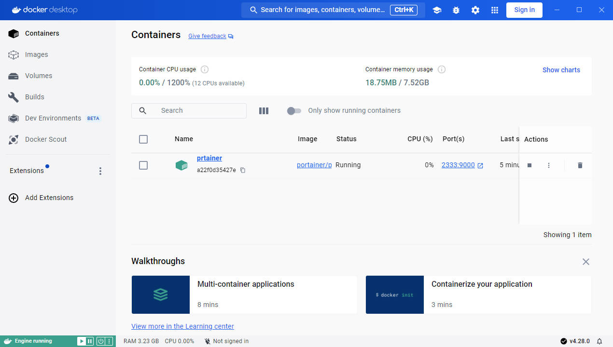

# 可视化工具

# 官方客户端



# portainer

1. 安装

```term
triangle@LEARN:~$ docker run -d -p 2333:9000 -v /var/run/docker.sock:/var/run/docker.sock --restart=always --name prtainer portainer/portainer
-v : 将主机文件系统挂载到容器
--restart : 重启策略。容器退出时，是否重启容器
triangle@LEARN:~$ file /var/run/docker.sock // 用于与 docker 服务通信的 sock 文件
/var/run/docker.sock: socket
```

2. 使用

```term
triangle@LEARN:~$ ipconfig.exe 
    ...
以太网适配器 vEthernet (WSL):

   连接特定的 DNS 后缀 . . . . . . . :
   本地链接 IPv6 地址. . . . . . . . : fe80::ca1b:10c3:b774:dead%73
   IPv4 地址 . . . . . . . . . . . . : 172.18.160.1    # wsl2 的本机 ip 地址
   子网掩码  . . . . . . . . . . . . : 255.255.240.0
   默认网关. . . . . . . . . . . . . :
   ...
triangle@LEARN:~$ curl 172.18.160.1:2333 // 请求成功，2333 为启动 portainer 时的本机映射端口
<!doctype html><html lang="en" ng-app="portainer" ng-strict-di data-edition="CE"><head><meta charset="utf-8"/><title>Portainer</title><meta name="description" content=""/><meta name="author" content="Portainer.io"/><meta http-equiv="cache-control" content="no-cache"/><meta http-eq .... 
```

3. 使用浏览器查看


