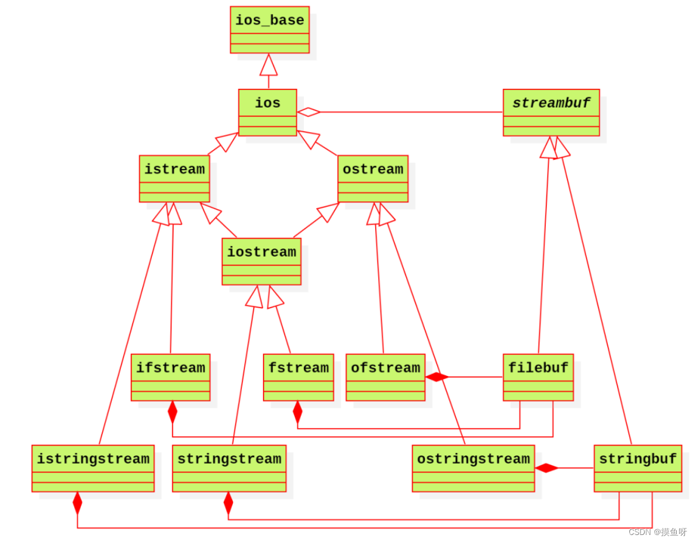

# Stream

# `std::ios`



在 `c++` 中提供了三类基本流实现：
- `std::iostream` : 标准输入输出流
- `std::fstream` : 文件流
- `std::stringstream` : 字符流

每一类流内部都有一个 `std::streambuf` 用作缓冲区。缓冲区的实现又存在两个基本实现：
- `std::filebuf` : 文件缓冲区，主要用于文件读写
- `std::stringbuf`: 字符缓冲区，提供字符串的格式化读取和输出操作


```cpp

#include <iostream>

int main(){
    std::stringbuf buf;

    // 为流指定缓冲区
    std::iostream io(&buf);
}
```


# 读/写

「流」对「缓冲区」的操作主要为
- **读**: 将数据从缓冲区中读出
- **写**: 将数据写入缓冲区

读写方式又分为两类：
- **格式化**: 所有数据都当作字符，例如 `123` 的读写，将数据视作字符串，对 `'1'、'2'、'3'` 这三个字符的读写
- **二进制**: 以二进制形式读写数据，例如 `123` 的读写，便是对 `0x007b` 二进制的读写


```cpp
#include <iostream>
#include <fstream>

int main(){

    /* 
        流符号 >> 与 << 对数据的读写默认均是「格式化」形式
     */
    int a;
    std::cin >> a;
    std::cout << 123;

    /* 通过指定 std::ios_base::binary 则对数据的读写为二进制形式 */
    std::fstream fs;
    fs.open("file.txt", std::ios_base::in | std::ios_base::binary);
}
```

# streambuf

```cpp

/* NOTE - 伪代码, 实际不是这样的 */
class streambuf{

protected:
    /* put 写操作三个指针 */
    char_type* pbase(); // pbeg
    char_type* pptr(); // pnext
    char_type* epptr(); // pend
    void setg(char_type*  pbeg,char_type* pnext,char_type* pend);

    /* get 读操作三个指针 */
    char_type* eback(); // gbeg
    char_type* gptr(); // gnext
    char_type* egptr(); // gend
    void setp(char_type* gbeg,char_type* gnext,char_type* gend);

protected:
    /* 缓冲区配置 */
    // 设置缓冲区
    virtual streambuf * setbuf(char_type*, streamsize); 
    // 根据相对位置移动内部指针
    virtual pos_type seekoff(off_type, ios_base::seekdir, ios_base::openmode);
    // 根据绝对位置移动内部指针
    virtual pos_type seekpos(pos_type, ios_base::openmode);
    // 同步缓冲区数据(flush)，默认什么都不做
    virtual int sync();
    //  流中可获取的字符数，默认返回0
    virtual streamsize showmanyc();

    /* get 操作 */
    // 当get缓冲区不可用时调用，用于获取流中当前的字符，
    // 注意获取和读入的区别，获取并不使gnext指针前移
    // 空则返回EOF
    virtual int_type underflow();
    // 默认返回 underflow()，并使gnext++
    virtual int_type uflow();
    // 从流中读取n个字符到缓冲区s中并返回读到的字符数
    // 默认从当前缓冲区中读取n个字符，若当前缓冲区不可用，则调用一次uflow()
    virtual streamsize xsgetn(char_type* __s, streamsize __n);
    // 回写失败时调用
    virtual int_type pbackfail(int_type __c _IsUnused  = traits_type::eof());

    /* put 操作 */
    // 将缓冲区s的n个字符写入到流中并返回写入的字符数；与输入函数的xsputn相对
    virtual int_type overflow(int_type __c _IsUnused  = traits_type::eof());
    // 当put缓冲区不可用时调用，向流中写入一个字符；当c==EOF时，流写入结束；与输入函数的uflow()相对
    virtual streamsize xsputn(const char_type* __s, streamsize __n);

public:
    /* 缓冲区 */
    pubsetbuf : setbuf()
    pubseekoff : seekoff()
    pubseekpos : seekpos()
    pubsync : sync()

    /* get 操作 */
    in_avail : (用于get的)缓冲区内还有多少个字符可获取，缓冲区可用时返回glast-gnext，否则返回showmanyc()
    snextc : return sbumpc() == EOF ? EOF : sgetc()
    sbumpc : 缓冲区不可用时返回uflow()；否则返回(++gnext)[-1]
    sgetc : 缓冲区不可用时返回underflow()；否则返回*gnext
    sgetn : xsgetn()
    sputbackc : 缓冲区不可用时返回pbackfail(c)；否则返回*(--gnext)
    sungetc : 类似于sputbackc，不过默认调用pbackfail(EOF)

    /* set 操作 */
    sputc : (用于put操作的)缓冲区不可用时，返回overflow(c)；否则*pnext++ = c，返回pnext
    sputn : xsputn()
};

```


