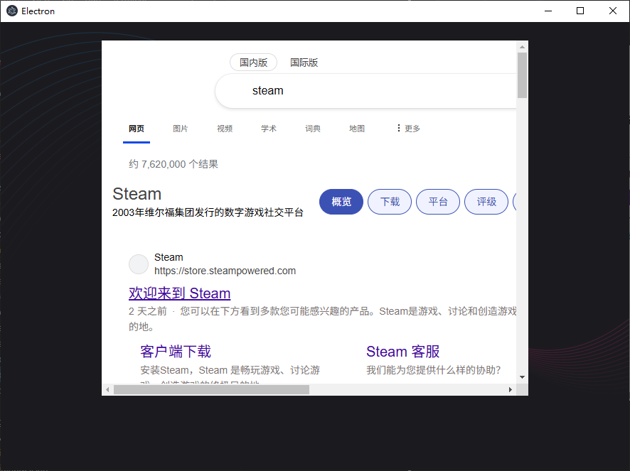

# 配置


# 工程配置

## 介绍

通过  `electron.vite.config.ts` 配置文件可对 `electron-vite` 项目工程进行配置


```ts
import { resolve } from 'path'
import { defineConfig, externalizeDepsPlugin } from 'electron-vite'
import vue from '@vitejs/plugin-vue'

export default defineConfig({
  // 主进程配置
  main: {
    plugins: [externalizeDepsPlugin()]
  },
  // 消息通信配置
  preload: {
    plugins: [externalizeDepsPlugin()]
  },
  // 渲染框架配置，例如配置 vue、react 等前端界面框架
  renderer: {
    resolve: {
      alias: {
        '@renderer': resolve('src/renderer/src')
      }
    },
    plugins: [vue()]
  }
})
```

## renderer

### 快捷导入

在`import`时都使用 `./` 或 `../` 来导入模块就会特别繁琐，而且容易出错。因此，可在 `alias` 选项下配置工程路径的名称，便于快速导入

```ts
export default defineConfig({
    ...
  renderer: {
    resolve: {
      alias: {
        // 配置快捷导入别名
        '@renderer': resolve('src/renderer/src'),
        '@store' : resolve('src/renderer/src/store')
      }
    },
    plugins: [vue()]
  }
    ....
})
```

使用

```ts
import {useNumber} from '@store/number.ts'
```

### 跨域代理

> [!note|style:flat]
>  [跨域问题](https://spite-triangle.github.io/cpp_notes/#/vue/chapter/config) 


解决方案
- 跨域代理设置只能解决「开发环境」中的跨域问题
- 正式环境一般情况不存在跨域问题，**因为打包结果是「客户端」，而非「浏览器」**
- 正式环境中特殊情况
  - 「反向代理服务器」协助跨域请求
  - 将跨域请求转给「主进程」，主进程请求成功后，把结果传递给「渲染进程」

```ts
export default defineConfig({
    ...
  renderer: {
        ....
    // 代理服务设置
    server:{
      proxy: {
        '/bingapi': {
          target: ' https://cn.bing.com',
          changeOrigin: true,
          rewrite: (path) => path.replace(/^\/bingapi/, '')
        }
      }
    },
  }
})
```

- `App.vue`

```vue
<template>
    <iframe src="/bingapi/search?q=steam" frameborder="0" class="window" ></iframe>
</template>

<style scoped>
.window {
    width: 600px;
    height: 500px;
}
</style>
```




# 环境变量

## 环境变量文件


```term
triangle@LEARN:~$ tree ./build/
./build/
├── .env.development  # 开发环境
└── .env.prodution    # 正式环境
```

### 工程配置

- `electron.vite.config.ts`

```ts
// 配置文件与资源所在路径
const publicDir = resolve('resources')
const envDir = resolve('build')

export default defineConfig({
  ...
  renderer: {
    publicDir: publicDir,
    envDir: envDir,     // 将本地路径指定给 renderer
    envPrefix: 'VITE_', // 环境变量前缀
    ...
  }
})
```

### 使用

- `.env.xxx`

```ini
VITE_NODE_ENV = development
VITE_PROXY_ENABLE = true
VITE_PROXY_URL = 'http://xxx'
```

使用

```ts
// 所有环境变量均储存在  import.meta.env 对象中
import.meta.env

// 访问配置项
import.meta.env.VITE_NODE_ENV
```


> [!tip]
> 由于 `electron-vite` 工程项目就是使用的 `vite`，因此在「渲染进程」与「主进程」均能访问到环境变量配置

