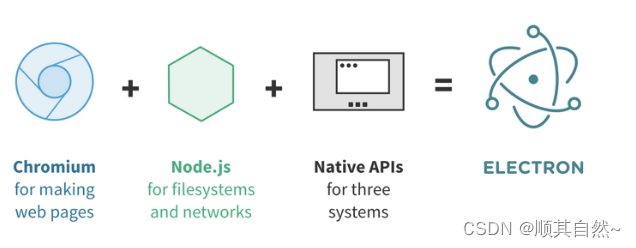
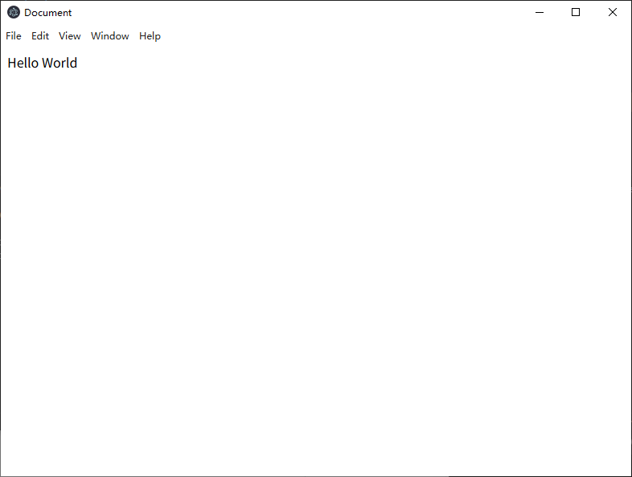
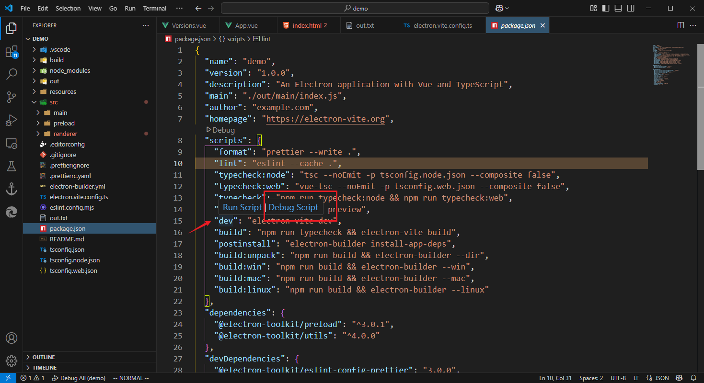

# 基本概念

# electron

[Electron](https://www.electronjs.org/zh/docs/latest/) : 使用 `JavaScript(TypeScript)、HTML、CSS` 构建跨平台（Windows、MacOs、Linux）的桌面应用开发框架。该框架基于 `Chromium` 与 `Nodejs` 实现，因此可无缝使用 `web` 前端的界面库进行桌面应用开发。




# 工程构建

> 安装 [NodeJs](https://nodejs.org/zh-cn)

## 传统工程

>[!note]
> 使用 `cnpm` 代替 `npm` 进行 `electron` 安装，`npm` 安装会卡住。

```term
triangle@LEARN:~$ npn init -y   // 初始化 nodejs 工程
triangle@LEARN:~$ npm install -g cnpm --registry=https://registry.npmmirror.com // 安装国内版 npm
triangle@LEARN:~$ cnpm install --save-dev electron // 安装 electron
triangle@LEARN:~$ tree .
.
├── node_modules        # 模板文件夹
├── index.html          # 主界面
├── index.js            # 入口
└── package.json        # 工程配置文件
```

- `index.html`

```html
<!DOCTYPE html>
<html lang="en">
<head>
    <meta charset="UTF-8">
    <meta name="viewport" content="width=device-width, initial-scale=1.0">
    <title>Document</title>
</head>
<body>
     <div>
        Hello World 
     </div>
</body>
</html>
```

- `index.js`

```js
const { app, BrowserWindow } = require('electron')

const createWindow = () => {
    // 创建主窗口
    const win = new BrowserWindow({
        width: 800,
        height: 600
    })

    // 加载主界面
    win.loadFile('index.html')
}

// 应用程序启动
app.whenReady().then(() => {
    createWindow()
})
```

- `package.json`

```json
{
    "name": "electron",
    "version": "1.0.0",
    "main": "index.js",             // 程序入口
    "scripts": {
        "start": "electron .",      // 启动程序命令
        "test": "echo \"Error: no test specified\" && exit 1"
    },
    "keywords": [],
    "author": "",
    "license": "ISC",
    "description": "",
    "devDependencies": {
        "electron": "^35.2.1"
    }
}
```

```term
triangle@LEARN:~$ npm run start
```




> [!note|style:flat]
> 使用传统方案构建 `electron` 构建应用程序特别繁琐，每一个界面都需要单独定义一个 `html` 界面，**不推荐使用**

## vue3 工程

[vue](https://cn.vuejs.org/) 是目前比较流行的一个 `web` 前端开发框架，相比于传统的纯手撸 `html` 脚本，基于 `vue` 进行界面开发更简便，且 `vue` 还拥有较多的 UI 组件库，对非前端开发人员来说使用更加友好。

```term
triangle@LEARN:~$ npm install -g cnpm --registry=https://registry.npmmirror.com // 安装国内版 npm
triangle@LEARN:~$ npm create @quick-start/electron // 通过脚手架创建项目
triangle@LEARN:~$ cnpm i // 安装依赖包，使用 npm 容易卡住
```

>[!warning|style:flat]
> 该方式构建项目，请先学习 [vue3](https://spite-triangle.github.io/cpp_notes/#/vue/README)，**且该笔记将只详细介绍 vue 工程的开发方式**。


```term
triangle@LEARN:~$ tree .
.
├── node_modules                # 依赖库
├── build                       # 打包配置
├── resources                   # 资源目录
├── src                         # 项目
│   ├── main                    # 主进程，控制应用程序
│   │   └── index.ts
│   ├── preload                 # 主进程与渲染进程通信的中间件
│   │   ├── index.d.ts
│   │   └── index.ts
│   └── renderer                # 渲染进程，vue 项目工程
│       ├── index.html
│       └── src
├── package.json                # 工程配置文件
├── electron-builder.yml        
├── electron.vite.config.ts     # electron-vite 配置文件
├── eslint.config.mjs
├── tsconfig.json
├── tsconfig.node.json
├── tsconfig.web.json
└── README.md
```

# 调试

## debug 

1. 打开 `package.json`
2. 找到 `scripts` 配置项
3. 点击 `debug script` 即可进入调试模式

    

## 开发工具

在浏览器中可以按 `f12` 打开 `web` 开发工具， `electron` 客户端程序中也可以启用该开发工具进行 UI 界面开发。

```ts
function createWindow(): void {

  // Create the browser window.
  const mainWindow = new BrowserWindow({
    width: 900,
    height: 670,
    show: false,
    autoHideMenuBar: true,
    ...(process.platform === 'linux' ? { icon } : {}),
    webPreferences: {
      preload: join(__dirname, '../preload/index.js'),
      sandbox: false
    }
  })

  // NOTE - 创建的窗口打开开发工具
  mainWindow.webContents.openDevTools()
    ....
}
```

> [!tip]
> 默认使用 `ctrl + shift + i` 键可打开开发工具

# 打包

1. 给 `powershell` 挂梯子，**代理软件可能无法自动给终端挂梯子**

```term
triangle@LEARN:~$  // 在 powshell 中直接输入以下内容
if (!(Test-Path -Path $PROFILE)) {
    New-Item -ItemType File -Path $PROFILE -Force
}
triangle@LEARN:~$  notepad $PROFILE // 打开上面创建的脚本文件，修改代理地址

function proxy {
    $env:http_proxy = "http://127.0.0.1:10809"
    $env:https_proxy = "http://127.0.0.1:10809"
    [System.Net.WebRequest]::DefaultWebProxy = New-Object System.Net.WebProxy("http://127.0.0.1:10809")
    Write-Host "Proxy enabled: http://127.0.0.1:10809" -ForegroundColor Green
}

function unproxy {
    $env:http_proxy = $null
    $env:https_proxy = $null
    [System.Net.WebRequest]::DefaultWebProxy = $null
    Write-Host "Proxy disabled" -ForegroundColor Yellow
}

function check-proxy {
    if ($env:http_proxy -or $env:https_proxy) {
        Write-Host "Current proxy settings:" -ForegroundColor Cyan
        Write-Host "HTTP Proxy: $env:http_proxy"
        Write-Host "HTTPS Proxy: $env:https_proxy"
    } else {
        Write-Host "No proxy is currently set." -ForegroundColor Cyan
    }
}
```

2. 以 **「管理员」** 权限重启 `powshell`，打包程序可能会在 `c` 盘创建文件，因此必须给管理员权限
3. 启动代理

```term
triangle@LEARN:~$ proxy // 启动代理
triangle@LEARN:~$ unproxy // 关闭代理
triangle@LEARN:~$ check-proxy // 检查代理
```

4. 执行打包

```json
/* package.json */
  "scripts": {
        ...
    "build:unpack": "npm run build && electron-builder --dir",
    "build:win": "npm run build && electron-builder --win",
    "build:mac": "npm run build && electron-builder --mac",
    "build:linux": "npm run build && electron-builder --linux"
        ...
  },
```

```term
triangle@LEARN:~$ npm run build:win // 打包 window 程序
triangle@LEARN:~$ npm run build:upack // 只生成可执行程序，不打包 
```

>[!note]
> 出现打包异常，需要手动删除 `C:\Users\主机名\AppData\Local` 下的 `electron` 与 `electron-builder` 文件夹

