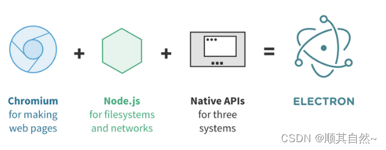

# 进程模型

# 流程模型



`electron` 平台环境主要就三大部分
- **主进程** ： `nodejs` 环境，管理所有的界面（即渲染进程），且封装操作系统接口
- **渲染进程** ： `chromium` 浏览器环境，通过 `web` 技术实现界面窗口
- **进程通信** ： 实现「主进程」与 「渲染进程」的消息通信


```term
triangle@LEARN:~$ tree ./src
 ./src
 ├── main                    # 主进程，控制应用程序
 │   └── index.ts
 ├── preload                 # 主进程与渲染进程通信的中间件
 │   ├── index.d.ts
 │   └── index.ts
 └── renderer                # 渲染进程，vue 项目工程
     ├── index.html
     └── src
```

# 主进程

- `main/index.ts`

```ts
import { app, shell, BrowserWindow, ipcMain } from 'electron'
import { join } from 'path'
import { electronApp, optimizer, is } from '@electron-toolkit/utils'
import icon from '../../resources/icon.png?asset'

// 窗口创建函数
function createWindow(): void {
    
    // 主界面创建
    const mainWindow = new BrowserWindow({
        width: 900,
        height: 670,
        show: false,
        autoHideMenuBar: true,
        ...(process.platform === 'linux' ? { icon } : {}),
        webPreferences: {
            preload: join(__dirname, '../preload/index.js'),
            sandbox: false
        }
    })

    // 窗口准备完成后，加载「渲染进程」
    mainWindow.on('ready-to-show', () => {
        mainWindow.show()
    })

    mainWindow.webContents.setWindowOpenHandler((details) => {
        shell.openExternal(details.url)
        return { action: 'deny' }
    })

    // 区分「正式环境」与「开发环境」的界面加载方式
    if (is.dev && process.env['ELECTRON_RENDERER_URL']) {
        mainWindow.loadURL(process.env['ELECTRON_RENDERER_URL'])
    } else {
        mainWindow.loadFile(join(__dirname, '../renderer/index.html'))
    }
}

// 等价于 app.on('ready',()=>{})
app.whenReady().then(() => {
    // Set app user model id for windows
    electronApp.setAppUserModelId('com.electron')

    // `f12` 打开开发者工具，且在正式版本忽略 `ctrl + r` 刷新按键
    app.on('browser-window-created', (_, window) => {
        optimizer.watchWindowShortcuts(window)
    })

    // IPC test
    ipcMain.on('ping', () => console.log('pong'))

    // 窗口创建
    createWindow()

    // 应用被激活事件
    app.on('activate', function () {
        // 同样兼 MacOS 的窗口切换
        if (BrowserWindow.getAllWindows().length === 0) {
            createWindow()
        } 
    })
})

app.on('window-all-closed', () => {
    // 'darwin' ： 苹果系统
    // 该判断是在兼容 MacOS 窗口切换
    if (process.platform !== 'darwin') {
        app.quit()
    }
})
```


# 预加载脚本

## 介绍

负责「主进程」与「渲染进程」的通信，**本身运行在「渲染环境」**，但是可以调用部分 `nodejs` 的接口。

## 脚本

```term
triangle@LEARN:~$ tree ./src/preload
 ./preload
 ├── index.d.ts             # 接口定义文件
 └── index.ts               # 脚本代码
```

- **加载脚本**

```ts
// 窗口创建
const mainWindow = new BrowserWindow({
    ....
    webPreferences: {
        // 设置预加载脚本的绝对路径
        // NOTE - 该脚本在渲染进程中执行
        preload: join(__dirname, '../preload/index.js'),
        sandbox: false
    }
})
```

- `preload/index.ts`

```ts
import { contextBridge } from 'electron'
import { electronAPI } from '@electron-toolkit/preload'

// 通过 api 可以封装渲染进程与主进程的通信接口
const api = {}

if (process.contextIsolated) {
    try {
        // 将 electronAPI 、api 对象暴露给「渲染进程」
        contextBridge.exposeInMainWorld('electron', electronAPI)
        contextBridge.exposeInMainWorld('api', api)
    } catch (error) {
        console.error(error)
    }
} else {
    // @ts-ignore : ts 指令，非注释。用于告诉 ts 编译器忽略当前类型检查
    // @ts-ignore (define in dts)
    window.electron = electronAPI
    // @ts-ignore (define in dts)
    window.api = api
}
```
 
根据 `process.contextIsolated` 是否启用，`contextBridge` 的调用形式不同
- `true` : 在渲染进程使用 `electron.ipcRenderer`
- `false` : 在渲染进程使用 `window.electron.ipcRenderer` 


- `preload/index.d.ts`

上述暴露方式无对象类型，不符合 `TypeScript` 规范，因此需要定义一个 `index.d.ts`来声明对象类型

```ts
import { ElectronAPI } from '@electron-toolkit/preload'

declare global {
    interface Window {
        electron: ElectronAPI   // electron 的类型定义
        api: unknown            // api 的类型定义
    }
}
```


# 进程通信

## 流程

通过「预加载脚本」将 `electronAPI` 对象暴露给「渲染进程」，通过 `electronAPI` 便能实现渲染进程与主进程的通信
- 渲染进程: 通过 `ipcRenderer` 消息通信
- 主进程 ： 通过 `ipcMain`  消息通信

## 渲染进程 -> 主进程

### send

```vue
<template>
    <button @click="invoke">invoke</button>    
</template>

<script setup lang="ts">
    // 导入的 electronAPI 与 window.electron 等价
    import { electronAPI } from '@electron-toolkit/preload';
    
    function invoke(){
        // 往名为 'message' 的 channel 发送消息
        window.electron.ipcRenderer.invoke('message', 'Hello from Vue 3');

    }
</script>
```

在主线程监听消息

```ts
import { ipcMain } from 'electron'

// `send` 使用 `on` 监听
ipcMain.on('message', (event, msg) => {
    console.log(msg)
})
```

### invoke

在渲染进程发送消息

```vue
<template>
    <button @click="invoke">invoke</button>    
</template>

<script setup lang="ts">
    function invoke(){
        // 往名为 'message' 的 channel 发送消息
        let res = window.electron.ipcRenderer.invoke('message', 'Hello from Vue 3');

        // 接收主进程的对于消息的处理结果
        res.then((result) => {
            console.log(result);
        }).catch((error) => {
            console.error(error);
        });
    }
</script>
```

在主线程监听消息，并返回消息处理结果

```ts
import { ipcMain } from 'electron'

// `invoke` 使用 `handle` 监听
ipcMain.handle('message', (event, msg) => {
    console.log(msg)

    // 返回处理结果给渲染进程
    return 'main process received message: ' + msg
})
```

## 主进程 -> 渲染进程

主进程发送消息

```ts
const mainWindow = new BrowserWindow({
    width: 900,
    height: 670,
    show: false,
    autoHideMenuBar: false,
    ...(process.platform === 'linux' ? { icon } : {}),
    webPreferences: {
        preload: join(__dirname, '../preload/index.js'),
        sandbox: false
    }
})

mainWindow.on('ready-to-show', () => {
    mainWindow.show()

    // 通过 webContents 发送消息
    mainWindow.webContents.send('demo', 'message')
})
```

渲染进程接收消息

```vue
<script setup lang="ts">
    window.electron.ipcRenderer.on('demo',(event, arg) => {
        alert(arg)
    });
</script>
```


