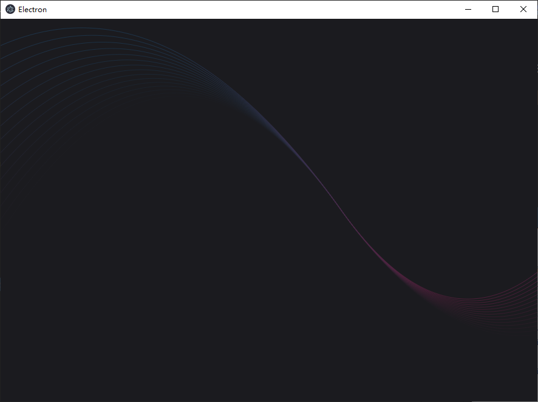
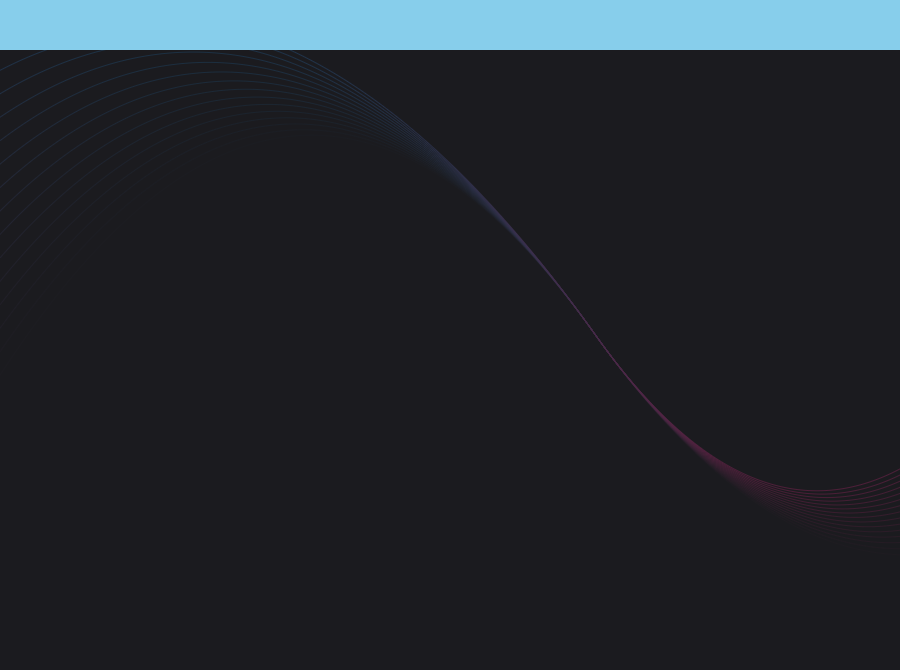

# 窗口

# 窗口创建

```ts
import { shell,BrowserWindow } from 'electron'

// 创建窗口
const mainWindow = new BrowserWindow({
    width: 900,         // 窗口宽高
    height: 670,
    x: 0,               // 窗口在界面上的位置，默认居中
    y: 0,
    show: false,        // 窗口显示
    resizable:true,     // 窗口是否可缩放
    alwaysOnTop: false, // 窗口置顶
    transparent: false, // 窗口透明，仅在无边框窗口生效
    autoHideMenuBar: true,
    ...(process.platform === 'linux' ? { icon } : {}),
    webPreferences: {
        preload: join(__dirname, '../preload/index.js'),
        sandbox: false
    }
})

// 锁定
// NOTE - 跨平台存在兼容问题，别用。还是通过捕获事件自定义实现
mainWindow.isKiosk()
mainWindow.setKiosk(false)

// 修改窗口宽高，位置
mainWindow.setBounds({
    x: 0,
    y: 0,
    width: 900,
    height: 670
})

// 监听 'ready-to-show' 事件
mainWindow.on('ready-to-show', () => {
    mainWindow.show()
})

mainWindow.webContents.setWindowOpenHandler((details) => {
    shell.openExternal(details.url)
    return { action: 'deny' }
})

// 当前窗口展示界面的入口文件
// is.dev 判断当前是否为开发版：
// - 开发版 : 界面显示的 `html` 会以服务形式提供，便于 web 调试
// - 发布版 : 界面展示的 `html` 就为本地静态文件，比开发版性能要好
if (is.dev && process.env['ELECTRON_RENDERER_URL']) {
    mainWindow.loadURL(process.env['ELECTRON_RENDERER_URL'])
} else {
    mainWindow.loadFile(join(__dirname, '../renderer/index.html'))
}
```

# 窗口类型

## 原生窗口

使用默认形式生成的窗口，展示样式与操作系统一致



## 无边框

### 渲染进程拖拽

```ts
const mainWindow = new BrowserWindow({
    width: 900,
    height: 670,
    show: false,
    titleBarStyle: 'hidden',    // 隐藏 title bar
    frame: false,               // 无边框
    autoHideMenuBar: true,
    ...(process.platform === 'linux' ? { icon } : {}),
    webPreferences: {
        preload: join(__dirname, '../preload/index.js'),
        sandbox: false
    }
})
```

在窗口创建时设置 `titleBarStyle` 便能隐藏窗口默认边框，但是也将关闭、放大、缩小、拖拽等功能也一起屏蔽了

```vue
<template>
    <!-- 为窗口自定义标签，实现关闭、放大、缩小、拖拽  --> 
    <div class="title"></div>
</template>

<style scoped>
.title {
    position: absolute; 
    width: 100vw;
    height: 50px;
    top: 0; 
    bottom : 0;
    left : 0;
    right : 0;
    background-color: skyblue;
    /* 为 title 开启拖拽移动功能 
        - drag : 选择器选中区域启用拖拽
        - no-drag : 选择器选中区域关闭拖拽
    */
    -webkit-app-region: drag;      
}
</style>
```



### 主进程拖拽

实现思路为在渲染界面捕获到鼠标事件后，将对应坐标数据传递给主进程，然后通过主进程来修改窗口位置

```vue

<template>
     <div class="title" @mousedown="onMouseDown"></div>
</template>

<style scoped>
.title {
    position: absolute; 
    width: 100vw;
    height: 50px;
    top: 0;
    background-color: skyblue;
}
</style>

<script setup lang="ts">
    let isMouseDown = false;
    let mouseDownX = 0;
    let mouseDownY = 0;
    
    // title 被点击事件
    function onMouseDown(event:MouseEvent){
        isMouseDown = true;
        // 界面内的坐标，即记录鼠标相对于窗口左上角的偏移量
        mouseDownX = event.x;
        mouseDownY = event.y;
        
        // 窗口移动事件
        document.onmousemove = (ev) =>{
            if(isMouseDown){
                // 鼠标移动后，窗口坐左上角移动后的坐标
                let data = {
                    x: ev.screenX - mouseDownX,
                    y: ev.screenY - mouseDownY
                }
                
                // 将坐标传递给主进程
                window.electron.ipcRenderer.invoke('window-move', data)
            }
        }

        // 窗口鼠标抬起事件
        document.onmouseup = (ev) => {
            isMouseDown = false;
            document.onmousemove = null;
            document.onmouseup = null;
        }
    }
</script>
```

窗口更新坐标位置

```ts
const mainWindow = new BrowserWindow({
    width: 900,
    height: 670,
    show: false,
    titleBarStyle: 'hidden',
    autoHideMenuBar: true,
    ...(process.platform === 'linux' ? { icon } : {}),
    webPreferences: {
        preload: join(__dirname, '../preload/index.js'),
        sandbox: false
    }
})

    ...

// 监听移动事件
ipcMain.handle('window-move', (event, data) => {
    mainWindow.setBounds({
        x: data.x,
        y: data.y,
    })
})
```

### 放大/缩小/关闭

```vue

<template>
     <div class="title">
        <button @click="close">关闭</button>
        <button @click="minimize">最小化</button>
        <button @click="maximize">最大化</button>
     </div>
</template>

<style scoped>
.title {
    position: absolute; 
    width: 100vw;
    height: 50px;
    top: 0;
    background-color: skyblue;
}
</style>

<script setup lang="ts">
    function close() {
        window.electron.ipcRenderer.send('close');
    }
    function minimize() {
        window.electron.ipcRenderer.send('minimize');
    }
    function maximize() {
        window.electron.ipcRenderer.send('maximize');
    }
</script>
```

主进程处理事件

```ts
const mainWindow = new BrowserWindow({
    width: 900,
    height: 670,
    show: false,
    titleBarStyle: 'hidden',
    autoHideMenuBar: true,
    ...(process.platform === 'linux' ? { icon } : {}),
    webPreferences: {
        preload: join(__dirname, '../preload/index.js'),
        sandbox: false
    }
})
    ...
ipcMain.on('close', () => {
    // 关闭窗口
    mainWindow.close()

    // 退出
    app.quit()
})
ipcMain.on('minimize', () => {
    mainWindow.minimize()
})
ipcMain.on('maximize', () => {
    mainWindow.maximize()
})
```

# 子窗口创建

## 实现思路

`electon` 与 `vue` 开发方案中，子窗口创建通过 `vue` 的 `route` 实现。**每一个窗口均是一个路由中的视图界面，整个项目工程只有一个 `.html` 文件，其余界面均通过`.vue`实现。**


```term
triangle@LEARN:~$ tree ./src
./src
├── main
│   ├── index.ts
│   └── windows
│       ├── context.ts      # 记录子窗口的上下文
│       └── sub.ts          # 子窗口创建
├── preload
└── renderer
    ├── index.html
    └── src
        ├── assets
        ├── components
        ├── main.ts
        ├── App.vue
        ├── route           # 路由
        │   └── index.ts
        └── view            # 界面视图
            ├── Home.vue
            └── Sub.vue
```

## 路由视图

`vue` 框架中路由见 [route](https://spite-triangle.github.io/cpp_notes/#/vue/chapter/route)，下文只描述主要配置

- `route/index.ts`

```ts
const router = createRouter({
    history:createWebHashHistory(), // hash 路由
    routes:[ 
        {
            path:'/', 
            component: Home     // 主见面视图 Home.vue
        },
        {
            path:'/Sub',
            component: Sub      // 子界面视图 Sub.vue
        },
    ]
})
```

> [!note|style:flat]
> `electron` 正式环境只支持配置 `hash` 路由


- `App.vue` : 应用界面只展示 `RouterView`，具体展示界面靠路由切换

```vue
<template>
    <RouterView></RouterView> 
</template>

<script setup lang="ts">
    import { RouterView } from 'vue-router';
</script>
```

- `view/Home.vue` ： 主视图，显示可打开子界面的按钮

```vue
<template>
    <button @click="openSub">子界面</button>
</template>

<script setup lang="ts">
    function openSub() {
        window.electron.ipcRenderer.send('open-sub')
    }
</script>
```

- `view/Sub.vue` : 子视图，子界面展示内容

```vue
<template>
    子页面
</template>
```

## 子界面定义

- `windows/context.ts` : 记录当前创建的界面实例，防止界面重复创建

```ts
import { BrowserWindow } from 'electron'

interface WindowContext {
    ...  // 额外配置，按需定义
    window: BrowserWindow | null;
}

// 使用一个 map 存储所有子界面信息
let windowContexts = new Map<string, WindowContext>()

export {windowContexts}
```

- `windows/sub.ts` : 子界面定义

```ts
import { shell, BrowserWindow } from 'electron'
import { join } from 'path'
import { is } from '@electron-toolkit/utils'
import icon from '../../../resources/icon.png?asset'
import {  windowContext } from './context'

function createSubWindow(): void{
    // 判断上下文中是否已经存在子界面
    if(windowContext.has('sub')){
        return;
    }
        
    const subWindow = new BrowserWindow({
        width: 900,
        height: 670,
        show: false,
        autoHideMenuBar: true,
        ...(process.platform === 'linux' ? { icon } : {}),
        webPreferences: {
            preload: join(__dirname, '../preload/index.js'),
            sandbox: false
        }
    })

    windowContext.set('sub', {
        name: 'sub',
        allowQuiting: true,
        window: subWindow
    })

    subWindow.on('ready-to-show', () => {
        subWindow.show()
    })

    // 在子界面关闭释放后，清除 windowContext 中的记录
    subWindow.on('closed', () => {
        if(subWindow.isDestroyed()){
            windowContext.delete('sub')
        }
    })
    
    subWindow.webContents.setWindowOpenHandler((details) => {
        shell.openExternal(details.url)
        return { action: 'deny' }
    })

    if (is.dev && process.env['ELECTRON_RENDERER_URL']) {
        // NOTE - 通过 vue 路由地址跳转到子界面
        subWindow.loadURL(process.env['ELECTRON_RENDERER_URL'] + '#/Sub')
    } else {
         subWindow.loadFile(join(__dirname, '../renderer/index.html'),{
            hash: '#/Sub'
         })
    }
}

export function showSub(){
    const subWindow = windowContext.get('sub')
    if(subWindow?.window){
        if(subWindow.window.isVisible() == false){
            subWindow.window.show()
        }
    }else{
        createSubWindow()
    }   
}
```

> [!note|style:flat]
> `loadFile` 只支持配置 `hash` 路由


## 打开子界面

- `index.ts`

```ts
    ...
import { showSub } from './windows/sub'

function createWindow(): void {
    const mainWindow = new BrowserWindow({
        ...
    })
        ...
    // 监听 `view/Home.vue` 中子界面的点击事件，并调用打开子界面的函数
    ipcMain.on('open-sub', () => {
        showSub()
    })
}
```


