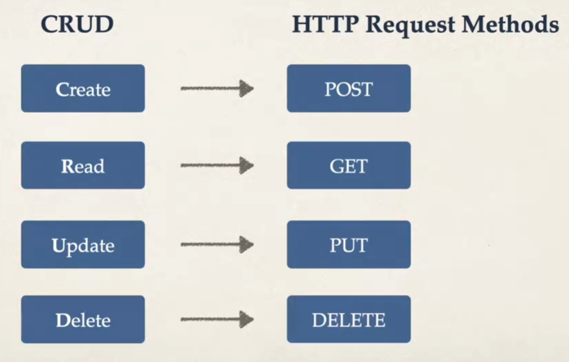

# CRUD


# 概念

`FastAPI` 是用于快速开发 `Restful API` 范式的 HTTP 服务框架，因此，服务 API 接口设计应当符合 `CRUD(Create Read Update Delete)` 规范。



# 路径参数

## 使用介绍

> [!note]
> 路径参数在 `POST`、`PUT`、`DELETE` 均能使用

```python
from fastapi import FastAPI

app = FastAPI()

# {param} , 在 url 中定义动态参数
# dynamic_param:str , 限定参数类型为 str
@app.get("/get/{dynamic_param}")
async def get_path_param(dynamic_param:str):
    return {'dynamic_param' : dynamic_param}
```

> [!note]
> 当 url 中存在特殊字符时，需要注意转义，例如 `http://127.0.0.1:8000/get/test%20aaa` 中 `%20` 表示「空格」。**FastAPI 接收参数时会自动转换**。

## 路由顺序

> [!note]
> FastAPI 会优先匹配最先定义的 url 路由

想要特化路径参数，特化的 url 路由定义必须在路径参数 url 之前定义。

```python
@app.get("/get/default")
async def get_default():
    return {'message' : 'default'}

@app.get("/get/{book_name}")
async def get_book(book_name:str):
    book = query_book(book_name) 
    return {'book' : book}
```

# GET

通过查询查询可以对数据进行筛选，例如获取版本号为 `2` 的帮助手册

```txt
http://127.0.0.1:8000/get/help/?version=2
```
在 url 中定义查询参数的规范为
- 以 `?` 开始
- 按照 `key=value` 的形式进行定义
- 使用 `&` 连接多个参数

```python
@app.get("/get/{book_name}")
async def get_book_by_version(book_name:str, version:int):
    book = query_book(book_name,version) 
    return {'book' : book}
```

> [!note]
> 查询参数同样要注意特殊字符转换问题，**FastAPI 会自动转换，但是访问 url 的时候需要自己来**。

# POST


```python
from fastapi import Body

@app.post("/post/create_book")
async def post_create_book(body = Body()):
    # body 就是 post 请求时传递的数据
    # FastAPI 会自动解析 body 的类型
    # - json 文本： dict
    # - 字符串： str
    msg = append_book(body)
    return {'msg' : msg}

```

# PUT

`PUT` 与 `POST` 使用上无差别，主要是用来进行处理「更新」相关的业务逻辑。**其本身属于口头协议，用 `POST` 来实现其功能也完全没问题**。

```python
from fastapi import Body

@app.put("/put/update_book")
async def put_update_book(body = Body()):
    msg = update(body)
    return {'msg' : msg}
```

# DELETE

与 `PUT` 一样，属于口头协议，完全可以用 `POST/GET` 替代。

```python
@app.delete("/delete/{book_name}")
async def put_update_book(book_name:str):
    msg = delete(book_name)
    return {'msg' : msg}
```