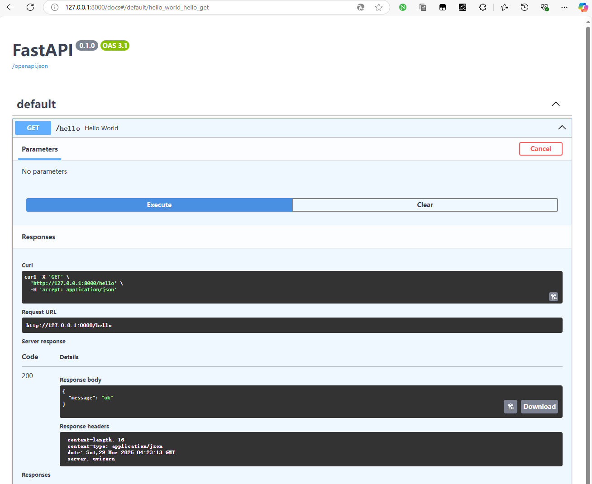

# 简介


# Fast API

[FastAPI](https://fastapi.tiangolo.com/zh/) : 是一个用于构建 API 的现代、快速（高性能）的 web 框架，**天生支持 Python 异步特性**。

- `Starlette` : 基于 `ASGI` 框架，提供异步能力
- `Pydantic` : 提供数据校验功能


# 安装

```term
triangle@LEARN:~$ python.exe -m venv .env // 创建虚拟环境，用 conda 也行
triangle@LEARN:~$ .\.env\Scripts\activate // windows 激活环境
triangle@LEARN:~$ source ./.env/bin/activate // linux 激活环境
(.env) triangle@LEARN:~$ pip list // 查看安装了哪些包
(.env) triangle@LEARN:~$ pip install fastapi
(.env) triangle@LEARN:~$ pip install "uvicorn[standard]"
(.env) triangle@LEARN:~$ deactivate // 退出激活环境
triangle@LEARN:~$ rm -rf .env // 直接删除文件夹即可删除虚拟环境
```

如果在内网机中使用，安装离线版的 `FastAPI` 才能离线使用 [Swagger UI](https://swagger.io/tools/swagger-ui/)

```term
triangle@LEARN:~$ pip install fastapi-offline
```

```python
from fastapi_offline import FastAPIOffline

# 使用 FastAPIOffline 代替 FastAPI
# app = FastAPI()
app = FastAPIOffline()
```


# hello world


```python
# hello.py

from fastapi import FastAPI

app = FastAPI()

# async : 声明接口使用异步
@app.get("/hello")
async def hello_world():
    return {'message' : 'ok'}
```

```term
triangle@LEARN:~$  uvicorn.exe hello:app --reload // 启动服务
INFO:     Will watch for changes in these directories: ['E:\\testspace\\fastapi']
INFO:     Uvicorn running on http://127.0.0.1:8000 (Press CTRL+C to quit)
INFO:     Started reloader process [22708] using WatchFiles
INFO:     Started server process [13696]
    ....
```

使用 `http://127.0.0.1:8000/docs#/` 便能访问 [Swagger UI](https://swagger.io/tools/swagger-ui/) 浏览服务的所有接口。




除了使用命令行启动 FastAPI ，也可以通过代码启动

```python
import uvicorn
from fastapi import FastAPI

app = FastAPI()

# async : 声明接口使用异步
@app.get("/hello")
async def hello_world():
    return {'message' : 'ok'}

if __name__ == '__main__':

    # 执行与 FastAPI 无关的初始化
    init()

    # 启动 FastAPI
    uvicorn.run('hello:app', host='127.0.0.1', port=8000, reload=True, workers=1)

```

# 生命周期

通过 `lifespan` 可以在 `FastAPI` 启动成功后与准备关闭前做一些处理。


```python
from contextlib import asynccontextmanager

@asynccontextmanager
async def lifespan(app: FastAPI):
    # app 启动
    handle_init()

    yield

    # app 关闭
    handle_destroy()

app = FastAPI(lifespan=lifespan)
```

# 依赖注入

使用 `Depends` 可以在进行业务处理前进行一些初始化操作

```python
from fastapi import FastAPI, Depends

app = FastAPI()

# 定义一个依赖项，可以实现公用
def get_database_connection():
    # 建立或获取数据库连接
    connection = ...  # 替换为实际的数据库连接代码
    return connection

@app.get("/")
async def read_root(connection=Depends(get_database_connection)):
    # 使用数据库连接进行操作
    return {"message": "Hello World!"}

@app.get("/user")
async def read_user(connection=Depends(get_database_connection)):
    # 使用数据库连接进行操作
    return {"message": "Hello World!"}

```

# 接口测试

```python
import pytest
from fastapi.testclient import TestClient

# 使用该方式创建客户端，才能正确启动 tortoise orm
@pytest.fixture(scope="module")
def test_client():
with TestClient(app) as client:
    yield client

def test_demo(test_client:TestClient):
    resp = test_client.get(
        "/demo"
    ) 
```

> [!note]
> 测试 `async` 接口时，`@pytest.mark.asyncio` 与 `@pytest.mark.repeat` 可能存在兼容问题
