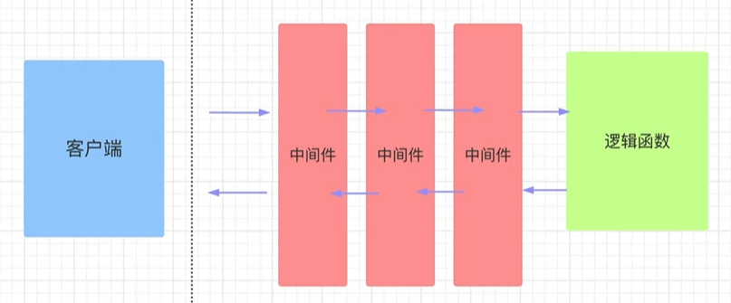

# 中间件

# 概念



**中间件 `Middleware`** : 是一个非常重要的概念，它允许开发者在请求被处理之前和响应被发送之前执行自定义逻辑。中间件在Web应用程序中扮演着桥梁的角色，连接着客户端的请求和服务器端的响应处理过程。**通过中间件可以在请求前与响应前进行业务处理，例如日志记录、黑名单处理、修改响应头等**。


# 函数实现

FastAPI 的中间件通过函数实现
- 通过 `call_next` 将同一函数拆分为两个代码块
- **最后被定义的中间件最先被执行**


```python
import time
from fastapi import FastAPI, Request

app = FastAPI()

@app.middleware("http")
async def add_process_time_header(request: Request, call_next):
    # 处理请求前
    start_time = time.time()

    # 分界线
    response = await call_next(request)

    # 返回响应前
    process_time = time.time() - start_time
    response.headers["X-Process-Time"] = str(process_time)
    return response
```

# 类实现


- `middle.py`

```python
import time
from fastapi import Request
from starlette.middleware.base import BaseHTTPMiddleware
from starlette.responses import Response

class UseTimeMiddleware(BaseHTTPMiddleware):
    """ 计算耗时中间件"""

    def __init__(self, app):
        super().__init__(app)

    # 重写BaseHTTPMiddleware类中的dispatch方法        
    async def dispatch(self, request: Request, call_next) -> Response:
        """ 请求耗时 """
        start_time = time.time()

        # 调用下一个中间件或路由处理函数
        response = await call_next(request)

        process_time = time.time() - start_time
        response.headers["X-Process-Time"] = str(process_time)
        return response
```

- **demo.py**

```python
from fastapi import FastAPI
from middle import UseTimeMiddleware

app = FastAPI()

# 添加中间件
app.add_middleware(UseTimeMiddleware)
```

# 跨域配置

```python
from fastapi.middleware.cors import CORSMiddleware

# 配置跨域请求
app.add_middleware(
    CORSMiddleware,
    allow_origin="*",
    allow_credentials=True,
    allow_methods=["GET","POST"],
    allow_headers= ["*"]
)
```

# 异常统一

```python

```