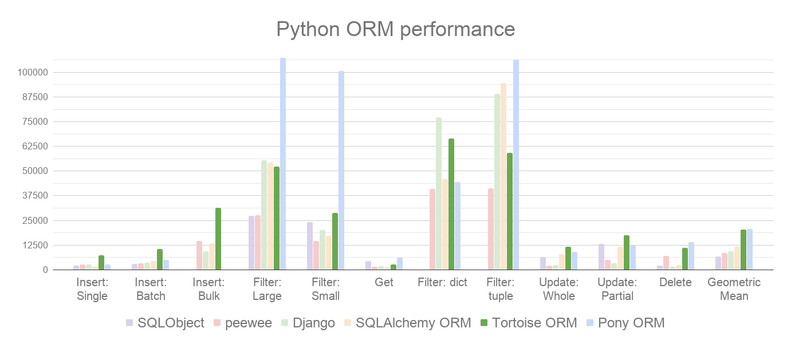

# ORM

# 概念

**对象关系映射 `Object Relational Mapping (ORM)`** : 是一种为了解决面向对象与关系数据库存在的互不匹配的现象的技术，即通过对象来完成数据库操作。`ORM` 框架是连接数据库的桥梁，只要提供了持久化类与表的映射关系，`ORM` 框架在运行时就能参照映射文件的信息，把对象持久化到数据库中。
- `ORM` 类对应数据库中的一张表
- `ORM` 类属性对应表中的字段
- `ORM` 类实例对应表中的一条记录

| 名称       |  异步  | 数据迁移 | web框架        | 注意                                              |
| ---------- | :----: | -------- | -------------- | ------------------------------------------------- |
| tortoise   |  支持  | Aerich   | FastAPI        | 1. 不支持跨数据库迁移 </br> 2. 配合异步数据库使用 |
| SQLAlchemy | 不支持 | Alembic  | Flask、FastAPI | 1. 最成熟的 ORM 库                                |
| Django.db  | 不支持 | Django   | Django         | 1. 只能 Django 内部使用                           |





# Tortoise


[Tortoise](https://tortoise.github.io/) : 一个现代的异步 ORM，专为 Python 的异步框架（如FastAPI、Starlette）设计。它的API设计类似Django ORM，易于上手，支持多种数据库。

| 数据库 | 安装 |
| ------ | ---- |
|SQLite|pip install tortoise-orm|
|PostgreSQL (psycopg)|pip install tortoise-orm[psycopg]|
|MySQL (aiomysql)|pip install tortoise-orm[aiomysql]|
|MySQL (asyncmy) |pip install tortoise-orm[asyncmy]|
|MS SQL|pip install tortoise-orm[asyncodbc]|
|Oracle | pip install tortoise-orm[asyncodbc]|


# 模型搭建

```term
triangle@LEARN:~$ 
├── demo.py
├── settings.py         # 配置文件
└── orm                 # ORM 模型定义
    └── models.py
```

## 模型定义

- `models.py`

```python
from tortoise import fields
from tortoise.models import Model

""" 
fields 可设置的基本参数
    :param source_field: Provide a source_field name if the DB column name needs to be
        something specific instead of generated off the field name.
    :param generated: Is this field DB-generated?
    :param primary_key: Is this field a Primary Key? Can only have a single such field on the Model,
        and if none is specified it will autogenerate a default primary key called ``id``.
    :param null: Is this field nullable?
    :param default: A default value for the field if not specified on Model creation.
        This can also be a callable for dynamic defaults in which case we will call it.
        The default value will not be part of the schema.
    :param unique: Is this field unique?
    :param db_index: Should this field be indexed by itself?
    :param description: Field description. Will also appear in ``Tortoise.describe_model()``
        and as DB comments in the generated DDL.
    :param validators: Validators for this field.
"""

class Student(Model):
    id = fields.IntField(primary_key=True)
    name = fields.CharField(max_length=32)
    pwd = fields.CharField(max_length=32)
    sno = fields.IntField()

    # 一对多关系 : 表A中的一条记录只能对应表B中的一条记录, 表B中的一条记录对应表A中的多条记录
    # 实现 ： 两张表，多的表加外键
    classroom = fields.ForeignKeyField(
            model_name = 'models.Classroom',    # 关联的外键表
            related_name = 'students'               # 外键反向查询
        )
    
    # 多对多 : 表A中的一条记录只能对应表B中的多条记录, 表B中的一条记录对应表A中的多条记录
    # 实现 ：三张表，关系表加外键
    courses = fields.ManyToManyField(
            model_name = 'models.Course',
            related_name= 'courses'
        )

    # 自定义模型新信息
    class Meta:
        table = "Student"

class Classroom(Model):
    id = fields.IntField(primary_key=True)
    name = fields.CharField(max_length=32)


class Course(Model):
    id = fields.IntField(primary_key=True)
    name = fields.CharField(max_length=32)

```

## 配置数据库

- `settings.py`

```python
CONFIG_ORM = {
    "connections": {
        "default": "sqlite://db.sqlite3"
    },
    "apps": {
        "models": {
            "models": [
                "orm.models",       # tortoise.models.Model 实现所在 py 文件
                "aerich.models"     # aerich 需要用到的 model
            ],
            "default_connection": "default",
        },
    },
}
```

## 注册 ORM

```python
import uvicorn
from fastapi import FastAPI
from settings import CONFIG_ORM
from tortoise.contrib.fastapi import register_tortoise

app = FastAPI()

# 注册
register_tortoise(
    app=app,
    config=CONFIG_ORM,
    generate_schemas=False,         # 方便调试使用，正式版本应当 False
    add_exception_handlers=False    # 方便调试使用，正式版本应当 False
)


if __name__ == '__main__':
    uvicorn.run('hello:app', host='127.0.0.1', port=8000, reload=True,  workers=1)

```

## 数据迁移

- **安装**

```term
triangle@LEARN:~$ pip install aerich
triangle@LEARN:~$ pip install tomlkit 
```

- **初始化** ： 一般只执行一次

```term
triangle@LEARN:~$ aerich init -t settings.CONFIG_ORM // 根据配置初始化配置
triangle@LEARN:~$ tree .
├── demo.py
├── migrations          # 迁移脚本所在文件夹
├── pyproject.toml      # 迁移配置
├── settings.py         # 配置文件
└── orm                 # ORM 模型定义
    └── models.py
triangle@LEARN:~$ aerich init-db // 初始化数据库
```

- **更新** : 数据库修改后，需要更新数据库

```term
triangle@LEARN:~$ aerich migrate // 生成迁移脚本
triangle@LEARN:~$ aerich upgrade // 更新版本
triangle@LEARN:~$ aerich downgrade // 版本回退
```

# 数据操作

## 查询

### 基本操作

```python
from orm.models import Student

@app.get("/query")
async def query():

    # 返回类似于 List[Student] 的容器
    students = await Student.all() 
    student : Student
    for student in students:
        print(student.name) 

    # 过滤
    students : QuerySet[Student] = await Student.filter(classroom_id= 1, name="xxx")

    # 返回类似 List[dict] 的容器，且能指定返回字段
    value = await Student.filter(name='xx').values("name","age")

    # 返回一个 Student 对象
    student : Student = await Student.get(id=1)

    # order
    students = await Student.all().order_by('id')

    # limit
    students = await Student.all().offset(1).limit(10)

    # group
    students = await Student.all().group_by('name')

    return students
```

### 高级查撇

```python
# 1.  等于 xxxx__exact
# 例: 查询name等于‘xiao ming’的学生
Student.filter(name='xiao ming')
Student.filter(name__exact='xiao ming')#此处的exact可以省略

# 2.  模糊查询 xxxx_contains
# 例：查询姓名包含'xiao'的学生。
Student.filter(name__contains='xiao')

# 开头：startswith  结尾：endswith
# 例：查询姓名以'xiao'开头的学生 以'ming'结尾的学生
Student.filter(name__startswith='xiao')
Student.filter(name__endswith='ming')

# 3.  空查询   xxxx__isnull
# 例：查询姓名不为空的学生
Student.filter(name__isnull=False)

# 4.  范围查询  xxxx__in 
# 例：查询年龄12或15或16的学生
Student.filter(age__in=[12,15,16])
Student.filter(age__range=[12,16])

# 5.  比较查询 
# - gt大于 
# - lt(less than) 
# - gte(equal) 
# - lte
# 例：查询年龄大于等于12的学生
Student.filter(age__gte=12)

# 6.  日期查询  date
# 例：查询1994年出生的学生。
Student.filter(birthyear__date=1994)
# 例：查询1994年1月1日后出生的学生。
Student.filter(birthyear__date__gt = date(1994,1,1))

# 7. 返回不满足条件的数据 exclude
# 例：查询id不为3的学生。
Student.exclude(id=3)
```


### 关系查询

```python
student : Studnet =  Student.get(name='xx')

# 一对多查询
classroom : Classroom = student.classroom   # 直接查询

# 多对多查询
student.courses.all()
student.courses.get(id=0)
student.courses.filter(id=0)

# 关联表内字段查询
Student.all().values("name","classroom__name", "courses__name") 
```

## 添加

```python
from typing import List
from orm.models import Student
from pydantic import BaseModel

# Student 的校验模型
class StudentIn(BaseModel):
    id:int
    name:str
    pwd:str
    sno:int
    # 外键在数据库实际名是 xxxx_id
    classroom_id : int
    courses: List[int] = []

@app.post("/add1")
async def add1(student_in:StudentIn):
    # 将 student_in 转换为 student 对象
    student = Student(
        name= student_in.name,
        pwd=student_in.pwd,
        sno=student_in.sno,
        classroom_id=student_in.classroom_id
    )

    # 插入数据
    await student.save()

    # 必须在 student 插入成功之后，才能获取 student.id 往多对多表中添加关系
    courses  = await Course.filter(id__in=student_in.courses)
    await student.courses.add(*courses)
    
    return student

@app.post("/add2")
async def add2(student_in:StudentIn):
    # 将创建与 save 进行合并
    student = await Student.create(
        name= student_in.name,
        pwd=student_in.pwd,
        sno=student_in.sno,
        classroom_id=student_in.classroom_id
    )

    # 必须在 student 插入成功之后，才能获取 student.id 往多对多表中添加关系
    courses  = await Course.filter(id__in=student_in.courses)
    await student.courses.add(*courses)
    
    return student
```

> [!note]
> 不要使用 `tortoise` 的 `pydantic_model_creator` 自动创建校验模型，好像新版本 `pydantic` 不兼容

## 更新

```python
@app.post("/update/{id}")
async def update(student_id: int,student_in:StudentIn):

    # students = await Student.filter(id=student_id)

    # # 批量更新
    # await students.update(
    #     name=student_in.name,
    #     pwd=student_in.pwd,
    #     sno=student_in.sno,
    #     classroom_id=student_in.classroom_id
    # )

    # 单值更新
    student  = await Student.get(id=student_id)
    student.name = student_in.name
    student.pwd = student_in.pwd
    student.sno = student_in.sno
    student.classroom_id = student_in.classroom_id
    
    await student.save()

    # 多对多更新 : 必须每个对象单独操作
    await student.courses.clear()
    courses  = await Course.filter(id__in=student_in.courses)
    await student.courses.add(*courses)

    return student
```

> [!note]
> 正式环境不要用「外键」来实现关联关系，维护麻烦。


## 删除

```python
# 多对多关系会自动删除
count = await Student.filter(id=student_id).delete()
```

# 事务

- `with` 写法

```python
from tortoise.transactions import in_transaction
from tortoise.backends.base.client import TransactionalDBClient

@app.get("/transaction")
async def transaction():
    try:
        async with in_transaction() as t:
            st1 = await Student.create(name='1', pwd='11', sno='111',classroom_id=0)
            await st1.save()

            # 抛出异常后，会自动回滚
            raise ValueError('error')

            st1 = await Student.create(name='2', pwd='22', sno='111',classroom_id=0)
            await st1.save()

            # 手动控制
            trans :TransactionalDBClient = t
            trans.rollback()
            trans.commit()
    except Exception as e:
        print(f'异常 {e}')
    return {"ok"}
```

- 装饰器写法

```python
import tortoise.transactions as transactions

# 发生异常后，自动回滚
@transactions.atomic()
async def atomic_transaction() as conn:
    st1 = await Student.create(name='11', pwd='11', sno='111',classroom_id=0)
    await st1.save()

    raise HTTPException(status_code=500, detail='error')

    st1 = await Student.create(name='21', pwd='22', sno='111',classroom_id=0)
    await st1.save()

@app.get("/transaction")
async def transaction():
    await atomic_transaction()
    return {"ok"}
```

# SQL

```python
# settings.CONFIG_ORM 中设置的 `default_connection` 名
conn : BaseDBAsyncClient= Tortoise.get_connection('default')
# 可执行所有 SQL 语句
await conn.execute_query("PRAGMA journal_mode = PERSIST;")

# 只支持复杂查询
result = await Student.raw('select * from student')
```