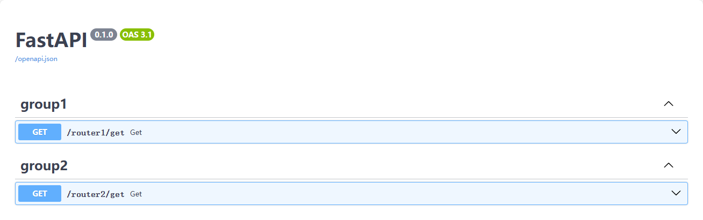

# 路由

# 接口文档

FastAPI 中请求方式都是基于 Python 的「装饰器」实现，且可在装饰器中配置 `Swagger UI` 的文档信息。

```python
@app.get(
        path = "/get/",
        tags = ["docs 文档的标题"],
        summary = "接口概述",
        description =  "接口详情",
        response_description = "响应详情",
        deprecated=False     # 该接口是否已经废弃
    )
async def get_hello():
    return {'msg' : 'ok'}
```

访问 `http://127.0.0.1:8000/docs#/`


# 路由分组

将不同的路由 url 放到不同的模块中， 方便模块管理。

```term
triangle@LEARN:~$ tree .

.
├── demo.py
├── router1             # 路由分组 1
│   ├── __init__.py
│   └── url.py
└── router2             # 路由分组 2
    ├── __init__.py
    └── url.py
```
- `demo.py`

```python
from fastapi import FastAPI
from router1.url import router1
from router2.url import router2

app = FastAPI()

# 导入子路由
app.include_router(router1, prefix="/router1", tags=["group1"])
app.include_router(router2, prefix="/router2", tags=["group2"])
```

- `router1/url.py`

```python
from fastapi import APIRouter

router1 = APIRouter()

@router1.get("/get")
def get():
    return {"msg": "ok"}
```

- `router2/url.py`

```python
from fastapi import APIRouter

router2 = APIRouter()

@router1.get("/get")
def get():
    return {"msg": "ok"}
```


