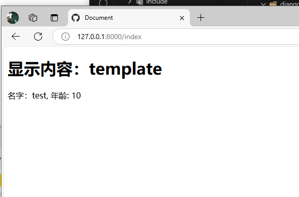

# 模板

# 介绍

在前后端不分离的 web 项目中，所有的 `HTML` 文件均是通过服务动态生成返回给浏览器渲染。但不可能次客户端请求，都重新生成一个 `HTML` 文本返回，因此，使用「模板」来简化 `HTML` 的生成流程，实现 `HTML` 内容复用。


# jinja

## 介绍

**Jinja3** : 是 Python 里面被广泛应用的模板引擎，设计思想来源于 Djnago 模板引擎，并扩展了其语法与功能。
- 沙箱执行模式，模板的每个部分都在引擎的监督之下执行，更安全
- 强大的自动 HTML 转义系统，可以有效地阻止跨站脚本攻击

```term
triangle@LEARN:~$ pip install jinja2 // 包名没改，版本其实已经是 3.x 版本
```

## hello world

```term
triangle@LEARN:~$ tree .
.
├── demo.py
└── templates           # 模板文件
    └── index.html
```

- `index.html`

```html
<!DOCTYPE html>
<html lang="en">
<head>
    <meta charset="UTF-8">
    <meta name="viewport" content="width=device-width, initial-scale=1.0">
    <title>Document</title>
</head>
<body>
    <h1>显示内容：{{ content }}</h1>
    <div>名字：{{user.name}}, 年龄: {{user.age}}</div>
    <div>名字：{{person.name}}, 年龄: {{person.age}}</div>
</body>
</html>
```

- `demo.py`

```python
from fastapi import FastAPI,Request
from fastapi.templating import Jinja2Templates

app = FastAPI()

templates = Jinja2Templates(directory="templates")

@app.get('/index')
def post(req:Request):

    return templates.TemplateResponse(
        request=req,
        name="index.html",
        context={
            "content": "template",
            "user" :{
                "name" : "test",
                "age" : 10
            }
        }
    )
```




## 详细使用

- [Jinja2](./distributeCluster/chapter/flask.md)

