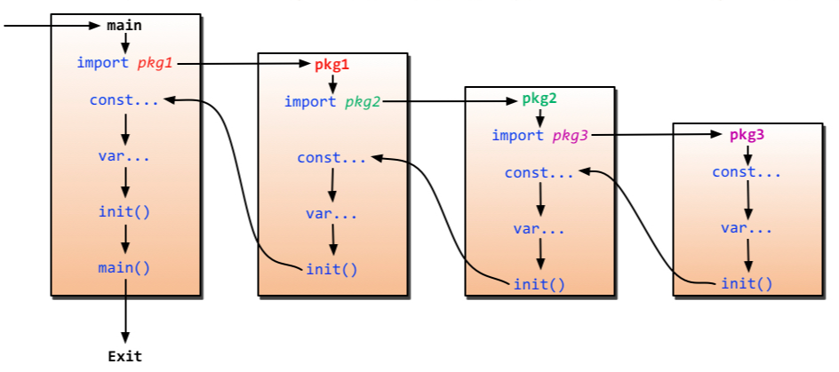

# 基本概念

# 安装

- windows 

[go 官网](https://go.dev/dl/) 下载安装包

- linux

[go 官网](https://go.dev/dl/) 下载安装包

```term
triangle@LEARN:~$ sudo tar -zxvf go1.21.6.linux-amd64.tar.gz -C /usr/local/ // 解压安装包
triangle@LEARN:~$ sudo vim /etc/profile
export GOROOT=/usr/local/go  # 安装路径
export PATH=$PATH:$GOROOT/bin # 添加 go 命令
triangle@LEARN:~$ go version // 查看版本
go version go1.21.6 linux/amd64
```

- 环境变量

```bash
export GOROOT=/usr/local/go # go 的安装路径
export GOPATH=$HOME/go  # go 的工作目录，默认在家目录下
```

- 环境配置

```term
triangle@LEARN:~$ go env -w GO111MODULE=on // 启动 module
triangle@LEARN:~$ go env -w GOPROXY=https://goproxy.cn,direct // 修改代理
```

# 语法规则


## Hello World

```go
package main // 程序入口包

// 单个导入包
import "fmt"  

// 批量导入包
import ( 
	"time"
	"fmt"
)

// main 函数
func main() {
	fmt.Println("hello world") // ; 可加可不加
	time.Sleep(1 * time.Second)
}
```

```term
triangle@LEARN:~$ go build main.go // 编译
triangle@LEARN:~$ ./main // 运行
hello world
triangle@LEARN:~$ go run main.go // 编译 + 运行
hello world
```

## 变量

- 普通变量

```go
package main

import "fmt"

func main()  {

	var nVal1 int
	var nVal2 int = 10
	fmt.Println("nVal1 = ", nVal1)
	fmt.Println("nVal2 = ", nVal2)

	// 自动推导类型
	var str1 = "test"
	fmt.Printf("type is %T\n", str1)

	// 直接定义
	// NOTE - 该方式不支持定义全局变量
	str2 := "test"
	nVal3 := 100
	fmt.Printf("type is %T\n", str2)
	fmt.Printf("type is %T\n", nVal3)

	// a=10
	// b="b"
	var a,b=10,"b"	
	fmt.Println("a = ",a)
	fmt.Println(b)

	var(
		a1 int = 10
		b1 string = "b1"
	)
	fmt.Println("a = ",a1)
	fmt.Println("b = ",b1)
}
```

- `const`

```go
package main

import "fmt"

// 定义枚举
const(
	OK=1
	FCK=2
)

const(
	// iota ，从 0 开始，自增赋值 
	// iota 只能在 const() 中使用
	A=iota*10 
	B
	C
)

func main()  {
	
	// 定义常量
	const len int = 10
	fmt.Println("len = ", len)
}
```

## 指针

```go
package main

import "fmt"

// 形参指针
func fcn(a * int){

	// 解指针
	*a = 10
}

func main()  {
	var b int = 1

	// 取地址
	fcn(&b)
	fmt.Println(b)

	// 定义指针
	var p *int 
	p = &b
	fmt.Println(p)

	// 二级
	var pp ** int
	pp = &p
	fmt.Println(pp)
}
```


## 函数

```go
func Fcn1(a int, b int) int {
	return a + b	
}

// 多返回值
func Fcn2(a int, b int) (int,int) {
	return a+b,a*b
}

// 返回参数定义名称
func Fcn3(a int, b int) (r1 int, r2 int) {
	r1 = a * b
	r2 = a + b
	return
}

func main()  {
	r := Fcn1(10,10)

	r1,r2 := Fcn2(10,10)

	r1,r2 = Fcn3(10,10)
}
```

## 数组

### 普通数组

- **定义**

```go
package main

import "fmt"

func main()  {

	// 定义数组
	var array [5]int = [5]int{1,2,3,4,5}

	// 遍历
	for i := 0; i < len(array); i++ {
		fmt.Println(array[i])
	}

	// foreach
	for i,val := range array{
		fmt.Println("index = ", i, "val = ", val)
	}
}
```

- **数组形参**

```go
package main

import "fmt"

func fcn(array [5]int){
	array[0]= 100
}

func main()  {
	array := [5]int{1,2,3,4,5}
	
	fcn(array)

	for _,val := range array{
		fmt.Println(val)
	}
}
```

```term
triangle@LEARN:~$  go run main.go 
1
2
3
4
5
```

> [!note]
> 普通数组传参是值传递，而非指针

### 切片

- **函数形参**

```go
package main

import "fmt"

// 切片的形参是引用传递
func fcn(array []int)  {
	array[0] = 100	
}

func main()  {

	// 定义 slice，即动态数组
	array := []int{1,2,3,4,5}

	fcn(array)

	for _,val := range array{
		fmt.Println(val)
	}
}
```

```term
triangle@LEARN:~$  go run main.go 
100
2
3
4
5
```

- **相关接口**

```go
package main

import "fmt"

func main()  {

	// 定义空的slice
 	var	array []int

	// 开辟空间
	array = make([]int, 10)

	// 追加
	array = append(array, 10)

	// 长度
	nLen := len(array)
	fmt.Println(nLen)

	// 容量
	// 当 nLen > nCap，切片的 nCap 会增加 2 倍
	nCap := cap(array)
	fmt.Println(nCap)

	// 截取 [2,5)，规则同 python
	// sub 与 array 指向的内存空间一样
	sub := array[2:5]
	fmt.Printf("%v\n", sub)

	// 深拷贝
	subcpy := make([]int, 3)
	copy(subcpy, array[1:4])

	// 判空
	if array == nil{
	}
}
```

## map

```go
package main

import "fmt"

func main() {
	// 声明一个空 map
	var dict map[string]int

	// 申请空间
	dict = make(map[string]int)

	dict["test1"] = 1
	dict["test2"] = 2
	dict["test3"] = 3
	fmt.Printf("%v\n", dict)

	// 快速初始化
	dict1 := map[string]int{
		"tset1":1,
		"tset2":2,
		"tset3":3,
	}
	fmt.Println(dict1)

	// 遍历
	for key,val := range dict1{
		fmt.Println(key, "=", val)
	}

	// 删除
	delete(dict, "test1")
} 
```

## defer

```go
package main

import "fmt"

func fcn(){
	fmt.Println("fcn")
}

func main()  {
	// defer 类似析构函数，在函数 return 运行结束之后调用，且当 defer 运行完毕才会退出函数
	// defer 后面的表达式，是按照代码顺序【压栈】，因此是先定义的表达式，最后才会调用
	defer fcn()
	defer fmt.Println("end")

	fmt.Println("run")
}
```

```term
triangle@LEARN:~$ go run main.go
run
end
fcn
```

# 包

## 自定义包

```term
triangle@LEARN:~$ tree
.
├── lib
│   └── add
│       └── add.go
└── main.go
```

- `add.go`

```go
package add // 自定义包名

import "fmt"

// 包的初始化函数
func init(){
	fmt.Println("add init")
}

// 包导出方法
// 方法名的首字母大写
func AddFcn1(){
}

// 包内部方法
// 方法名的首字母小写
func addFcn2(){
}
```

- `main.go`

```go
package main

// 导入包
//  `import` 搜索包的基路径为 `GOROOT、GOPATH`，包所在的文件夹不在基目录下时，需要写出相对路径
import "lib/add"

func main()  {
	add.AddFcn1()
}
```

go 程序的运行顺序为从 `package main` 进入，然后通过 `import` 递归导入 `.go` 文件依赖的外部包，并且会调用包的初始化函数 `init()`。



> [!note]
> 利用 `go module` 则不用使用该方案自定义包

## 导入方式

```go
// 只导入包，可以不调用包的接口，程序运行时会调用 add 包的 init() 函数
import _"lib/add"

// 给 package1 包取一个别名
import alias "package1"

// 直接导入包内的方法，不用使用包名进行调用
import . "package2"
```


# 面向对象

## struct

```go
package main

import "fmt"

// 定义一个别名
type dict map[string]int

// 定义结构体
type Student struct{
	age int
	name string
}

// 结构体是值传递
func Fcn(st Student){
	st.name = "t"
}

func main() {
	map1 := make(dict)
	map1["a"] = 1
	fmt.Println(map1)

	var st1 Student
	st1.age = 10
	st1.name = "snake"
	Fcn(st1)
	fmt.Println(st1)
} 
```

## 类

### 定义

```go
package main

import "fmt"


// 定义类属性
type Student struct{
	age int
	name string
}

// 定义成员方法
// this 是对象实列的拷贝
func (this Student)getName() string {
	return this.name
}

// this 是对象实列的指针
func (this *Student)setName(name string)  {
	this.name = name
}

func main() {

	// 创建对象
	st := Student{age: 10, name: "snake"}

	fmt.Println(st.getName())
} 
```

### 访问权限


```go
package main

import "fmt"

// public : 类名首字母大写
// private : 类名首字母小写
type Student struct{
	// public: 属性名大写
	Age int

	// private: 属性名小写
	name string
}

// public: 方法名大写
// public: 方法名小写
func (this *Student)setName(name string)  {
	this.name = name
}

```

> [!note]
> `public` 与 `private` 是针对是否同一个 `package` 而言的

### 继承


```go
package main

import "fmt"

type Human struct{
	name string
	sex string
}

func (this *Human)Walk(){
}

type Son struct{
	Human // 继承 Human

	index int
}

func main() {
	// 初始化父类和子类
	s := Son{Human{name: "snake", sex: "man"}, 10}
	s.Walk()
	fmt.Println(s)

	// 分开初始化
	var s1 Son
	s1.index = 11
	s1.name = "mary"
	s1.sex = "woman"
	fmt.Println(s1)
} 
```

### 多态

```go
package main

// 定义接口
type Human interface{
	Eat()
	Walk()
}

// 定义类
type Man struct{
}

func (this * Man)Eat(){
}

func (this * Man)Walk(){
}

func main() {
	// 接口实列本质上是一个指针
	var h Human
	h = &Man{}

	h.Eat()
	h.Walk()
} 
```

### 万能类型

```go
package main

import "fmt"

func main() {

	// 定义
	var arg interface{}
	arg = 10
	fmt.Println(arg)

	arg = "string"
	fmt.Println(arg)

	// 类型断言
	val, ok := arg.(string)
	if ok == true{
		fmt.Println(val)
	}
} 
```