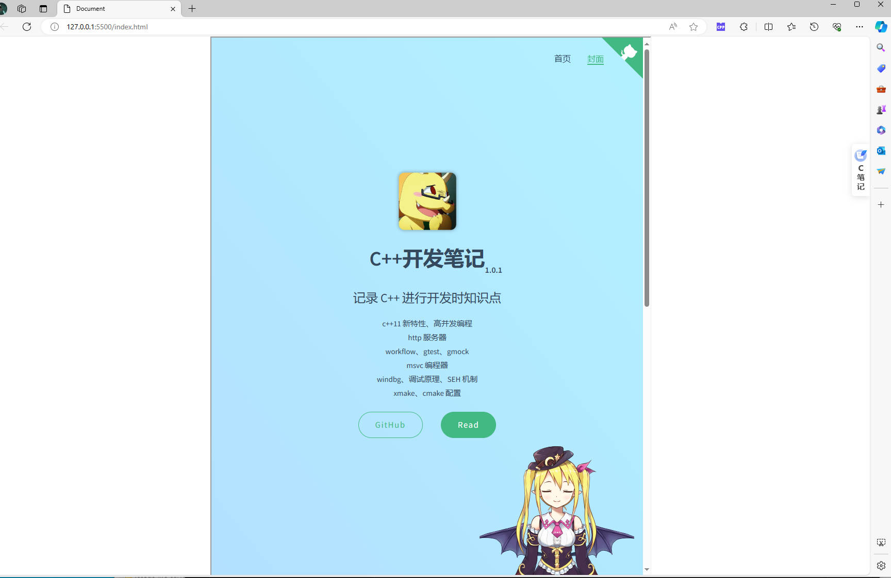

# HTML


# iframe


## 简介

`iframe` 是 HTML 内联框架元素，它能够将另一个 HTML 页面嵌入到当前页面中。

```html
<!DOCTYPE html>
<html lang="en">
<head>
    <meta charset="UTF-8">
    <meta name="viewport" content="width=device-width, initial-scale=1.0">
    <title>Document</title>
    <style>
        /* Make the html body cover the entire (visual) viewport with no scroll bars. */
        html, body { padding: 0; margin: 0; overflow:hidden; height: 200vh }
      </style>
</head>
<body>
    <div style="width: inherit; height: inherit; display: flex; justify-content: center;" >
        <iframe 
            title="notebook"  
            style="width: 50%;height: 50%;"
            src="https://spite-triangle.github.io/cpp_notes/#/"></iframe>
    </div>
</body>
</html>
```



## 基本属性

```html
Property:
    name                window.frames[name]时专用的属性
    scrolling           是否支持滚动
    src                 要展示的网页
    sandbox             限制
```

## 信息访问

### 同域

**同域**： `iframe` 的 `src` 访问网页与主界面在同一服务器下，即请求 `host` 与通信协议一样。**在同域的条件下，父界面能修改子界面内容，子界面也能修改父界面。**

- **主界面访问子界面**

```javascript
    // 获取 iframe 
    var iframe = document.getElementById("iframe1");
    // iframe 的 window 对象
    var iwindow = iframe.contentWindow;
    // iframe 的 document 对象
    var idoc = iwindow.document;

    // 若 iframe 设置 name 属性，直接获取
    window.frames['name'].window
    window.frames['name'].document
```

- **子界面访问主界面**

```javascript
    // 当前 iframe 的父级 window 对象
    window.parent

    // 最顶层的 window 对象，即最开始加载的界面
    window.top

    // 自身
    window.self
```

### 跨域

父级与子级跨域不能直接访问彼此的属性，但可以使用 `CDM(cross document messaging)` 进行消息通信。


```javascript
    /*  ====================父级脚本================== */
    // 接收子级返回的消息
    window.addEventListener('message',(e)=>{
        e.data; 
    },false);

    let ifr = window.frames['sendMessage'];
    // 向子级的 host 发送信息
    ifr.postMessage('send a message', 'Targethost');

    /* ====================子级脚本=================== */
    // 接收父级消息
    window.addEventListener('message', (e)=>{
        // 发送信息的源 host
        e.origin;

        // origin 发送过来的消息
        e.data;

        // 发送消息文档的 window 对象代理
        e.source;

        // 向发送信息的 host 返回消息
        e.source.postMessage('received message', e.origin);  
    }, false);
```

> [!note]
> `Targethost` 的写法为 `http://localhost` 而非 `http://localhost/`，**末尾不写 `/`**

