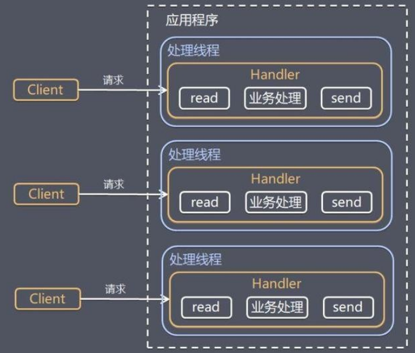
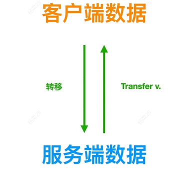
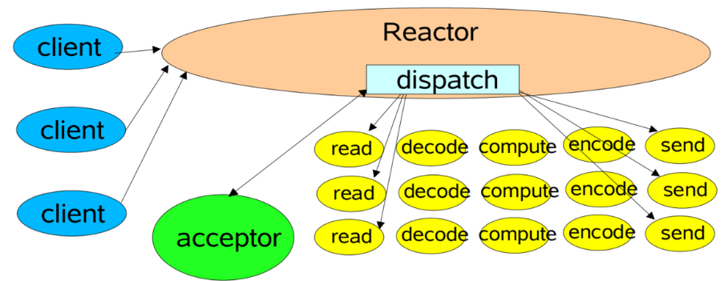
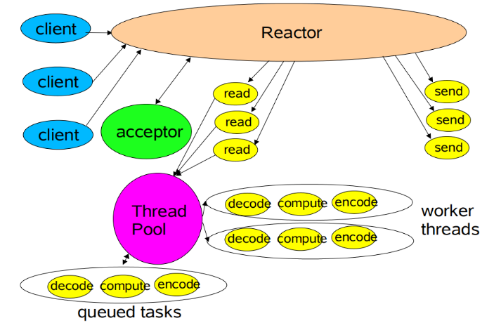
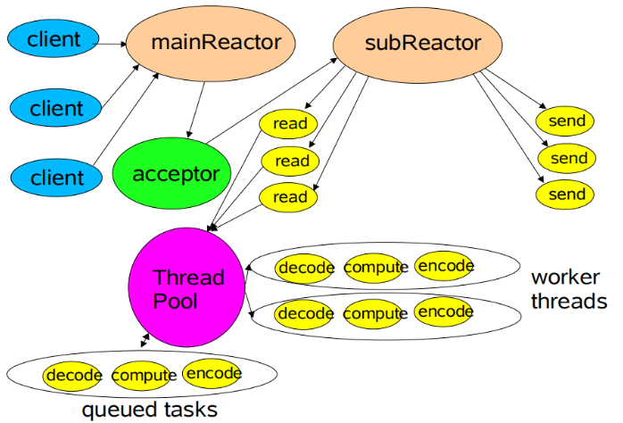

# 网络模型

# Thread Based

采用阻塞式 I/O 模型获取输入数据；每个连接都需要独立的线程完成数据输入，业务处理，数据返回的完整操作。

- **应用场景：** 并发量不大
- **缺点：**
  - 线程创建和销毁开销大
  - 线程切换开销大

# Reactor 模型

## 概念

对于http协议而言，客户端与服务端的通信规则就是
- **请求**：客服端向服务器发送数据
- **响应**：服务器向客户端发送数据

以服务器的角度来看这两个操作就是
- **读入**：来请求了，服务器需要将请求读取出来
- **写出**：响应请求，服务器处理完请求，得写点东西发送出去，告诉客户端请求处理情况

再把 **读入/写出** 扩展到 `epoll` 事件中，那就分别是
- **EPOLLIN**：内核中 socket 缓冲区有数据等待读取
- **EPOLLOUT**：需要利用内核中 socket 缓冲区发送数据

**http 中的请求、响应可以转变成`epoll`中的 EPOLLIN 、EPOLLOUT 两个事件，这样在服务器上用来接收事件以及通知事件处理的工具就是 Reactor**

> [!tip]
> 在服务器上，将 http 协议转变为读写事件，这是完全可行的。
> 
> 客户端请求 -> [ 服务器获取请求 -> 服务器处理 -> 服务器发送处理结果 ] -> 客户端获取响应
>
> 中括号中，服务器的处理流程就是：读事件 -> 处理 -> 写事件
>
> **除了请求与响应可以转换为事件外，服务器与客户端的`connect()`也可以抽象为服务器`epoll`中的读事件。**

## 单Reactor单线程

有多个客户端连接到 Reactor，Reactor 单线程处理所有事件
- `acceptor`：连接事件
- `read/send`：读写事件

Reactor既负责处理连接请求，又要负责处理读写请求，一般来说处理连接请求是很快的，但是处理具体的读写请求就要涉及到业务逻辑处理了，相对慢太多了。Reactor正在处理读写请求的时候，其他请求只能等着，只有等处理完了，才可以处理下一个请求。

## 单Reactor多线程

Reactor 只读取事件，并处理连接（连接处理比较快，没必要开线程了）。然后将读事件、写事件、业务逻辑全部扔到线程池中进行处理。**图中只将读事件和业务逻辑放到了线程池，写事件也可以放到线程池**。

## 多Reactor多线程

在单Reactor多线程的基础上，引入多个Reactor线程，形成主从结构
- **mainReactor**：负责接收客户端连接，并将建立的客户端连接进行分发给subReactor进程中
- **subReactor**：主要负责处理客户端的数据读写和业务逻辑的处理

