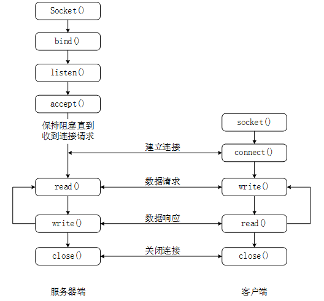

# socket TCP

# 介绍


 套接字是一种网络API，提供一种进程间的通信方法，使得相同主机或者不同主机上的进程能够使用socket定义的规范进行双向的数据通信。可以实现TCP与UDP方式的通信。

**socket实现的TCP通讯模式：**


# API接口

## server

创建 socket

```cpp
#include <sys/socket.h>

// family：对应的就是AF_INET、AF_INET6等。
// type：套接字类型：SOCK_STREAM、SOCK_DGRAM、SOCK_RAW。
// protocol：0
// 成功：非负套接字描述符。
// 出错：-1
int socket(int family, int type, int proto)
```

绑定服务器地址

```cpp
// sockfd：套接字描述符。
// my_addr：本地地址。可以使用 sockaddr_in 代替
// addrlen：my_addr 长度：
// 成功：0
// 出错：-1
int bind(int sockfd,struct sockaddr *my_addr,int addrlen)

#include <arpa/inet.h>
struct sockaddr_in {
    // AF_INET、AF_INET6等
    short int sin_family;         
    // htons(端口号)
    unsigned short int sin_port;  
    // inet_pton(AF_INET,"ip",&sin_addr) 
    struct in_addr  sin_addr;     
};
```

服务器启动客户端监听服务

```cpp
// sockfd：套接字描述符
// backlog：请求队列中允许的最大请求数，大多数系统默认为20
// 成功：0
// 出错：-1
int listen(int sockfd,int backlog)
```

服务器连接客户端：
- **请求队列已满时，该服务器套接字将拒绝连接请求**
- **请求队列为空时，进程进入睡眠（阻塞），直到新的连接到达**

```cpp
// sockfd：套接字描述符
// addr：客户端地址
// addrlen：地址长度
// 成功：0
// 出错：-1
int accept(int sockfd,struct sockaddr * addr,socklen_t* addrlen)
```

## client

连接服务器

```cpp
// sockfd：套接字描述符
// serv_addr：服务器端地址
// addrlen：地址长度
// 返回值：
// 成功：0
// 出错：-1
int connect(int sockfd,struct sockaddr* serv_addr,int addrlen)
```

## 读写

```cpp
// sockfd：套接字描述符
// msg：指向要发送数据的指针
// len：数据长度
// flags：一般为0
// 返回值：
// 成功：发送的字节数
// 出错：-1
int send(int sockfd,const void* msg,int len,int flags)

// sockfd：套接字描述符
// buf：存放接受数据的缓冲区
// len：数据长度
// flags：一般为0
// 返回值：
// 成功：接受的字节数
// 出错：-1
int recv(int sockfd,void* buf,int len,unsigned int flags)

#include <unistd.h>
int write(int sockfd, char *buf, int buf_len);

// 数据在不超过指定的长度的时候有多少读多少，没有数据则会一直等待
int read(int sockfd, char *buf, int buf_len); 

// UDP 协议使用
int sendto(int sockfd,const void* msg,int len,unsigned int flags,const struct sockaddr* to,int tolen)
int recvfrom(int sockfd,void * buf,int len,unsigned int flags,struct sockaddr* from,int* fromlen)
```

**flags**:
- MSG_DONTROUTE：不查找路由表
- MSG_OOB：接受或发送带外数据
- MSG_PEEK：查看数据,并不从系统缓冲区移走数据
- MSG_WAITALL：阻塞模式，等待数据凑够 `len` 的长度，但是也不会一直等着
- MSG_DONTWAIT：非阻塞模式，不等待，读取一段就拿走，就算总长度小于`len`
- 0：两种方式等价


## 关闭

```cpp
#include <unistd.h>
int close(int sockfd);     
```