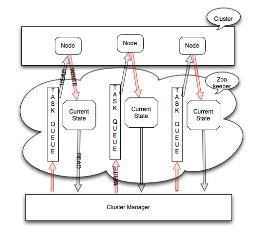
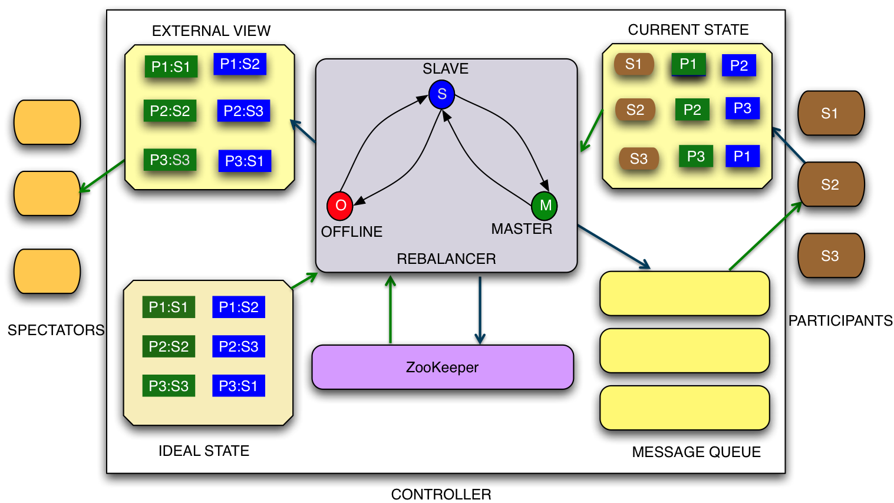
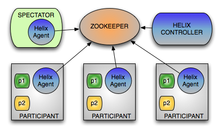

# Helix

# 简介

[Apache Helix](https://helix.apache.org/) 是一个用于管理分区和复制分布式资源的集群管理框架。它的核心目标是自动化管理分布式系统中的资源分配、状态转换和故障恢复,**即资源如何在节点上运行**。



# 概念

## 基本概念

`Helix` 存在三个核心概念
- **位置 `Location`**: 资源运行位置，即 `Helix` 节点进程实例的别名
- **资源 `Resource`**: 运行在节点上的一套独立应用系统，例如数据库、计算`Worker`、后台服务等，**如何划分资源由需求决定**
- **状态 `State`**: 资源在该节点的状态

## Ideal State


**理想状态`Ideal State`**: 描述**一个资源**如何在节点运行的规格 `spec` 清单，是 `Helix` 控制的最终目标，但实际可能实现不了，例如需要 `3` 台机器运行 `Redis`，但当前集群只有 `2` 台。


```json
{
    "id": "resource",               // 资源标识 id， 唯一
    "simpleFields": {               // 配置字段
    },
    "mapFields": {                  // 节点实例配置
        "partition": {
            "N1": "ONLINE"          // N1 : 节点别名, 唯一
                                    // ONLINE: 状态
        }
    }
}
```

**分区`partition`** : 一个资源可能由多个应用组合而成，这就需要通过分区来运行不同的应用，例如一个数据管理系统，可由 web 前端界面 + 数据库两个应用构成。**同一分区内运行的应用均一样，因此可认为分区就代表应用**


```json
{
    "id": "dataSystem",
    "simpleFields": {
        "NUM_PARTITIONS": "2"   // 分区数
    },
    "mapFields": {
        "db": {                 // db 分区
            "N1": "ONLINE"
        },
        "web": {                // web 分区
            "N2": "ONLINE"
        }
    }
}
```

**副本`Replica`**: 为应用提供实现多实例部署能力，例如有状态服务的主备部署（不用再从底层实现 `Raft` 算法），无状态服务多实例部署，已经实现 `Raft` 算法应用的多实例部署。


```json
{
    "id": "resporitySystem",
    "simpleFields": {
        "REPLICAS": "3"             // 资源的每个 partition 有几个实例
                                    // 只能统一配置，不能为某个 partition 单独配置副本数
    },
    "mapFields": {
        "respority": {              // 仓库
            "N1": "MASTER",
            "N2": "STANDBY",
            "N3": "STANDBY"
        }
    }
}
```


`Ideal State` 在创建后并非一成不变，`Helix` 允许在集群运行过程中调整 `Ideal state` 配置，其提供了三种方式
- `FULL_AUTO`: 根据提供的**约束**自动调整 `Ideal State`
- `SEMI_AUTO`: 根据偏好表 `preference list` （限定了应用只能在哪些节点上执行）与约束调整 `Ideal State`
- `CUSTOMIZED`: 完全自定义


## Current State

**当前状态 `Current State`**: `Ideal State` 描述的是资源中应用期望达到的状态，而 `Current State` 描述的应用在节点进程上的实际状态。

一个资源的应用在某个节点进程上的实际状态

```json
{
    "id": "resporitySystem",                 // 资源 ID
    "simpleFields": {
        "INSTANCE_NAME": "node-process",    // 节点上运行的 Helix 实例进程名，唯一
        "SESSION_ID": "13d0e34675e0002"     // 会话 ID, Helix 进程每次加入集群，都会重新分配
    },
    "mapFields": {
        "db": {
            "CURRENT_STATE": "OFFLINE"      // 应用当前状态
        }
    }
}
```

## External View

**外部试图`ExternalView`**: 要查看某个资源下所有应用的运行情况，就需要通过外部视图，且数据结构与 `Ideal State` 类似

```json
{
    "id": "MyResource",
    "mapFields": {
        "MyResource_0": {
            "N1": "STANDBY",
            "N2": "LEADER",
            "N3": "OFFLINE"
        },
        "MyResource_1": {
            "N1": "LEADER",
            "N2": "STANDBY",
            "N3": "ERROR"
        },
        "MyResource_2": {
            "N1": "LEADER",
            "N2": "STANDBY",
            "N3": "STANDBY"
        }
    }
}
```

## 有限状态机

**有限状态机`Finite State Machine, FSM`**: 在 `Ideal State` 中只是定义了应用的目标状态，如何从 `Current State` 抵达 `Ideal State` 则由 `FSM` 完成状态转移

```json
{
    "id": "resporitySystem",
    "simpleFields": {
        "REPLICAS": "3",
        "STATE_MODEL_DEF_REF": "LeaderStandby"      // 为资源绑定状态机
    },
    "mapFields": {
        "respority": {
            "N1": "MASTER",
            "N2": "STANDBY",
            "N3": "STANDBY"
        }
    }
}
```


## Rebalancer

**重平衡器`Rebalancer`**: 资源调度算法，执行由有限状态描述描述的 `Current State` 到 `Ideal State` 的流程，完成状态转移
1. 比较 `Ideal State` 和 `Current State` 差异
2. 计算达到 `Ideal State` 的应当进行哪些转换
   - 确定哪些副本需要改变状态
   - 确定哪些副本需要移动到新节点
3. 向每个节点发出转换指令
4. 当 `Ideal State` 和 `Current State` 一样时，则停止

一般会触发 `Rebalancer` 的事件有
- 节点启动和/或停止
- 节点经历软故障和/或硬故障
- 新节点被添加/移除
- `Ideal State` 发生变化
- 配置变更


# 系统结构



`Helix` 是由三个组件构成
- [控制器 `Controller`](https://helix.apache.org/2.0.0-docs/tutorial_controller.html): 运行 `Rebalancer` 算法，可实现资源调度
  - 观察和控制 `Participant` 节点
  - 协调集群中的所有状态转换，发送控制指令
- [参与者 `Participant`](https://helix.apache.org/2.0.0-docs/tutorial_participant.html): 工作节点实例
  - 管理资源应用的运行
  - 处理 `Rebalancer` 下发的状态转换指令
  - 更新资源的 `Current State`
- [观察者 `Spectator`](https://helix.apache.org/2.0.0-docs/tutorial_spectator.html): 负责整体集群节点的状态信息查询，但不参与集群管理
  - 能访问 `External View` ，完成一些监控任务

使用 `Helix` 实现集群管理，就是在项目中集成这三个组件实现业务逻辑。如何运行 `Controller` 又会影响项目的部署方式
- `EMBEDDED` : `Controller` 是 `Worker` 的一个库依赖，运行在 `worker` 进程中
- `STANDALONE` : 将 `Controller` 作为 `Worker` 中单独的一个进程
- `CONTROLLER AS A SERVICE` : 将 `Controller` 以服务形式独立部署

# Zookeeper



三个组件的运行状态(上下文)则靠 `Zookeeper` 统一管理，保证状态的一致性。

```
/cluster-demo                           集群根节点
│
├── PROPERTYSTORE                       系统属性
│
├── STATEMODELDEFS/                     状态机定义
│   ├── LeaderStandby
│   ├── MasterSlave
│   └── OnlineOffline
│
├── INSTANCES/                          节点进程实例运行时信息，永久存储
│   ├── N1/
│   │   ├── CURRENTSTATES/              当前状态
│   │   │   └── 12314324kdfwe1/         会话 ID
│   │   │       ├── partition_db        应用的 currentState
│   │   │       └──  partition_web
│   │   ├── MESSAGES                    Rebalancer 控制指令                   
│   │   ├── ERRORS
│   │   ├── STATUSUPDATES
│   │   └── HEALTHREPORT
│   │
│   └── N2/
│
├── CONFIGS/                            配置信息
│   ├── CLUSTER/                        集群配置
│   │   └── cluster-demo
│   ├── RESOURCE                        资源配置
│   │   ├── dataSystem
│   │   └── resporitySystem
│   └── PARTICIPANT/                    参与者配置
│       ├── N1
│       └── N2
│
├── IDEALSTATES/
│   ├── dataSystem
│   └── resporitySystem
│
├── EXTERNALVIEW/                       外部视图
│   ├── dataSystem
│   └── resporitySystem
│
├── LIVEINSTANCES/                      存活的节点进程实例，节点存活心跳
│   └── N1
│
└── CONTROLLER/                         控制器运行时信息
    ├── HISTORY
    ├── STATUSUPDATES
    ├── ALERTS
    ├── MESSAGES
    ├── PERSISTENTSTATS
    └── ERRORS
```