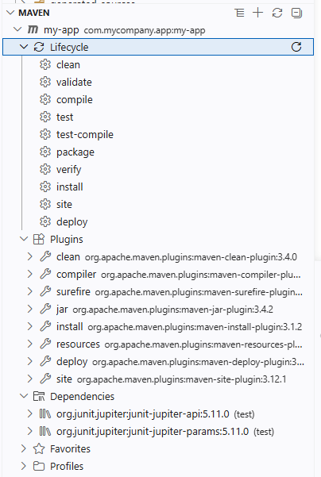

# maven

# 简介

[Maven](https://maven.apache.org/) 是一个项目管理工具，主要用于 Java 项目的构建、依赖管理和项目生命周期管理。它提供了一套标准的项目结构和构建流程，使得开发者能够更轻松地管理项目的构建和依赖关系。
- 依赖管理 : 管理 `jar` 包的依赖
- 构建自动化: 将源代码 `*.java` 编译成 `jar` 包

Maven 使用一个名为 `pom.xml` 的文件来定义项目的配置
- 包依赖
- 构建插件
- 项目版本
- 构建过程

Maven 通过仓库来存储依赖`jar`包
- 本地仓库: 存储在开发者的计算机上，默认路径为 `~/.m2/repository`
- 远程仓库
  - 私服仓库: 企业内部使用的仓库，通常由 `Nexus` 或 `Artifactory` 等工具搭建
  - 中央仓库: 由 Maven 官方维护的公共仓库，包含了大量的开源项目和库

# 安装

## 系统环境

1. 下载 [Apache Maven](https://maven.apache.org/download.cgi) 压缩包
2. 配置环境变量

```ini
MAVEN_HOME=C:/Program Files/Apache/maven-3.9.9
PATH=%MAVEN_HOME%\bin 
```

## vfox (推荐)

[vfox](https://vfox.dev/) 是一个支持 `java`、`nodejs`、`make`、`cmake` 等开发 `SDK` 的通用版本管理工具，安装相应 `SDK` 的插件后，便能实现`SDK`版本管理功能。

1. 下载 [vfox](https://github.com/version-fox/vfox)
2. vfox 的 SDK 、插件，配置默认存放目录在 `$HOME/.fox/`
   - 修改插件存储位置 `vfox.exe config storage.sdkPath <your_sdk_path>`
3. 安装管理插件 `vfox add maven` , **下载不了也能离线安装，`vfox add --source maven.zip  maven`**
4. 修改 `$HOME/.fox/plugin/maven/lib/util.lua` 中的 `url` 路径，可替换下载源
5. 使用 
   - `vfox use maven[@version]` 终端切换
   - `vfox use -g maven[@version]` 系统默认

如果是完全断网的离线环境，可以从 `https://maven.apache.org/download.cgi` 下载压缩包，然后解压到 `vfox.exe config storage.sdkPath` 目录下，目录组织结构如下

```
./
└── maven
    └── v-4.0.0-rc-5
        └── maven-4.0.0-rc-5
            ├── LICENSE
            ├── NOTICE
            ├── README.txt
            ├── bin
            ├── boot
            ├── conf
            └── lib
```


# 配置


在 `maven` 安装目录下，找到 `conf` 文件夹，里面有一个名为 `settings.xml` 的文件。

```xml
<!-- 本地仓库路径，默认在 `$HOME/.m2/repository` 文件夹下 -->
<localRepository>your_local_repository_path</localRepository>

<mirrors>
    <!-- .... -->
    <!-- 追加远程镜像仓库 -->
    <mirror>
        <id>aliyunmaven</id>
        <mirrorOf>*</mirrorOf>
        <name>阿里云公共仓库</name>
        <url>https://maven.aliyun.com/repository/public</url>
    </mirror>
</mirrors>
```

# 使用

## 命令

### 命令行

- 创建项目

```bash
mvn archetype:generate -DgroupId="com.mycompany.app" -DartifactId="my-app" -DarchetypeArtifactId="maven-archetype-quickstart" -DarchetypeVersion="1.5" -DinteractiveMode="false"

Options
    -DgroupId 组织名
    -DartifactId 项目名
    -DarchetypeArtifactId 项目模板类型，默认是 `maven-archetype-quickstart`
    -DarchetypeVersion 模板版本，默认是 `1.5`
    -DinteractiveMode=false 非交互式模式
```

>[!note]
> `windows` 系统需要给参数值添加 `""`，例如 `-DartifactId="my-app"`，而不能直接写 `-DartifactId=my-app`

- 其他命令

```term
triangle@LEARN:~$ mvn compile  // 编译源码
triangle@LEARN:~$ mvn package  // 生成 jar 包
triangle@LEARN:~$ java -cp <jar_package> <entity_point_class> // 运行
```

###  vsocde 

- 创建项目

安装 `java` 全家桶插件后，使用 `ctrl + shift + p`
- 方案一：`java: create java project` 命令
- 方案二：`maven: new moudle` 命令

交互界面在 `Explorer/maven` 侧边栏中 

## 目录结构

```
.
├── pom.xml                 项目配置文件
├── src                     代码
│   ├── main
│   └── test
└── target                  编译结果
    ├── classes             二进制编译结果
    ├── generated-sources
    ├── maven-status
    ├── site                site 生成的站点文件
    └── test-classes
```

## pom.xml

```xml
<?xml version="1.0" encoding="UTF-8"?>
<project xmlns="http://maven.apache.org/POM/4.0.0" xmlns:xsi="http://www.w3.org/2001/XMLSchema-instance"
  xsi:schemaLocation="http://maven.apache.org/POM/4.0.0 http://maven.apache.org/xsd/maven-4.0.0.xsd">
  <modelVersion>4.0.0</modelVersion>

  <!-- 项目基本信息 -->
  <groupId>com.mycompany.app</groupId>
  <artifactId>my-app</artifactId>
  <version>1.0-SNAPSHOT</version>
  <!-- 最终打包类型：
       - jar
       - war   web 使用
       - pom   父子工程
   -->
  <packaging>jar</packaging>

  <name>my-app</name>
  <!-- FIXME change it to the project's website -->
  <url>http://www.example.com</url>

  <!-- 属性变量 --> 
  <properties>
    <project.build.sourceEncoding>UTF-8</project.build.sourceEncoding>
    <maven.compiler.release>17</maven.compiler.release>
  </properties>

  <!-- 依赖继承控制，只声明 -->
  <dependencyManagement>
    <dependencies>
      <dependency>
        <!-- jar 标识三要素，在本地仓库中 `localRepository` -->
        <groupId>org.junit</groupId>
        <artifactId>junit-bom</artifactId>
        <version>5.11.0</version>

        <type>pom</type>

        <!-- 依赖范围 -->
        <scope>import</scope>
      </dependency>
    </dependencies>
  </dependencyManagement>

  <!-- 实际依赖表 -->
  <dependencies>
    <dependency>
      <groupId>org.junit.jupiter</groupId>
      <artifactId>junit-jupiter-api</artifactId>
      <scope>test</scope>
    </dependency>
    <!-- Optionally: parameterized tests support -->
    <dependency>
      <groupId>org.junit.jupiter</groupId>
      <artifactId>junit-jupiter-params</artifactId>
      <scope>test</scope>
    </dependency>
  </dependencies>

  <!-- 成果物发布到私服仓库 -->
  <distributionManagement>
    <snapshotRepository>
      <id>ossrh</id>
      <url>https://s01.oss.sonatype.org/content/repositories/snapshots</url>
    </snapshotRepository>
  </distributionManagement>

  <build>
    <!-- 生命周期所使用的插件 -->
    <pluginManagement><!-- lock down plugins versions to avoid using Maven defaults (may be moved to parent pom) -->
      <plugins>
        <!-- clean lifecycle, see https://maven.apache.org/ref/current/maven-core/lifecycles.html#clean_Lifecycle -->
        <plugin>
          <artifactId>maven-clean-plugin</artifactId>
          <version>3.4.0</version>
        </plugin>
        <!-- default lifecycle, jar packaging: see https://maven.apache.org/ref/current/maven-core/default-bindings.html#Plugin_bindings_for_jar_packaging -->
        <plugin>
          <artifactId>maven-resources-plugin</artifactId>
          <version>3.3.1</version>
        </plugin>
        <plugin>
          <artifactId>maven-compiler-plugin</artifactId>
          <version>3.13.0</version>
        </plugin>
        <plugin>
          <artifactId>maven-surefire-plugin</artifactId>
          <version>3.3.0</version>
        </plugin>
        <plugin>
          <artifactId>maven-jar-plugin</artifactId>
          <version>3.4.2</version>
        </plugin>
        <plugin>
          <artifactId>maven-install-plugin</artifactId>
          <version>3.1.2</version>
        </plugin>
        <plugin>
          <artifactId>maven-deploy-plugin</artifactId>
          <version>3.1.2</version>
        </plugin>
        <!-- site lifecycle, see https://maven.apache.org/ref/current/maven-core/lifecycles.html#site_Lifecycle -->
        <plugin>
          <artifactId>maven-site-plugin</artifactId>
          <version>3.12.1</version>
        </plugin>
        <plugin>
          <artifactId>maven-project-info-reports-plugin</artifactId>
          <version>3.6.1</version>
        </plugin>
      </plugins>
    </pluginManagement>
  </build>
</project>
```

## 属性变量

在 `properties` 中可以配置系统参数，也能自定义变量

```xml
<properties>
    <project.build.sourceEncoding>UTF-8</project.build.sourceEncoding>
    <maven.compiler.release>17</maven.compiler.release>
    <junit.version>1.0.0</junit.version>
</properties>

<dependencies>
    <dependency>
        <groupId>org.junit.jupiter</groupId>
        <artifactId>junit-jupiter-api</artifactId>
        <scope>test</scope>
        <!-- 引用属性 -->
        <version>${junit.version}</version>
    </dependency>
</dependencies>
```

# 生命周期

`Maven` 的生命周期定义了构建项目的各个阶段，每个阶段由一系列目标（goals）组成。这些目标按顺序执行，确保项目从源代码到最终可部署的产物能够被正确构建、测试和打包。



`Maven` 生命周期 `lifecyle` 是由具体的 `plugins` 实现的，有以下三类生命周期
- 默认生命周期：按顺序执行以下流程，当执行中间某个流程时，会默认执行之前的所有流程
  1. `validate`: 验证项目配置是否正确，确保所有依赖和插件都已正确设置。
  2. `compile`: 将源代码编译成字节码文件（`.class`）。
  3. `test`: 运行单元测试，确保代码功能正常。
  4. `package`: 将编译后的代码打包成可分发的格式（如 `.jar`、`.war`）。
  5. `verify`: 验证构建产物是否符合质量标准，例如检查测试覆盖率。
  6. `install`: 将构建产物安装到本地仓库，供其他项目使用。
  7. `deploy`: 将构建产物部署到远程仓库，供团队或其他系统使用。
- `clean`: 清理构建产物，删除编译后的文件、测试报告等。
- `site`: 生成项目文档和报告，通常用于发布项目的技术文档。

生命周期的各个环节可以通过命令行进行执行

```term
triangle@LEARN:~$ mvn compile
triangle@LEARN:~$ mvn package
triangle@LEARN:~$ mvn clean
triangle@LEARN:~$ mvn clean package  // 三类生命周期可组合使用
```


# 依赖管理

## 包添加

Maven 项目依赖的`jar`包存储在 `localRepository` 中，依赖信息记录在 `pom.xml` 文件中

```xml
<dependencies>
    <dependency>
        <!-- jar 标识三要素，能确定 `jar` 包在本地仓库中 `localRepository` 的存储位置-->
        <groupId>org.junit</groupId>
        <artifactId>junit-bom</artifactId>
        <version>5.11.0</version>

        <type>pom</type>
        <scope>import</scope>
    </dependency>
</dependencies>
```

可以通过 `https://mvnrepository.com/` 网站，查询中央仓库管理中的 `jar` 对应的三要素信息，然后写到 `pom.xml` 中。

```xml
<dependencies>
    <!-- Source: https://mvnrepository.com/artifact/org.flywaydb/flyway-database-postgresql -->
    <dependency>
        <groupId>org.flywaydb</groupId>
        <artifactId>flyway-database-postgresql</artifactId>
        <version>12.8.1</version>
        <scope>compile</scope>
    </dependency>
</dependencies>
```

下载实际包的方案
- 命令行：执行 `mvn dependency:resolve` ，Maven 会去仓库中查找依赖包，如果本地仓库没有，则从远程仓库下载并缓存到本地仓库
- `IDE`: 一般会自动下载
- 内网环境：手动下载 `jar` 包，然后通过 `mvn install:install-file -Dfile="/path/to/your.jar" -DgroupId="com.example" -DartifactId="my-lib" -Dversion="1.0.0" -Dpackaging="jar" [-DpomFIle="xxx.pom"]` 命令安装到本地仓库

## 依赖范围

### scope

```xml
<dependencies>
    <!-- Source: https://mvnrepository.com/artifact/org.flywaydb/flyway-database-postgresql -->
    <dependency>
        <groupId>org.flywaydb</groupId>
        <artifactId>flyway-database-postgresql</artifactId>
        <version>12.8.1</version>

        <!-- 依赖范围 -->
        <scope>compile</scope>
    </dependency>
</dependencies>
```

通过 `scope` 属性，可以控制依赖的范围，默认是 `compile`
- `compile`: 编译、运行时都需要改依赖。这是默认的依赖范围。
- `provided`: 编译时包含该依赖，但运行时不需要
- `runtime`: 仅在运行时需要该依赖
- `test`: 仅在测试和开发时需要该依赖，正式版则不需要
- `system`: 本地系统路径里的 jar 包，不用去仓库中查询，配合 `<systemPath>` 使用

    ```xml
    <scope>system</scope>
    <!-- jar 包放在当前项目 `lib` 文件夹下 -->
    <systemPath>${basedir}/lib/your.jar</systemPath>
    ```

### import

上述的 `scope` 方式均会将实际的 `jar` 下载本地仓库，但是实际工程用不到这些 `jar` 包，只是想要某一部分依赖链路（实际包依赖是很坑爹的，版本不匹配，就可能运行不起来），因此，可以使用 `import` 标签来只导入依赖链路，然后提取了需要的依赖使用即可
- 必须在 `dependencyManagement` 标签中使用
- 必须配合 `<type>pom</type>` 标签

```
<dependencyManagement>
    <dependencies>
        <!--  Spring Boot 的“版本清单”导入 -->
        <dependency>
            <groupId>org.springframework.boot</groupId>
            <artifactId>spring-boot-dependencies</artifactId>
            <version>3.2.0</version>
            <type>pom</type>
            <scope>import</scope> <!-- 就是这张“抄作业许可证” -->
        </dependency>

        <!-- 抄 Spring 的 Web 包配置 -->
        <dependency>
            <groupId>org.springframework.boot</groupId>
            <artifactId>spring-boot-starter-web</artifactId>
            <!-- 注意！这里不用写 version，直接抄！ -->
        </dependency>
    </dependencies>
</dependencyManagement>
```


## 依赖传递

`Maven` 会自动处理传递依赖，开发只需关注直接依赖。**但`Maven`不会处理间接依赖的`provided` 与`test`依赖**

- **直接依赖**：在 `pom.xml` 中明确声明的依赖，即项目直接使用的库
- **间接依赖**：由直接依赖引入的其他依赖。例如，如果项目依赖了库 A，而库 A 又依赖了库 B，那么库 B 就是间接依赖，即传递依赖

## 依赖冲突

当多个依赖引入了同一个 `jar` 包的不同版本时，就会发生依赖冲突。

### 自动解决

Maven 使用以下规则解决冲突：
1. **最短路径优先** : Maven 会优先选择距离项目最近的依赖版本。例如，如果项目 O 直接依赖了库 A（版本 1.0）和库 B，而库 B 依赖了库 C，库 C 依赖了库 A（版本 2.0），`A 2.0` 的依赖路径为 `B -> C -> A 2.0`，`A 1.0` 的依赖路径为 `O -> A 1.0`。由于 `O -> A 1.0` 更短，Maven 会选择 `A 1.0`。
2. **声明优先** : 对于同层级依赖，Maven 会优先选择显式声明的依赖版本。例如，如果项目 O 依赖了库 A 和库 B, 而库 A 依赖了库 C (版本 1.0), 库 B 依赖了库 C (版本 2.0)。若在 `pom.xml` 中先声明了库 A 依赖，则 Maven 会选择 `C 1.0`。

### 手动解决

在特殊情况下，`Maven` 的自动解决方案并不能满足要求时，可手动解决
- **依赖排除**: 使用 `exclusions` 标签排除不需要的传递依赖，**排除具有递归性，对该库的子依赖链路均生效**，例如**声明优先**中案例，可以通过配置 `exclusion` ，将 `A` 产生的 `A -> C 1.0` 的依赖排除掉，这样 Maven 最终会选择 `C 2.0`

    ```xml
    <dependency>
        <groupId>com.demo</groupId>
        <artifactId>A</artifactId>
        <version>12.8.1</version>
        <scope>compile</scope>

        <!-- 排除传递依赖 -->
        <exclusions>
            <exclusion>
                <groupId>com.demo</groupId>
                <artifactId>C</artifactId>
            </exclusion>
        </exclusions>
    </dependency>
    ```
- **可选依赖**：使用 `optional` 标签，将依赖标记为可选，即降低了依赖的优先级

    ```xml
    <dependency>
        <groupId>com.demo</groupId>
        <artifactId>A</artifactId>
        <version>12.8.1</version>
        <scope>compile</scope>

        <!-- 依赖冲突时，优先使用其他依赖包 -->    
        <optional>true</optional>
    </dependency>
    ```


# 父子工程

## 工程创建

当项目庞大时，可将项目拆分为多个子工程，每个子工程有自己的 `pom.xml`，同时也能通过父工程的 `pom.xml` 配置公共依赖和插件，例如 `cmake` 项目会将项目划分为多个动态库进行管理。
- vscode 中使用 `maven: new moudle` 命令能快速创建父子工程

创建好的目录结构为

```
.
├── demo_part_1
│   ├── pom.xml         子工程配置
│   ├── src
│   └── target
├── demo_part_2
│   ├── pom.xml         子工程配置
│   ├── src
│   └── target
├── pom.xml             总配置
├── src
└── target
```

- 父工程 `pom.xml` 配置

```xml
<?xml version="1.0" encoding="UTF-8"?>
<project xmlns="http://maven.apache.org/POM/4.0.0"
         xmlns:xsi="http://www.w3.org/2001/XMLSchema-instance"
         xsi:schemaLocation="http://maven.apache.org/POM/4.0.0 http://maven.apache.org/xsd/maven-4.0.0.xsd">
    <modelVersion>4.0.0</modelVersion>

    <groupId>com.triangle</groupId>
    <artifactId>demo</artifactId>
    <version>1.0-SNAPSHOT</version>

    <!-- pom 标记当前项目时父子工程 -->
    <packaging>pom</packaging>

    <!-- 子模块 -->
    <modules>
        <module>demo_part_1</module>
        <module>demo_part_2</module>
    </modules>

    <properties>
        <maven.compiler.source>17</maven.compiler.source>
        <maven.compiler.target>17</maven.compiler.target>
    </properties>

</project>
```

- 子工程 `pom.xml` 配置

```
<?xml version="1.0" encoding="UTF-8"?>
<project xmlns="http://maven.apache.org/POM/4.0.0"
         xmlns:xsi="http://www.w3.org/2001/XMLSchema-instance"
         xsi:schemaLocation="http://maven.apache.org/POM/4.0.0 http://maven.apache.org/xsd/maven-4.0.0.xsd">
    <modelVersion>4.0.0</modelVersion>

    <!-- 标记所属的父工程 -->
    <parent>
          <groupId>com.triangle</groupId>
          <artifactId>demo</artifactId>
          <version>1.0-SNAPSHOT</version>
    </parent>

    <groupId>com.triangle</groupId>
    <artifactId>demo_part_1</artifactId>
    <version>1.0-SNAPSHOT</version>

    <properties>
        <maven.compiler.source>17</maven.compiler.source>
        <maven.compiler.target>17</maven.compiler.target>
    </properties>

</project>
```

## 依赖继承

父工程 `pom.xml` 配置

```xml
<?xml version="1.0" encoding="UTF-8"?>
<project xmlns="http://maven.apache.org/POM/4.0.0"
         xmlns:xsi="http://www.w3.org/2001/XMLSchema-instance"
         xsi:schemaLocation="http://maven.apache.org/POM/4.0.0 http://maven.apache.org/xsd/maven-4.0.0.xsd">
    <modelVersion>4.0.0</modelVersion>

    <groupId>com.triangle</groupId>
    <artifactId>demo</artifactId>
    <version>1.0-SNAPSHOT</version>

    <!-- pom 标记当前项目时父子工程 -->
    <packaging>pom</packaging>

    <!-- 子模块 -->
    <modules>
        <module>demo_part_1</module>
        <module>demo_part_2</module>
    </modules>

    <properties>
        <maven.compiler.source>17</maven.compiler.source>
        <maven.compiler.target>17</maven.compiler.target>
    </properties>

  <dependencies>
    <dependency>
        <groupId>junit</groupId>
        <artifactId>junit</artifactId>
        <version>3.8.1</version>
        <type>test</type>
    </dependency>
    <dependency>
        <groupId>org.flywaydb</groupId>
        <artifactId>flyway-database-postgresql</artifactId>
        <version>12.8.1</version>
        <scope>compile</scope>
    </dependency>
  </dependencies>
</project>
```

子模块 `demo_part_1` 和 `demo_part_2` 均会继承父工程的依赖，即 `junit` 和 `flyway-database-postgresql`。**这样虽然简化了子工程的`pom.xml`配置，但是也会将多余的包都传递给了子工程，因此，需要使用 `dependencyManagement` 进行管理。**

- 父工程 `pom.xml` 配置，依赖配置放到 `dependencyManagement` 标签中

    ```xml
    <!-- 声明依赖 -->
    <dependencyManagement>
        <dependencies>
            <dependency>
                <groupId>junit</groupId>
                <artifactId>junit</artifactId>
                <version>3.8.1</version>
                <type>test</type>
            </dependency>
            <dependency>
                <groupId>org.flywaydb</groupId>
                <artifactId>flyway-database-postgresql</artifactId>
                <version>12.8.1</version>
                <scope>compile</scope>
            </dependency>
        </dependencies>
    </dependencyManagement>

    <!-- 实际依赖表 -->
    <dependencies>
        <dependency>
            <!-- 只用写组织和包名，范围和版本默认使用 dependencyManagement 中的 -->
            <groupId>org.flywaydb</groupId>
            <artifactId>flyway-database-postgresql</artifactId>
        </dependency>
    </dependencies>
    ```
- 子工程 `pom.xml` 配置，不用指定版本和范围
    ```xml
    <dependencies>
        <dependency>
            <!-- 只用写组织和包名，范围和版本默认使用父配置 dependencyManagement 中的 -->
            <groupId>org.flywaydb</groupId>
            <artifactId>flyway-database-postgresql</artifactId>
        </dependency>
    </dependencies>
    ```


# 上传仓库

通过 `pom.xml` 的 `distributionManagement` 标签，可将成果物发布到私有仓库

```xml
<!-- 成果物发布到私服仓库 -->
<distributionManagement>
    <!-- 预览版 -->
    <snapshotRepository>
      <id>ossrh</id>
      <url>https://s01.oss.sonatype.org/content/repositories/snapshots</url>
    </snapshotRepository>
    <!-- 正式版 -->
    <repository>
      <id>ossrh</id>
      <url>https://s01.oss.sonatype.org/service/local/staging/deploy/maven2/</url>
    </repository>
    <!-- 文档报告之类的 -->
    <site>
      <id>gh-pages</id>
      <url>https://github.com/your-username/your-repo-name.git</url>
    </site>
</distributionManagement>
```

