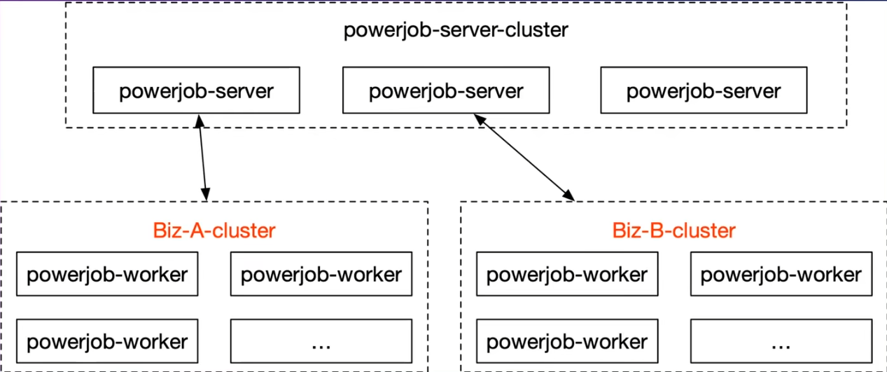
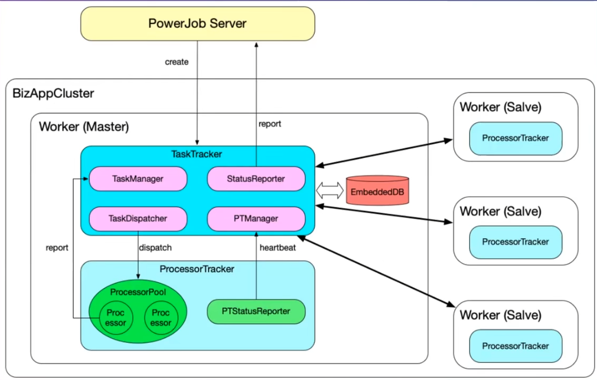

# PowerJob

# 简介

[PowerJob](http://www.powerjob.tech/): 是全新一代分布式任务调度与计算框架

- **任务调度**: 支持定时任务、延迟任务、`API` 任务
- [工作流](https://www.yuque.com/powerjob/guidence/mdbdcf):  通过 `DAG` 编排多个 `job` 任务
- **分布式计算**: 使用 `MapReduce` 结构的分布式计算
- [动态容器](https://www.yuque.com/powerjob/guidence/container): 按照 `PowerJob` 项目规范自定义任务处理器，可通过前端界面动态注入 `PowerJob` 中使用
- **实时日志**
- **在线运维**

适用场景
- 定时任务
- 全部机器一同执行的业务
- 分布式处理的业务
- 延迟任务

# 术语

- **分组**：通过 `appName` 可设置一个独立的业务系统，实现不同业务的分组与隔离
- **任务`Job`**: 需要被 `PowerJob` 调度的任务，记录任务元信息
  - `API` 任务：由 `OpenAPI` 接口触发
  - `CRON`: 秒级定时任务
  - 固定频率：毫秒级定时任务，**只有任务被关闭或删除时才能真正停止任务**
  - 固定延时：毫秒级延时任务, **只有任务被关闭或删除时才能真正停止任务**
  - 工作流
- **任务实例`Job Instance`**: `Job` 被调度执行后生成的实例，记录任务运行时信息
- **作业 `Task`** : 任务实例的执行单元
  - 单机任务`STANDALONE` ：一个 `Job Instance` 对应一个 `Task`
  - 广播任务`BROADCAST` ：一个 `Job Instance` 对应 `N` 个 `Task`，`N` 为集群机器数量
  - 分布式任务`Map/MapReduce`: 一个 `Job Instance` 对应若干个 `Task`，由开发者手动 `map` 产生
- **工作流`Workflow`**：由有向无环图 `DAG` 编排的一组任务 `Job`，记录工作流元信息
- **工作流实例`Workflow Instance`**：工作流被调度执行后会生成工作流实例，记录了工作流的运行时信息
- **`JVM` 容器**: 按照 `PowerJob` 项目规范自定义的任务处理器，可通过前端界面动态注入 `PowerJob` 中使用
- [OpenAPI](https://www.yuque.com/powerjob/guidence/olgyf0): 允许开发者通过接口来完成调度操作，而无需修改 `PowerJob` 项目

# 系统结构

`PowerJob` 有三部分
- 调度中心`powerjob-server` ：负责任务的管理和调度，**不需要定制开发，直接部署即可**
- 执行器 `powerjob-worker`: 接收调度中心的任务，并处理，**是否定制开发看需求，依赖 `powerjob-worker-spring-boot-starter` 即可自定义执行器中的处理器**
- 客户端 `powerjob-client`: 提供 [OpenAPI](https://www.yuque.com/powerjob/guidence/olgyf0) 能力，可实现 `powerjob-server` 调度自定义，**引入`powerjob-client` 库便能使用功能**

# 执行流程

`PowerJob` 的任务执行流程就是层层外包
1. `Server` 获取到 `Job` 后，就会创建 `Job Instance` 下发给 `Worker`，并选择一个 `Worker` 作为为该 `Job` 的负责人 `Master`
2. `Masker Worker` 会启动 `TaskTracker` 用于管理该 `Job Instance` 下 `Task` 的执行情况， 同时也会将 `Job` 执行情况上报 `Server`
3. 接着 `Masker Worker` 又会将 `Job` 的 `Task` 下派给 `ProcessorTracker` 执行，若 `Task` 很多，`Masker Worker` 还会将 `Task` 派发给其他 `Salve Worker` 的 `ProcessorTracker` 执行
4. `ProcessorTracker` 接收到 `Task` 后，才会调用处理器 `Processor` 处理 `Task`，并将结果报告给 `TaskTracker`

# 处理器

`ProcessorTracker` 中的处理器来源有以下方式

- [自定义处理器](https://www.yuque.com/powerjob/guidence/processor): 引入 `powerjob-worker-spring-boot-starter` 依赖，构建 `powerjob-worker` 项目
  - 单机处理器`BasicProcessor`: 对应了单机任务，即某个任务的某次运行只会有某一台机器的某一个线程参与运算。
  - 广播处理器`BroadcastProcessor`" 对应了广播任务，即某个任务的某次运行会调动集群内所有机器参与运算。
  - `Map`处理器`MapProcessor`: 对应了`Map`任务，即某个任务在运行过程中，允许产生子任务并分发到其他机器进行运算。
  - `MapReduce` 处理器`MapReduceProcessor`: 对应了 `MapReduce` 任务
- [官方处理](https://www.yuque.com/powerjob/guidence/official_processor)：引入依赖 `powerjob-official-processors` 就能为 `powerjob-worker` 项目添加
  - `Shell`
  - `HTTP`
  - `SQL`
  - `Python`
- [容器](https://www.yuque.com/powerjob/guidence/container): 向已经运行起来的 `PowerJob` 系统拓展处理器
