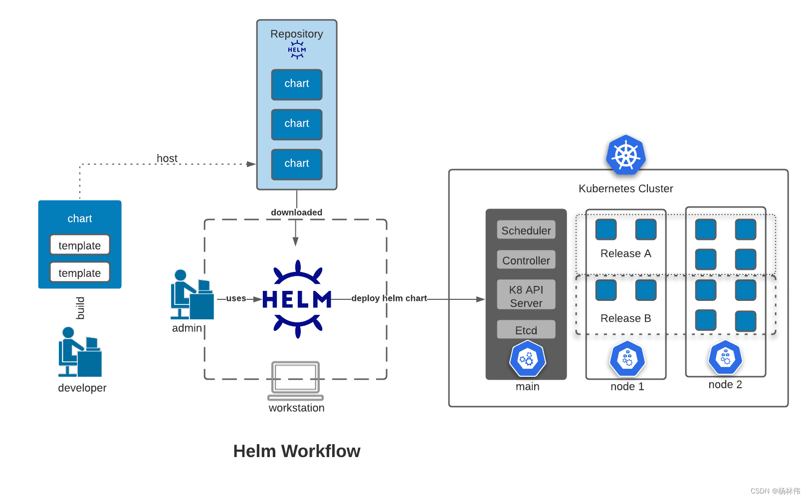
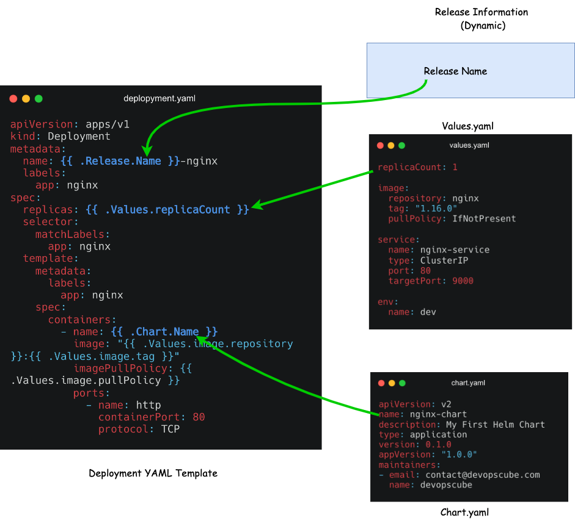

# helm


# 简介

[helm](https://helm.sh/zh/docs/): `Kubernetes` 中资源的包管理器。将一个 `k8s` 集群的所涉及的 `.yaml` 资源配置全部当作一个工程项目 (`chart` 包)，从而实现该集群的快速部署。
- `chart` : 一个 `Helm` 包，其中包含了运行一个应用所需要的镜像、依赖和资源定义等
- `Release` : `Chart` 在 `k8s` 上运行的 `Chart` 的一个实例





# 安装

[install](https://helm.sh/zh/docs/intro/install/)

# 命令行

```term
triangle@LEARN:~$ helm repo list // 查看仓库
triangle@LEARN:~$ helm search [repo|hub] <name> // 搜索 chart
triangle@LEARN:~$ helm pull <name> // 下载 chart 工程包
triangle@LEARN:~$ helm lint <path> // 检测 chart 工程
triangle@LEARN:~$ helm install <release> <chart path> // 安装 chart
triangle@LEARN:~$ helm list // 查看本地的 release
triangle@LEARN:~$ helm uninstall <name> // 卸载 chart
triangle@LEARN:~$ helm upgrade <release> <path> // 修改 chart 工程后，进行更新
triangle@LEARN:~$ helm history <release> // 查看 release 的历史版本
triangle@LEARN:~$ helm rollback <release> <revision> // 版本回退
```

# chart

## 项目工程

```term
triangle@LEARN:~$ helm create nginx-chart // 创建一个 chart 项目
triangle@LEARN:~$ tree .
nginx-chart/
    ├── Chart.yaml                          # chart 描述
    ├── charts                              # 依赖的其他 chart
    ├── templates                           # chart 模板，根据需要定义 k8s 资源
    │    ├── NOTES.txt
    │    ├── _helpers.tpl
    │    ├── deployment.yaml
    │    ├── configmap.yaml
    │    ├── ingress.yaml
    │    ├── service.yaml
    │    └──  tests
    │        └──  test-connection.yaml
    └── values.yaml                         # chart 模板中自定义配置的默认值
```

## 配置文件

- `chart.yaml` 

```yaml
apiVersion: v2
name: nginx-chart
description: My First Helm Chart
type: application
version: 0.1.0
appVersion: "1.0.0"
maintainers:
- email: contact@devopscube.com
  name: devopscube
```

- `values.yaml` 

```yaml
replicaCount: 2

image:
  repository: nginx
  tag: "1.16.0"
  pullPolicy: IfNotPresent

service:
  name: nginx-service
  type: ClusterIP
  port: 80
  targetPort: 9000

env:
  name: dev
```

- `templates/deployment.yaml`  : 在 `templates` 中可以引用 `values.yaml` 与 `chart.yaml` 的变量

```yaml
apiVersion: apps/v1
kind: Deployment
metadata:
  name: {{ .Release.Name }}-nginx
  labels:
    app: nginx
spec:
  replicas: {{ .Values.replicaCount }}
  selector:
    matchLabels:
      app: nginx
  template:
    metadata:
      labels:
        app: nginx
    spec:
      containers:
        - name: {{ .Chart.Name }}
          image: "{{ .Values.image.repository }}:{{ .Values.image.tag }}"
          imagePullPolicy: {{ .Values.image.pullPolicy }}
          ports:
            - name: http
              containerPort: 80
              protocol: TCP
          volumeMounts:
            - name: nginx-index-file
              mountPath: /usr/share/nginx/html/
      volumes:
        - name: nginx-index-file
          configMap:
            name: {{ .Release.Name }}-index-html-configmap
```


