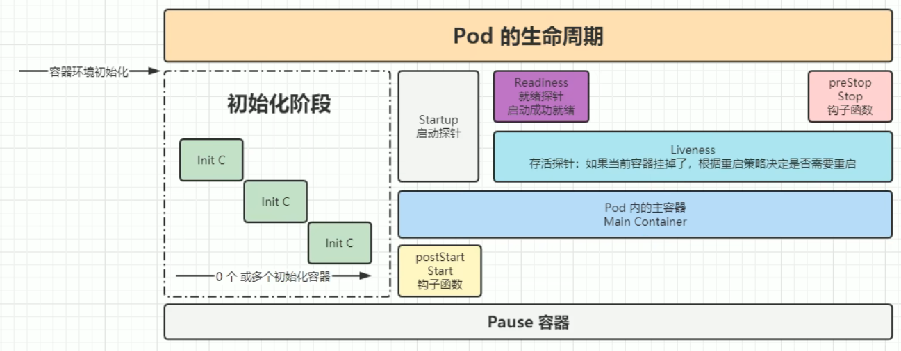

# Pod

# 配置文件


> - [配置](https://kubernetes.io/zh-cn/docs/concepts/configuration/)


```yaml
apiVersion: v1                          # api 版本号 kubectl get versions 查询
kind: Pod                               # 资源名

# 元数据
metadata:
  name: nginx-demo
  namespace: default                    # 命令空间
  labels:                               # 定义标签，内容自定义
    k8s-app: nginx
    environment: dev
  annotations:
    name: nginx-demo

# 期望
spec:
  nodeSelector:                         # 节点选择器
   disk-type: ssd
  restartPolicy: OnFailure              # 重启策略
  containers:                           # 容器定义
  - name: nginx
    image: nginx:1.17                   # 容器镜像，需要 docker 能搜索到
    imagePullPolicy: IfNotPresent       # always: 每次都从仓库拉取
                                        # never: 不会从仓库拉取
                                        # IfNotPresent: 本地没有才会从仓库拉取
    command:                            # 应用启动命令，nginx -g 'daemon off;'
    - nginx
    - -g
    - 'daemon off;'
    workingDir: /usr/share/nginx/html   # 应用的工作目录
    env:
    - name: JVM_OPTS                    # 容器中的环境变量
      value: 'xxx'
    ports:                              # 端口配置
    - name: httpd
      containerPort: 80                 # 容器需要暴露的端口
      hostPort: 8090                    # 宿主机映射到 containerPort 的端口
      protocol: TCP
    resources:                          # 资源限制
      requests:                         # 资源下限
        cpu: 100m
        memory: 128Mi
      limits:                           # 资源上限
        cpu: 200m
        memory: 512Mi
    volumeMounts:                       # 卷挂载
    - name: nginx-site                  # volumes 中的卷名
      mountPath: /usr/share/nginx/html  #挂载至容器中哪个目录
      readOnly: false                   #读写挂载方式，默认为读写模式false
    - name: nginx-log
      mountPath: /var/log/nginx/
      readOnly: false
  volumes:                              # 卷定义
  - name: nginx-site                    # 存储卷名称
    hostPath:                           # 路径，为宿主机存储路径
      path: /data/volumes/nginx/html/   # 在宿主机上目录的路径
      type: DirectoryOrCreate           # 定义类型，这表示如果宿主机没有此目录，则会自动创建
  - name: nginx-log
    hostPath:
      path: /data/volumes/nginx/log/
      type: DirectoryOrCreate
```

# 命令行

```term
triangle@LEARN:~$ kubectl create -f nginx.yaml // 根据配置创建
pod/nginx-demo created
triangle@LEARN:~$ kubectl get pods // 查看 pod 状态
NAME         READY   STATUS              RESTARTS   AGE
nginx-demo   0/1     ContainerCreating   0          14s
triangle@LEARN:~$ kubectl describe pods nginx-demo // 查看详情
Name:             nginx-demo
Namespace:        default
Priority:         0
Service Account:  default
Node:             minikube/192.168.49.2
Start Time:       Wed, 10 Sep 2025 19:53:30 +0800
Labels:           environment=dev
                  k8s-app=nginx
Annotations:      name: nginx-demo
Status:           Running
IP:               172.17.0.3
IPs:
  IP:  172.17.0.3
Containers:
  nginx:
    Container ID:  docker://d8d116c62fc00b10983d7051c120b7a2d9bd0d2def7a12f7c6895f6ec13d77a4
    Image:         nginx:1.17
    Image ID:      docker-pullable://nginx@sha256:6fff55753e3b34e36e24e37039ee9eae1fe38a6420d8ae16ef37c92d1eb26699
    Port:          80/TCP
    Host Port:     8090/TCP
    Command:
      nginx
      -g
      daemon off;
    State:          Running
      Started:      Wed, 10 Sep 2025 19:53:44 +0800
    Ready:          True
    Restart Count:  0
    Limits:
      cpu:     200m
      memory:  512Mi
    Requests:
      cpu:     100m
      memory:  128Mi
    Environment:
      JVM_OPTS:  xxx
    Mounts:
      /usr/share/nginx/html from nginx-site (rw)
      /var/log/nginx/ from nginx-log (rw)
      /var/run/secrets/kubernetes.io/serviceaccount from kube-api-access-76rwn (ro)
Conditions:
  Type              Status
  Initialized       True
  Ready             True
  ContainersReady   True
  PodScheduled      True
Volumes:
  nginx-site:
    Type:          HostPath (bare host directory volume)
    Path:          /data/volumes/nginx/html/
    HostPathType:  DirectoryOrCreate
  nginx-log:
    Type:          HostPath (bare host directory volume)
    Path:          /data/volumes/nginx/log/
    HostPathType:  DirectoryOrCreate
  kube-api-access-76rwn:
    Type:                    Projected (a volume that contains injected data from multiple sources)
    TokenExpirationSeconds:  3607
    ConfigMapName:           kube-root-ca.crt
    ConfigMapOptional:       <nil>
    DownwardAPI:             true
QoS Class:                   Burstable
Node-Selectors:              <none>
Tolerations:                 node.kubernetes.io/not-ready:NoExecute op=Exists for 300s
                             node.kubernetes.io/unreachable:NoExecute op=Exists for 300s
Events:
  Type    Reason     Age   From               Message
  ----    ------     ----  ----               -------
  Normal  Scheduled  73s   default-scheduler  Successfully assigned default/nginx-demo to minikube
  Normal  Pulling    72s   kubelet            Pulling image "nginx:1.17"
  Normal  Pulled     59s   kubelet            Successfully pulled image "nginx:1.17" in 13.068502795s
  Normal  Created    59s   kubelet            Created container nginx
  Normal  Started    59s   kubelet            Started container nginx
triangle@LEARN:~$ kubectl get pods -o wide // 详情
NAME         READY   STATUS    RESTARTS   AGE     IP           NODE       NOMINATED NODE   READINESS GATES
nginx-demo   1/1     Running   0          2m46s   172.17.0.3   minikube   <none>           <none>
triangle@LEARN:~$ kubectl edit pods nginx-demo // 查看 '.yaml' 配置文件
triangle@LEARN:~$ kubectl exec  nginx-demo -it -c nginx -- echo hello // 在容器中执行命令
  kubectl exec (POD | TYPE/NAME) [-c CONTAINER] [flags] -- COMMAND [args...] [options]
Option
    -t              开启终端
    -i              终端可交互
    -c              容器名，'.yaml' 配置文件中配置的
    -n              命名空间
triangle@LEARN:~$ kubectl cp nginx-demo:/data/volumes/nginx/html/index.html ./index.html // 复制命令
由于 nginx 容器进行 volume 挂载，Pod 中容器是共享 Pause 容器中的文件系统，因此只需指定 Pod 

  kubectl cp <file-spec-src> <file-spec-dest> [options]
Options
    -c              容器名
    -n              命名空间

triangle@LEARN:~$ kubeclt logs -f <pod-name> // 查看日志
triangle@LEARN:~$ kubectl delete pods nginx-demo // 删除
```

# 探针

## 概念

**探针`probe`**：`Pod` 探测容器内应用状态的机制
- `startupProbe` : 检查容器内的应用是否已经启动，只有容器启动成功后，才会开启 `livenessProbe` 与 `readinessProbe` 机制
- `livenessProbe`: 检测容器内应用活状态，探测失败则重启容器
- `readinessProbe`: 检测容器内应用否初始化成功，探测成功则 `service` 将会下发流量


## 使用方式

探针的使用方式有三类
- `Exec`: 通过命令行来执行检测

  ```yaml
  spec:
    containers:
    - image: soscscs/myapp:v1
      name: myapp
      livenessProbe:
        exec:                     # 执行一个命令行
          command:
          - sh
          - -c
          - "test -f /tmp/scj.txt"

  ```

- `TCP/Socket` : 通过套接字请求进行检测

  ```yaml
  spec:
    containers:
    - image: soscscs/myapp:v1
      name: myapp
      livenessProbe:
        tcpSocket:                  # 连接一个 socket
                                    # ip 地址就是当前 pod 的，自动填
          port: 8080
        initialDelaySeconds: 5
        periodSeconds: 5
        failureThreshold: 3
  ```

- `HTTP` : 通过 `http` 请求进行检测

  ```yaml
  spec:
    containers:
    - image: soscscs/myapp:v1
      name: myapp
      livenessProbe:
        initialDelaySeconds: 5      # 初始化时间
        timeoutSeconds: 2           # 超时时间
        periodSeconds: 5            # 探测时间间隔
        failureThreshold: 3         # 探测失败 3 次，便认为失败
        successThreshold: 1         # 测成功 1 次，便认为成功
        httpGet:                    # httpget检查方式   
          port: 8080
          path: /index.html
          schema: HTTP
  ```

# 生命周期

## 概念


- `Init C` : 初始化容器，可以塞自己的东西
- `postStart` ：容器启动时回调，一般不使用，功能与容器容器中的启动 `CMD` 冲突，**且 `postStart` 与 `CMD` 同时执行**
- `preStop`: 容器关闭前回调，可进行注销下线、数据清理、数据销毁等操作
- **`Pod` 删除规则**
  1. `Endpoint` 删除 `Pod` 的 `IP` 地址
  2. `Pod` 状态变为 `Terminating`
  3. 执行 `preStop` 回调

## preStop/postStart

```yaml
spec:
  terminationGracePeriodSeconds: 30   # 等待 preStop 的执行时间，超过时间就直接关闭 Pod
  containers:
  - image: soscscs/myapp:v1
    name: myapp
    lifecycle:
      postStart:                      # 不常用
        exec:
          command:
          - sh
          - -c
          - "echo hello"
      preStop:
        httpGet:
          path: /shutdown             # 请求的uri
          port: 8080                  # 端口
          host: api.yilingyi.com      # 主机域名，不加该字段将请求Pod本身
          scheme: HTTP                # http协议，默认值HTTP，支持HTTP、HTTPS
```

## intc

```yaml
apiVersion: apps/v1
kind: Deployment

metadata:
  annotations:
    deployment.kubernetes.io/revision: "1"
  labels:
    app: nginx-deploy
  creationTimestamp: "2025-09-13T06:34:57Z"
  name: nginx-deploy
  namespace: default

spec:
  replicas: 1
  revisionHistoryLimit: 10
  selector:
    matchLabels:
      app: nginx-deploy
  progressDeadlineSeconds: 600
  strategy:
    type: RollingUpdate
    rollingUpdate:
      maxSurge: 25%
      maxUnavailable: 25%

  template:                                 # pod 定义模板
    metadata:
      labels:
        app: nginx-deploy
    spec:
      initContainers:                       # 在 containers 之前运行
      - image: alpine
        imagePullPolicy: IfNotPresent
        name: init
        command: ["sh", "-c", "echo init"]
      containers:
      - name: nginx
        image: nginx:1.7.9
        imagePullPolicy: IfNotPresent
      dnsPolicy: ClusterFirst
      restartPolicy: Always
      schedulerName: default-scheduler
      terminationGracePeriodSeconds: 30
```


