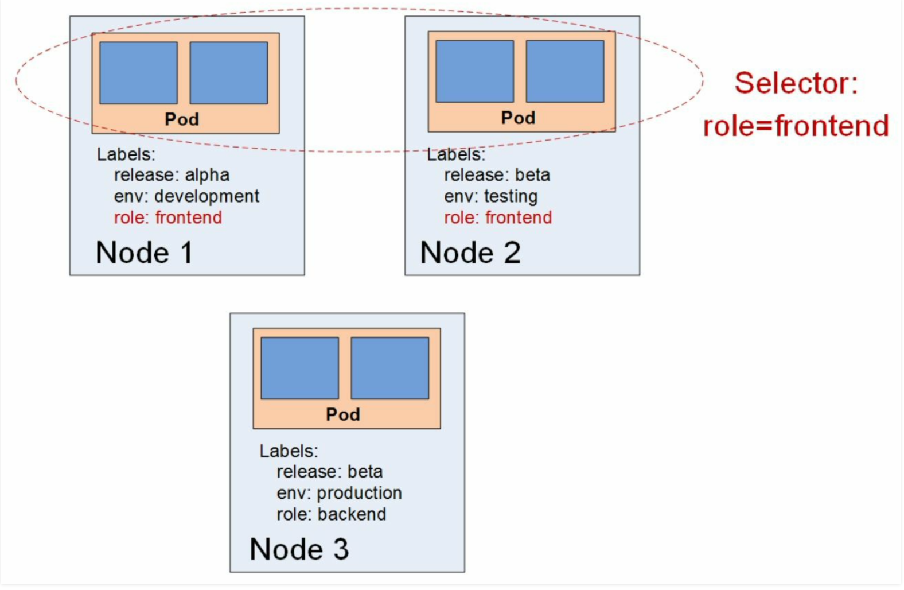

# Pod 部署

# 标签与选择器

## 功能

**作用** : 在 `k8s` 中，可通过「标签`label`」与「选择器`selector`」在两个资源对象之间建立其关联关系。**通过选择器查询目标标签，实现目标对象查询**。




## 标签

- **配置文件**

```yaml
apiVersion: v1                          # api 版本号 kubectl get versions 查询
kind: Pod                               # 资源名

# 元数据
metadata:
  name: nginx-demo
  namespace: default                    # 命令空间
  labels:                               # 定义标签，内容自定义
    k8s-app: nginx
    environment: dev
```

- **命令行**

```term
triangle@LEARN:~$ kubectl get pods --show-labels // 显示 label
NAME         READY   STATUS    RESTARTS       AGE     LABELS
nginx-demo   1/1     Running   1 (116s ago)   2d18h   environment=dev,k8s-app=nginx
triangle@LEARN:~$ kubectl label po nginx-demo author=triangle // 临时添加，刷新会丢失
    kubectl label <resources type> <resources name> <label>
triangle@LEARN:~$ kubectl label po nginx-demo author=young --overwrite // 覆盖
triangle@LEARN:~$ kubectl label pods my-pod author- // 删除标签
```

## 选择器

- **配置文件**

```yaml
apiVersion: apps/v1
kind: Deployment

metadata:
  name: example-deployment

spec:
  selector:
    matchLabels:
      app: nginx-deploy
```

- **命令行**

```term
triangle@LEARN:~$ kubectl get pods -l app=nginx,author=young // 等式匹配
triangle@LEARN:~$ kubectl get pods -l 'app in (nginx,nginx02)' // 多值匹配
triangle@LEARN:~$ kubectl get pods -l 'env!=dev'
```

# deployment


## 配置文件

```yaml
apiVersion: apps/v1
kind: Deployment

metadata:
  annotations:                              # 描述得比比 label 更细致一些
    deployment.kubernetes.io/revision: "1"
  labels:
    app: nginx-deploy
  creationTimestamp: "2025-09-13T06:34:57Z"
  name: nginx-deploy
  namespace: default

spec:
  replicas: 1                               # 副本数量
  revisionHistoryLimit: 10                  # 进行滚动更新后，历史版本保留个数
  selector:                                 # deploy 关联 RS, pod 的选择器
    matchLabels:
      app: nginx-deploy
  progressDeadlineSeconds: 600

  strategy:                                 # 更新策略
    type: RollingUpdate                     # 更新方式
    rollingUpdate:
      maxSurge: 25%                         # 更新最多能超出 replicas 的 pod 数
      maxUnavailable: 25%                   # 最多能更新失败的 pod 数 

  template:                                 # pod 定义模板
    metadata:
      labels:
        app: nginx-deploy
    spec:
      containers:
      - name: nginx
        image: nginx:1.7.9
        imagePullPolicy: IfNotPresent
      dnsPolicy: ClusterFirst
      restartPolicy: Always
      schedulerName: default-scheduler
      terminationGracePeriodSeconds: 30
```


## 命令行

- **管理命令**

```term
triangle@LEARN:~$ kubectl create deployment nginx-deploy --image=nginx:1.7.9 // 快速构建
triangle@LEARN:~$ kubectl get deploy // 查看
NAME           READY   UP-TO-DATE   AVAILABLE   AGE
nginx-deploy   0/1     1            0           74s
triangle@LEARN:~$ kubectl get replicaset // deployment 创建了 RS
NAME                      DESIRED   CURRENT   READY   AGE
nginx-deploy-78d8bf4fd7   1         1         0       3m54s
triangle@LEARN:~$ kubectl get pods // RS 创建了 pod
NAME                            READY   STATUS             RESTARTS   AGE
nginx-deploy-78d8bf4fd7-94pcc   0/1     ImagePullBackOff   0          4m38s
triangle@LEARN:~$ kubectl get deploy nginx-deploy -o yaml // 获取快速创建的 deploy 的配置文件
```

- **配置更新**： 只有修改 `spec.template` 内配置才会触发 `Pod` 更新，其他选项则只是修改 `deployment` 的配置

```term
triangle@LEARN:~$ kubectl edit deploy nginx-deploy // 修改 yaml 配置
triangle@LEARN:~$ kubeclt set image deployment/nginx-deploy nginx=nginx:1.7.9 // 命令修改 'spec.template.spec.containers[nginx]' 的 'image'
triangle@LEARN:~$ kubeclt rollout status deployments nginx-deploy // 查看更新状态
```

- **版本回滚**

```term
triangle@LEARN:~$ kubeclt rollout history deployment/nginx-deploy // 查看历史版本
triangle@LEARN:~$ kubeclt rollout history deployment/nginx-deploy --revision=3 // 查看具体版本详情
triangle@LEARN:~$ kubeclt rollout undo deployment/nginx-deploy --to-revision=2 // 回退到指定版本
```

- **扩容/缩容**

```term
triangle@LEARN:~$ kubectl edit deploy nginx-deploy // 修改 'spec.replicas'
triangle@LEARN:~$ kubeclt scale  deploy nginx-deploy --replicas=3 // 直接修改，不会修改 yaml 配置
```

- **暂停/恢复** : 控制 `kubectl edit` 修改 `spec.template` 中的内容后是否进行 `Pod` 更新

```term
triangle@LEARN:~$ kubeclt rollout pause deploy nginx-deploy // 暂停更新
triangle@LEARN:~$ kubeclt rollout resume deploy nginx-deploy // 恢复更新
```


# StatefulSet


## 配置文件


```yaml
# service 配置，实现访问地址固化
apiVersion: v1
kind: Service
metadata:
  name: nginx
  labels:
    app: nginx
spec:
  ports:
  - port: 80
    name: web
  clusterIP: None
  selector:
    app: nginx

--- # 多个文件分隔符

# StatefulSet 配置
apiVersion: apps/v1
kind: StatefulSet
metadata:
  name: web
spec:
  serviceName: "nginx"                      # 与 Service 绑定
  replicas: 2
  selector:
    matchLabels:
      app: nginx

  updateStrategy:                           # 更新策略
    type: RollingUpdate                     # RollingUpdate : 灰度发布
                                            # OnDelete : Pod 被删除时进行更新
    rollingUpdate:
      partition: 1                          # 简易的灰度发布控制
                                            # 只更新 index >= partition 的 Pod

  template:
    metadata:
      labels:
        app: nginx
    spec:
      containers:
      - name: nginx
        image: nginx:1.7.9
        ports:                              # 端口映射
        - containerPort: 80
          name: web
        volumeMounts:                       # 卷挂载
        - name: www
          mountPath: /usr/share/nginx/html

  volumeClaimTemplates:                     # PVC 定义，实现数据持久化
  - metadata:
      name: www
    spec:
      accessModes: [ "ReadWriteOnce" ]
      resources:
        requests:
          storage: 1Gi
```

## 命令行

- **创建**

```term
triangle@LEARN:~$ kubectl create -f web.yaml // 通过配置文件创建 statefulset，没有快捷创建
service/nginx created
statefulset.apps/web created
triangle@LEARN:~$ kubectl get pods // StatefulSet 创建的 pod
NAME       READY   STATUS             RESTARTS      AGE
web-0      1/1     Running            0             4m19s
web-1      1/1     Running            0             4m3s
```

- **网络测试** : 在集群中可以创建 `busybox` 的 `Pod` 来访问集群内部的的网络

```term
triangle@LEARN:~$ kubectl run -it --image busybox dns-test /bin/sh 
triangle@busybox:~$ ping web-0.nginx // 访问内部网络
```

- **扩容/缩容**

```term
triangle@LEARN:~$ kubeclt scale  sts web --replicas=3
```

- **配置更新** : 与 `deployment` 不同，除了修改 `spec.template` 外，修改 `spec.updateStrategy` 中的内容也会触发 `Pod` 更新

```term
triangle@LEARN:~$ kubectl edit sts web // 修改配置
triangle@LEARN:~$ kubectl set image sts web nginx=nginx:latest // 更新容器镜像
```

- **删除** : `StatefulSet` 部署会关联 `Service` 与 `PersistentVolumeClaim` 资源，因此需要挨着删除
 
```term
triangle@LEARN:~$ kubectl delete sts web // 删除 StatefulSet ，且删除关联的 Pod
triangle@LEARN:~$ kubectl delete service nginx // 删除 Service
triangle@LEARN:~$ kubectl delete pvc www // 删除 PersistentVolumeClaim
```

# daemonSet

## 配置文件


```yaml
apiVersion: apps/v1
kind: DaemonSet

metadata:
  name: fluentd-elasticsearch
  namespace: kube-system
  labels:
    k8s-app: fluentd-logging

spec:
  selector:                             # 关联 Pod ，而非 Node
    matchLabels:
      name: fluentd-elasticsearch

  updateStrategy:                           # 更新策略
    type: OnDelete                          # RollingUpdate : 滚动更新
                                            # OnDelete : Pod 被删除时进行更新

  template:                             # Pod 的定义
    metadata:
      labels:
        name: fluentd-elasticsearch
    spec:
      nodeSelector:                      # 节点选择器，控制 Pod 应当部署到哪些节点上
        type: node-worker
      containers:
      - name: fluentd-elasticsearch
        image: fluentd:v5.0.1
        resources:
          limits:
            memory: 200Mi
          requests:
            cpu: 100m
            memory: 200Mi
        volumeMounts:
        - name: varlog
          mountPath: /var/log
      terminationGracePeriodSeconds: 30

      volumes:                              # 定义数据卷
      - name: varlog
        hostPath:
          path: /var/log                    # node 中的目录
```

## 命令行

- **创建**: 未配置 `nodeSelector`，则默认所有工作节点都会部署 `Pod`

```term
triangle@LEARN:~$ kubeclt create -f fluentd-elasticsearch.yaml
```

- **节点标签**

```term
triangle@LEARN:~$ kubeclt label node node1 type=node-worker // 添加标签
triangle@LEARN:~$ kubeclt get nodes --show-labels // 查看标签
```

- **配置更新** : 与 `deployment` 一样，修改 `spec.template` 中的内容可触发滚动更新，**但是推荐使用 `OnDelete` 策略，而非 `RollingUpdate`**

```term
triangle@LEARN:~$ kubeclt edit daemonSet fluentd-elasticsearch 
```

# HPA

## 配置文件


```yaml
apiVersion: apps/v1
kind: Deployment

metadata:
  annotations:
    deployment.kubernetes.io/revision: "1"
  labels:
    app: nginx-deploy
  creationTimestamp: "2025-09-13T06:34:57Z"
  name: nginx-deploy
  namespace: default

spec:
  replicas: 1                               # 副本数量
  revisionHistoryLimit: 10
  selector:
    matchLabels:
      app: nginx-deploy
  progressDeadlineSeconds: 600
  strategy:
    type: RollingUpdate
    rollingUpdate:
      maxSurge: 25%
      maxUnavailable: 25%

  template:
    metadata:
      labels:
        app: nginx-deploy
    spec:
      containers:
      - name: nginx
        image: nginx:1.7.9
        imagePullPolicy: IfNotPresent
        resources:                          # HPA 得定义每个容器的资源使用量
          limits:
            cpu: 200m                       # 1000m = 1 core
            memory: 512Mi
          requests:
            cpu: 100m
            memory: 128Mi
```


## 命令行

- **`HPA` 管理**

```term
triangle@LEARN:~$ kubeclt create -f nginx-deploy.yaml // 创建 deploy
triangle@LEARN:~$ kubeclt autoscale deploy nginx-deploy --cpu-percent=20 --min=2 --max=5 // 创建 HPA
Options
      --cpu-percent             CPU 阈值，超过阈值扩容，低于阈值缩容
      --min                     replicas 最小值
      --max                     replicas 最大值
triangle@LEARN:~$ kubeclt get hpa
```

- **`metrics` 服务**

```term
triangle@LEARN:~$ curl https://github.com/kubernetes-sigs/metrics-server/releases/download/v0.8.0/components.yaml // 安装
需要对配置文件进行修改
    spec:
      containers:
      - args:
          ...
        # 加上该启动参数，跳过证书验证
        - --kubelet-insecure-tls 
        # 有梯子就直接下载，没有就修改源
        image: mregistry.k8s.io/metrics-server/metrics-server:v0.8.0
triangle@LEARN:~$ kubectl create -f components.yaml
triangle@LEARN:~$ kubeclt top po // 通过  metrics-server 便能查看资源占用情况
NAME    CPU(cores)   MEMORY(bytes)
web-0   0m           13Mi
web-1   0m           13Mi
```
