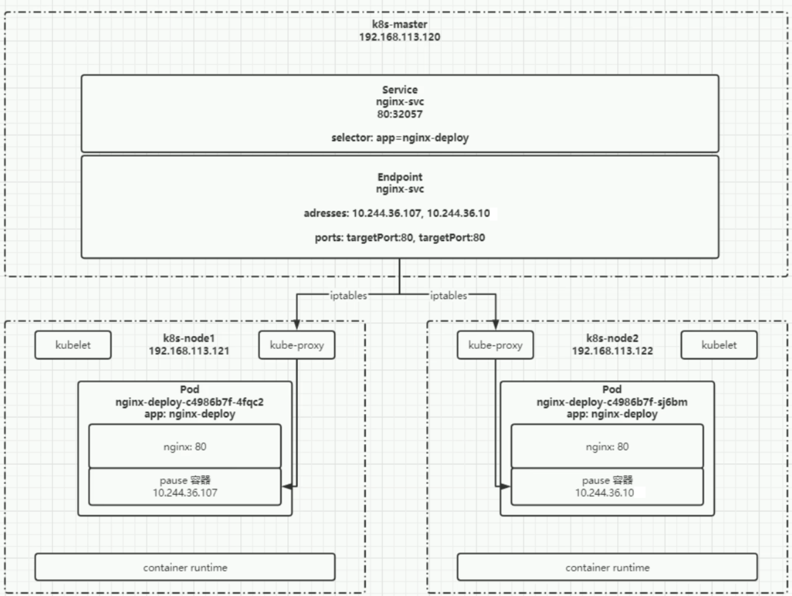
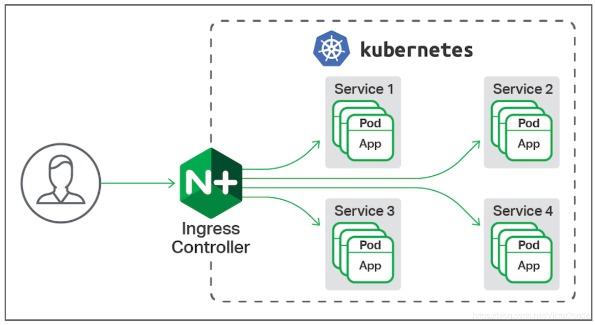

# 服务发现

# service

## 通信结构



`service` 网络通信系统结构为
- `Pod` ： 所有容器运行在 `Pause` 容器之上，由 `Pause` 提供 `IP` 地址，应用容器定义需要暴露的 `Port`
- `Node` : 通过 `kube-proxy` 为每个 `Pod` 的 `Pause` 容器分配 `k8s` 集群的 `IP` 地址
- `EndPoint`: 记录与之关联 `Service` 所管理的 `Pod` 的 `IP` 地址，以及`Pod` 中应用容器暴露的 `Port`，**充当了 `Service` 所管理的 `Pod` 进行网络通信的「路由器」**
- `Service`: 将目标 `Pod` 中需要暴露的 `Port` 与 `Node` 物理 `Port` 绑定，且管理 `EndPoint`

通过 `Service` 便能构建一个通信网络，该网络中的 `Pod` 可互相通信
- **`k8s`集群内网访问**: `Pod` 中暴露的 `Port` + `Pause` 容器的 `IP`
- **`k8s`集群外网访问**: `Service` 中绑定的物理 `Port` + `Node` 的物理 `IP`，**生产环境应当使用 `ingress` 代替**


> [!note]
> 一个 `Service` 内部应当只负责同一类 `Pod` 资源服务的网络通信，不同种类的 `Pod` 应当创建各自的 `Service` 对象

## 配置

```yaml
apiVersion: v1
kind: Service

metadata:
  name: nginx-svc
  labels:
    app: nginx

spec:
  selector:                     # pod 选择器，不配置则不会创建 EndPoint 
    app: nginx-deploy
  type: NodePort                # ClusterIP: 只能够在集群内部访问 service
                                # NodePort: 集群外部可通过 NodePort 访问 service
  ports:                        # 端口映射
  - name: web                   # 端口名
    port: 80                    # service 的端口
    targetPort: 80              # 需要与 service 端口绑定的 Pod 端口
    nodePort: 30007             # node 上的物理端口，默认会从 30000-32767 中随机选择一个值
```


## 命令行

- **管理命令**

```term
triangle@LEARN:~$ kubeclt get svc 
triangle@LEARN:~$ kubeclt describe svc nginx-svc // 查看详情
triangle@LEARN:~$ kubeclt get endpoints
triangle@LEARN:~$ kubeclt get pods -o wide
```

- **内网请求**

```term
triangle@LEARN:~$ kubectl run -it --image busybox dns-test /bin/sh 
triangle@busybox:~$ wget http:\/\/nginx-svc:80 // 内网访问 Service
triangle@busybox:~$ wget http:\/\/nginx-svc.default:80 // 访问其他命名空间的 service
```

## 外部代理

### 概念

**外部代理**：通过 `Service` 将外部服务伪装成内部 `Pod` 服务，内部 `Pod` 可直接通过代理 `Service` 访问外部服务。**当外部服务变动时，只需修改代理 `Service` 即可**。

### IP 代理

1. 创建无 `endpont` 的 `service`

    ```yaml
    apiVersion: v1
    kind: Service

    metadata:
    name: redis-proxy
    labels:
      app: redis-proxy

    spec:
    # 未配置 selector 不会自动创建 endpoint
    # selector:
    #   app: nginx-deploy
    type: ClusterIP
    ports:                          # 端口映射
    - name: redis                   # 端口名
      port: 5678                  # service 的端口
      targetPort: 5678            # 需要与 service 端口绑定的 Pod 端口
    ```

2. 创建 `endpoint` 连接外部的 `redis` 服务

    ```yaml
    apiVersion: v1
    kind: EndPoints

    metadata:
    name: redis-proxy               # 需要与 service 一致
    labels:                         # 需要与 service 一致
      app: redis-proxy

    subsets:
    - addresses:
      - ip: 10.2.3.10               # redis 的 IP 地址
      ports:
      - name: web
        port: 5678                  # redis 端口号
        protocol: TCP
    ```

### 域名代理

```yaml
apiVersion: v1
kind: Service

metadata:
name: bing-proxy
labels:
  app: bing-proxy

spec:
  type: ExternalName
  externalName: www.bing.cn         # 直接代理外部域名
```

# ingress

## 通信结构

[ingress](https://kubernetes.io/zh-cn/docs/concepts/services-networking/ingress/): 主要作用就是反向代理 `service` ，并且将 `k8s` 内部服务暴露给外部用户访问。**但是，`k8s`又只制定了协议规则，需要自行安装控制器，例如 [ingress-nginx](https://kubernetes.github.io/ingress-nginx/deploy/)**



> [!note]
> `ingress-nginx` 的实现原理为在安装 `ingress` 的 `Node` 本地环境中安装了一个 `nginx`，然后通过 `ingress` 与本地的 `nginx` 进行通信，**因此，集群外部可通过 `Node` 的物理 `IP` 直接访问反向代理的集群服务。**

## 配置

```yaml
apiVersion: networking.k8s.io/v1
kind: Ingress

metadata:
  name: minimal-ingress
  annotations:
    # 将 path 重写，然后再转发给 backend
    nginx.ingress.kubernetes.io/rewrite-target: /

spec:
  ingressClassName: nginx-example

  rules:
  - host: www.ingress.com               # 监听域名
    http:
      paths:                            # 路由配置
      - path: /testpath
        pathType: Prefix                # 匹配方式
        backend:
          service:                      # 目标 service
            name: test
            port:
              number: 80
```

