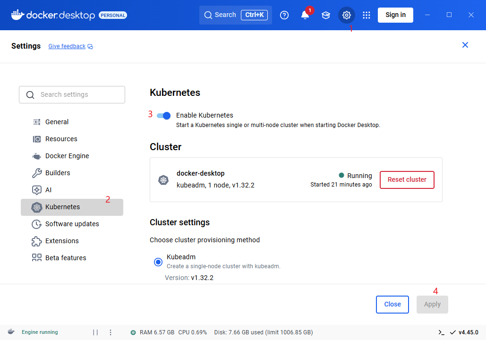
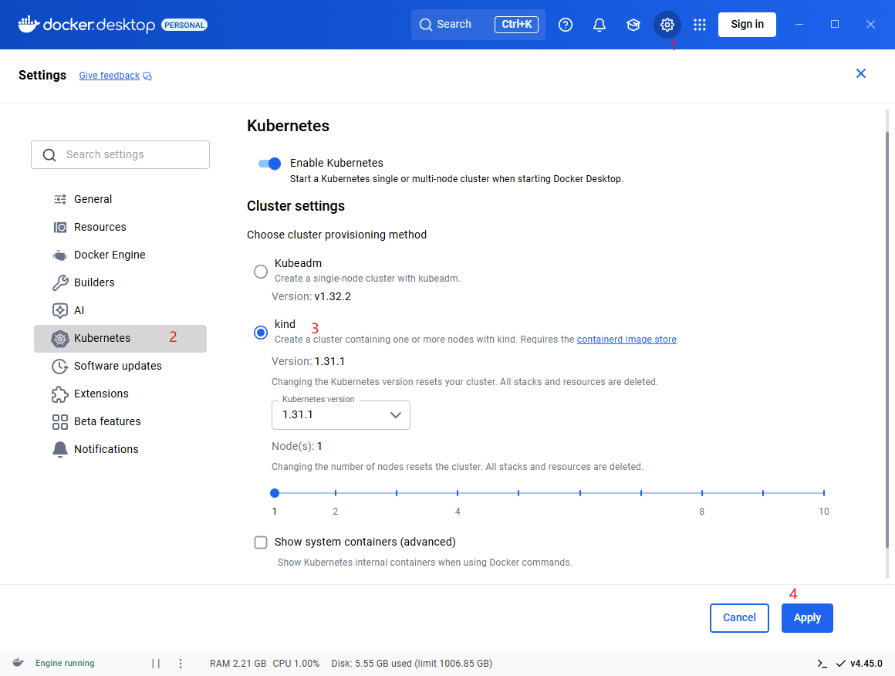
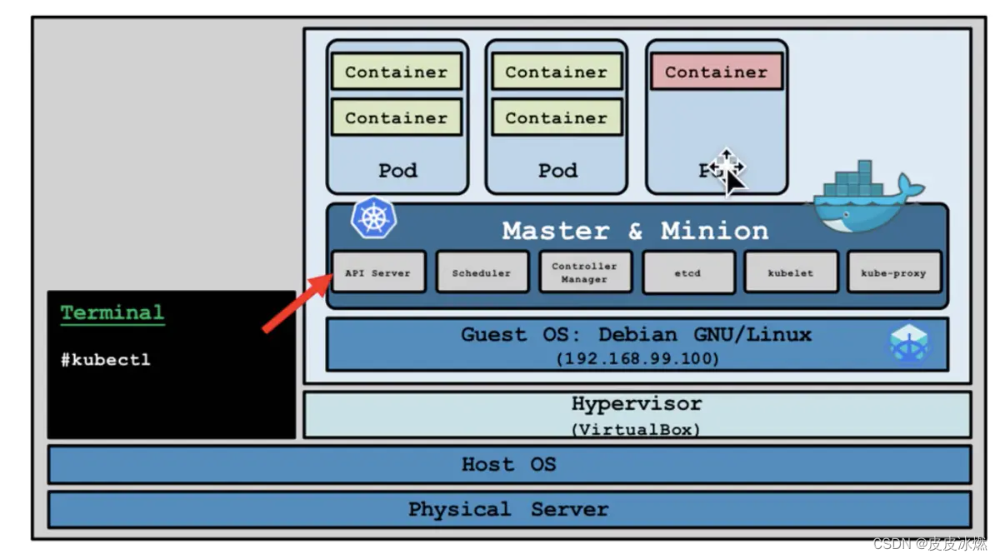
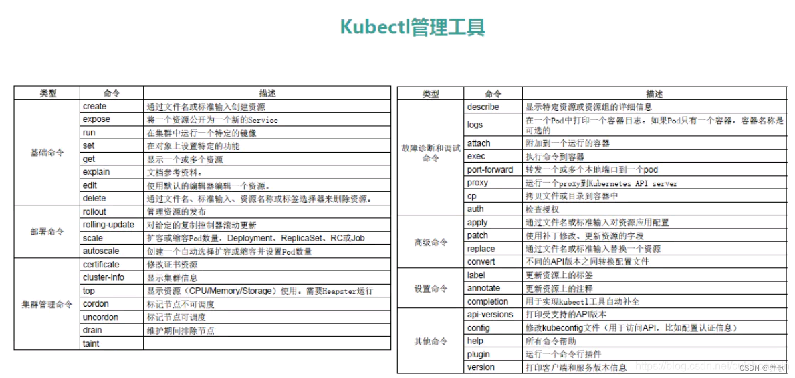

# 集群搭建

# 搭建工具

## 方案

`k8s` 针对用途，有多种构建方式
- `kubeadm` : 主流部署方式，用于生产环境
- `minikube`: 一般用于本地开发、测试和学习，不能用于生产环境
- `docker desktop` : 傻瓜式构建方案
  - 通过 `kubeadm` 构建一个「单节点集群」，用于测试与学习
  - 通过 `kind` 构建「多节点集群」 
- **二进制安装**：从官网下载二进制包，全手动安装，排查问题方便，可用于生产环境

> [!note]
> 学习安装 `k8s` 最好别安装 `1.24.0` 之后的新版本，新版放弃适配 `docker`

## docker desktop

### 单节点

使用 `docker desktop` 自动通过 `kubeadm` 部署一个 **单节点** 的 `k8s` 集群，且自动安装 `kubectl`



### 多节点




## minikube

### 简介

(minikube)[https://minikube.kubernetes.ac.cn/docs/] : 是一个基于`go`语言开发，易于在本地运行 `Kubernetes` 的工具，可在电脑的虚拟机内轻松创建单机版 `Kubernetes` 集群，对硬件资源没有太高的要求，非常适合 **测试** 和 **本地开发**。
- **单机器部署**：`k8s` 的所有 `Node` 均运行在同一台物理机上，即通过 `virtualBox` 虚拟机模拟出多机器的效果




### 安装

根据 [minikube](https://minikube.kubernetes.ac.cn/docs/start/?arch=%2Fwindows%2Fx86-64%2Fstable%2F.exe+download) 官网描述直接安装

### 管理命令

```term
triangle@LEARN:~$ minikube start // 启动 k8s 集群 ，并自动安装 k8s
Options
    --driver                        容器运行时
    --image-mirror-country          镜像国家
    --image-repository              镜像仓库
    --memory                        内存占用
    --cpus                          cpu 占用
    --kubernetes-version            k8s 版本
    --nodes                         需要模拟的节点数
triangle@LEARN:~$ minikube stop // 暂停集群
triangle@LEARN:~$ minikube delete // 删除集群
triangle@LEARN:~$ minikube status // 查看集群状态
triangle@LEARN:~$ minikube dashboard // k8s web 管理界面

```

### 工具命令

```term
triangle@LEARN:~$ minikube service // 快速实现 k8s 中的 service 功能，实现外部访问集群
```

### 节点命令

```term
triangle@LEARN:~$ minikube ip // 获取集群 IP
triangle@LEARN:~$ minikube ssh // 登录 minikube 模拟的 Node
triangle@LEARN:~$ minikube node list // 列出所有节点
triangle@LEARN:~$ minikube node add // 添加一个节点
triangle@LEARN:~$ minikube node delete <name>  // 删除指定节点
triangle@LEARN:~$ minikube node start <name>  // 启动节点
triangle@LEARN:~$ minikube node stop <name>  // 暂停节点
```


### 插件

```term
triangle@LEARN:~$ minikube addons list // 查看插件
triangle@LEARN:~$ minikube addons enable <name> // 启动插件
triangle@LEARN:~$ minikube addons disable <name> // 停用插件
triangle@LEARN:~$ minikube plugin install <name> // 安装
triangle@LEARN:~$ minikube plugin uninstall <name> // 卸载
```

## kubeadm


- **自行安装**: 先按照 [kubeadm 安装手册](https://kubernetes.io/zh-cn/docs/setup/production-environment/tools/kubeadm/install-kubeadm/) 完成初始化工作

```term
triangle@LEARN:~$ sudo apt install kubelet // 在节点上启动 Pod 和容器的工具
triangle@LEARN:~$ sudo apt install kubectl // 管理 k8s 集群的工具
triangle@LEARN:~$ sudo apt install kubeadm // 集群的部署工具
```

> [!note] 所有节点上都要安装 `kubelet`、`kubectl`、`kubeadm`、容器运行时环境


### 主节点


```term
triangle@LEARN:~$ systemctl enable kubelet // 启动节点
triangle@LEARN:~$ kubeadm init // 初始化 k8s 集群
Option
    --apiserver-advertise-address       主节点 IP
    --control-plane-endpoint            主节点的 port
    --image-repository                  docker 镜像仓库
    --kubernetes-version                k8s 版本
    --service-cidr                      service 的网段
    --pod-network-cidr                  pod 的网段
```

`kubeadm init` 安装集群成功后，会提示额外需要执行的命令，依次执行即可

```txt
    ...
Your Kubernetes control-plane has initialized successfully!

To start using your cluster, you need to run the following as a regular user:

  mkdir -p $HOME/.kube
  sudo cp -i /etc/kubernetes/admin.conf $HOME/.kube/config
  sudo chown $(id -u):$(id -g) $HOME/.kube/config

    ...
```

### 从节点

```term
triangle@LEARN:~$ kubeadm token list // 在主节点查询 token
TOKEN                     TTL       EXPIRES                     USAGES                   DESCRIPTION                                                EXTRA GROUPS
0w3a92.ijgba9ia0e3scicg   23h       2019-09-08T22:02:40+08:00   authentication,signing   <none>                                                     system:bootstrappers:kubeadm:default-node-token
triangle@LEARN:~$ // 获取 ca 证书 sha256 编码 hash 值
triangle@LEARN:~$ openssl x509 -pubkey -in /etc/kubernetes/pki/ca.crt | openssl rsa -pubin -outform der 2>/dev/null | openssl dgst -sha256 -hex | sed 's/^.* \/\/'
ce07a7f5b259961884c55e3ff8784b1eda6f8b5931e6fa2ab0b30b6a4234c09a
triangle@LEARN:~$ kubeadm join <ip:port> --token <token> --discovery-token-ca-cert-hash <hash> // 加入主节点
```

### CNI 插件

```term
triangle@LEARN:~$ kubectl get pod -n kube-system // 系统 pod 没有安装到默认命名空间
NAME                                 READY   STATUS    RESTARTS   AGE
coredns-bccdc95cf-h2ngj              0/1     pending   0          14m
coredns-bccdc95cf-m78lt              0/1     pending   0          14m
etcd-k8s-master                      1/1     Running   0          13m
kube-apiserver-k8s-master            1/1     Running   0          13m
kube-controller-manager-k8s-master   1/1     Running   0          13m
kube-flannel-ds-amd64-j774f          1/1     Running   0          9m48s
kube-flannel-ds-amd64-t8785          1/1     Running   0          9m48s
kube-flannel-ds-amd64-wgbtz          1/1     Running   0          9m48s
kube-proxy-ddzdx                     1/1     Running   0          14m
kube-proxy-nwhzt                     1/1     Running   0          14m
kube-proxy-p64rw                     1/1     Running   0          13m
kube-scheduler-k8s-master            1/1     Running   0          13m
```

通过 `kube-system` 命名空间查看集群系统的的 `pod` ，可以发现 `coredns` 没有自动安装，要想集群运行起来，还要额外手动安装对应的 `CNI` 网络插件。可选方案有
- [flannel](https://github.com/flannel-io/flannel)
- [calico](https://www.tigera.io/project-calico/)


```term
triangle@LEARN:~$ kubeclt apply -f <xxx.yaml> // 安装应用，会自动创建对应 pod
```

> [!note]
> 需要在主节点上安装 `flannel` 或 `calico`


# kubectl

## 简介

[kubectl](https://kubernetes.io/zh-cn/docs/reference/kubectl/): 使用 `Kubernetes AP`I 与 `Kubernetes` 集群的控制面进行通信的命令行工具。


## 从节点访问

上述使用 `kubeadm` 部署真正的多节点集群服务时，只在「主节点」中配置了 `$HOME/.kube/config`，即只有主节点的 `kubectl` 才能正确访问到当前集群。要想从节点也能通过 `kubectl` 访问集群，还需要额外配置
1. 将主节点的 `/etc/kubernetes/admin.conf` 拷贝到目标节点 `/etc/kubernetes/` 下
2. 执行以下命令

    ```term
    triangle@LEARN:~$ sudo cp -i /etc/kubernetes/admin.conf $HOME/.kube/config
    triangle@LEARN:~$ sudo chown $(id -u):$(id -g) $HOME/.kube/config
    ```

## 命令



在 `kubectl` 对会对一些常用资源名进行简写
- `pods` -> `po`
- `deployments` -> `deploy`
- `services` -> `svc`
- `namespace` -> `ns`
- `nodes` -> `no`

```term
triangle@LEARN:~$ kubectl --help
kubectl controls the Kubernetes cluster manager.

 Find more information at: https://kubernetes.io/docs/reference/kubectl/

Basic Commands (Beginner):
  create          Create a resource from a file or from stdin
  expose          Take a replication controller, service, deployment or pod and expose it as a new Kubernetes service
  run             Run a particular image on the cluster
  set             Set specific features on objects

Basic Commands (Intermediate):
  explain         Get documentation for a resource
  get             Display one or many resources
  edit            Edit a resource on the server
  delete          Delete resources by file names, stdin, resources and names, or by resources and label selector

Deploy Commands:
  rollout         Manage the rollout of a resource
  scale           Set a new size for a deployment, replica set, or replication controller
  autoscale       Auto-scale a deployment, replica set, stateful set, or replication controller

Cluster Management Commands:
  certificate     Modify certificate resources
  cluster-info    Display cluster information
  top             Display resource (CPU/memory) usage
  cordon          Mark node as unschedulable
  uncordon        Mark node as schedulable
  drain           Drain node in preparation for maintenance
  taint           Update the taints on one or more nodes

Troubleshooting and Debugging Commands:
  describe        Show details of a specific resource or group of resources
  logs            Print the logs for a container in a pod
  attach          Attach to a running container
  exec            Execute a command in a container
  port-forward    Forward one or more local ports to a pod
  proxy           Run a proxy to the Kubernetes API server
  cp              Copy files and directories to and from containers
  auth            Inspect authorization
  debug           Create debugging sessions for troubleshooting workloads and nodes
  events          List events

Advanced Commands:
  diff            Diff the live version against a would-be applied version
  apply           Apply a configuration to a resource by file name or stdin
  patch           Update fields of a resource
  replace         Replace a resource by file name or stdin
  wait            Experimental: Wait for a specific condition on one or many resources
  kustomize       Build a kustomization target from a directory or URL

Settings Commands:
  label           Update the labels on a resource
  annotate        Update the annotations on a resource
  completion      Output shell completion code for the specified shell (bash, zsh, fish, or powershell)

Subcommands provided by plugins:

Other Commands:
  api-resources   Print the supported API resources on the server
  api-versions    Print the supported API versions on the server, in the form of "group/version"
  config          Modify kubeconfig files
  plugin          Provides utilities for interacting with plugins
  version         Print the client and server version information

Usage:
  kubectl [flags] [options]
```