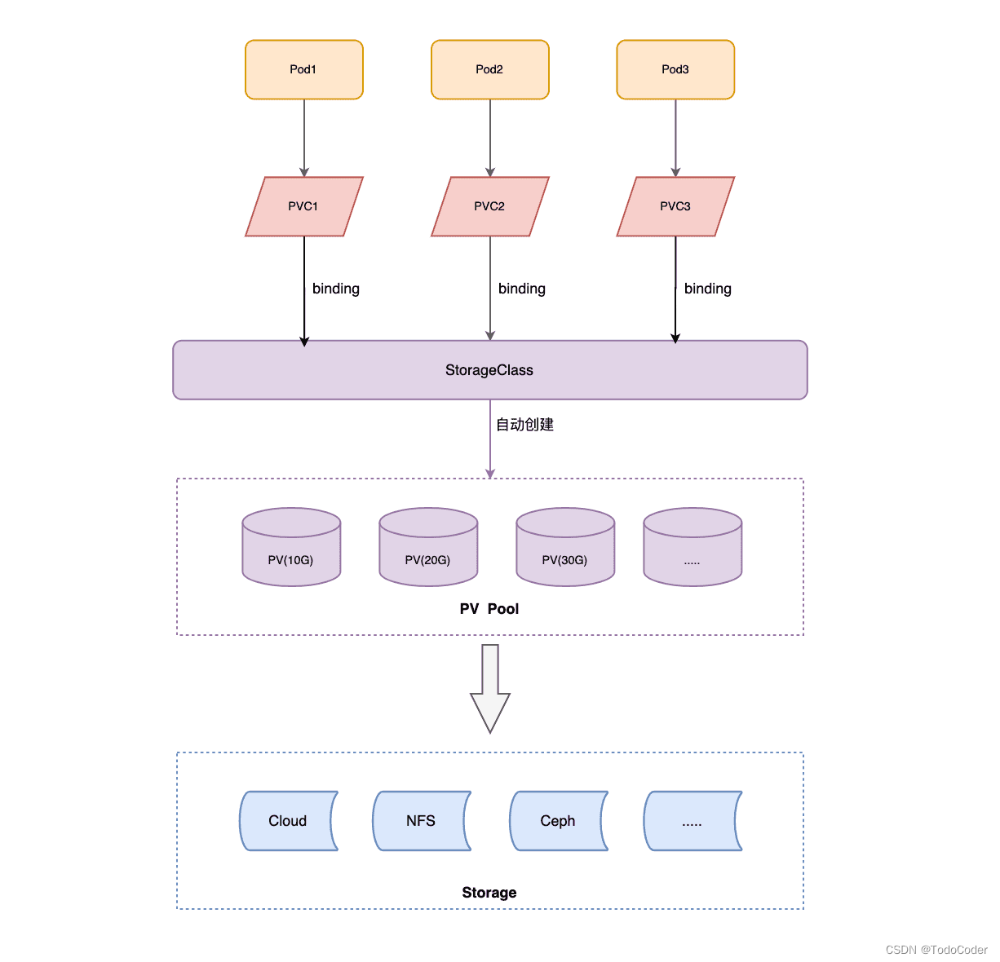

# 存储

# volumes

## HostPath

`HostPath`: 将节点上的文件或文件夹挂载到 `Pod` 中。


```yaml
apiVersion: v1
kind: Pod
metadata:
  name: test-volume
spec:
  containers:
  - name: alpine
    imagePullPolicy: IfNotPresent
    image: alpine
    command: ["/bin/sh", "-c", "sleep 30000"]
    volumeMounts:
    - name: test                            # 要挂载的卷名
      mountPath: /test-data
  volumes:
  - name: test
    HostPath:                               # 将主机文件夹定义为卷
      path: /data                           # 主机上的目录
      type: Directory                       # 空字符：默认
                                            # DirectoryOrCreate: path 文件夹不存在会自动创建
                                            # Directory: path 文件夹必须存在
                                            # FileOrCreate: path 文件
                                            # File
                                            # Socket: socket 文件
```

## EmptyDir

`EmptyDir` : 实现同一 `Pod` 中多个容器间的文件/文件夹共享，**但没有数据持久化能力**


```yaml
apiVersion: v1
kind: Pod
metadata:
  name: test-volume
spec:
  containers:

  - name: alpine_1
    imagePullPolicy: IfNotPresent
    image: alpine
    command: ["/bin/sh", "-c", "sleep 30000"]
    volumeMounts:
    - name: test
      mountPath: /test-data-1

  - name: alpine_2
    imagePullPolicy: IfNotPresent
    image: alpine
    command: ["/bin/sh", "-c", "sleep 30000"]
    volumeMounts:
    - name: test
      mountPath: /test-data-2

  volumes:
  - name: test
    emptyDir: {}
```

# NFS


## 安装

```term
triangle@LEARN:~$ sudo apt install nfs-utils // 安装
triangle@LEARN:~$ sudo systemctl start nfs-server // 启动
triangle@LEARN:~$ vim /etc/exports // 配置共享文件夹
/public     192.168.245.0/24(ro)
/protected  192.168.245.0/24(rw)
triangle@LEARN:~$ exportfs -f // 应用配置文件
triangle@LEARN:~$ sudo systemctl reload nfs-server // 重启服务
triangle@LEARN:~$ mount -t nfs 192.168.245.1:/public  /mnt/nfs/public // 其他机器挂载 nfs
```

## Pod 挂载

```yaml
apiVersion: v1
kind: Pod
metadata:
  name: test-volume
spec:
  containers:
  - name: alpine
    imagePullPolicy: IfNotPresent
    image: alpine
    command: ["/bin/sh", "-c", "sleep 30000"]
    volumeMounts:
    - name: test
      mountPath: /test-data-1

  volumes:
  - name: test
    nfs:                                # 配置 nfs 卷
      server: 192.168.245.1
      path: /public
      readOnly: false
```

# PV 与 PVC

## 概念

- **持久卷 `PersistentVolume，PV`**: 一种集群资源，是存储方案的抽象，具体可由`NFS`、`iSCSI` 等存储系统实现接口。 **`k8s` 通过 `PV` 代理实现数据持久化，而无需关注背后实际的存储方案。**

- **持久卷申领`PersistentVolumeClaim，PVC`** : `Pod` 通过 `PVC` 去查询满足要求的 `PV` 资源。


`PV` 与 `PVC` 定义流程
1. **构建**
   - 静态构建：在 `k8s` 集群启动前，已经提前准备好了 `PV` 资源
   - 动态构建：如果 `PV` 已经无法满足 `PVC` 需求，集群将根据 `StorageClass` 动态创建 `PV`
2. **绑定**：将 `PV` 与 `PVC` 关联
3. **使用**: 将 `Pod` 与 `PVC` 关联

`k8s` 集群中的实际运行流程：`Pod` 查找对应的 `PVC`，然后 `PVC` 查找目标 `PV`

## PV

```yaml
apiVersion: v1
kind: PersistentVolume
metadata:
  name: pv0003
spec:
  capacity:
    storage: 5Gi
  volumeMode: Filesystem                  # 卷模式
  accessModes:                            # 访问模式
    - ReadWriteOnce                       # __Once: PV 与 PVC 只能一对一
                                          # __Many: PV 可以与多个 PVC 绑定
  persistentVolumeReclaimPolicy: Retain   # Retain：PV 删除后，数据会保留
                                          # Delete: PV 删除后，会清理数据
                                          # Recycled: 新版废弃，PV 清理数据，然后可以被继续使用
  storageClassName: slow
  mountOptions:
    - hard
    - nfsvers=4.1
  nfs:
    path: /tmp
    server: 172.17.0.2
```

## storageClass

### 概念


**存储类`storageClass`** : 提供动态创建 `PV` 的能力，当 `PVC` 提出需求后，`StorageClass` 将自动构建出目标 `PV`，而无需人工手动创建。
- `provisioner` : 制备器，决定使用何种存储系统来构建 `PV`，例如本地磁盘、NFS、NAS等。**制备器抄官网，或者用现成的。**




> [!note]
> 制备器与 `k8s` 版本关联，若 `storageClass` 无法运行，可能是使用的 `provisioner` 与 `k8s` 版本不匹配

### 配置


```yaml
apiVersion: storage.k8s.io/v1
kind: StorageClass
metadata:
  name: low-latency
  annotations:
    storageclass.kubernetes.io/is-default-class: "false"
provisioner: csi-driver.example-vendor.example              # 制备器
reclaimPolicy: Retain # default value is Delete
allowVolumeExpansion: true
mountOptions:
  - discard # this might enable UNMAP / TRIM at the block storage layer
volumeBindingMode: WaitForFirstConsumer
parameters:
  guaranteedReadWriteLatency: "true" # provider-specific
```


## PVC

```yaml
apiVersion: v1
kind: PersistentVolumeClaim
metadata:
  name: myclaim
spec:                                     # 描述能与 PVC 匹配的 PV 需要满足哪些条件
  accessModes:                            # 只能查找访问模式的 PV
    - ReadWriteOnce
  volumeMode: Filesystem

  resources:                              # 声明需求，模糊匹配
    requests:                             # 下限
      storage: 8Gi                        # PVC 需要 >= 8Gi 的 PV

  storageClassName: low-latency           # 指定 storageClass 创建 PV

  selector:                               # 通过选择器精确查询 PV
    matchLabels:
      release: "stable"
    matchExpressions:
      - {key: environment, operator: In, values: [dev]}
```


## Pod

```yaml
apiVersion: v1
kind: Pod
metadata:
  name: mypod
spec:
  containers:
    - name: myfrontend
      image: nginx
      volumeMounts:
      - mountPath: "/var/www/html"
        name: mypd

  volumes:
    - name: mypd
      persistentVolumeClaim:
        claimName: myclaim                # 声明当前 Pod 需要使用的 PVC
```

