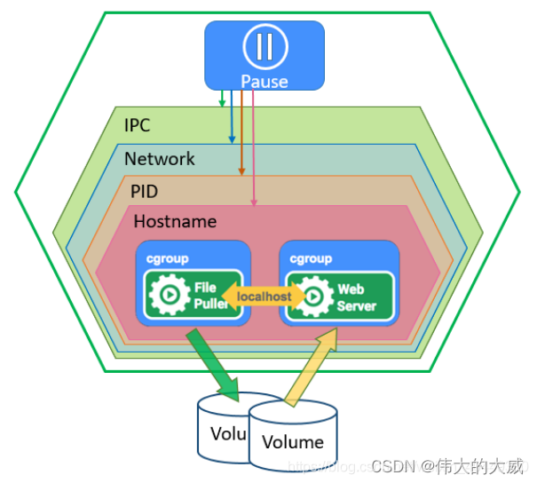

# 概念与术语

# 服务分类

**无状态服务**: 不会在本地存储持久化数据；复制的服务实例对于同一个用户请求的响应结果是完全一致的，且多服务实例之间是没有依赖关系
- 优点：可快速扩容、迁移
- 缺点：无法存储数据，只能通过输入计算得到输出结果

**有状态服务**：会在本地存储持久化数据；复制的服务实例之间存在主从关系
- 优点：可实现数据管理
- 确定：主从节点数据同步、节点扩容复杂

# 资源与对象

> - **资源**： `k8s` 中所有内容的抽象，即「类定义」
> - **对象**: 基于资源创建出来的实体，即「实例」

## 对象规约与状态

**配置文件**：描述对象的属性，`kubectl` 可通过配置文件创建「对象」，支持的 `json` ，`yaml` 格式

- **规约`spec`**: 对象的期望状态 `desired state` ，在对象的配置文件中「必填」
- **状态`status`**: 对象的当前状态`current state`，由 `k8s` 创建维护，且控制器会努力使之达成期望状态

## 资源层级

在 `k8s` 会将资源划分为主要三个层级
- **元数据资源** : 一种模板化资源，主要用于监控和管理资源的中间变量，允许其他资源访问
- **集群资源** : 用范围覆盖整个集群，不属于任何特定命名空间，且名称必须全局唯一
- **命名空间资源**: 用于资源隔离的逻辑单元，它允许在同一集群中运行多个团队或应用，避免资源冲突。

## 元数据资源

- `Horizontal Pod Autoscaler（HPA）` : `Pod` 自动扩容，可以根据 `CPU` 使用率或自定义指标`metrics`自动对`Pod`进行扩/缩容
  - 控制器默认会间隔 `30s` 检查一次
  - 指标`metrics`类型
    - 预定义指标
    - 自定义 `pod` 指标
    - 自定义 `object` 指标
- `PodTemplate`: `Pod`的模板定义，`k8s` 会根据模板创建 `Pod`
- `LimitRange`: 对集群内 `Pod` 的 `Request` 和 `Limits` 进行统一配置，即限制 `Pod` 能使用的资源

## 集群资源

- `Namespace` : 命名空间资源，当前集群中的命令空间
- `Node`: 节点资源，实际物理机
- `ClusterRole`: 定义权限角色
- `ClusterRoleBinding`: 将权限角色与资源绑定，**且只能绑定集群级别的资源**

## 命名空间资源

### Pod

**`Pod`** : `k8s` 中最小的可部署计算单元。它是一组（一个或多个）容器，这些容器共享存储、网络以及运行规约。`Pod` 中的容器总是并置运行，并在共享的上下文中调度。

`Pod` 本质上是一个 `Pause` 容器，而在 `Pod` 中的用户容器则运行在 `Pause` 容器之中。通过 `Pause` 容器便能实现一个 `Pod` 内的用户容器实现网络、进程、磁盘、域名等资源共享
- **共享网络命名空间**：`Pod` 内容器可通过 `localhost` 进行通信
- **共享存储卷**：`Pod` 中的容器可以挂载共享的存储卷，从而共享数据，例如一个容器生成数据，另一个容器处理这些数据。
- **紧密耦合**：`Pod` 中的容器通常共同协作完成某个特定任务。它们可以共享资源和环境，从而更好地利用集群的计算能力。
- **生命周期**：`Pod` 是 `k8s` 调度和管理的基本单位，当 `Pod` 中的容器失败或终止时，`k8s` 会根据定义的重启策略自动重启 `Pod`

### replicas

**副本 `Replicas`** : 根据现有 `Pod` 实例创建的副本,副本除了基本信息(名字、`uuid`等)不一样外，其他信息与原 `Pod` 一致。在控制器中，会通过 `replicas` 属性指定 `Pod` 的期望的副本数量，`k8s` 将确保集群中运行的实际副本数量与期望值相符

### 控制器

**`Pod`控制器**: `Kubernetes`中用于管理`Pod`的中间层。通过控制器，用户只需定义需要的`Pod` 数量及其配置，控制器会自动创建满足条件的`Pod`，并确保它们始终处于预期状态。如果`Pod`运行中出现故障，控制器会根据指定策略重新启动或重建`Pod`

在 `k8s` 中，控制器主要有四大类
- **无状态服务部署**
  - `ReplicationController(RC)` : 动态控制 `Pod` 的 `replicas` 数量，**已经废弃**
  - `ReplicatSet(RS)` : `RC` 的增强版，增加 `selector` 机制，可对指定标签 `label` 的 `Pod` 进行动态扩容/缩容
  - `Deployment` : 对 `RS` 功能进一步增强，**最常用**
    - 自动创建 `RS` 与 `Pod`
    - 滚动升级/回滚: 当要升级 `RS1` 中 `Pod` 时，`Deployment` 首先会新建一个 `RS2` ，然后在 `RS2` 创建一个新的 `Pod` 并删除 `RS1` 中一个旧的 `Pod`，重复操作，直到 `RS1` 中旧 `Pod` 全部更新完成。滚动回滚同理

      

    - 平滑扩容/缩容
    - 滚动机制的暂停/恢复 : 将修改累计到一定量时，才允许进行滚动操作，防止频繁滚动
- **有状态服务部署**: `StatefulSet` 是专门用于有状态服务部署的控制器，主要实现维持主从关系、应用的数据持久化存储、访问网络地址固定功能
  - `headless service`: 为每个 `Pod` 创建网络标识 `DNS domain`
  - `volumeClaimTemplate`: 用于数据本地持久化的工具
  - 有序的扩容/缩容：`StatefulSet` 中的 `Pod` 会分配一个顺序编号，当需要进行扩容与缩容时，会根据该编号进行
  