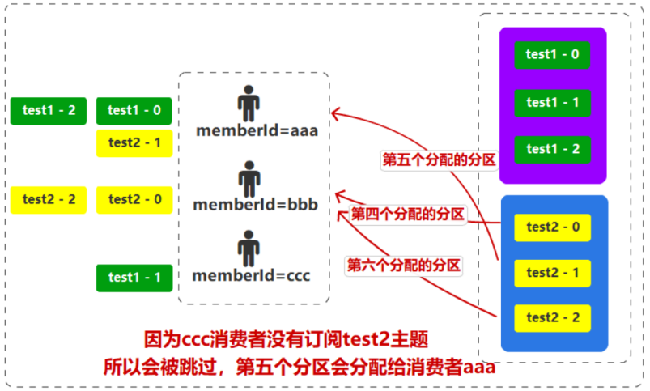

# 消费者

# 消息获取流程


# 偏移量初始值


消费者从 `Topic` 的分区中获取消息时，需要指定消息的「偏移量」。默认会将 `LEO` 作为初始偏移量获取消息。**但这样就会导致消费者启动后，只有生产者发送新的消息才会开始消费，不会消费`Topic`中已经存储的消息**
- `LEO, (Log End Offset)` : 分区日志中下一条将要写入的消息的偏移量，**即当前最后一条消息的偏移量 + `1`**

可通过 `auto_offset_reset` 指定偏移量初始值
- `earliest` : 用 `Topic`  中最早的消息作为初始值
- `latest` : 用 `Topic` 中最新的消息作为初始值

```python
from kafka import KafkaConsumer

consumer = KafkaConsumer(
    bootstrap_servers='127.0.0.1:9092',
    auto_offset_reset='earliest',           # 消息偏移量的设置方式
    enable_auto_commit=True,
    group_id = "group_1"                    # 消费组
)
```

> [!note]
> 初始化只发生在「消费者组」第一次创建的时候，当存在偏移量提交时，便忽略

# 偏移量提交

## 自动提交

消费者会以消费组 `group_id` 为单位，自动提交已经消费的偏移量，使得消费者重启后能接着继续消费。**消费者提交的偏移量会被保存到 `broker` 的 `consumer_offsets` 主题中。**
- `auto.commit.interval.ms` : 自动提交偏移量的时间间隔，默认 `5s`

由于自动提交是 `5s` 一次，这样就可能存在 `5s` 内的偏移量更新丢失，**即在自动提交模式，消费者重启后可能会重复消费消息**。


## 手动提交

```python
from kafka import KafkaConsumer

consumer = KafkaConsumer(
    bootstrap_servers='127.0.0.1:9092',
    auto_offset_reset='earliest',
    enable_auto_commit=False
)

consumer.subscribe(topics=['test'])

while True:
    datas = consumer.poll(timeout_ms=100)

    for key,record in datas.items():
        print(record[0].value.decode('utf-8'))

        try:
            # 消息处理
            do_something()

            consumer.commit()  # 同步提交
            consumer.commit_async() # 异步提交
        except Exception as e:
            pass
```

# 消费者组

## 概念

**消费者组`Consumer Group`**: 由多个消费者实例组成，共同协作来消费一个或多个主题。消费者组存在一个重要的规则，**一个分区的消息只能被组内的一个消费者消费，但一个消费者可以消费多个分区。** 

在一个消费者组内，存在以下情况
- `消费者数量 = 分区数量` : 一个消费者对应一个分区
- `消费者数量 > 分区数量` : 多的消费者将空闲
- `消费者数量 < 分区数量` : 存在一个消费者对应多个分区


**通过消费者组机制，就能保证同一消费者组内，消费者提交的偏移量操作肯定是原子的，即在`broker`视角，消费组内同一消息不会被重复消费**

> [!tip]
> 此外以下规则也合法
> - 一个消费者可以消费多个`Topic`，即一个消费者可以属于多个消费者组
> - 一个消费者组可以消费多个 `Topic`

## 队列模式

基于消费组，便能实现「点对点」与「发布/订阅」消息通信模式


| 模式      | 消费者组配置                   | 效果                                             | 适用场景                                               |
| --------- | ------------------------------ | ------------------------------------------------ | ------------------------------------------------------ |
| 发布/订阅 | 多个消费者组订阅同一主题       | 一条消息被多个消费者组消费                       | 数据复用，如一份数据同时用于实时分析、风控、归档       |
| 点对点    | 一个消费者组内有多个消费者实例 | 消息在组内消费者间负载均衡，每条消息只被消费一次 | 横向扩展，提高消息处理能力，如多个`Worker`处理任务队列 |


# 分区分配策略

## 角色

消费者组内的消费者没有与 `Topic` 分区直接绑定，因此，`kafka` 内部实现了一个分区分配策略：
- `Leader` : 负责执行分区分配策略的消费者
- `Follower`: 消费者组内的其他其他消费者


当新消费者加入群组的时候，会发送一个 `JoinGroup` 请求，`broker` 会将现有的消费者全部剔除消费组，重新选举出 `Leader` (谁先接入，谁就是 `leader` )，然后 `Leader` 通过「分配策略」重新分配分区。


> [!tip]
> 消费组的信息都会保存到 `broker` 的 `consumer_offsets` 主题中，为了保证效率，默认 `consumer_offsets` 的主题值为 `50`，因此 `group.id.hashCode % 50`

## 分配策略
<!-- D:\notebooks\cpp_notes\docs\image\kafka -->
### RoundRobinAssignor

1. 每个消费者组中的消费者都会含有一个自动生产的`UUID`作为`memberid`

    

2. 将每个消费者按照 `memberid` 进行排序，所有 `member` 消费的主题分区根据主题名称进行排序

    

3. 将主题分区轮询分配给对应的订阅用户，注意未订阅当前轮询主题的消费者会跳过

    

    

**轮询分配策略并不是那么的均衡**

### RangeAssignor

按照每个 `topic` 的 `partition` 数计算出每个消费者应该分配的分区数量，然后分配，分配的原则就是一个主题的分区尽可能的平均分，如果不能平均分，那就按顺序向前补齐即可。

```txt
假设【1,2,3,4,5】5个分区分给2个消费者：
5 / 2 = 2, 5 % 2 = 1 => 剩余的一个补在第一个中[2+1][2] => 结果为[1,2,3][4,5]

假设【1,2,3,4,5】5个分区分到3个消费者:
5 / 3 = 1, 5 % 3 = 2 => 剩余的两个补在第一个和第二个中[1+1][1+1][1] => 结果为[1,2][3,4][5]
```


**范围分配策略针对单个`Topic`的情况下显得比较均衡，但是假如一个消费者对应多个 `Topic` 的话，效果就很不理想。**

### StickyAssignor

**黏性分区`StickyAssignor`**: 在第一次分配后，每个组成员都保留分配给自己的分区信息。如果有消费者加入或退出，那么在进行分区再分配时（一般情况下，消费者退出 `45s` 后，才会进行再分配，因为需要考虑可能又恢复的情况），尽可能保证消费者原有的分区不变，重新对加入或退出消费者的分区进行分配。

- **新增消费者**


- **消费者退出**


### CooperativeStickyAssignor

前面的三种分配策略再进行重分配时使用的是`EAGER`协议，会让当前的所有消费者放弃当前分区，关闭连接，资源清理，重新加入组和等待分配策略。明显效率是比较低的，所以从`Kafka2.4`版本开始，在粘性分配策略的基础上，优化了重分配的过程，使用的是`COOPERATIVE`协议，特点就是在整个再分配的过程中从图中可以看出，粘性分区分配策略分配的会更加均匀和高效一些，`COOPERATIVE`协议将一次全局重平衡，改成每次小规模重平衡，直至最终收敛平衡的过程。

> [!note]
> `kafka` 的默认分配策略便是，首先使用 `RangeAssignor` 初始化，之后便使用 `CooperativeStickyAssignor` 实现更新。

## 脚本

```python
from kafka import KafkaConsumer
from kafka.coordinator.assignors import (
    RoundRobinAssignor, 
    RangeAssignor, 
    StickyAssignor
)

consumer = KafkaConsumer(
    bootstrap_servers='127.0.0.1:9092',
    auto_offset_reset='earliest',
    enable_auto_commit=False,
    partition_assignment_strategy=[
        StickyAssignor,                     # 优先尝试粘性策略
        RoundRobinAssignor,                 # 如果不支持，回退到轮询策略
        RangeAssignor                       # 最后使用范围策略
    ]
    group_instance_id = 'member_id'         # 不指定则自动分配
)
```

