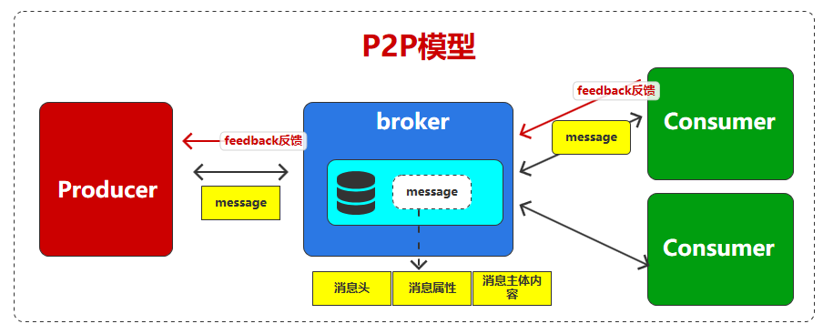
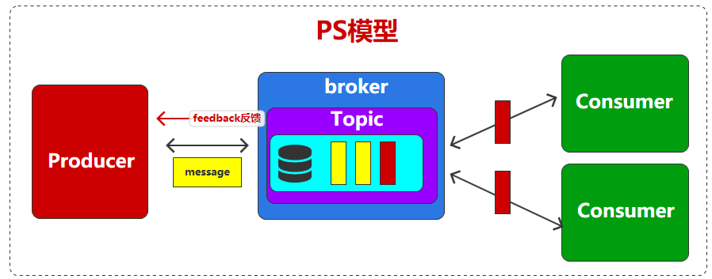
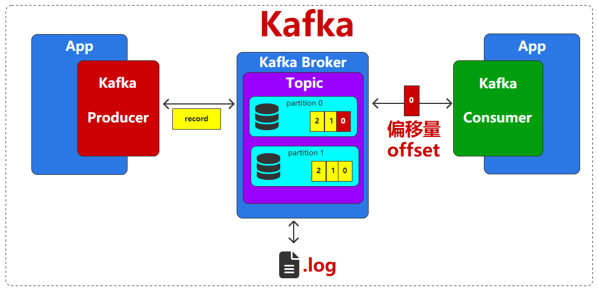

# 简介


# kafka

[kafka](https://kafka.apache.org/): 用`scala`语言编写，是一个分布式、支持分区的（partition）、多副本的（replica），基于`zookeeper`协调的分布式消息系统，它的最大的特性就是可以实时的处理大量数据以满足各种需求场景：比如基于hadoop的批处理系统、低延迟的实时系统、storm/Spark流式处理引擎，web/nginx日志、访问日志，消息服务等。

# 安装

```term
triangle@LEARN:~$ docker pull apache/kafka
triangle@LEARN:~$ docker run -d --name kafka -p 9092:9092 apache/kafka
```

> [!note]
> - `2.8.0` 版本之前，只能通过 `zookeeper` 实现节点管理
> - `3.0.0` 版本开始，生产环境可采用 `KRaft` （`Raft`算法实现）模式替代 `zookeeper` 
> - `3.5.0` 版本开始，`KRaft` 成为生产环境集群部署的主流模式

# 通信模式

## 点对点

**点对点`P2P, Peer-to-Peer`** : 同一个消息只能被一个消费者消费




## 发布订阅

**发布订阅`PS, publish/subscribe`**: 生产者`Producer`将消息发布到主题`Topic`，多个消费者`Consumer`可以订阅同一个主题，获取消息副本。




# 基本结构

可看出 `P2P` 模式是 `PS` 通信模型的一种特例，因此，在 `kafka` 中将两种通信方式统一为一种实现



- 话题 `Topic` : 生产者的消息存入 `Topic`，而消费者则从 `Topic` 读消息
- 分区 `Partition` : 一个有序、不可变的消息队列
- 偏移量 `Offset` : 每条消息在分区 `partition` 中的唯一编号，从 `0` 开始，进而实现队列的 `FIFO` 机制
- 日志 `log` : 消息数据本地序列化
- 记录 `record` : 封装消息的对象


# 命令行

## 命令脚本

`kafka` 的命令行控制均是通过 `.bat` 或 `.sh` 脚本实现

```term
triangle@LEARN:~$ docker exec -it kafka /bin/bash // 进入容器
triangle@LEARN:~$ cd /opt/kafka/bin // 进入 kafka 命令脚本位置
triangle@LEARN:bin$ ls -l
total 172
-rwxr-xr-x 1 appuser appuser  1414 Mar 14  2025 connect-distributed.sh
-rwxr-xr-x 1 appuser appuser  1387 Mar 14  2025 connect-mirror-maker.sh
-rwxr-xr-x 1 appuser appuser   963 Mar 14  2025 connect-plugin-path.sh
-rwxr-xr-x 1 appuser appuser  1455 Mar 14  2025 connect-standalone.sh
-rwxr-xr-x 1 appuser appuser   872 Mar 14  2025 kafka-acls.sh
-rwxr-xr-x 1 appuser appuser   884 Mar 14  2025 kafka-broker-api-versions.sh
-rwxr-xr-x 1 appuser appuser   880 Mar 14  2025 kafka-client-metrics.sh
-rwxr-xr-x 1 appuser appuser   871 Mar 14  2025 kafka-cluster.sh
-rwxr-xr-x 1 appuser appuser   864 Mar 14  2025 kafka-configs.sh
-rwxr-xr-x 1 appuser appuser   965 Mar 14  2025 kafka-console-consumer.sh
-rwxr-xr-x 1 appuser appuser   955 Mar 14  2025 kafka-console-producer.sh
-rwxr-xr-x 1 appuser appuser   969 Mar 14  2025 kafka-console-share-consumer.sh
-rwxr-xr-x 1 appuser appuser   897 Mar 14  2025 kafka-consumer-groups.sh
-rwxr-xr-x 1 appuser appuser   959 Mar 14  2025 kafka-consumer-perf-test.sh
-rwxr-xr-x 1 appuser appuser   882 Mar 14  2025 kafka-delegation-tokens.sh
-rwxr-xr-x 1 appuser appuser   880 Mar 14  2025 kafka-delete-records.sh
-rwxr-xr-x 1 appuser appuser   866 Mar 14  2025 kafka-dump-log.sh
-rwxr-xr-x 1 appuser appuser   877 Mar 14  2025 kafka-e2e-latency.sh
-rwxr-xr-x 1 appuser appuser   874 Mar 14  2025 kafka-features.sh
-rwxr-xr-x 1 appuser appuser   876 Mar 14  2025 kafka-get-offsets.sh
-rwxr-xr-x 1 appuser appuser   873 Mar 14  2025 kafka-groups.sh
-rwxr-xr-x 1 appuser appuser   867 Mar 14  2025 kafka-jmx.sh
-rwxr-xr-x 1 appuser appuser   881 Mar 14  2025 kafka-leader-election.sh
-rwxr-xr-x 1 appuser appuser   874 Mar 14  2025 kafka-log-dirs.sh
-rwxr-xr-x 1 appuser appuser   881 Mar 14  2025 kafka-metadata-quorum.sh
-rwxr-xr-x 1 appuser appuser   873 Mar 14  2025 kafka-metadata-shell.sh
-rwxr-xr-x 1 appuser appuser   959 Mar 14  2025 kafka-producer-perf-test.sh
-rwxr-xr-x 1 appuser appuser   894 Mar 14  2025 kafka-reassign-partitions.sh
-rwxr-xr-x 1 appuser appuser   885 Mar 14  2025 kafka-replica-verification.sh
-rwxr-xr-x 1 appuser appuser 11757 Mar 14  2025 kafka-run-class.sh
-rwxr-xr-x 1 appuser appuser  1367 Mar 14  2025 kafka-server-start.sh
-rwxr-xr-x 1 appuser appuser  2986 Mar 14  2025 kafka-server-stop.sh
-rwxr-xr-x 1 appuser appuser   892 Mar 14  2025 kafka-share-groups.sh
-rwxr-xr-x 1 appuser appuser   860 Mar 14  2025 kafka-storage.sh
-rwxr-xr-x 1 appuser appuser   956 Mar 14  2025 kafka-streams-application-reset.sh
-rwxr-xr-x 1 appuser appuser   874 Mar 14  2025 kafka-topics.sh
-rwxr-xr-x 1 appuser appuser   879 Mar 14  2025 kafka-transactions.sh
-rwxr-xr-x 1 appuser appuser   958 Mar 14  2025 kafka-verifiable-consumer.sh
-rwxr-xr-x 1 appuser appuser   958 Mar 14  2025 kafka-verifiable-producer.sh
-rwxr-xr-x 1 appuser appuser  1714 Mar 14  2025 trogdor.sh
drwxr-xr-x 2 appuser appuser  4096 Mar 14  2025 windows
```

## server

```term
triangle@LEARN:~$ /etc/kafka/docker/run // 快捷启动 kafka
triangle@LEARN:~$ ./kafka-server-start.sh /etc/kafka/docker/server.properties // 启动服务
triangle@LEARN:~$ ./kafka-server-stop.sh // 关闭服务
```

## topic


```term
triangle@LEARN:~$ ./kafka-topics.sh  --bootstrap-server localhost:9092 --create --topic test // 创建 topic
Options
    --bootstrap-server          kafka 服务 host
    --create                    创建
    --topic                     topic 名 (_ 与 . 在命名中不用同时使用)
triangle@LEARN:~$ ./kafka-topics.sh  --bootstrap-server localhost:9092 --list // 罗列所有 topic
triangle@LEARN:~$ ./kafka-topics.sh  --bootstrap-server localhost:9092 --topic test --describe // 查看 topic 详细信息
triangle@LEARN:~$ ./kafka-topics.sh  --bootstrap-server localhost:9092 --topic test --alter --<key> <value> // 修改配置
triangle@LEARN:~$ ./kafka-topics.sh  --bootstrap-server localhost:9092 --topic test --alter --delete // 在 window 中，可能会导致 kafka 异常关闭
```

## consumer / producer

```term
triangle@LEARN:~$ /opt/kafka/bin$ ./kafka-console-consumer.sh --bootstrap-server localhost:9092 --topic test // 控制台消费者
```

```term
triangle@LEARN:~$ /opt/kafka/bin$ ./kafka-console-producer.sh --bootstrap-server localhost:9092 --topic test // 控制台消费者
```

# 脚本

```term
triangle@LEARN:~$ pip install kafka-python
```


## 生产者

```python
from kafka import KafkaProducer

producer = KafkaProducer(bootstrap_servers='127.0.0.1:9092')

producer.send(
        topic='test', 
        value=b'Hello, Kafka!'
    )
producer.flush()

producer.close()
```

## 消费者

- **简单写法**

```python
from kafka import KafkaConsumer

consumer = KafkaConsumer(
    'test',
    bootstrap_servers='127.0.0.1:9092',
    auto_offset_reset='earliest',
    enable_auto_commit=True
)

for message in consumer:
    print(f"Received: {message.value.decode('utf-8')}")

consumer.close()
```

- **正常流程**

```python
from kafka import KafkaConsumer

consumer = KafkaConsumer(
    bootstrap_servers='127.0.0.1:9092',
    auto_offset_reset='earliest',
    enable_auto_commit=True
)

# 订阅 topic
consumer.subscribe(topics=['test'])

# 从头 topic 拉取数据
datas = consumer.poll(timeout_ms=100)

# 解析数据
for key,record in datas.items():
    print(record[0].value.decode('utf-8'))
    
consumer.close()
```


# 可视化界面

- [Kafdrop](https://kafdrop.com/) : 项目级别工具

```term
triangle@LEARN:~$ docker pull obsidiandynamics/kafdrop
triangle@LEARN:~$ docker run -d -p 9000:9000 --name kafdrop -e KAFKA_BROKERCONNECT=<kafka host:ip> obsidiandynamics/kafdrop
```

- `Kafka UI` :  `vscode` 插件


