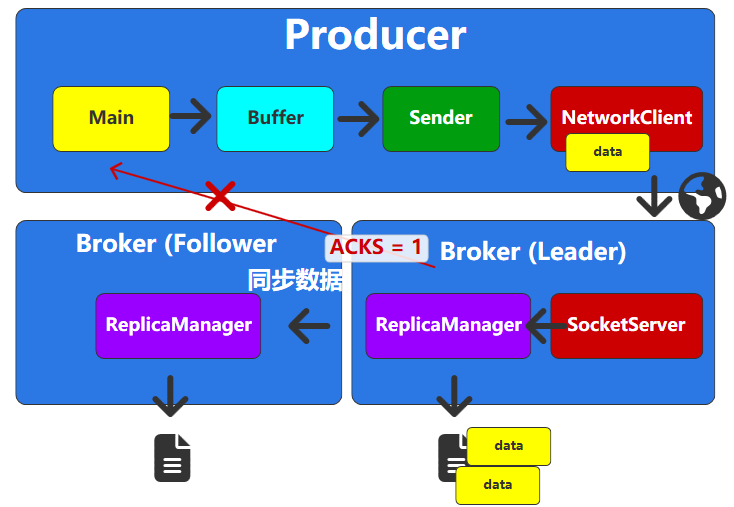

# 生产者

# 消息发送

## 通信流程

`Producer` 生产者创建消息的通信流程


- `InFlightRequests` : 在途请求缓冲区，默认值为 `5`


## 拦截器

**拦截器`interceptors`**: 是在消息发送的生命周期中插入自定义逻辑，实现对生产过程的无侵入式监控和处理


> [!note]
> - 拦截失败时，生产者并不会终止，消息依然能正常发送到 `broker`
> - 在 `java` 版本中，可以定义 `kafka` 内部的拦截器，而其他语言可以自己在外层封装

## 序列化器

`kafka` 支持生产者对消息的 `key` 与 `value` 数据进行自定义序列化操作，实现特定的消息网络传输规则
- `valueSerializer`
- `keyserializer`

## 分区器

**分区器`Partitioner`**: 生产者会从 `MetadataCache` 中获取到当前 `Topic` 中有哪些分区，若发送时未指定分区编号，分区器会通过算法逻辑判断出当前消息应当发送到哪个分区。
- **自定义算法**： `producer` 对象传入 `partitioner` 参数
- **默认算法**
  1. 消息的 `key` 不为空
  2. `kafka` 的配置设置 `partitioner.ignore.keys = false`
  3. 默认分区算法 `convertNumber(key) % partitionNumber`
- **保底策略** : 若自定义算法与默认算法都没使用，`kafka` 将使用「粘性分区策略」计算分区编号

> [!note]
> 若分区编号不存在，`kafka` 并不会进行异常处理，消息将会丢失

## 数据校验

根据配置的规则对待发送消息进行校验
- `max.request.size`: 能发送的消息数据的最大长度
- `buffer.memory` : 生产者能使用的总的消息缓冲区大小

## 消息发送

- **数据缓冲区/数据收集器`Record Accumulator`**: 消息并发生产一条，就发送一条。生产的消息会被放入`Topic` 对应的 `ProducerBatch` 中，当`ProducerBatch`的数据大小超过 `batch.size` 后，才会将消息批量塞给 `sender` 线程
- **`sender`线程** : 将 `Topic` 的 `ProducerBatch` 消息重新按照 `broker` 进行分类，然后进行消息发送


# 发送方式

`kafka` 提供了两种方式来实现消息发送到 `broker`
- **异步通信**: 通过设置 `callback` 来确认消息是否发送成功
- **同步通信**: 通过 `FutureRecordMetadata.get()` 阻塞等待消息发送结果

```python
from kafka import KafkaProducer
from kafka.producer.future import  FutureRecordMetadata

producer = KafkaProducer(
    bootstrap_servers='localhost:9092',
    value_serializer=lambda v: json.dumps(v).encode('utf-8'),
    key_serializer=lambda v: str(v).encode('utf-8') if v else None,
)

resp:FutureRecordMetadata = producer.send(topic='test', value={'message': 'test message'})

# 消费发送后回调，不阻塞
resp.add_callback(lambda metadata: print(f"Message sent to {metadata.topic} partition {metadata.partition}"))
resp.add_errback(lambda e: print(f"Error sending message: {e}"))

# 阻塞等待消息发送成功
resp.get()

producer.flush()  # Ensure all messages are sent
producer.close()  # Clean up producer resources
```

# ACKS

`ACKS` :  `Kafka` 生产者一个核心的配置参数，决定了生产者认为一个消息请求「发送成功」的条件，即它设置了需要多少个分区副本收到消息，生产者才会收到来自 `Broker` 的成功响应。
- `ACKS = 0`: 生产者发送消息后，完全不等待任何来自 `Broker` 的确认。假设消息发送不会出现任何问题

    

- `ACKS = 1`: 只要分区的 Leader 副本将消息写入其本地日志，就会向生产者发送成功确认


    

- `ACKS = -1`: 需要等待分区的所有 `ISR`（`In-Sync Replicas`，同步副本）列表中的副本都将消息成功写入本地日志后，才会收到成功确认

    

| `acks` 值 | 数据可靠性                      | 吞吐量 | 延迟 | 使用场景                |
| --------- | ------------------------------- | ------ | ---- | ----------------------- |
| `0`       | 最差（可能丢失）                | 最高   | 最低 | 日志聚合、 Metrics 收集 |
| `1`       | 中等（`Leader` 故障时可能丢失） | 中等   | 中等 | 默认值，大多数业务场景  |
| `all/-1`  | 最高（`ISR` 内不会丢失）        | 最低   | 最高 | 金融交易、关键业务数据  |


# 重试

## 问题

当消费者发送消息失败时，会对消息发送进行重试，但是会可能会导致两种现象
- **数据重复** : `data` 发送到 `broker` 且 `broker` 保存成功，但是响应 `producer` 时异常，这时 `producer` 就会重新发送一次 `data` 请求，导致 `broker` 日志中消息重复

    

- **消息乱序**: 在 `producer` 中 `InFlightRequests` 会同时发送 `5` 次请求，若此时同时发送了 `3` 个数据，但是 `data-1` 失败，`data-2`、`data-3` 成功。`data-1` 会重新发送，便会导致日志文件中 `data-1` 在 `data-2`、`data-3` 之后

    


## 幂等性

**幂等性** : 为消息增加一个编号 `生产者 ID + 消息顺序号`
- **重复性问题**：保证同一编号下只有一份数据，**但只能保证同一分区下，消息不会重复**
- **乱序问题**: 在 `broker` 端会记录生产者最近的 `5` 次请求，在消息放入日志前，会校验接收的消息的「消息顺序号」是否与最近的 `5` 次请求一致
  - 一致：请求成功
  - 不一致：请求失败，生产者接收到失败时，便会进行重试，且优先发送序号较小的消息

幂等性启动条件为
- `InFlightRequests` 的并发请求数 `max.in.flight.requests.per.connection <= 5`
- 配置  `enable_idempotence = true` 
- `acks` 只能是 `all`
- `retries` 必须启用

```python
producer = KafkaProducer(
    bootstrap_servers='localhost:9092',
    value_serializer=lambda v: json.dumps(v).encode('utf-8'),
    key_serializer=lambda v: str(v).encode('utf-8') if v else None,
    acks='all',                 # 确保消息被确认
    retries=10,                 # 重试次数
    enable_idempotence= True    # 启用幂等操作
)
```

> [!note]
> 幂等性并未完全解决问题
> - 生产者重启后，其「生产者 `ID`」将会改变，幂等性机制将失效
> - 幂等性无法跨分区使用

## 事务

**事务**：解决生产者重启后，「生产者 `ID`」将会改变导致幂等性机制失效问题


```python
producer = KafkaProducer(
    bootstrap_servers='localhost:9092',
    value_serializer=lambda v: json.dumps(v).encode('utf-8'),
    key_serializer=lambda v: str(v).encode('utf-8') if v else None,
    acks='all',                             # 确保消息被确认
    retries=10,                             # 重试次数
    enable_idempotence= True,               # 启用幂等操作
    transactional_id='test-producer-id',    # 事务 ID 会与生产者 ID 关联，因此事务 ID 要固定
)

producer.init_transactions()

try:
    producer.begin_transaction()
    
    producer.send(topic='test', value={'message': 'test message'})

    producer.commit_transaction()
except Exception as e:
    producer.abort_transaction()

producer.flush()  # Ensure all messages are sent
producer.close()  # Clean up producer resources
```

上述代码设置能保证生产者以事务的形式将消息提交到 `broker` 中，**但是在 `broker` 二阶段提交事务发生异常后，消费者仍然能读取这些异常的消息。要限制消费者仅仅只能在消息事务完全提交成功后，消费者才能看见消息，就需要调整「事务隔离级别」。**
- `read_committed` : 生产者事务完全成功，消费者才能读取
- `read_uncommitted` : 生产者事务在日志文件中被记录，消费者就能读取消息

```python
from kafka import KafkaConsumer

consumer = KafkaConsumer(
    bootstrap_servers='127.0.0.1:9092',
    auto_offset_reset='earliest',
    isolation_level='read_committed'       # 事务隔离
)
```

