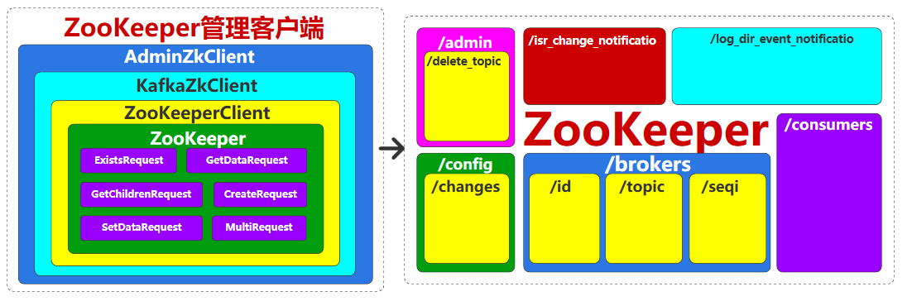
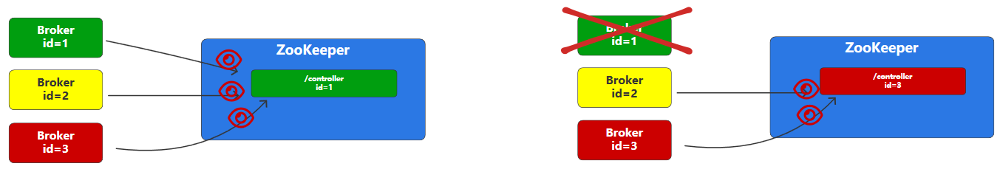
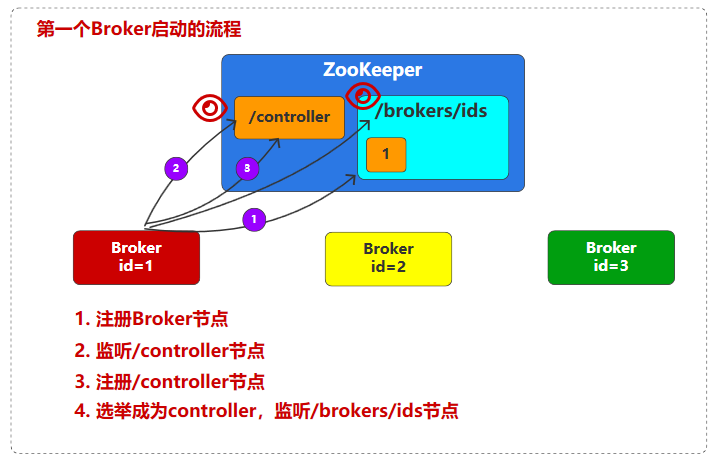
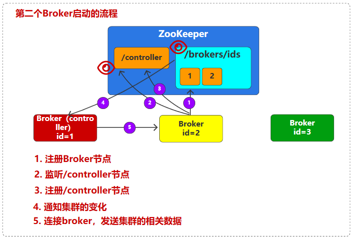
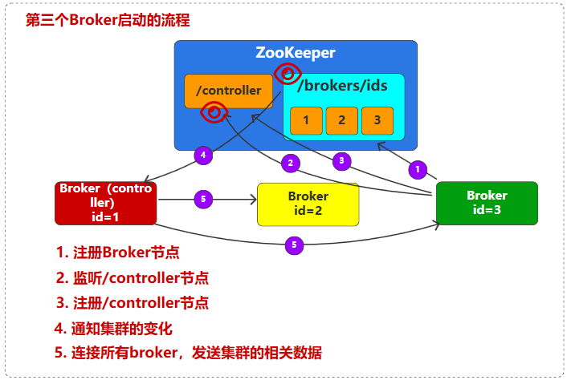

# 服务

# zookeeper

## 数据存储

在 `zookeeper` 中数据管理是通过「树」状结构进行管理，类似文件系统
- **节点** : 树中的一个节点，例如 `brokers`、`ids`、`1` 
- **路径** :  在树中查找具体节点的路径，例如 `/brokers/ids/1` 路径查找的是 `1` 节点

其数据存储本质就是 `key-value` 形式
- `key` : 全局唯一的路径
- `value`: 节点中的存放的数据

```txt
/（根节点，持久化）
│
├── brokers（Broker注册和主题元数据）
│   ├── ids
│   │   ├── 0 [E]  # Broker 0的注册信息，可通过 server.properties 配置文件配置
│   │   ├── 1 [E]  # Broker 1的注册信息
│   │   └── ...    # 其他Broker
│   └── topics
│       ├── topic_1          # 主题"topic_1"的配置和分区分配
│       │   ├── partitions   # 分区详情
│       │   │   ├── 0        # 分区 0 的 Leader 和 ISR 信息
│       │   │   ├── 1        # 分区 1 
│       │   │   └── ...
│       │   └── state        # 主题状态（新版本引入）
│       ├── topic_2
│       └── ...
│
├── controller [E]           # 当前控制器的Broker ID
├── controller_epoch         # 控制器纪元编号（整数）
│
├── config（动态配置管理）
│   ├── changes              # 配置变更序列（顺序节点）
│   ├── topics
│   │   ├── topic_1          # 主题级别覆盖配置
│   │   └── ...
│   ├── clients              # 客户端级别配置
│   └── ...
│
├── admin（管理操作）
│   ├── delete_topics        # 待删除主题列表
│   ├── reassign_partitions  # 分区重分配任务
│   └── ...
│
├── consumers（旧版消费者客户端使用，新版已弃用）
│   ├── group_1              # 消费者组1的偏移量信息
│   │   ├── owners           # 分区所有者
│   │   ├── offsets          # 消费偏移量记录
│   │   └── ...
│   └── ...
│
├── isr_change_notification  # ISR 变更通知队列（顺序节点）
├── latest_producer_id_block # 生产者 ID 分配块（幂等性支持）
│
└── cluster
    └── id [P]               # 集群唯一标识（Kafka 2.1+引入）
```

## 数据操作

`kafka` 会通过 `zookeeper` 提供的接口，对 `zookeeper` 中存储的数据进行操作



## 数据监听

可以在 `zookeeper` 中设置监听器，监听指定 `zookeeper` 节点中数据的增、删、改操作，并通知 `kafka` 发生了哪些变化

# controller 选举

`controller` 的简单选举流程为
1. 第一次启动 `Kafka` 集群时，会同时启动多个 `Broker` 节点，第一个尝试创建一个临时节点 `/controller` 成功的 `broker` 将成为 `controller`
2. 没有选举成功的其他 `Slave`节点会创建 `/controller` 节点的监听器
3. 当 `Controller` 节点出现故障或挂掉，`zooKeeper` 中的 `/controller` 节点就会自动被删除
4. 其他 `Slave` 节点通过监听器，监听到 `/controller` 节点被删除后，就会马上向 `ZooKeeper` 发出创建 `/controller` 节点的请求。创建成功的 `Broker` 将变成了新的 `Controller`




# 集群启动流程








