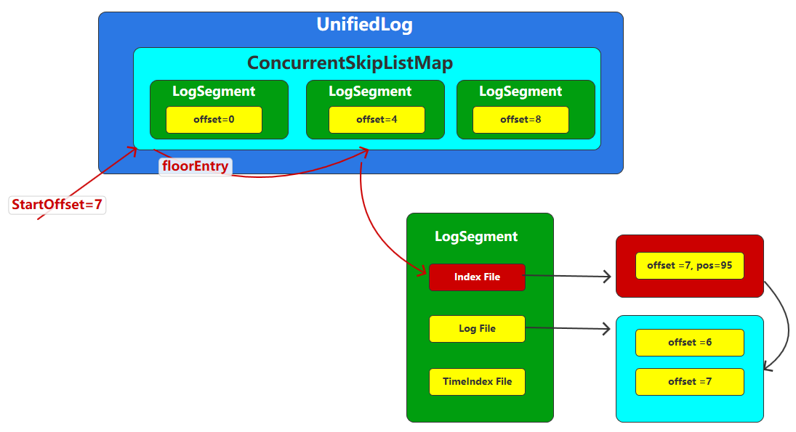
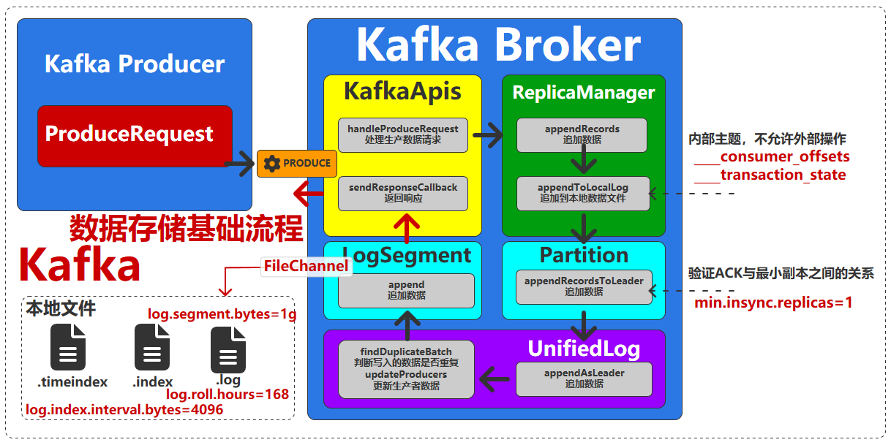
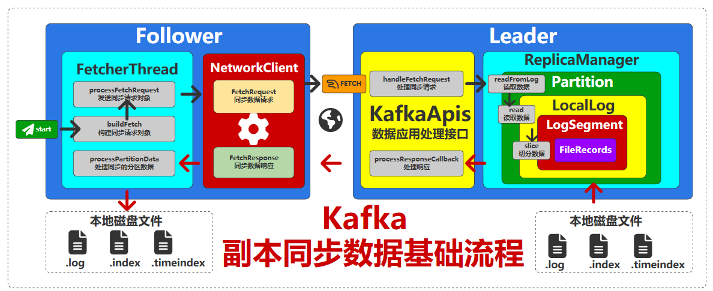
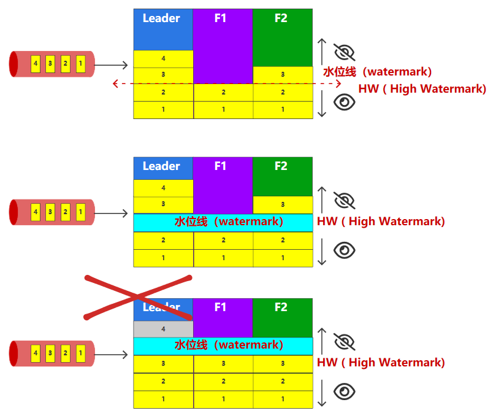

# 数据存储

# 存储配置


在 `kafka` 中，内存里缓存的消息数据由 `LogManager` 负责序列化到磁盘存储
- `log.flush.interval.messages` : 缓存中的消息超过该值时，会写出到日志文件
- `log.flush.interval.ms` : 间隔多少 `ms`，就进行一次日志写出
- `log.flush.scheduler.interval.ms`: 检测日志是否写出到日志中的频率

> [!tip]
> `kafka` 推荐使用操作系统的后台机制完成日志写入，因此，上述参数默认都是往最大值设置


将所有的数据都保存到一个日志文件中特别不合理，会导致超大文件的出现，因此，`kafka` 又设计了日志文件段的机制 `log segment`，就日志拆分为多个文件进行保存
- `log.segment.bytes` : 按照日志大小拆分
- `log.roll.ms` : 按照日期拆分

# 日志文件

## 目录结构

```txt
./data/
  ├── cleaner-offset-checkpoint             # 日志清理进度检查点
  ├── log-start-offset-checkpoint           # 日志起始偏移量检查点
  ├── meta.properties                       # Broker ID 等元信息
  ├── recovery-point-offset-checkpoint      # 恢复点偏移量检查点
  ├── my-topic-0/                           # 主题 my-topic 的第 0 号分区，<topic-name>-<partition-id>
  │   ├── 00000000000000000000.log          # 日志段数据文件（存储消息内容）
  │   ├── 00000000000000000000.index        # 位移索引文件（偏移量 → 物理位置）
  │   ├── 00000000000000000000.timeindex    # 时间戳索引文件（时间戳 → 偏移量）
  │   ├── ...
  │   ├── 00000000000000053500.log          # 新的日志段文件（按大小/时间切分）
  │   ├── 00000000000000053500.index
  │   ├── 00000000000000053500.timeindex
  │   └── leader-epoch-checkpoint           # Leader Epoch 信息（防消息错乱）
  │
  ├── my-topic-1/                           # 同一主题的第 1 号分区（结构同上）
  ├── other-topic-0/                        # 其他主题的分区
  ├── transaction_state-0/                  # 特殊主题：处理事务
  └── consumer_offsets-0/                   # 特殊主题：存储消费者组位移信息（结构同普通分区）
```

## 文件内容

日志文件以 `segment` 为基本单位进行存储，每个日志段存在三个文件
- **日志段文件 `.log`** : 真正存储消息内容的文件，以该日志段文件存储的第一条消息的偏移量`Offset`来命名，固定长度为`20`位，不足补`0`
- **日志索引文件** : 通过 `log.index.interval.bytes` 控制 `.log` 日志中要新增多少数据时才新增一条索引
  - **索引文件`.index`** : 用于快速定位消息，与日志段文件一一对应，存储的是 `[Offset, PhysicalPosition]`
  - **时间戳索引文件`.timeindex`**: 用于根据消息的时间戳快速查找消息的偏移量，存储的是 `[Timestamp, Offset]`

```term
triangle@LEARN:~$ ./kafka-dump-log.sh --files <file path>  --print-data-log // 查看文件内容
```

## 数据项结构

`.log` 文件中的一项数据由两部分构成: 批次头 + `n` * 数据体。`n` 表示一项数据中存放多少个消息数据（数据体），由 `batch.size` 控制 `sizeof(批次头 + n * 数据体) <= batch.size`

- **批次头**

| 数据项                        | 含义                  | 长度 |
| ----------------------------- | --------------------- | ---- |
| BASE_OFFSET_OFFSET            | 基础偏移量偏移量      | 8    |
| LENGTH_OFFSET                 | 长度偏移量            | 4    |
| PARTITION_LEADER_EPOCH_OFFSET | Leaader分区纪元偏移量 | 4    |
| MAGIC_OFFSET                  | 魔数偏移量            | 1    |
| ATTRIBUTES_OFFSET             | 属性偏移量            | 2    |
| BASE_TIMESTAMP_OFFSET         | 基础时间戳偏移量      | 8    |
| MAX_TIMESTAMP_OFFSET          | 最大时间戳偏移量      | 8    |
| LAST_OFFSET_DELTA_OFFSET      | 最后偏移量偏移量      | 4    |
| PRODUCER_ID_OFFSET            | 生产者ID偏移量        | 8    |
| PRODUCER_EPOCH_OFFSET         | 生产者纪元偏移量      | 2    |
| BASE_SEQUENCE_OFFSET          | 基础序列号偏移量      | 4    |
| RECORDS_COUNT_OFFSET          | 记录数量偏移量        | 4    |
| CRC_OFFSET                    | CRC校验偏移量         | 4    |

- **数据体**

| 数据项            | 含义                               | 长度      |
| ----------------- | ---------------------------------- | --------- |
| size              | 固定值                             | 1         |
| offsetDelta       | 固定值                             | 1         |
| timestampDelta    | 时间戳                             | 1         |
| keySize           | Key字节长度                        | 1（动态） |
| keySize(Varint)   | Key变量压缩长度算法需要大小        | 1（动态） |
| valueSize         | value字节长度                      | 1（动态） |
| valueSize(Varint) | Value变量压缩长度算法需要大小      | 1（动态） |
| Headers           | 数组固定长度                       | 1（动态） |
| sizeInBytes       | 上面长度之和的压缩长度算法需要大小 | 1         |


## 索引查找

通过日志段与索引文件，便将一个分区的消息数据存储变成了「跳表`skip list`」，实现 `offset` 的快速查找



# 存储流程



# 日志备份

## 日志拉取

`Follower` 会通过 `FetcherThread` 线程向 `Leader` 请求最新的日志数据，然后保存到副本日志中



## 日志同步

当 `Leader` 接收到`4`之后挂掉，在从 `F1` 与 `F2` 之中选举新 `Leader` 时，会让 `F1` 与 `F2` 的日志都同步成一样的状态。**只有 `watermark` 下的的数据才会被整个集群认可（是在集群内部同步成功的数据），水位线以上的数据都被认为是有风险的数据。**



# 日志清理

`Kafka` 软件的目的本质是用于传输数据，而不是存储数据，但是为了均衡生产数据速率和消费者的消费速率，所以可以将数据保存到日志文件中进行存储。默认的数据日志保存时间为`7`天
- `log.retention.hours` : 日志过期时间（以日志段最后日期为准），小时
- `log.retention.check.interval.ms` : 多久时间检查一次
- `log.cleanup.policy` : 日志清理策略
  - `delete` : 直接删除
  - `compact`: 压缩归档

> [!note]
> 只会清理「非激活」的日志段，处于「激活」状态的日志段不会被清理