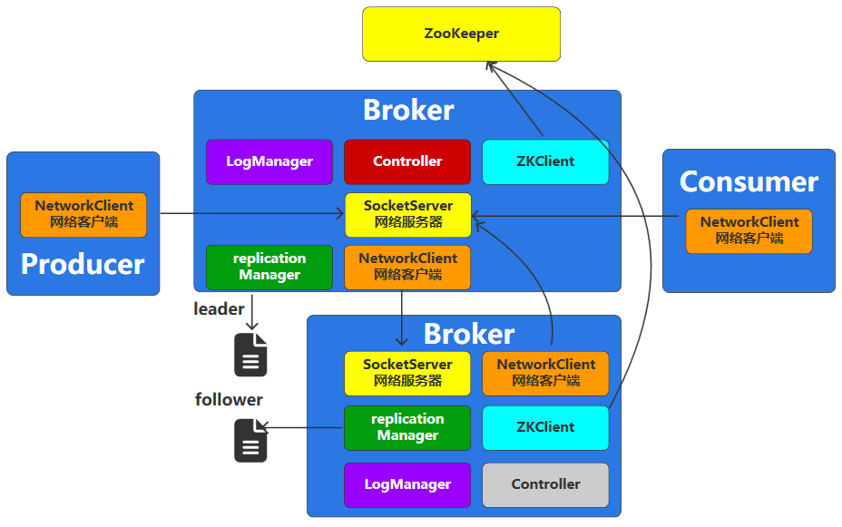

# 系统架构

# 单节点结构

- 中间件 `broker` : 一个 `kafka` 进程实例，集群中的一个节点
- 话题 `Topic` : 生产者的消息存入 `Topic`，而消费者则从 `Topic` 读消息
- 分区 `Partition` : 一个有序、不可变的消息队列，编号从 `0` 开始
- 偏移量 `Offset` : 每条消息在分区 `partition` 中的唯一编号，从 `0` 开始，进而实现队列的 `FIFO` 机制
- 日志 `log` : 消息数据本地序列化
- 记录 `record` : 封装消息的对象

# 集群结构

当一个 `broker` 无法满足需求时，可以对 `kafka` 进行集群部署。对于多个 `broker`, 同一 `Topic` 的多个分区的 `leader` 会尽量分散到不同的 `broker` 上，实现性能最大化。

- 消费者组 `group`: 消费同一 `Topic` 消息的消费者集合。当 `kafka` 多 `broker` 部署时，便于对消费者进行管理
- 日志副本 `repica`: 当多 `borker` 部署时，每个 `borker` 管理的分区所产生的日志在其他 `broker` 上均存在副本，从而实现多个 `broker` 间的数据同步
  - `leader` : 读/写
  - `follower`: 纯备份，无法读/写

# controller

在 `kafka` 的集群节点中，还需要选举出一个主节点 `controller` 实现对整个集群的控制
- `2.8.0` 版本之前，只能通过 `zookeeper` 实现节点管理
- `3.0.0` 版本开始，生产环境可采用 `KRaft` （`Raft`算法实现）模式替代 `zookeeper` 
- `3.5.0` 版本开始，`KRaft` 成为生产环境集群部署的主流模式

# 完整结构

- `Controller` : 主控节点
- `Log Manager` : 日志管理器
- `replication Manager` : 日志副本管理器
- `Socket Server / Network Client`: 生产者、消费者、`broker` 之前通信的机制
- `ZKClient` : 访问 `zookeeper` 的客户端

