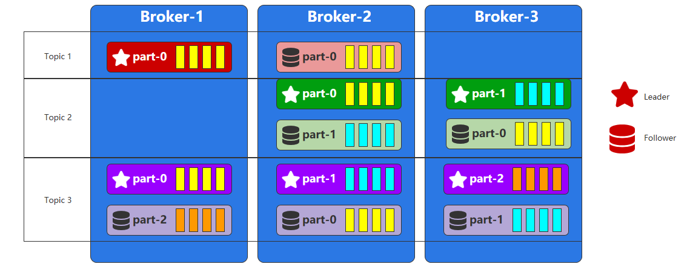
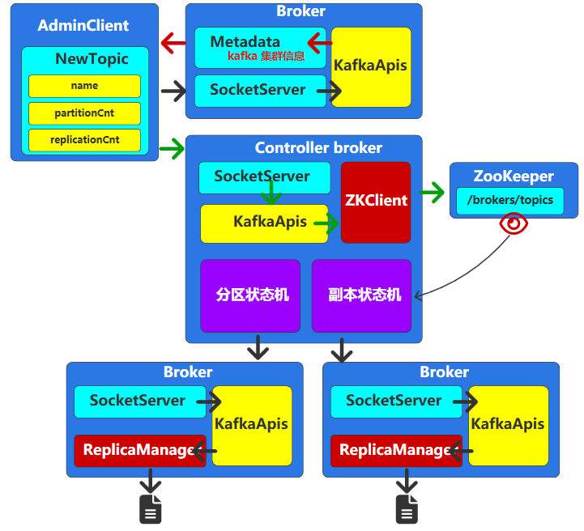
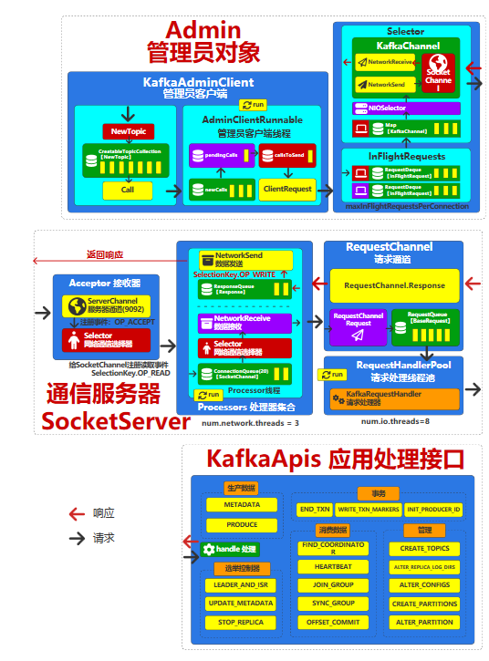

# 主题

# 分区

`Topic` 是消息队列的逻辑结构，而分区 `partition` 则是物理结构，当吞吐量不能满足需求时，就需要增加 `Topic` 的分区数量
- 单 `broker` : 能增加消费组内消费者的并发量，且提升消息吞吐量，**但是受机器物理性能限制**
- 多 `broker` : 将 `Topic` 的 `partition` 分布到不同的机器上，理论上无性能上限，可以使劲加机器。且配合日志副本，还是应对单机故障问题




# 副本

## 概念

在`Kafka` 中，`Topic` 的分区会分布在多个 `broker` 上。若某个 `broker` 故障，其上的分区数据可能丢失。为防止数据丢失，可为分区设置多个副本 `Replication` ，确保数据高可用。
- `Leader` : 读/写数据
- `Follower`: 只备份数据


## 分配算法

未指定机架信息的分配算法

```txt

##################################################################
# 假设 
#     当前分区编号 : 0
#     BrokerID列表 :【1，2，3，4】
#     副本数量 : 4
#     随机值（BrokerID列表长度）: 2
#     副本分配间隔随机值（BrokerID列表长度）: 2
##################################################################
# 第一个副本索引：（分区编号 + 随机值）% BrokerID列表长度 =（0 + 2）% 4 = 2
# 第一个副本所在BrokerID : 3

# 第二个副本索引（第一个副本索引 + （1 +（副本分配间隔 + 0）% （BrokerID列表长度 - 1））） % BrokerID列表长度 = （2 +（1+（2+0）%3））% 4 = 1
# 第二个副本所在BrokerID：2

# 第三个副本索引：（第一个副本索引 + （1 +（副本分配间隔 + 1）% （BrokerID列表长度 - 1））） % BrokerID列表长度 = （2 +（1+（2+1）%3））% 4 = 3
# 第三个副本所在BrokerID：4

# 第四个副本索引：（第一个副本索引 + （1 +（副本分配间隔 + 2）% （BrokerID列表长度 - 1））） % BrokerID列表长度 = （2 +（1+（2+2）%3））% 4 = 0
# 第四个副本所在BrokerID：1

# 最终分区0的副本所在的Broker节点列表为【3，2，4，1】
# 其他分区采用同样算法
```

# 主题创建

## 创建流程

创建 `Topic` 的流程为：
1. 由 `AdminClient` 发送请求给 `broker` ，获取到整个集群的 `Metadata` 信息2
2. `AdminClient` 从 `Metadata` 中查询到 `Controller` 的 `IP` 地址
3. 发送创建 `Topic` 请求给 `Controller` ，由 `Controller` 执行 `Topic` 创建



## 底层通信

`AdminClient` 发送给 `Controller` 请求创建 `Topic` 的网络通信流程




## 脚本

### 创建

```python
from kafka.admin import KafkaAdminClient, NewTopic

# NOTE - topic 只有 admin 才有管理权限
admin_client = KafkaAdminClient(
    bootstrap_servers='localhost:9092',
)

# 创建新的 topic 配置
topic = NewTopic(
    name='test',
    num_partitions=1,
    replication_factor=1
)

# 创建 topic
admin_client.create_topics([topic])

# 关闭
admin_client.close()
```

### list

```python
from kafka.admin import KafkaAdminClient

admin_client = KafkaAdminClient(
    bootstrap_servers='localhost:9092',
)

admin_client.list_topics()
```