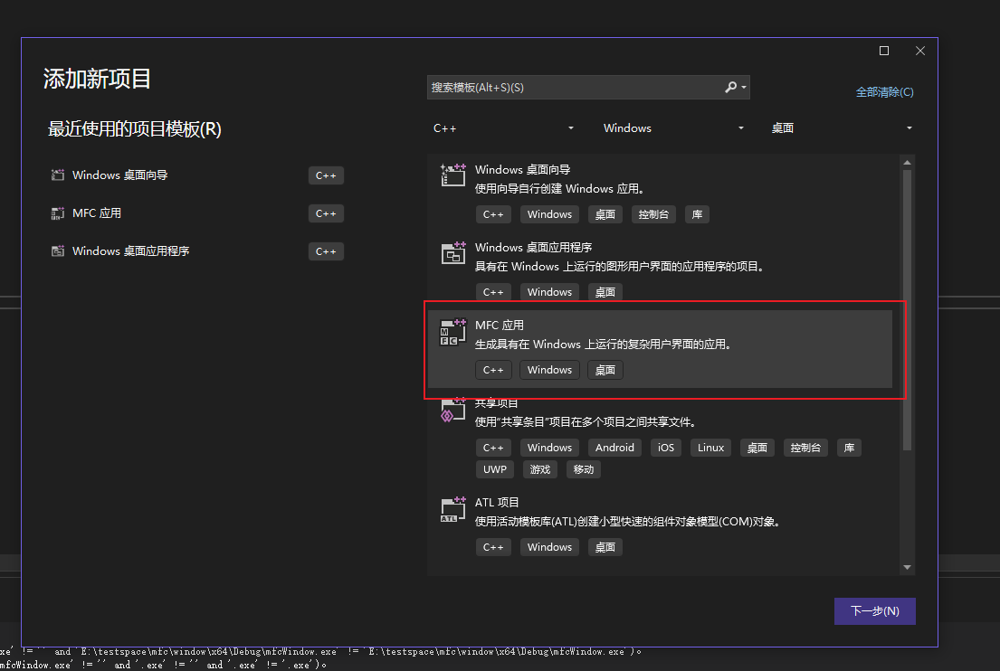
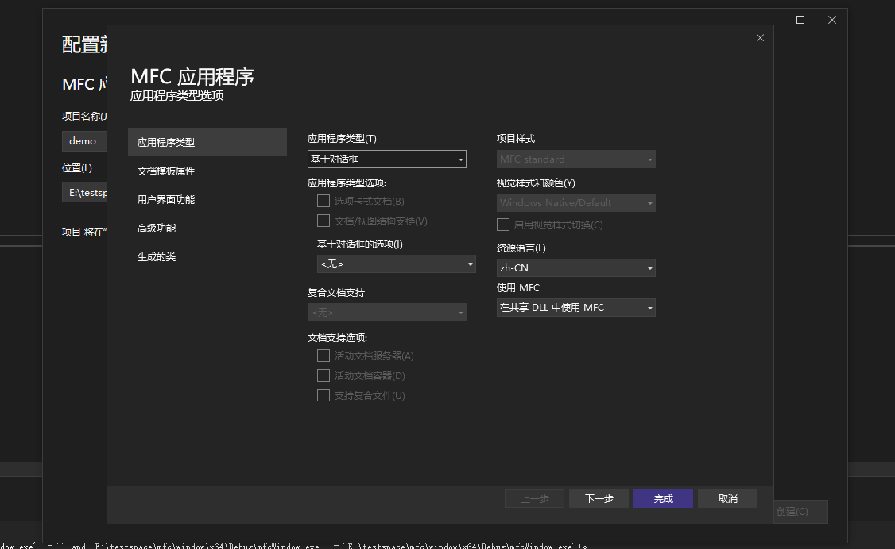
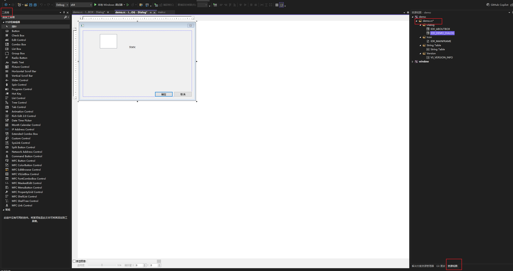
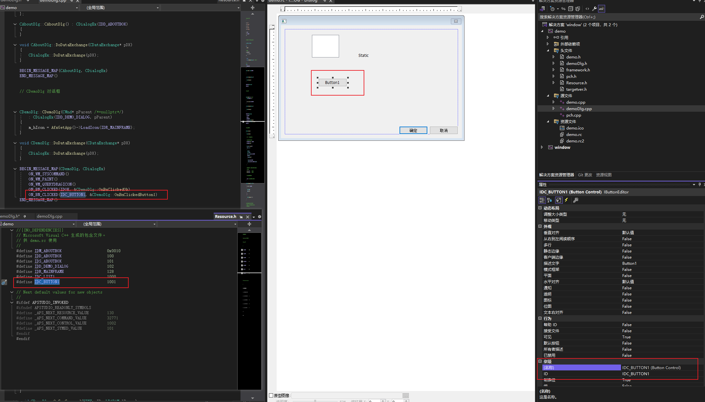

# 界面开发

# VS 工程

使用代码手撸界面很痛苦，因此 `visual studio` 本身集成了界面开发工具，可以类似 `.ui` 一样进行快速的界面开发。

1. 创建 MFC 项目

    

1. 项目配置

    

1. 界面编辑
    
    工程项目创建成功后，可以对 [resouce file](https://learn.microsoft.com/zh-cn/windows/win32/menurc/about-resource-files) 进行编辑，修改窗口样式

    


```term
triangle@LEARN:~$ tree ./demo
│  demo.h                   # CWinApp 实现
│  demo.cpp
│  demoDlg.h                # 对话框窗口实现
│  demoDlg.cpp
│  framework.h              # 定义了项目所使用的MFC应用程序框架相关的头文件。通常包括预编译头文件的引用
│  pch.h                    # 预编译头文件，用于提高编译速度
│  pch.cpp
│  Resource.h               # 定义了资源的 ID 与 .rc 中定义关联，vs维护
│  demo.rc                  # 资源文件，通过 vs 的 「资源视图」进行编辑
│  demo.aps                 # demo.rc 的二进制版本
│  targetver.h              # 定义了目标版本的Windows平台，vs维护
│  demo.vcxproj             # vs 项目工程配置文件
│  demo.vcxproj.filters
│  demo.vcxproj.user
└─res                       # 资源存放文件夹
        demo.ico
        demo.rc2
```


# 按钮




在 `.rc` 文件中新建一个 `Button1` 后，并双击 `Button1` 按钮
- `resource.h` 文件中新增 `IDC_BUTTON1` 参数，且与 `Button1` 属性中 `ID` 对应
- `demoDlg.cpp` 中的消息映射表中增加 `ON_BN_CLICKED(IDC_BUTTON1, &CDemoDlg::OnBnClickedButton1)` 按钮点击信号配置
- `demoDlg.h` 增加按钮点击处理函数 `CDemoDlg::OnBnClickedButton1`