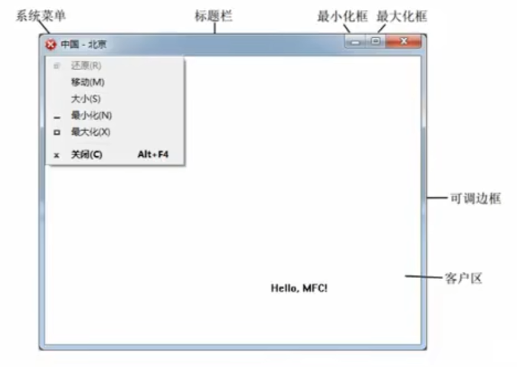
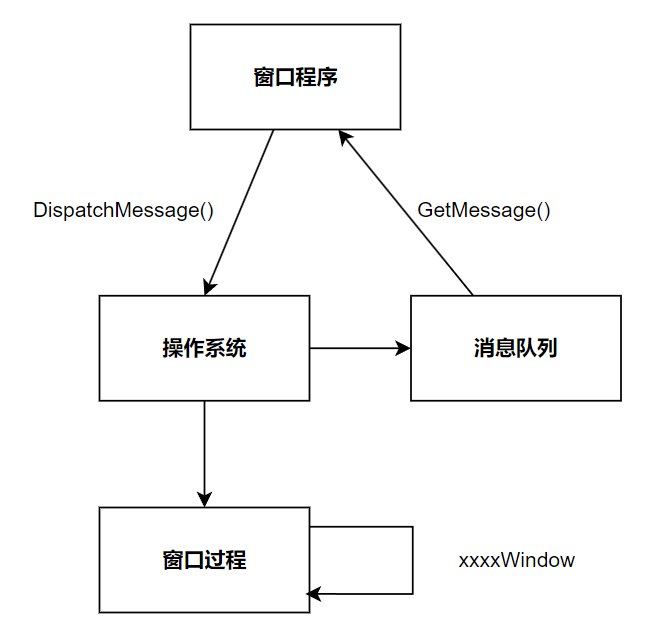

# Windows 窗口

# 概念

## 窗口与句柄

- **窗口**：屏幕上的一块矩形区域，是 Windows 应用程序与用户进行交互的接口。利用窗口可以接收用户的输入、以及显示输出

    

- **句柄**: 在 Windows 程序中，有各种各样的资源（ 窗口 图标、光标、画刷等）， 系统在创建这些资源时会为它们分配内存，并返回标识这些资源的标识号，**即一个类对象在 `c` 中实现的实例**。

## 消息机制



操作系统监听到鼠标点击、键盘按下等操作时，会将操作信息信息放入消息队列中；界面程序可以通过 `GetMessage()` 接口从消息队列中获取消息事件，并对消息过滤处理后，通过 `DispatchMessage()` 接口下发给操作系统；操作系统接收到界面窗口处理好的消息后，则会调用窗口工程进行具体消息的处理。

## GUI框架

在 windows 平台上运行的 GUI 图形框架，例如 `Qt`、`MFC` ，都是对由 windows 提供的底层窗口 API 的二次封装。 


# 窗口创建

windows 底层窗口 API 均以 `c` 风格提供，且所有接口都包含在头文件 `windows.h` 中。其实现步骤为
1. 定义程序入口函数 `WinMain`
2. 使用 API 完成窗口定义、窗口注册及窗口创建
3. 窗口消息循环创建
4. 窗口过程实现


```cpp
#include <windows.h>

// 按照 c 接口进行编译
extern "C"{

//6.处理窗口过程
LRESULT CALLBACK WindowProc(
    HWND hwnd,          // 消息所属窗口句柄
    UINT uMsg,          // 具体消息名称
    WPARAM wParam,      // 键盘附件消息
    LPARAM lParam)      // 鼠标附加消息
{
	switch (uMsg)
	{
	case WM_CLOSE:
		// 所有xxxWindow为结尾的方法 ，都不会进入到消息队列中，而是直接执行
        // DestroyWindow 发送另一个消息 WM_DESTROY
		DestroyWindow(hwnd); 
		break;
	case  WM_DESTROY:
		PostQuitMessage(0);
		break;
	case WM_LBUTTONDOWN: //鼠标左键按下
	{
		int xPos = LOWORD(lParam);
		int yPos = HIWORD(lParam);
 
		TCHAR buf[1024];
		wsprintf(buf, TEXT("x = %d,y = %d"), xPos, yPos);
 
		MessageBox(hwnd, buf, TEXT("鼠标左键按下"), MB_OK);
		break;
	}
	case WM_KEYDOWN: //键盘
		MessageBox(hwnd, TEXT("键盘按下"), TEXT("键盘按下"), MB_OK);
		break;
 
	case WM_PAINT: //绘图
	{
		PAINTSTRUCT ps; //绘图结构体
		HDC hdc = BeginPaint(hwnd, &ps);
		TextOut(hdc, 100, 100, TEXT("Hello world"), strlen("Hello world"));
		EndPaint(hwnd, &ps);
	}
 
	break;
	}
	
	return DefWindowProc(hwnd,uMsg,wParam,lParam);
}


//WINAPI代表__stdcall 参数传递顺序：从右到左，由此入栈，并且在函数返回前 清空堆栈
int WINAPI WinMain(
    HINSTANCE hInstance,        // 应用程序实例句柄
    HINSTANCE hPrevInstance,    //上一个应用程序句柄
    LPSTR lpCmdLine,            // char * argv[];
    int nShowCmd)               // 显示命令，最大化，最小化，正常
{
	//1.设计窗口
	WNDCLASS wc;
	wc.cbClsExtra = 0;                                      //不要额外内存
	wc.cbWndExtra = 0;                                      //不要窗口额外内春
	wc.hbrBackground = (HBRUSH)GetStockObject(WHITE_BRUSH); 
	wc.hCursor = LoadCursor(NULL,IDC_HAND);                 //如果第一个为NULL，使用默认的
	wc.hIcon = LoadIcon(NULL, IDI_ERROR);
	wc.hInstance = hInstance;                               //应用程序实例句柄，传入WinMain中的形参即可
	wc.lpfnWndProc=WindowProc;                              //回调函数，窗口过程
	wc.lpszClassName = TEXT("Win");
	wc.lpszMenuName = NULL;
	wc.style = 0;
 
	//2.注册窗口
	RegisterClass(&wc);
 
	//3.创建窗口
	HWND hwnd=CreateWindow(
        wc.lpszClassName,           // 类名 
        TEXT("WINDOWS"),            // 标题
        WS_OVERLAPPEDWINDOW,        // 显示样式
        CW_USEDEFAULT,              // x
        CW_USEDEFAULT,              // y
        CW_USEDEFAULT,              // width
        CW_USEDEFAULT,              // height
        NULL,                       // parent
        NULL,                       // menu
        hInstance,
        NULL);                      // 鼠标附加值
 
	//4.显示和更新
	ShowWindow(hwnd, SW_SHOWNORMAL);
 
	//5. 消息循环
	/*
        HWND     hwnd    ;主窗口
        UINT     message ;具体消息名称
        WPARAM   wParam  ;附加消息，键盘消息
        LPARAM   lParam  ;附件消息，鼠标消息
        DWORD    time    ;消息产生时间
        POINT    pt      ;鼠标坐标 x，y
	*/
	MSG msg;
	while (true)
	{
		/*
		LPMSG lpMsg, 消息
        HWND hWnd,捕获窗口，NULL代表所有窗口
        UINT wMsgFilterMin,最小和最大过滤消息 一般填零
        UINT wMsgFilterMax);
		*/
		if (GetMessage(&msg, NULL, 0, 0) == FALSE)
		{
			break;
		}
 
		TranslateMessage(&msg);
		DispatchMessage(&msg);
	}
	return 0;
}
} // extern "C"
```

