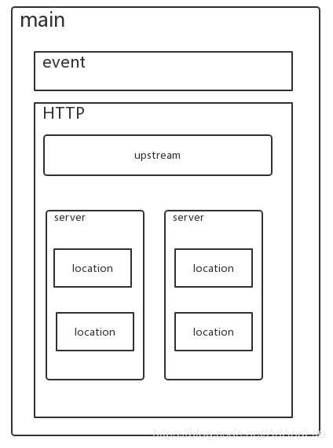
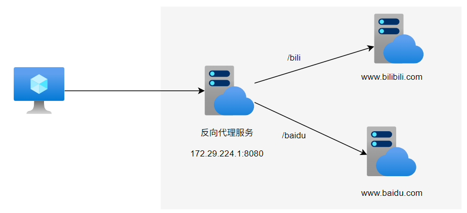
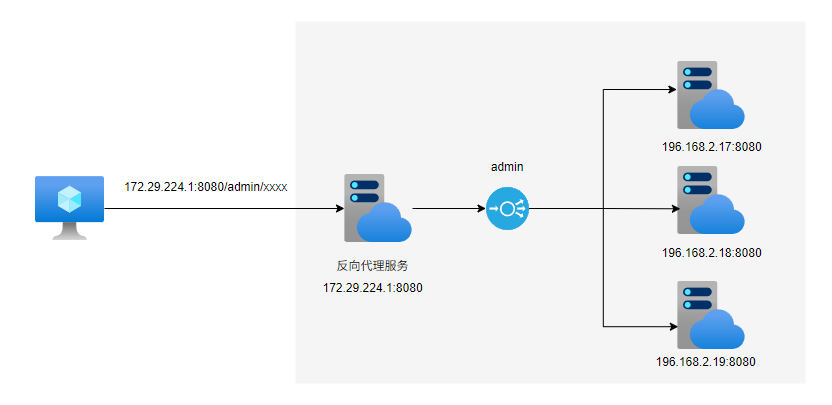
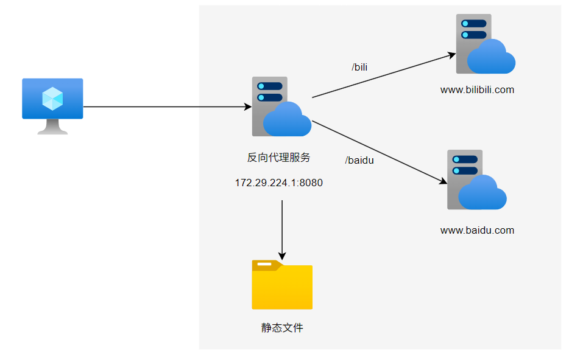
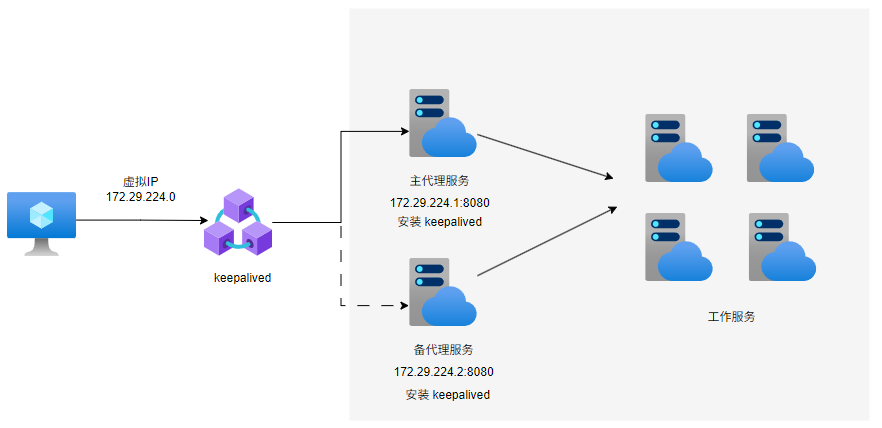

# 配置

# 配置文件

```term
triangle@LEARN:~$ vim /etc/nginx/nginx.conf    
```



配置文件结构
- **全局块(main)**：设置 Nginx 服务的整体运行配置指令
- **Event 块** ： 用于配置 Nginx 服务与用户之间连接的属性
- **http 块** : 用于配置 Nginx 的业务功能
  - 全局配置
  - Server 块 ： 配置一个 Nginx 服务
  - location : 路由配置，将 Nginx 反向代理服务器接收的请求转发到目标服务
  
```conf
# ===================== 全局块 ==========================

worker_processes  1; # 工作进程的数量

# ===================== Event 块 ==========================

events {
    worker_connections  1024; # 每个工作进程连接数
}

# ===================== http 块 ==========================

http {
    include       mime.types;
    default_type  application/octet-stream;

    # 日志格式
    log_format  access  '$remote_addr - $remote_user [$time_local] $host "$request" '
                  '$status $body_bytes_sent "$http_referer" '
                  '"$http_user_agent" "$http_x_forwarded_for" "$clientip"';
    access_log  /srv/log/nginx/access.log  access; # 日志输出目录
    gzip  on;
    sendfile  on;

    # 链接超时时间，自动断开
    keepalive_timeout  60;

    # 虚拟主机
    server {
        listen       8080;
        server_name  localhost; # 浏览器访问域名

        charset utf-8;
        access_log  logs/localhost.access.log  access;

        # 路由
        location / {
            root   www; # 访问根目录
            index  index.html index.htm; # 入口文件
        }
    }

    # 引入其他的配置文件
    include servers/*;
    include /etc/nginx/conf.d/*.conf;
}
```
http://127.0.0.1:8080/

# 反向代理

## 代理服务


```conf
worker_processes  auto;
error_log  /var/log/nginx/error.log notice;
pid        /run/nginx.pid;

events {
    worker_connections  1024;
}

http {
    include       /etc/nginx/mime.types;
    default_type  application/octet-stream;
    log_format  main  '$remote_addr - $remote_user [$time_local] "$request" '
                      '$status $body_bytes_sent "$http_referer" '
                      '"$http_user_agent" "$http_x_forwarded_for"';
    access_log  /var/log/nginx/access.log  main;
    sendfile        on;
    keepalive_timeout  65;

    server{
        ; 代理服务
        server_name 172.29.224.1;
        listen 8080;

        ; 代理服务 '/bili' 路由跳转到的链接
        location /bili {
                proxy_pass https://www.bilibili.com/;
        }
        location /baidu {
                proxy_pass https://www.baidu.com/;
        }
    }
}
```


 
在浏览器中输入 `http://172.29.224.1:8080/bili` 便会通过 `nginx` 跳转到 `https://www.bilibili.com/`。


## location

通过 `location` 定义代理服务的 url 指向的服务

```conf
location [= | ~ | ~* | ^~] <url> {

} 
```

路由规则
- `=` : 代理服务的路由要与 `url` 完全匹配；匹配成功，则停止路由搜索
- `^~` : 找到与 url 匹配度最高，然后转发请求，不支持正则表达式
- `~` : `url` 包含正则表达式，区分大小写
- `~*` : `url` 包含正则表达式，不区分大小写

# 负载均衡

## 代理服务


```conf
http {
    ; 定义负载均衡，命名为 admin
    upstream admin {
        keepalive 32;  # 启用长连接
        server 196.168.2.17:8080 weight=1 max_fails=3 fail_timeout=30s;
        server 196.168.2.18:8080 weight=1 max_fails=3 fail_timeout=30s;
        server 196.168.2.19:8080 weight=1 max_fails=3 fail_timeout=30s;
    }

    server {
        ; 代理服务
        server_name 172.29.224.1;
        listen 8080;

        location /admin {
            proxy_pass http://admin ; 负载均衡的地址

            proxy_http_version 1.1;
            proxy_set_header Connection "";
            proxy_set_header Host $host;
            proxy_set_header X-Real-IP $remote_addr;
            proxy_set_header X-Forwarded-For $proxy_add_x_forwarded_for;
            
            proxy_connect_timeout 3s;
            proxy_read_timeout 10s;
            proxy_send_timeout 10s;
        }
    }
}
```



通过 `upstream` 定义负载均衡服务集群，用户访问 `http://172.29.224.1:8080/admin/xxxx` 时，nginx 便会通过负载均衡节点将 `xxxx` 路由随机派发给 `admin` 集群下的服务进行处理


## 策略

- **轮询** 
    默认方案，按请求的时间顺序逐一分配到不同的后端服务。若某一服务下线，就会被轮询踢出

- **权重**
    
    权值 `weight` 越大的服务，分配到的请求越多
    ```conf
    upstream admin {
        keepalive 32;  # 启用长连接
        server 196.168.2.17:8080 weight=1;
        server 196.168.2.18:8080 weight=2;
        server 196.168.2.19:8080 weight=3;
    }
    ```

- **ip_hash**

    对用户 IP 建立一个 `hash` 值，然后根据 hash 去匹配后台服务，**保证同一`ip`用户多次请求均在同一服务器响应，可解决 `session` 问题**

    ```conf
    upstream admin {
        ip_hash;
        server 196.168.2.17:8080;
        server 196.168.2.18:8080;
        server 196.168.2.19:8080;
    }
    ```

- **fair**

    按照后端响应时间分配，响应时间越短优先分配，**即服务处理速度，能力强，那就多做些**

    ```conf
    upstream admin {
        server 196.168.2.17:8080;
        server 196.168.2.18:8080;
        server 196.168.2.19:8080;
        fair;
    }
    ```

# 动静分离


```conf
server {
    server_name 172.29.224.1;
    listen 8080;
    
    # 静态html文件处理
    location /html {
        root   /data/; 
        index  index.html index.htm;
    }
    
    # 静态图片文件处理
    location /images {
        root   /data/;
        autoindex on; 自动生成 index.html 网页目录
    }
    
    # 动态请求转发给后端服务器
    location /bili {
            proxy_pass https://www.bilibili.com/;
    }
    location /baidu {
            proxy_pass https://www.baidu.com/;
    }
}
```



```term
triangle@LEARN:~$ tree /data
/data
    ├── html
    │   └── index.html      # 主页面
    └── images              # 图片
        └── xxx.jpg
```

通过 `http://172.29.224.1:8080/images/xxx.jpg` 便可访问到 `xxx.jpg` 静态图片资源。**对于少量的静态资源就直接使用 `nginx` 服务实现即可，大批量的静态资源则需单独设置静态资源服务。**

# 高可用

> [!note]
> 这里的高可用针对的是保证 `nginx` 代理服务，而非目标服务（目标服务通过负载均衡就已经保证了高可用）





主/备 Nginx 均会安装 `keepalived` (Linux 下一个轻量级别可实现服务或网络高可用解决方案)，用户通过虚拟IP地址（在 keepalived 中配置）访问 Ningix 代理服务，当主/备 Nginx 中某一台机器挂掉后，另外一台代理服务也能保证系统正常运行。

```term
triangle@LEARN:~$ sudo apt install openssl libssl-dev
triangle@LEARN:~$ sudo apt install keepalived // 在 nginx 服务上安装 keepalive
triangle@LEARN:~$ sudo cp /usr/share/doc/keepalived/samples/keepalived.conf.sample /etc/keepalived/keepalived.conf // 准备预设配置文件
triangle@LEARN:~$ cat /etc/keepalived/keepalived.conf // 配置文件
triangle@LEARN:~$ systemctl start keepalived  // 启动
```

- [keepalived.conf 详细配置](https://www.cnblogs.com/rexcheny/p/10778567.html)

```conf
# keepalived.conf

# 全局配置
global_defs {
    # 邮件通知信息
    notification_email {
        # 定义收件人
        acassen@firewall.loc
    }
    # 定义发件人
    notification_email_from Alexandre.Cassen@firewall.loc
    # SMTP服务器地址
    smtp_server 192.168.200.1
    smtp_connect_timeout 30

    # 在 /etc/hosts 中定义的域名，例如 localhost
    # 路由器标识，一般不用改，也可以写成每个主机自己的主机名
    router_id LVS_DEVEL
}

# 定义用于实例执行的脚本内容，比如可以在线降低优先级，用于强制切换
vrrp_script SCRIPT_NAME {
    script  "/xxxx/nginx_check.sh"
    interval 2 # 执行时间间隔，单位时间 s
    weight -20 # 当前机器挂掉后，修改 vrrp_instance 中的 priority
}

# 一个vrrp_instance就是定义一个虚拟路由器的，实例名称
vrrp_instance VI_1 {
    # 定义初始状态
    # - 主服务： MASTER
    # - 备服务：BACKUP
    state MASTER
    # 如果你上面定义了MASTER,这里的优先级就需要定义的比其他的高
    priority 100
    # 心跳检测时间间隔，单位 s
    advert_int 1
    # 网卡，通过 ifconfig 查看，默认用来绑定虚拟 IP 网卡
    interface ens33
    # 虚拟路由ID，主/备服务需要设定一样
    # 是虚拟MAC最后一段地址的信息，取值范围0-255
    virtual_router_id 51
    # 使用哪个虚拟MAC地址
    use_vmac XX:XX:XX:XX:XX
    # 通信认证机制，这里是明文认证还有一种是加密认证
    authentication {
        auth_type PASS
        auth_pass 1111
    }
    # 设置虚拟VIP地址，一般就设置一个
    virtual_ipaddress {
        172.29.224.0
    }

}

# 定义LVS集群服务，可以是IP+PORT；也可以是fwmark 数字，也就是防火墙规则
# 所以通过这里就可以看出来keepalive天生就是为ipvs而设计的
virtual_server 10.10.10.2 1358 {
   .....
}
```

- `nginx_check.sh` 的简单实现

```bash
#!/bin/bash
# 计算 Nginx 进程数量
n=`ps -C nginx --no-heading | wc -l`
# 当 Nginx 停止后，停止 Keepalived 服务
if [ $n -eq "0" ]; then
    /usr/bin/systemctl stop keepalived
fi
```


