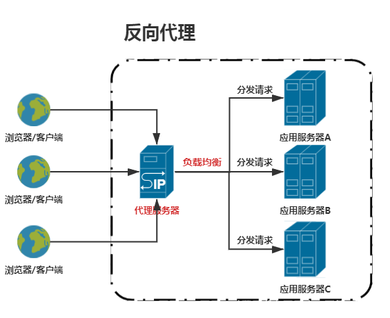
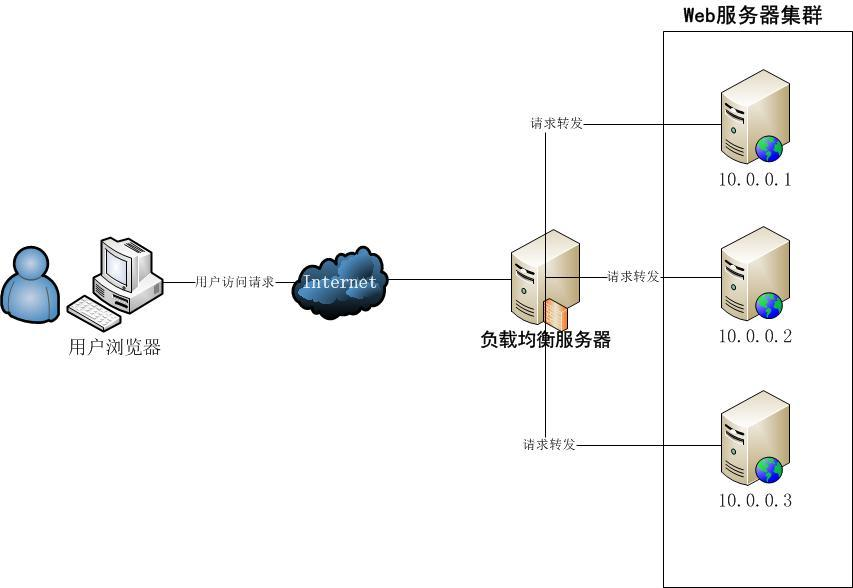
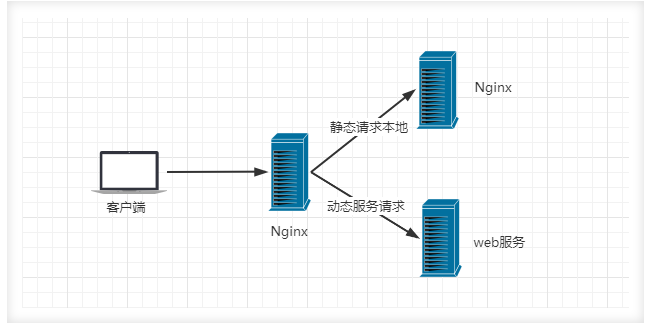

# 基础概念

# 代理服务

## 正向代理

**正向代理**： 用户通过代理服务去请求目标服务器
- 代理服务器代理的是用户
- 目标服务器不知道用户的地址，但用户知道目标服务的地址

作用：
- 突破网络限制、例如 `VPN`
- 网络安全，保护用户信息
- 内容过滤，在代理服务上屏蔽不良请求信息

## 反向代理

**反向代理** ： 目标服务通过代码服务接收用户请求
- 代理服务代理的是目标服务
- 用户只知道将请求提交给代理服务，但是不知道真正处理请求的服务，由代理服务将请求分发给真正的目标服务处理

作用：
- 负载均衡、最大化使用内部服务器资源
- API 网关、对外部请求进行统一管理和调度

# 负载均衡

**负载均衡** ： 将用户请求分发到多个服务器机器（每个服务器提供的功能都相同）上处理，减少单台服务器处理压力，例如有 `100` 个用户请求，`4` 台服务机器，通过「反向代理」服务提供的负载均衡能力，为 `4` 台服务各分发 `25` 个请求，相比于单台服务大大提升了请求处理速度。

# 动静分离

**动静分离** ： 动态资源其实就是指服务代码会进行增删、修改的文件（例如数据库），而静态资源就是指服务运行中不会通过代码修改的文件 (例如 LOGO 图片)。动静分离就是将网站静态资源与后台应用分开部署，提高用户访问静态代码的速度，降低对后台应用服务器的请求。后台应用服务器只负责动态数据请求。

