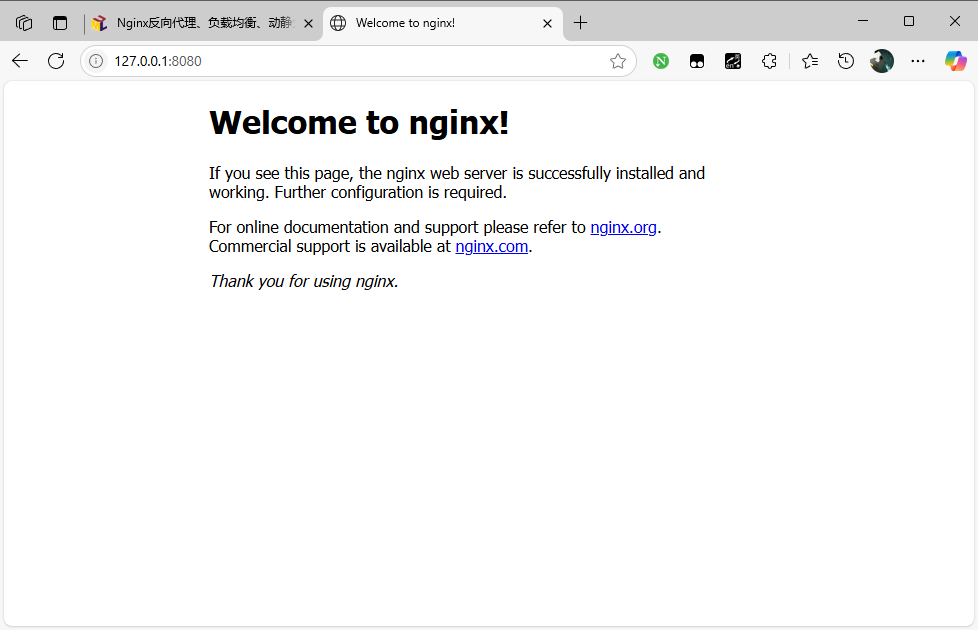

# 简介

# 介绍

[Nginx](https://nginx.org/en/) 是一个高性能的HTTP和反向代理web服务器。其特点是占有内存少，并发能力强，事实上nginx的并发能力确实在同类型的网页服务器中表现较好，中国大陆使用nginx网站用户有：百度、京东、新浪、网易、腾讯、淘宝等。

# docker 安装

- [nginx](https://hub.docker.com/_/nginx?uuid=E6FF9E05-3331-4635-A1FD-C749F9151800) 官方镜像

```term
triangle@LEARN:~$ docker pull nginx // 安装最新版
triangle@LEARN:~$ docker run --name demo-nginx -p 8080:80  nginx // 暴露端口
可选的挂载文件
    -v /home/nginx/conf/nginx.conf:/etc/nginx/nginx.conf    # 配置
    -v /home/nginx/conf/conf.d:/etc/nginx/conf.d            # 配置
    -v /home/nginx/log:/var/log/nginx                       # 日志
    -v /home/nginx/html:/usr/share/nginx/html               # 主页 html
```

通过 `http://127.0.0.1:8080/` 能打开网页，便说明安装成功





```term
triangle@LEARN:~$ docker run -it nginx /bin/bash // 通过该命令进入容器内部
```


# 常用命令

```term
triangle@LEARN:~$ nginx -v // 版本号
triangle@LEARN:~$ nginx // 启动
triangle@LEARN:~$ nginx -s stop // 关闭 nginx
triangle@LEARN:~$ nginx -s reload // 重新加载配置
```

