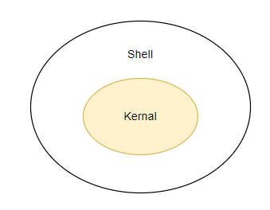
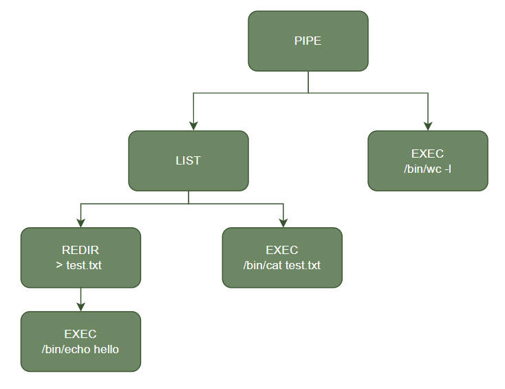
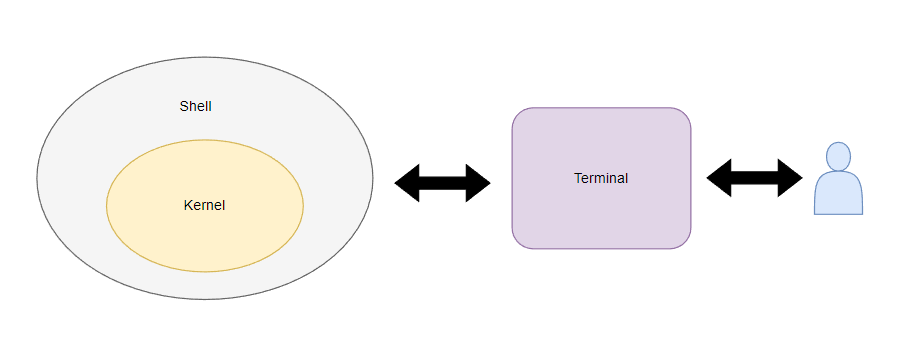
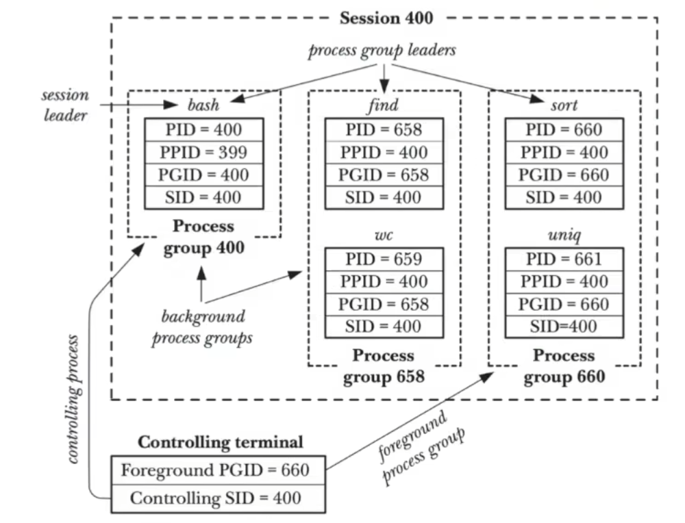
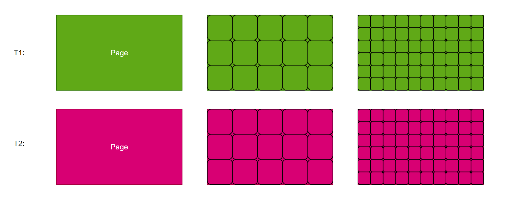
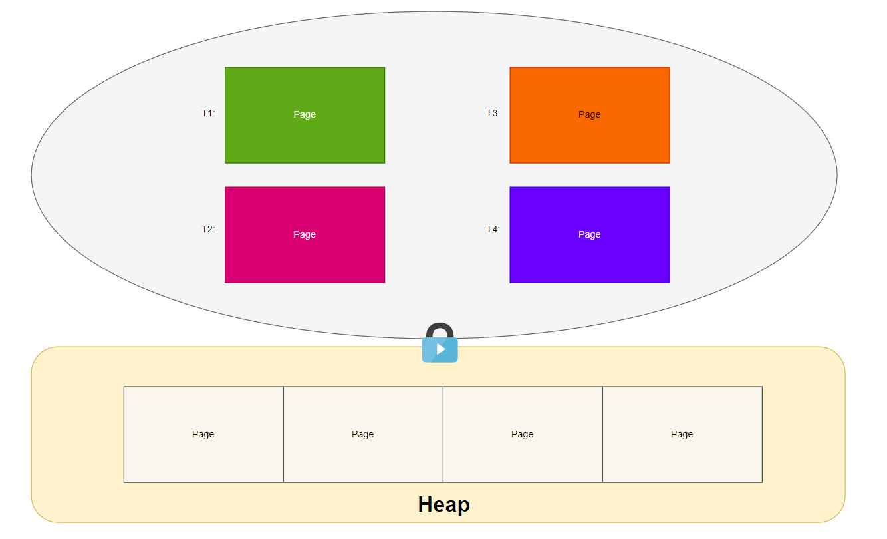
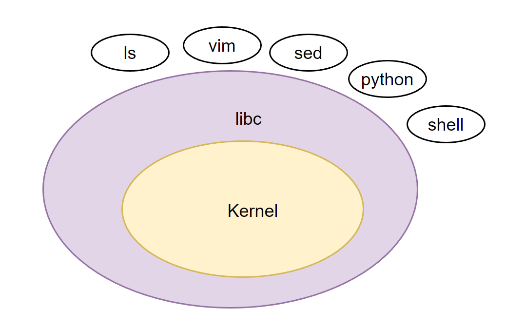

# 用户接口

# shell



- **kernel** : 提供操作系统的系统调用
- **shell** : 与人交互的程序，用户客户通过 shell 来使用操作系统的 kernel

```term
triangle@LEARN:~$ main sh // 最简单的 linux shell 文档
```

# xv6 shell

## 编译

> - [shell](http://jyywiki.cn/pages/OS/2022/demos/sh-xv6.c) 
> - [back shell](../../code/operateSystem/sh-xv6.c) 

程序编译：

```term
triangle@LEARN:~$ gcc -c -ffreestanding sh-xv6.c -g -o2 // -ffreestanding 零依赖，包含系统库
triangle@LEARN:~$ ld sh-xv6.o -o sh
triangle@LEARN:~$ ./sh
> /bin/pwd
/home/triangle
```

## cd

切换路径，只能靠 shell 自己利用系统调用完成，其余的命令行都是靠对应程序实现。

```cpp
void _start() {
  static char buf[100];

  // 循环等待用户输出命令行
  while (getcmd(buf, sizeof(buf)) >= 0) {

    // 判断是否为 cd 命令
    if (buf[0] == 'c' && buf[1] == 'd' && buf[2] == ' ') {
      // Chdir must be called by the parent, not the child.
      buf[strlen(buf) - 1] = 0;  // chop \n
      if (syscall(SYS_chdir, buf + 3) < 0) print("cannot cd ", buf + 3, "\n", NULL);
      continue;
    }

    // 创建一条子进程，用于命令行执行
    if (syscall(SYS_fork) == 0) runcmd(parsecmd(buf));

    // 主线程等待
    syscall(SYS_wait4, -1, 0, 0, 0);
  }
  syscall(SYS_exit, 0);
}
```

## 命令行解析

shell 会将用户输入的命令行解析为语法树，然后根据语法树执行命令。

```term
triangle@LEARN:~$ (/bin/echo hello > test.txt ; /bin/cat test.txt) | /bin/wc -l
```

上述指令通过语法树可以解析为：




<details>
<summary><span class="details-title">语法树</span></summary>
<div class="details-content"> 

```cpp
/* 生成语法树 */
struct cmd* parsecmd(char* s) {
  char* es;
  struct cmd* cmd;

  es = s + strlen(s);
  // 解析命令行
  cmd = parseline(&s, es);

  // 查询 s[0] 是否到了指定字符，中间会过滤掉空白符
  peek(&s, es, "");
  assert(s == es);

  // 遍历语法树，初始化值
  nulterminate(cmd);
  return cmd;
}

struct cmd* parseline(char** ps, char* es) {
  struct cmd* cmd;
  // 根据管道符拆分命令行
  //  pipecmd
  //    /  \
  // Lcmds  Rcmds
  cmd = parsepipe(ps, es);

  // 解析后台运行命令
  //     backcmd
  //        |
  //       cmds 
  while (peek(ps, es, "&")) {
    gettoken(ps, es, 0, 0);
    cmd = backcmd(cmd);
  }

  // 依次执行命令
  //      listcmd
  //       /  \
  //   Fronts  Backs
  if (peek(ps, es, ";")) {
    gettoken(ps, es, 0, 0);
    cmd = listcmd(cmd, parseline(ps, es));
  }
  return cmd;
}

struct cmd* parsepipe(char** ps, char* es) {
  struct cmd* cmd;
  
  // 有括号，先去除括号；
  // 无括号，解析出 execcmd
  cmd = parseexec(ps, es);

  //  pipecmd
  //    /  \
  // Lcmds  Rcmds
  if (peek(ps, es, "|")) {
    gettoken(ps, es, 0, 0);
    cmd = pipecmd(cmd, parsepipe(ps, es));
  }
  return cmd;
}

struct cmd* parseblock(char** ps, char* es) {
  struct cmd* cmd;
  
  // 去除左括号
  assert(peek(ps, es, "("));
  gettoken(ps, es, 0, 0);
  
  // 解析命令树
  cmd = parseline(ps, es);
  assert(peek(ps, es, ")"));

  // 去除右括号
  gettoken(ps, es, 0, 0);

  // 解析重定向
  //  redircmd
  //     |
  //    cmds
  cmd = parseredirs(cmd, ps, es);
  return cmd;
}

struct cmd* parseredirs(struct cmd* cmd, char** ps, char* es) {
  int tok;
  char *q, *eq;

  // 解析重定向
  //  redircmd
  //     |
  //    cmds
  while (peek(ps, es, "<>")) {
    tok = gettoken(ps, es, 0, 0);
    assert(gettoken(ps, es, &q, &eq) == 'a');
    switch (tok) {
      case '<':
        cmd = redircmd(cmd, q, eq, O_RDONLY, 0);
        break;
      case '>':
        cmd = redircmd(cmd, q, eq, O_WRONLY | O_CREAT | O_TRUNC, 1);
        break;
      case '+':  // >>
        cmd = redircmd(cmd, q, eq, O_WRONLY | O_CREAT, 1);
        break;
    }
  }
  return cmd;
}

/* 语法树节点 */
struct cmd* execcmd(void) {
  struct execcmd* cmd;
  cmd = zalloc(sizeof(*cmd));
  cmd->type = EXEC;
  return (struct cmd*)cmd;
}

struct cmd* redircmd(struct cmd* subcmd, char* file, char* efile, int mode,
                     int fd) {
  struct redircmd* cmd;
  cmd = zalloc(sizeof(*cmd));
  cmd->type = REDIR;
  cmd->cmd = subcmd;
  cmd->file = file;
  cmd->efile = efile;
  cmd->mode = mode;
  cmd->fd = fd;
  return (struct cmd*)cmd;
}

struct cmd* pipecmd(struct cmd* left, struct cmd* right) {
  struct pipecmd* cmd;
  cmd = zalloc(sizeof(*cmd));
  cmd->type = PIPE;
  cmd->left = left;
  cmd->right = right;
  return (struct cmd*)cmd;
}

struct cmd* listcmd(struct cmd* left, struct cmd* right) {
  struct listcmd* cmd;
  cmd = zalloc(sizeof(*cmd));
  cmd->type = LIST;
  cmd->left = left;
  cmd->right = right;
  return (struct cmd*)cmd;
}

struct cmd* backcmd(struct cmd* subcmd) {
  struct backcmd* cmd;
  cmd = zalloc(sizeof(*cmd));
  cmd->type = BACK;
  cmd->cmd = subcmd;
  return (struct cmd*)cmd;
}
```
</div>
</details>


## 命令行执行

- 单命令: shell 进程创建一条子进程，然后子进程执行 execve 系统调用

```cpp
void _start() {
  static char buf[100]; 

  // 循环等待用户输出命令行
  while (getcmd(buf, sizeof(buf)) >= 0) {
    ...
    // 创建一条子进程，用于命令行执行
    if (syscall(SYS_fork) == 0) runcmd(parsecmd(buf));
    // 主线程等待
    syscall(SYS_wait4, -1, 0, 0, 0);
  }
  syscall(SYS_exit, 0);
}

void runcmd(struct cmd* cmd) {
  ...
  switch (cmd->type) {
    case EXEC:
      ecmd = (struct execcmd*)cmd;
      if (ecmd->argv[0] == 0) syscall(SYS_exit, 1);
      // 子进程执行程序 
      long ret = syscall(SYS_execve, ecmd->argv[0], ecmd->argv, NULL);
      print("fail to exec ", ecmd->argv[0], "\n",NULL);
      break;
      ....
  }
}
```

- 多行命令

```cpp 
void runcmd(struct cmd* cmd) {
  ...
    case LIST:
        lcmd = (struct listcmd*)cmd;
        // 生成一个子进程执行左边的节点
        if (syscall(SYS_fork) == 0) runcmd(lcmd->left);
        // 等待左边执行完
        syscall(SYS_wait4, -1, 0, 0, 0);
        // 执行右边的节点
        runcmd(lcmd->right);
        break;
  ...
}
```
- 管道

```cpp
void runcmd(struct cmd* cmd) {
    ...
    case PIPE:
      pcmd = (struct pipecmd*)cmd;
      assert(syscall(SYS_pipe, p) >= 0);
      if (syscall(SYS_fork) == 0) {
        // 关闭当前进程标准输出
        syscall(SYS_close, 1);
        // 当前进程标准输出绑定到管道
        syscall(SYS_dup, p[1]);
        // 关闭当前进程持有的管道输入与输出 
        syscall(SYS_close, p[0]);
        syscall(SYS_close, p[1]);
        // 运行左边，执行 execve 之后就不会返回
        runcmd(pcmd->left);
      }
      if (syscall(SYS_fork) == 0) {
        // 关闭当前进程标准输入
        syscall(SYS_close, 0);
        // 当前进程标准输入绑定到管道
        syscall(SYS_dup, p[0]);
        // 关闭当前进程持有的管道输入与输出 
        syscall(SYS_close, p[0]);
        syscall(SYS_close, p[1]);
        // 运行右边，执行 execve 之后就不会返回
        runcmd(pcmd->right);
      }
      // 主进关闭管道的输入与输出
      syscall(SYS_close, p[0]);
      syscall(SYS_close, p[1]);
      // 等待子进程运行完毕
      syscall(SYS_wait4, -1, 0, 0, 0);
      syscall(SYS_wait4, -1, 0, 0, 0);
      break;
    ...
}
```

- 重定向

```cpp
void runcmd(struct cmd* cmd){
    ...
    case REDIR:
      rcmd = (struct redircmd*)cmd;
      syscall(SYS_close, rcmd->fd);
      if (syscall(SYS_open, rcmd->file, rcmd->mode, 0644) < 0) {
        print("fail to open ", rcmd->file, "\n", NULL);
        syscall(SYS_exit, 1);
      }
      runcmd(rcmd->cmd);
      break;
    ...
}
```

# 终端




终端是一个抽象的设备，连接用户与 shell 的交互，能够实现响应标准输入流与标准输出流，展示输出与读取键盘等功能，**可以简单理解成一个专门用于展示编辑的文件文件**。

```term
triangle@LEARN:~$ tty // 查看终端名
/dev/pts/0
triangle@LEARN:~$ echo > /dev/pts/1 // 将打印信息重定向到 1 终端
triangle@LEARN:~$ tmux // 创建多个终端，实现界面分屏
```

# Session



当前一个 shell 启动会创建一个 `Session`，Session 里面又会存放许多的 `process group`，进程组按照类型进一步划分为 `background group` 与 `foreground group`。**子进程会继承父进程的组，且只有 「前台进程组」 能连接上 「终端」**。

```term
triangle@LEARN:~$ find / -name password & // & 将进程放入后台执行
triangle@LEARN:~$ jobs // 查看后台进程
[1] + 1903 运行中          find / -name password &
triangle@LEARN:~$ fg %n // 将后台进程前置 
triangle@LEARN:~$ bg %n // 将任务放回后台进程
```

> [!tip]
> 综上所述，在终端发起 `signal` 只要是在「前台进程组」 的进程都会响应。

# C 标准库

## 功能

```cpp
long syscall(int num, ...) {
  va_list ap;
  va_start(ap, num);
  register long a0 asm ("rax") = num;
  register long a1 asm ("rdi") = va_arg(ap, long);
  register long a2 asm ("rsi") = va_arg(ap, long);
  register long a3 asm ("rdx") = va_arg(ap, long);
  register long a4 asm ("r10") = va_arg(ap, long);
  va_end(ap);
  asm volatile("syscall"
    : "+r"(a0) : "r"(a1), "r"(a2), "r"(a3), "r"(a4)
    : "memory", "rcx", "r8", "r9", "r11");
  return a0;
}
```
查看上面的 shell 实现代码可知，源码中都是使用 `syscall(int num, ...)` 来与操作系统的 kernel 进行交互，但是这样对于编程而言太过麻烦。为了提高编码效率，c语言又将操作系统 kernel 提供的功能进行二次封装且对功能进行扩展，最终得到的一个工具包就是「标准库」。

- 文件描述符封装 `stdio.h`
- 计算 `math.h`
- 操作系统信号 `signal.h`
- 数值类型限制值 `limits.h`
- 环境变量

  ```cpp
    #include <iostream>
    extern char ** environ; // libc 库给的全局变量，可以访问所有的环境变量
    int main(int argc, char const *argv[])
    {
        for (int i = 0; environ[i] != NULL; i++)
        {
            printf("%s\n", environ[i]);
        }
        return 0;
    }
  ```
- ...

## 内存分配

### 目标

```cpp
#include <stdlib.h>
void *malloc(size_t size);
void free(void *ptr);
```

标准库的内存分配目标主要确保两件事：
1. 快速准确的从堆区拿出一块内存 `malloc`
2. 将内存放回堆区 `free`

实现这两个目标，就不可避免的会遇到「多线程」问题。因此标准库首先要保证内存分配操作是线程安全的，其次速度还要尽可能的快。

### 设计理念

最粗暴的方式是一把大锁保平安，但性能堪忧；想设计的精巧一点，就会考虑采用数据结构来实现，例如红黑树、区间树等，但是这些数据结构追求的性能极限一般都是 `log(n)` 。 **就能发现这些设计的思考方式从根源就是有问题的！**

> [!note|style:flat]
> [1] Premature optimization is the root of all evil.   —— D. E. Knuth
>
> [2] 脱离 Workload 做优化就是耍流氓。 —— JYY

**Workload 分析：**
- 小对象分配十分频繁，且生存周期短，例如字符串、临时对象，几到几百字节大小，用完就可能回收；
- 中等对象分配较为频繁，且生存周期相对更长，例如数组、复杂类对象等；
- 大对象分配分配低频，且生存周期基本会和一次任务或者进程运行时间持平，例如大容器，算法模型等
- 并行、并发。

综上所述:
1. 内存分配频率极高，得优先保证中小对象分配速度；
2. 线程并发不可避免，保证性能的同时，可能保证线程安全；

大量加锁来保证线程安全绝对不可取，且中小对象的分配一定要限定到单线程中进行处理。

**解决方案:** 

> [!note]
> 构建两套系统
> - **Fast Path:** 解决大部分情况，性能好，并行度高
> - **Slow Path:** 解决特殊情况，性能一般，专注解决难题

- 内存分配 Fast Path 



每个线程都会持有一定大小的 page 内存，要分配的中小对象都反复使用这页 page。并且 page 页根据不同尺寸的 slab 又可以被拆分成尺寸不同的 slab 链表 (字节对齐的意义)。每次内存分配，就给几个 slab 内存就行。

- 内存分配 Slow Path



直接对堆区的中 page 页添加大锁进行保护，当线程的当前持有的 page 分配完毕时，才会去堆区获取一页新的空闲内存。

## 编译统一



由于如今所有软件基本都是基于 libc 开发，操作系统只要兼容对应的 libc 就能运行对应的程序，在二进制层面就将软件进行统一。


