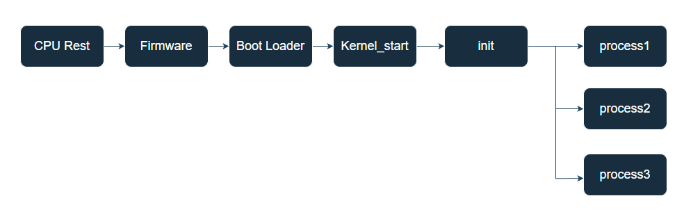
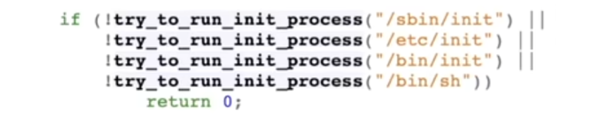
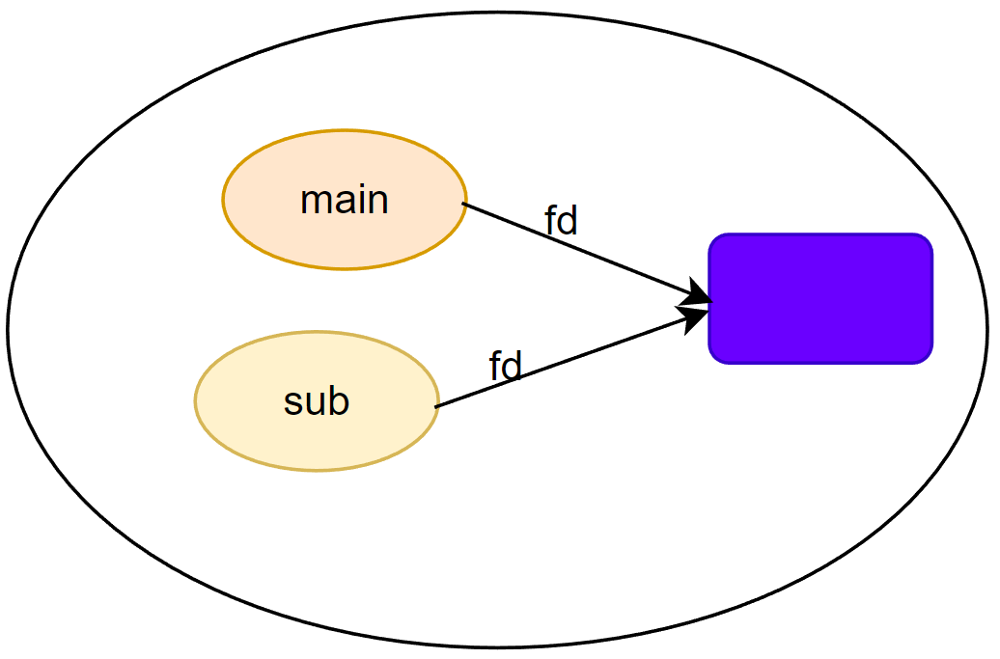
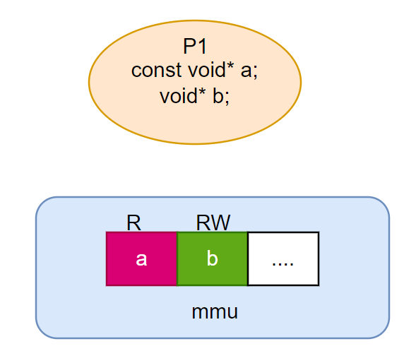
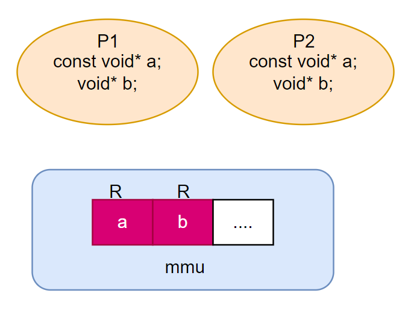
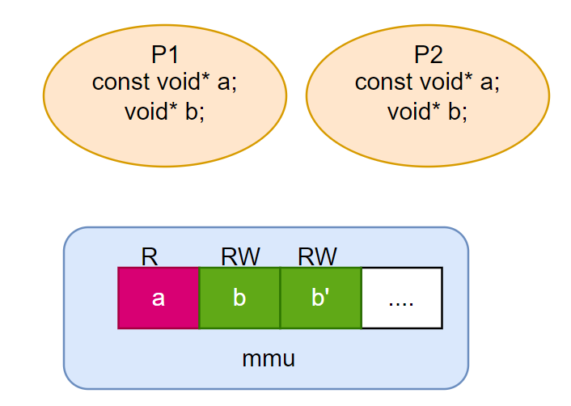
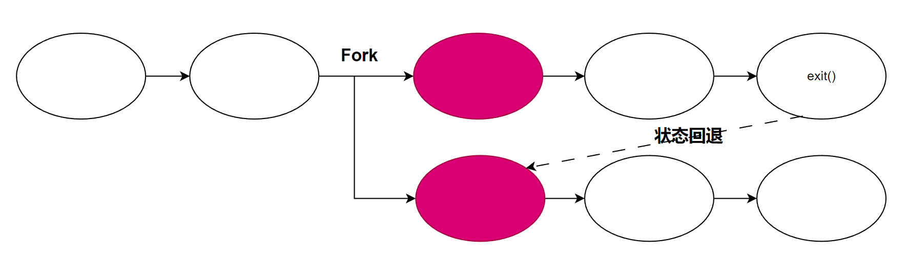

# 进程管理


# init 进程



操作系统内核加载后，会去启动一个进程，之后所有进程都是通过该进程或者子进程进行创建。一般启动的就是 `systemd` 进程。



```term
triangle@LEARN:~$ ll /sbin/ | grep init
lrwxrwxrwx  1 root root        20 Mar 15 23:04 init -> /lib/systemd/systemd*
```

管理进程的系统调用主要有：
- fork: 进程的创建
- execve: 加载新进程，并把状态机重置为进程的初始状态
- exit: 进程结束

# 进程控制

## fork

### 功能

调用 `fork()` 时，会将当前进程的**状态完全复制**，然后创建一个新进程。复制流程为写时复制，即要修改内容的时候，才回去真正的复制一份内存。

```cpp
#include <iostream>
#include <unistd.h>

int main(int argc, char const *argv[])
{
    for (size_t i = 0; i < 2; i++)
    {
        fork();
        printf("hello\n");
    } 
    return 0;
}
```

```term
triangle@LEARN:~$ ./a.out 
hello
hello
hello
hello
hello
hello
triangle@LEARN:~$ ./a.out | cat
hello
hello
hello
hello
hello
hello
hello
hello
```


上面的例子出现了一个奇怪现象，直接运行程序会打印 6 个 hello，但是利用管道进行输出就是 8 个 hello。在程序直接运行时，`printf()` 是 `line buffer`，即遇到换行符就会刷新缓冲区；在管道输出与文本输出时，`printf()` 是 `full buffer`，即只有达到缓冲区大小时，才会刷新缓冲区。通过管道打印 hello ，第二次调用 `fork()` 时，缓冲区的 `hello\n` 并未输出，也被一起复制，因此就多了两次 hello 的打印。

### 文件描述符



文件描述符是一个指向系统流对象的一个指针。 `fork()`时，进程文件描述符也会进行复制。

> [!tip]
文件描述符的系统调用
> - open: 打开文件描述符
> - dup: 复制文件描述符
> - close: 释放文件描述符
> - write: 写
> - read: 读

### 写时拷贝



1. 一个进程访问内存，会根据地址指针去访问真实内存映射的「虚拟内存」，然后通过内存管理单元 `MMU` 操作真实内存。



2. 当进程 `fork` 后，子进程也会持有同样的虚拟内存地址映射，**并且操作系统会偷偷将父进程可写的内存写权限收回**



3. 都进程对可写的内存页发生「写」行为时，由于权限不对，就会产生中断，操作系统介入就会检查写行为是否合规。合规的话，就赶紧复制一份新内存页给进程完成写操作，并恢复内存页的写权限。

### 使用技巧

- 复杂模块一次初始化，多进程复用，例如安卓应用秒开，就是将 java 运行环境提前初始化好，然后运行 app 时， fork 进程复用已经初始化好的环境就行。

    ```cpp
    int main(){
        // 模块初始化
        module_init();
        // 启动进程
        for(int i=0; i < count; i++){
            if(fork() == 0){
                // 启动新进程
                execve("new process");
                // 使用初始化好的模块 
                module_start();
            }
        } 
    } 
    ```

- **建立平行世界**：根据操作系统是状态机的特点，建立某个状态的快照，实现状态回退以及读档

    


### 问题

操作系统内容增多，`fork` 发展至今，累积了诸多问题
- 操作系统内部对象增多，这些对象是否应该 fork ?
- fork 违背了设计的初衷，变得更加复杂
- fork 很慢
- 。。。

更加安全的 `fork` 实现接口：

```cpp
#include <spawn.h>
int posix_spawn(pid_t *pid, const char *path,
            const posix_spawn_file_actions_t *file_actions,
            const posix_spawnattr_t *attrp,
            char *const argv[], char *const envp[]);
```

## execve

```cpp
/**
  pathname - 程序路径
  argv - 程序传参
  envp - 环境变量
 */
int execve(const char *pathname, char *const argv[], char *const envp[]);
```

每次新进程的启动，主进程 `fork()` 出子进程后会调用 `execve` 加载新进程，并将状态初始化为新进程的状态。


```cpp
int main(int argc, char const *argv[])
{
    // 参数
    char * const argvs[] = {
        "1","2", NULL
    };

    // 环境变量
    char * const envps[] = {NULL};

    execve("/mnt/e/testspace/cpp/add", argvs, envps);

    printf("hello\n");
    return 0;
}
```


```term
triangle@LEARN:~$ ./a.out
1 + 2 = 3
```


在执行完 `execve()` 之后，程序并没有打印 `printf()`，这是因为 `execve()` 已将当前进程的运行状态由 `a.out` 切换到了 `add` 程序的状态，当 `add` 运行完毕，就直接退出进程。

```term
triangle@LEARN:~$ strace -f -o out.txt ./a.out  
triangle@LEARN:~$ cat -n out.txt 
1  26216 execve("./a.out", ["./a.out"], 0x7ffeac6bc688 /* 34 vars */) = 0 // 启动 a.out 的系统调用
63 26216 execve("/mnt/e/testspace/cpp/add", ["1", "2"], 0x7fff993a94b8 /* 0 vars */) = 0 // 启动 add 的系统调用
...
126 26216 write(1, "1 + 2 = 3\n", 10)       = 10
127 26216 exit_group(0)                     = ?
128 26216 +++ exited with 0 +++ // 直接退出
```

## exit

结束进程有三种调用方式：
- exit(0) : libc 中封装的函数 (默认)
  - 调用 `exit_group` 终止所有的线程
  - 会调用 atexit 回调
- _exit(0) : glibc 中的系统调用封装
  - 执行 `exit_group` 终止所有的线程
  - 不会调用 atexit 回调
- syscall(SYS_exit,0) : 系统调用
  - 调用 `exit` 结束当前线程，不会结束子线程
  - 不会调用 atexit 回调

```cpp
#include <thread>
#include <stdio.h>
#include <stdlib.h>
#include <unistd.h>
#include <sys/syscall.h>

void run()
{
    int n = 1000;
    while (n--)
    {
        printf("hello\n");
    }
}

void quit()
{
    printf("over\n");
}

int main(int argc, char const *argv[], char const * envp[])
{
    atexit(quit);
    std::thread t(run);
    t.detach(); // 需要 detach 不然会抛异常

    // exit(0);
    // _exit(0);
    // syscall(SYS_exit,0);
    return 0;
}
```


# 地址空间

## pmap

pmap 可以查看进程的内存分布，以及在这片内存程序具有操作的权限。

```term
triangle@LEARN:~$ pmap 43417
43417:   /mnt/e/testspace/cpp/a.out
0000555555554000      4K r---- a.out
0000555555555000      4K r-x-- a.out
0000555555556000      4K r---- a.out
0000555555557000      4K r---- a.out
0000555555558000      4K rw--- a.out
0000555555559000    132K rw---   [ anon ]
00007ffff7a56000     20K rw---   [ anon ]
00007ffff7a5b000     52K r---- libm-2.31.so
00007ffff7a68000    668K r-x-- libm-2.31.so
00007ffff7b0f000    612K r---- libm-2.31.so
00007ffff7ba8000      4K r---- libm-2.31.so
00007ffff7ba9000      4K rw--- libm-2.31.so
00007ffff7baa000    136K r---- libc-2.31.so
00007ffff7bcc000   1504K r-x-- libc-2.31.so
00007ffff7d44000    312K r---- libc-2.31.so
00007ffff7d92000     16K r---- libc-2.31.so
00007ffff7d96000      8K rw--- libc-2.31.so
00007ffff7d98000     16K rw---   [ anon ]
00007ffff7d9c000     24K r---- libpthread-2.31.so
00007ffff7da2000     68K r-x-- libpthread-2.31.so
00007ffff7db3000     24K r---- libpthread-2.31.so
00007ffff7db9000      4K r---- libpthread-2.31.so
00007ffff7dba000      4K rw--- libpthread-2.31.so
00007ffff7dbb000     16K rw---   [ anon ]
00007ffff7dbf000     12K r---- libgcc_s.so.1
00007ffff7dc2000     72K r-x-- libgcc_s.so.1
00007ffff7dd4000     16K r---- libgcc_s.so.1
00007ffff7dd8000      4K r---- libgcc_s.so.1
00007ffff7dd9000      4K rw--- libgcc_s.so.1
00007ffff7dda000    600K r---- libstdc++.so.6.0.28
00007ffff7e70000    964K r-x-- libstdc++.so.6.0.28
00007ffff7f61000    292K r---- libstdc++.so.6.0.28
00007ffff7faa000      4K ----- libstdc++.so.6.0.28
00007ffff7fab000     44K r---- libstdc++.so.6.0.28
00007ffff7fb6000     12K rw--- libstdc++.so.6.0.28
00007ffff7fb9000     20K rw---   [ anon ]
00007ffff7fc9000     16K r----   [ anon ]
00007ffff7fcd000      8K r-x--   [ anon ]
00007ffff7fcf000      4K r---- ld-2.31.so
00007ffff7fd0000    140K r-x-- ld-2.31.so
00007ffff7ff3000     32K r---- ld-2.31.so
00007ffff7ffc000      4K r---- ld-2.31.so
00007ffff7ffd000      4K rw--- ld-2.31.so
00007ffff7ffe000      4K rw---   [ anon ]
00007ffffffde000    132K rw---   [ stack ]
 total             6032K
```
pmap 的实现原理其实是去读取进程文件

```term
triangle@LEARN:~$ strace pmap 43417
...
stat("/proc/43417", {st_mode=S_IFDIR|0555, st_size=0, ...}) = 0
openat(AT_FDCWD, "/proc/43417/stat", O_RDONLY) = 3
...
triangle@LEARN:~$ cat /proc/43417/maps 
555555554000-555555555000 r--p 00000000 00:4c 6473924464358880     /mnt/e/testspace/cpp/a.out
555555555000-555555556000 r-xp 00001000 00:4c 6473924464358880     /mnt/e/testspace/cpp/a.out
555555556000-555555557000 r--p 00002000 00:4c 6473924464358880     /mnt/e/testspace/cpp/a.out
555555557000-555555558000 r--p 00002000 00:4c 6473924464358880     /mnt/e/testspace/cpp/a.out
555555558000-555555559000 rw-p 00003000 00:4c 6473924464358880     /mnt/e/testspace/cpp/a.out
555555559000-55555557a000 rw-p 00000000 00:00 0     [heap]
7ffff7a56000-7ffff7a5b000 rw-p 00000000 00:00 0     // 未初始化的数据，当程序跑起来再初始化，就不用保存到文件中
7ffff7a5b000-7ffff7a68000 r--p 00000000 08:20 60458     /usr/lib/x86_64-linux-gnu/libm-2.31.so
7ffff7a68000-7ffff7b0f000 r-xp 0000d000 08:20 60458     /usr/lib/x86_64-linux-gnu/libm-2.31.so
7ffff7b0f000-7ffff7ba8000 r--p 000b4000 08:20 60458     /usr/lib/x86_64-linux-gnu/libm-2.31.so
7ffff7ba8000-7ffff7ba9000 r--p 0014c000 08:20 60458     /usr/lib/x86_64-linux-gnu/libm-2.31.so
7ffff7ba9000-7ffff7baa000 rw-p 0014d000 08:20 60458     /usr/lib/x86_64-linux-gnu/libm-2.31.so
7ffff7baa000-7ffff7bcc000 r--p 00000000 08:20 60456     /usr/lib/x86_64-linux-gnu/libc-2.31.so
7ffff7bcc000-7ffff7d44000 r-xp 00022000 08:20 60456     /usr/lib/x86_64-linux-gnu/libc-2.31.so
7ffff7d44000-7ffff7d92000 r--p 0019a000 08:20 60456     /usr/lib/x86_64-linux-gnu/libc-2.31.so
7ffff7d92000-7ffff7d96000 r--p 001e7000 08:20 60456     /usr/lib/x86_64-linux-gnu/libc-2.31.so
7ffff7d96000-7ffff7d98000 rw-p 001eb000 08:20 60456     /usr/lib/x86_64-linux-gnu/libc-2.31.so
7ffff7d98000-7ffff7d9c000 rw-p 00000000 00:00 0 
7ffff7d9c000-7ffff7da2000 r--p 00000000 08:20 60469     /usr/lib/x86_64-linux-gnu/libpthread-2.31.so
7ffff7da2000-7ffff7db3000 r-xp 00006000 08:20 60469     /usr/lib/x86_64-linux-gnu/libpthread-2.31.so
7ffff7db3000-7ffff7db9000 r--p 00017000 08:20 60469     /usr/lib/x86_64-linux-gnu/libpthread-2.31.so
7ffff7db9000-7ffff7dba000 r--p 0001c000 08:20 60469     /usr/lib/x86_64-linux-gnu/libpthread-2.31.so
7ffff7dba000-7ffff7dbb000 rw-p 0001d000 08:20 60469     /usr/lib/x86_64-linux-gnu/libpthread-2.31.so
7ffff7dbb000-7ffff7dbf000 rw-p 00000000 00:00 0 
7ffff7dbf000-7ffff7dc2000 r--p 00000000 08:20 12715     /usr/lib/x86_64-linux-gnu/libgcc_s.so.1
....
```

进程相关文件的手册

```term
triangle@LEARN:~$ man 5 proc
```
## vdso


> [!note]
> `vdso` 的目的是实现部分系统调用不进入系统内核，就能获取结果，进一步优化程序。

```cpp
#include <stdio.h>
#include <time.h>

int main(int argc, char const *argv[], char const * envp[])
{
    time(NULL);
    return 0;
}
```

```term
triangle@LEARN:~$ gdb ./a.out
(gdb) layout asm
(gdb) si // 运行到 time 系统调用 
│   0x7ffff7fcd870 <time>                   cmpl   $0x7fffffff,-0x47f6(%rip)        # 0x7ffff7fc9084  │
│   0x7ffff7fcd87a <time+10>                lea    -0x4801(%rip),%rax        # 0x7ffff7fc9080         │ # 将 0x7ffff7fc9080 地址值赋给 %rax
│   0x7ffff7fcd881 <time+17>                lea    -0x1808(%rip),%rdx        # 0x7ffff7fcc080         │
│   0x7ffff7fcd888 <time+24>                cmove  %rdx,%rax                                          │
│   0x7ffff7fcd88c <time+28>                test   %rdi,%rdi                                          │
│  >0x7ffff7fcd88f <time+31>                mov    0x20(%rax),%rax                                    │ # 将 0x20(%rax) 地址的内容读取到 %rax
(gdb) p $rax
$12 = 1687515210
triangle@LEARN:~$ cat /proc/55314/maps
...
7ffff7fb8000-7ffff7fbe000 rw-p 00000000 00:00 0
7ffff7fc9000-7ffff7fcd000 r--p 00000000 00:00 0     [vvar]
7ffff7fcd000-7ffff7fcf000 r-xp 00000000 00:00 0     [vdso]
...
```

可以看到 `time` 系统调用的指令地址在 `vdso` 内存空间，并没有到进入 libc 的内存。且程序运行结果是将 `0x7ffff7fc90a0` 的值读取到 %rax 中，即时间戳，且 `0x7ffff7fc90a0` 的地址空间在 `vvar` 中。因此可以得出 `time` 系统调用并没有进入操作系统内核，而是通过操作系统在内存 `vdso` 与 `vvar` 上的映射，直接获取时间结果。在 `vvar` 上的时间戳由操作系统实时更新，并且所有的进程都能访问到。

```term
triangle@LEARN:~$ man vdso // 可以查看其它不用进入操作系统内核，就能获取结果的系统调用
```
## mmap

> [!note]
> `mmap` 系统调用实现分配虚拟内存空间、将文件映射到一段内存空间上。

```cpp
#include <sys/mman.h>
// addr - 内存首地址
// length - 地址长度
// prot - 读写权限
// flags - 选项
// fd - 文件
// offset - 文件偏移量
void *mmap(void *addr, size_t length, int prot, int flags, int fd, off_t offset);
int munmap(void *addr, size_t length);
```

- 利用 `mmap` 快速分配大内存

```cpp
#include <sys/mman.h>

int main()
{
    volatile uint8_t *p = mmap(NULL, 3 GiB, 
                               PROT_READ | PROT_WRITE,
                               MAP_ANONYMOUS | MAP_PRIVATE,
                               -1, 0
                              );
}
```

- 利用 `mmap` 加载动态库

```term
triangle@LEARN:~$ strace a.out 
....
openat(AT_FDCWD, "/lib/x86_64-linux-gnu/libc.so.6", O_RDONLY|O_CLOEXEC) = 3
read(3, "\177ELF\2\1\1\3\0\0\0\0\0\0\0\0\3\0>\0\1\0\0\0\300A\2\0\0\0\0\0"..., 832) = 832
pread64(3, "\6\0\0\0\4\0\0\0@\0\0\0\0\0\0\0@\0\0\0\0\0\0\0@\0\0\0\0\0\0\0"..., 784, 64) = 784
pread64(3, "\4\0\0\0\20\0\0\0\5\0\0\0GNU\0\2\0\0\300\4\0\0\0\3\0\0\0\0\0\0\0", 32, 848) = 32
pread64(3, "\4\0\0\0\24\0\0\0\3\0\0\0GNU\0\226_\371;7.\306\344V\24-\4\267\323yZ"..., 68, 880) = 68
fstat(3, {st_mode=S_IFREG|0755, st_size=2029592, ...}) = 0
mmap(NULL, 8192, PROT_READ|PROT_WRITE, MAP_PRIVATE|MAP_ANONYMOUS, -1, 0) = 0x7fac591bd000
pread64(3, "\6\0\0\0\4\0\0\0@\0\0\0\0\0\0\0@\0\0\0\0\0\0\0@\0\0\0\0\0\0\0"..., 784, 64) = 784
pread64(3, "\4\0\0\0\20\0\0\0\5\0\0\0GNU\0\2\0\0\300\4\0\0\0\3\0\0\0\0\0\0\0", 32, 848) = 32
pread64(3, "\4\0\0\0\24\0\0\0\3\0\0\0GNU\0\226_\371;7.\306\344V\24-\4\267\323yZ"..., 68, 880) = 68
mmap(NULL, 2037344, PROT_READ, MAP_PRIVATE|MAP_DENYWRITE, 3, 0) = 0x7fac58fcb000
mmap(0x7fac58fed000, 1540096, PROT_READ|PROT_EXEC, MAP_PRIVATE|MAP_FIXED|MAP_DENYWRITE, 3, 0x22000) = 0x7fac58fed000
mmap(0x7fac59165000, 319488, PROT_READ, MAP_PRIVATE|MAP_FIXED|MAP_DENYWRITE, 3, 0x19a000) = 0x7fac59165000
mmap(0x7fac591b3000, 24576, PROT_READ|PROT_WRITE, MAP_PRIVATE|MAP_FIXED|MAP_DENYWRITE, 3, 0x1e7000) = 0x7fac591b3000
mmap(0x7fac591b9000, 13920, PROT_READ|PROT_WRITE, MAP_PRIVATE|MAP_FIXED|MAP_ANONYMOUS, -1, 0) = 0x7fac591b9000
....
```

- 利用 `mmap` 映射磁盘

```python
#!/usr/bin/env python3

import mmap, hexdump

with open('/dev/sda', 'rb') as fp:
    mm = mmap.mmap(fp.fileno(), prot=mmap.PROT_READ, length=128 << 30)
    hexdump.hexdump(mm[:512])
```


# 附加

## 环境变量

一个程序的入口 `main` 函数有三个参数

```cpp
#include <iostream>
/* 
    argc - 命令行参数个数
    argv - 命令行参数
    envp - 环境变量
 */
int main(int argc, char const *argv[], char const * envp[])
{
    printf("%s\n", envp[0]);
    printf("%s\n", envp[1]);
    return 0;
}
```

```term
triangle@LEARN:~$ ./a.out 
SHELL=/bin/bash
COLORTERM=truecolor
triangle@LEARN:~$ env | head
SHELL=/bin/bash
COLORTERM=truecolor
WSL2_GUI_APPS_ENABLED=1
....
```

并且在启动程序的时候也可以自定义环境变量列表 `envp` 

```term
triangle@LEARN:~$ TEST=fuck ./a.out
TEST=fuck
SHELL=/bin/bash
```

环境变量分类：
- PATH: 可执行文件搜索路径
- PWD: 当前路径
- HOME: home 目录
- DISPLAY: 图形输出
- PS1: shell 的提示符


在程序中获取所有环境变量

```cpp
  #include <iostream>
  extern char ** environ; // libc 库给的全局变量，可以访问所有的环境变量
  int main(int argc, char const *argv[])
  {
      for (int i = 0; environ[i] != NULL; i++)
      {
          printf("%s\n", environ[i]);
      }
      return 0;
  }

```