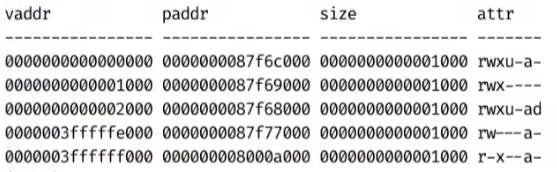
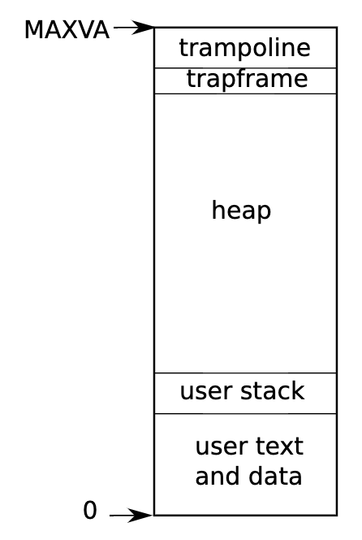

# XV6

# 介绍

`XV6` 专为教学开发，是 `UNIX v6` 版的优化版本。
- 基本工具集，例如 wc、echo、cat... 
- 命令执行、管道、重定向
- 支持多处理器

在 xv6 中只有 21 个系统调用


`XV6` 相关资料：
- [xv6: A simple, Unix-like teaching operating system](https://jyywiki.cn/pages/OS/manuals/xv6-riscv-rev2.pdf) 
- [xv6-riscv](https://github.com/mit-pdos/xv6-riscv)


# 虚拟内存

作用：让每一个进程都拥有一个独立且完整的内存，但实际运行中，这些虚拟内存会被映射到真正的物理地址上。这样做的好处是每个进程间的内存操作互不干涉，且每个进程都有大量的内存能使用。



在 `riscv` 中，会在 `satp` 寄存器中存储当前进程的虚拟内存映射表，进程访问虚拟内存地址 `vaddr` 就会被内存管理单元转换为真正的内存物理地址 `paddr`。

# 进程切换


在 `riscv` 中，一个进程的虚拟内存模型在高地址会有两块特殊内存
- `trampoline`：用于保存进程当前运行状态的代码，全局共享
- `trapframe`: 储存进程当前运行状态的寄存器、内存信息，进程肚子维护一份

当前发生中断、系统调用时，会首先调用 `trampoline` 将当前进程的寄存器、内存信息保存到 `trapframe` 内存中，然后才让操作系统介入，处理业务。当前要恢复某个进程时，就只需将 `trapframe` 的信息重新恢复到寄存器、内存就行。





# 任务调度

## 时间片轮转

策略：操作系统固定时间发生中断，依次轮转进程进行运行。


缺陷：如果大部分进程都在等待，那么依次轮询执行，就会浪费大量的cpu资源。

## 优先级

策略：为进程划分优先级，让高优先级的进程先执行。UNIX 采用 `niceness` 值进行评判，数值为 `-20 ~ 19` 的整数
- `-20` : 最坏，会抢着 cpu 执行
- `19` : 最好，会把 cpu 让给其他进程执行

缺陷：会饿死好人

> [!tip]
> 在 Linux 中，`niceness` 值是用来指定进程分配 cpu 的概率，防止好人饿死

```term
triangle@LEARN:~$ taskset -c 0 yes // 将进程绑定到指定 cpu 执行
triangle@LEARN:~$ nice -n 19  yes // 指定进程的 niceness 值
triangle@LEARN:~$  taskset -c 0 nice -n 9 yes > /dev/null &
triangle@LEARN:~$  taskset -c 0 nice -n 19 yes > /dev/null &
triangle@LEARN:~$ top // NI 就是 niceness 值；两个 yes 进程 cpu 占比 9 ：1
PID USER      PR  NI    VIRT    RES    SHR S  %CPU  %MEM     TIME+ COMMAND
882 triangle  29   9    7236    512    448 R  89.7   0.0   0:11.79 yes
879 triangle  39  19    7236    584    516 R  10.0   0.0   0:25.60 yes   
```

## 动态优先级 (MLFQ)

策略：靠操作系统自动设置进程优先级。
- 坏人：让坏人变好点，提升 niceness 值
- 好人：可以变坏点，降低 niceness 值

缺陷：会有坏人装好人

## 完全公平策略 (CFS)

策略：对每个进程的运行时间进行记录，确保所有进程的运行总时间尽可能一样。
- 好人：加快时间
- 坏人：减缓时间

问题：
1. 进程 `fork` 后，子进程的运行时间设置方式
2. 进程 `sleep` 后，运行时间要补充
3. 运行时间无限增长，数据会存在溢出风险，运行时间归零
 
## 复杂调度问题

- **进程同步调度**

问题：当优先级高的进程和优先级低的进程发生同步时，会给调度器造成严重问题。低优先级的进程拿着锁睡觉，高优先级的进程一直等待低优先级运行完，造成中级任务持续运行。

解决方案：
- 优先级继承：低优先级持有了高优先级的锁，低优先变高优先级

- **多处理器**

1. 进程怎么分配到 cpu 上运行
2. cpu 区分大小核

# 附加

## 依赖文件

对于 `makefile` 而言，其只能检测目标依赖的文件是否发生改变。然后再写 `makefile` 的时候，一般只会将 `*.c` 或 `*.cpp` 文件写入依赖，而并不涉及 `*.h` 。这就会导致当头文件发生改变时，进行项目编译，make 并不能识别出头文件变化，导致出现一系列问题。为解决该问题，gcc 编译器可以自动生成源文件的依赖文件，即 `*.d`，用于 `makefile` 能够识别头文件的变化。

```term
triangle@LEARN:~$ gcc -MD -c main.c // MD 告诉编译器生成 .d 文件
triangle@LEARN:~$ ll
-rwxrwxrwx 1 triangle triangle  102 Sep  2 14:45 main.c*
-rwxrwxrwx 1 triangle triangle   48 Sep  2 14:52 main.d*
-rwxrwxrwx 1 triangle triangle 1560 Sep  2 14:52 main.o*
triangle@LEARN:~$ cat main.d
main.o: main.c /usr/include/stdc-predef.h add.h
```

让 `makefile` 自动维护这些东西

```makefile
# 获取所有的 cpp
SRC=$(wildcard *.c)

# 替换 .cpp 为 .o
OBJ=$(SRC:.c=.o)

# .d 文件
DEP=$(SRC:.c=.d)

.PHONY: all clean
all: a.out

# - 当语句执行错误，会忽略继续执行
# 包含所有的 .d 文件
-include $(DEP)

# a.out 依赖所有 .o 目标，即执行完 .o 目标再执行 a.out
a.out: $(OBJ)
	gcc $^ -o $@

# 批量生成 .o 的目标
%.o: %.c
	gcc -MD -c $< -o $@

clean:
	rm ./*.d ./*.o a.out
```

> [!tip]
> ```term
> triangle@LEARN:~$ make -nB target // 查看命令序列的展开
> ```


## compile_commands

`vscode` 本身就是一个文本编辑器，若进行 `c/c++` 项目开发时，拥有代码提示、语法检测、宏定义检测等功能，就得对工程进行配置。`compile_commands.json` 就是一个不错的配置方案，可以针对单个的源文件进行配置（`c_cpp_properties.json` 是针对整个项目配置）

- makefile

```term
triangle@LEARN:~$ bear make target // bear 会解惑编译指令，生成 compile_commands.json
```

- visual studio

[vs_export](https://github.com/paopaol/vs_export) : 只支持 15/17/19/22 的 `.sln` 项目文件解析

- cmake 

```cmakelist
set(CMAKE_EXPORT_COMPILE_COMMANDS ON)
```

- xmake

```term
triangle@LEARN:~$ xmake project -k compile_commands
```

