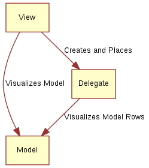

# Model View Delegate

# 概念



`Model View Delegate` 是 QML 应用程序的设计理念。
- `View` : qml 的界面程序
- `Delegate` ：展示数据的界面模板，从 `Model` 读取一项数据，然后显示在 `View` 上
- `Model` : 数据模型，是一个类似数组的容器，可以是一维或二维。

# 组件

##  Repeater

```qml
import QtQuick 2.5

Column {
    spacing: 2

    Repeater {
        // Model 数据： 0 ~ 10 的数字序列
        model: 10 

        // Delegate 展示 model 的界面模板，通过 index 获取数据
        BlueBox {
            width: 120
            height: 32
            text: index
        }
    }
}
```

> [!note]
> `Repeater` 适合展示数据量有限且不会修改的 `model`。对于大数据集的展示，则应使用 `ListView、GridView、Flickable`

## ListView

- **高亮**


```qml
import QtQuick 2.5
import "../common"

Background {
    width: 240
    height: 300

    ListView {
        id: view
        anchors.fill: parent
        anchors.margins: 20

        // 只展示 width x height 范围内的内容
        clip: true
        model: 100

        delegate: numberDelegate
        spacing: 5

        // 高亮时，展示的组件
        highlight: highlightComponent
        focus: true
    }

    Component {
        id: highlightComponent

        GreenBox {
            width: ListView.view.width
        }
    }

    Component {
        id: numberDelegate

        Item {
            width: ListView.view.width
            height: 40

            Text {
                anchors.centerIn: parent

                font.pixelSize: 10

                text: index
            }
        }
    }
}
```

- **首尾**


```qml
import QtQuick 2.5

Background {
    width: 240
    height: 300

    ListView {
        anchors.fill: parent
        anchors.margins: 20

        clip: true

        model: 4

        delegate: numberDelegate
        spacing: 2

        // 首
        header: headerComponent
        // 尾
        footer: footerComponent
    }

    Component {
        id: headerComponent

        YellowBox {
            width: ListView.view.width
            height: 20
            text: 'Header'

        }
    }

    Component {
        id: footerComponent

        YellowBox {
            width: ListView.view.width
            height: 20
            text: 'Footer'
        }
    }

    Component {
        id: numberDelegate

        GreenBox {
            width: ListView.view.width
            height: 40
            text: 'Item #' + index
        }
    }
}
```

## GridView


```qml
import QtQuick 2.5

Background {
    width: 220
    height: 300

    GridView {
        id: view
        anchors.fill: parent
        anchors.margins: 20

        clip: true

        model: 100

        // 单元格的大小
        cellWidth: 45
        cellHeight: 45

        // delegate 放在 cell 的左上角
        delegate: numberDelegate
    }

    Component {
        id: numberDelegate

        GreenBox {
            width: 40
            height: 40
            text: index
        }
    }
}
```

## TableView

```qml
TableView {
    id: view
    anchors.fill: parent
    anchors.margins: 20

    // 可以控制两个方向
    rowSpacing: 5
    columnSpacing: 5

    clip: true

    // 展示 c++ 中定义的 table model
    model: tableModel

    delegate: cellDelegate

    Component {
        id: cellDelegate

        GreenBox {
            implicitHeight: 40
            implicitWidth: 40

            Text {
                anchors.centerIn: parent
                text: display
            }
        }
    }
}
```

# 回调函数

```qml
import QtQuick 2.11

Rectangle {
    width: 120
    height: 300

    gradient: Gradient {
        GradientStop { position: 0.0; color: "#f6f6f6" }
        GradientStop { position: 1.0; color: "#d7d7d7" }
    }
    
    ListModel {
        id: actionModel
        
        // 从  5.11 开始，可以将函数作为属性，存放到容器中
        ListElement {
            name: "Copenhagen"
            hello: function(value) { console.log(value + ": You clicked Copenhagen!"); }
        }
        ListElement {
            name: "Helsinki"
            hello: function(value) { console.log(value + ": Helsinki here!"); }
        }
        ListElement {
            name: "Oslo"
            hello: function(value) { console.log(value + ": Hei Hei fra Oslo!"); }
        }
        ListElement {
            name: "Stockholm"
            hello: function(value) { console.log(value + ": Stockholm calling!"); }
        }
    }

    ListView {
        anchors.fill: parent
        anchors.margins: 20

        clip: true

        model: actionModel

        delegate: actionDelegate
        spacing: 5

        focus: true
    }

    Component {
        id: actionDelegate

        Rectangle {
            width: ListView.view.width
            height: 40

            color: "#157efb"

            Text {
                anchors.centerIn: parent
                font.pixelSize: 10
                text: name
            }
            
            MouseArea {
                anchors.fill: parent
                // 调用每个 delegate 对应的回调函数
                onClicked: hello(index);
            }
        }
    }
}
```

