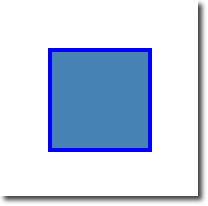
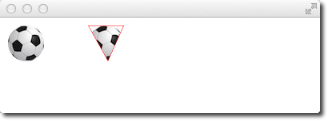
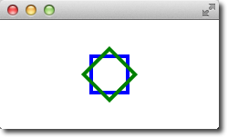

# Canvas


# 介绍

`Canvas` 能渲染的目标主要有两个
- `Canvas.Image` : 本质是一个 `QImage` 对象，所有的 Qt Quick 都支持
- `Canvas.FramebufferObject` : 依赖 `OpenGL` 

在 Canvas 中可以绘制线条、形状、图片等二维图形，其绘制结果可以也能保存为图片或者 `URL`。Canvas 会渲染在 `onPain` 中创建的 `Context2D` 对象，然后显示到画布中。

```qml
import QtQuick 2.0

Canvas {
    id: mycanvas

    // 定义画布宽高
    width: 100
    height: 200

    // 渲染目标
    renderTarget: Canvas.Image

    // 渲染策略
    renderStrategy: Canvas.Immediate

    // 画布的绘制内容
    onPaint: {
        // 创建 Context2D 对象
        var ctx = getContext("2d");
        ctx.fillStyle = Qt.rgba(1, 0, 0, 1);
        ctx.fillRect(0, 0, width, height);
    }
}
```

Canvas 支持 `HTML5` 所有关于 Context2D 的 `Pixel Operations`，并且对于 `Canvas.Image` 性能最好（`Canvas.FramebufferObject` 需要进行显存与内存的数据交换，而且可能还需要通过垂直同步修复画面撕裂）。 Canvas 提供了 `HTML5-lick API`，但使用时需要替换一些 HTML 的特有 API：
- `DOM API` 使用 QML 属性进行替换
- `HTML Event` 使用 `MouseArea` 替换
- 定时器使用 `Timer` 或者 `requestAnimationFrame()`
- 绘制内容放入 `onPaint`，并且可以通过 `markDirty()` 或 `requestPaint()` 触发绘制事件
- 通过 `loadImage()` 加载图片，且通过 `onImageLoaded` 绘制

>[!tip]
> 不推荐使用 `Cavans.Image` 渲染复杂且庞大的图形、需要频繁刷新的界面、复杂动画。应当使用 `QQuickPaintedItem` 或者 `QPainter` 替换

# Context2D

## 基本使用

通过 `Context2D` 可以在 `Canvas` 上绘制图形



```qml
import QtQuick 2.5

Canvas {
    id: root

    // canvas 坐标系
    // 原点：左上角
    // y 轴：向下为正
    // x 轴：向右为正
    // canvas size
    width: 200; height: 200

    // handler to override for drawing
    onPaint: {
        // 获取 Context2D 对象
        // get context to draw with
        var ctx = getContext("2d")

        // stroke : 画笔工具
        // setup the stroke
        ctx.lineWidth = 4
        ctx.strokeStyle = "blue"

        // fill: 填充工具
        // setup the fill
        ctx.fillStyle = "steelblue"

        // 设置绘画路径
        // begin a new path to draw
        ctx.beginPath()
        // top-left start point
        ctx.moveTo(50,50)
        // upper line
        ctx.lineTo(150,50)
        // right line
        ctx.lineTo(150,150)
        // bottom line
        ctx.lineTo(50,150)
        // left line through path closing
        ctx.closePath()

        // 利用填充工具填充
        // fill using fill style
        ctx.fill()

        // 利用画笔工具画线
        // stroke using line width and stroke style
        ctx.stroke()
    }
}
```

## Rect


```qml
// convenient.qml

import QtQuick 2.5

Canvas {
    id: root
    width: 120; height: 120
    onPaint: {
        var ctx = getContext("2d")

        ctx.fillStyle = 'green'
        ctx.strokeStyle = "blue"
        ctx.lineWidth = 4

        // 快速绘制一个实体的矩形
        ctx.fillRect(20, 20, 80, 80)

        // 裁剪上面的实体矩形
        ctx.clearRect(30,30, 60, 60)

        // 绘制一个矩形框 
        ctx.strokeRect(20,20, 40, 40)
    }
}
```

## 渐变


```qml
onPaint: {
    var ctx = getContext("2d")

    // 定义渐变的变化曲线: (100,0) -> (100,200) 的直线
    var gradient = ctx.createLinearGradient(100,0,100,200)
    // 将颜色值映射到渐变曲线上
    gradient.addColorStop(0, "blue")
    gradient.addColorStop(0.5, "lightsteelblue")

    ctx.fillStyle = gradient
    ctx.fillRect(50,50,100,100)
}
```

## 阴影

```qml
onPaint: {
    var ctx = getContext("2d")

    // 绘制背景
    ctx.strokeStyle = "#333"
    ctx.fillRect(0,0,canvas.width,canvas.height);

    // 绘制阴影
    ctx.shadowColor = "#2ed5fa";
    ctx.shadowOffsetX = 2;
    ctx.shadowOffsetY = 2;
    ctx.shadowBlur = 10;

    // 绘制文本
    ctx.font = 'bold 80px Ubuntu';
    ctx.fillStyle = "#24d12e";
    ctx.fillText("Canvas!",30,180);
}
```

## 图片



```qml

// 需要先加载图片，然后才能在 onPaint 中进行绘制
Component.onCompleted: {
    loadImage("assets/ball.png")
}

onPaint: {
    var ctx = getContext("2d")

    // draw an image
    ctx.drawImage('assets/ball.png', 10, 10)

    // 保存画图配置状态
    ctx.save()

    ctx.strokeStyle = '#ff2a68'

    // 创建一个裁剪区域
    ctx.beginPath()
    ctx.moveTo(110,10)
    ctx.lineTo(155,10)
    ctx.lineTo(135,55)
    ctx.closePath()
    ctx.clip()  // create clip from the path

    // draw image with clip applied
    ctx.drawImage('assets/ball.png', 100, 10)

    // draw stroke around path
    ctx.stroke()

    /**
     *  之后所有的绘图都将被裁剪
    */

    // 恢复 ctx.save() 的状态，用于取消 clip 
    ctx.restore()
}
```

## 变换



>[!note]
> `scale`、`rotate`、`translate` 等变换的坐标系默认与 `canvas` 的坐标系一致。


```qml
import QtQuick 2.5

Canvas {
    id: root
    width: 240; height: 120
    onPaint: {
            var ctx = getContext("2d");
            ctx.lineWidth = 4;
            ctx.strokeStyle = "blue";

            // 将坐标系挪动到 canvas 的中心
            ctx.translate(root.width/2, root.height/2);

            // draw path
            ctx.beginPath();
            ctx.rect(-20, -20, 40, 40);
            ctx.stroke();

            // rotate coordinate system
            ctx.rotate(Math.PI/4);
            ctx.strokeStyle = "green";

            // draw path
            ctx.beginPath();
            ctx.rect(-20, -20, 40, 40);
            ctx.stroke();
    }
}
```

## 混合模式

```qml
    property var operation : [
        'source-over', 'source-in', 'source-over',
        'source-atop', 'destination-over', 'destination-in',
        'destination-out', 'destination-atop', 'lighter',
        'copy', 'xor', 'qt-clear', 'qt-destination',
        'qt-multiply', 'qt-screen', 'qt-overlay', 'qt-darken',
        'qt-lighten', 'qt-color-dodge', 'qt-color-burn',
        'qt-hard-light', 'qt-soft-light', 'qt-difference',
        'qt-exclusion'
        ]

    onPaint: {
        var ctx = getContext("2d")
        // 指定混合模式
        ctx.globalCompositeOperation = "source-over"
        ctx.fillStyle = "#33a9ff"

        for(var i=0; i<40; i++) {
            ctx.beginPath()
            ctx.arc(Math.random()*400, Math.random()*200, 20, 0, 2*Math.PI)
            ctx.closePath()
            ctx.fill()
        }
    }
```

## Pixel Buffer

```qml
    Canvas {
        id: canvas
        x: 10; y: 10
        width: 100; height: 100
        property real hue: 0.0
        onPaint: {
            var ctx = getContext("2d")
            var x = 10 + Math.random(80)*80
            var y = 10 + Math.random(80)*80
            hue += Math.random()*0.1
            if(hue > 1.0) { hue -= 1 }
            ctx.globalAlpha = 0.7
            ctx.fillStyle = Qt.hsla(hue, 0.5, 0.5, 1.0)
            ctx.beginPath()
            ctx.moveTo(x+5,y)
            ctx.arc(x,y, x/10, 0, 360)
            ctx.closePath()
            ctx.fill()
        }

        MouseArea {
            anchors.fill: parent
            onClicked: {
                // 根据宽高创建 image 数据
                var img1 = canvas.createImageData(sw,sh);
                var img2 = canvas.getImageData(sx,sy,sw,sh);

                // img1 与 img2 是 imagedata 类型
                // imagedata 包含 width，height 与一维数据 data，排列为 RGBA

                // 塞入图片
                canvas.putImageData(imagedata, dx, dy)

                // 保存图片到本地
                canvas.save("image/out.png");

                // 将 canvas 保存为图片
                var url = canvas.toDataURL('image/png')
                print('image url=', url)

                // 通过 image 可以加载 url
                image.source = url
            }
        }
    }

    Image {
        id: image
        x: 130; y: 10
        width: 100; height: 100
    }
```

## 鼠标绘制

```qml
    Canvas {
        id: canvas
        anchors {
            left: parent.left
            right: parent.right
            top: colorTools.bottom
            bottom: parent.bottom
            margins: 8
        }
        property real lastX
        property real lastY
        property color color: colorTools.paintColor

        onPaint: {
            var ctx = getContext('2d')
            ctx.lineWidth = 1.5
            ctx.strokeStyle = canvas.color
            ctx.beginPath()
            ctx.moveTo(lastX, lastY)
            lastX = area.mouseX
            lastY = area.mouseY
            ctx.lineTo(lastX, lastY)
            ctx.stroke()
        }

        // 利用 MouseArea 追踪鼠标
        MouseArea {
            id: area
            anchors.fill: parent
            onPressed: {
                canvas.lastX = mouseX
                canvas.lastY = mouseY
            }
            onPositionChanged: {
                canvas.requestPaint()
            }
        }
    }
```