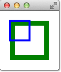

# Canvas


# 介绍

`Canvas` 能渲染的目标主要有两个
- `Canvas.Image` : 本质是一个 `QImage` 对象，所有的 Qt Quick 都支持
- `Canvas.FramebufferObject` : 依赖 `OpenGL` 

在 Canvas 中可以绘制线条、形状、图片等二维图形，其绘制结果可以也能保存为图片或者 `URL`。Canvas 会渲染在 `onPain` 中创建的 `Context2D` 对象，然后显示到画布中。

```qml
import QtQuick 2.0

Canvas {
    id: mycanvas

    // 定义画布宽高
    width: 100
    height: 200

    // 渲染目标
    renderTarget: Canvas.Image

    // 渲染策略
    renderStrategy: Canvas.Immediate

    // 画布的绘制内容
    onPaint: {
        // 创建 Context2D 对象
        var ctx = getContext("2d");
        ctx.fillStyle = Qt.rgba(1, 0, 0, 1);
        ctx.fillRect(0, 0, width, height);
    }
}
```

Canvas 支持 `HTML5` 所有关于 Context2D 的 `Pixel Operations`，并且对于 `Canvas.Image` 性能最好（`Canvas.FramebufferObject` 需要进行显存与内存的数据交换，而且可能还需要通过垂直同步修复画面撕裂）。 Canvas 提供了 `HTML5-lick API`，但使用时需要替换一些 HTML 的特有 API：
- `DOM API` 使用 QML 属性进行替换
- `HTML Event` 使用 `MouseArea` 替换
- 定时器使用 `Timer` 或者 `requestAnimationFrame()`
- 绘制内容放入 `onPaint`，并且可以通过 `markDirty()` 或 `requestPaint()` 触发绘制事件
- 通过 `loadImage()` 加载图片，且通过 `onImageLoaded` 绘制

>[!tip]
> 不推荐使用 `Cavans.Image` 渲染复杂且庞大的图形、需要频繁刷新的界面、复杂动画。应当使用 `QQuickPaintedItem` 或者 `QPainter` 替换

# Context2D

## 基本使用

通过 `Context2D` 可以在 `Canvas` 上绘制图形


```qml
import QtQuick 2.5

Canvas {
    id: root

    // canvas 坐标系
    // 原点：左上角
    // y 轴：向下为正
    // x 轴：向右为正
    // canvas size
    width: 200; height: 200

    // handler to override for drawing
    onPaint: {
        // 获取 Context2D 对象
        // get context to draw with
        var ctx = getContext("2d")

        // stroke : 画笔工具
        // setup the stroke
        ctx.lineWidth = 4
        ctx.strokeStyle = "blue"

        // fill: 填充工具
        // setup the fill
        ctx.fillStyle = "steelblue"

        // 设置绘画路径
        // begin a new path to draw
        ctx.beginPath()
        // top-left start point
        ctx.moveTo(50,50)
        // upper line
        ctx.lineTo(150,50)
        // right line
        ctx.lineTo(150,150)
        // bottom line
        ctx.lineTo(50,150)
        // left line through path closing
        ctx.closePath()

        // 利用填充工具填充
        // fill using fill style
        ctx.fill()

        // 利用画笔工具画线
        // stroke using line width and stroke style
        ctx.stroke()
    }
}
```

## Rect



```qml
// convenient.qml

import QtQuick 2.5

Canvas {
    id: root
    width: 120; height: 120
    onPaint: {
        var ctx = getContext("2d")

        ctx.fillStyle = 'green'
        ctx.strokeStyle = "blue"
        ctx.lineWidth = 4

        // 快速绘制一个实体的矩形
        ctx.fillRect(20, 20, 80, 80)

        // 裁剪上面的实体矩形
        ctx.clearRect(30,30, 60, 60)

        // 绘制一个矩形框 
        ctx.strokeRect(20,20, 40, 40)
    }
}
```

