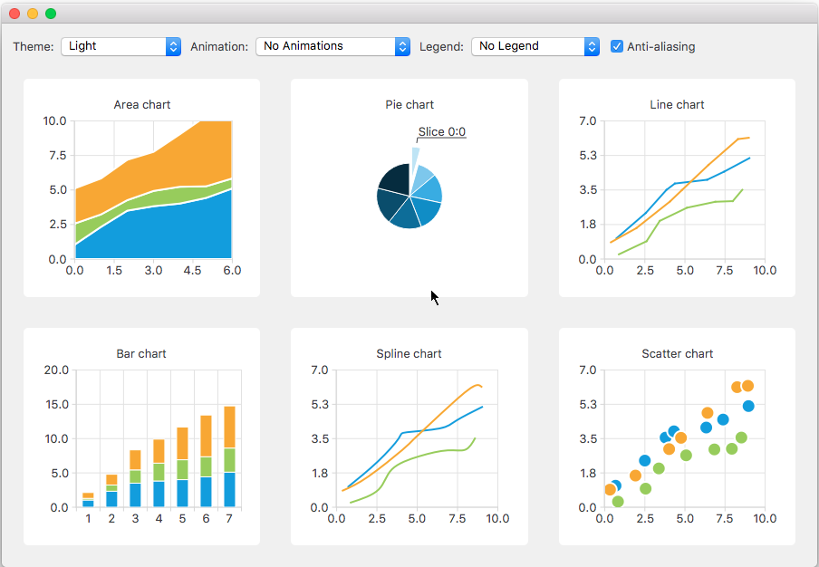
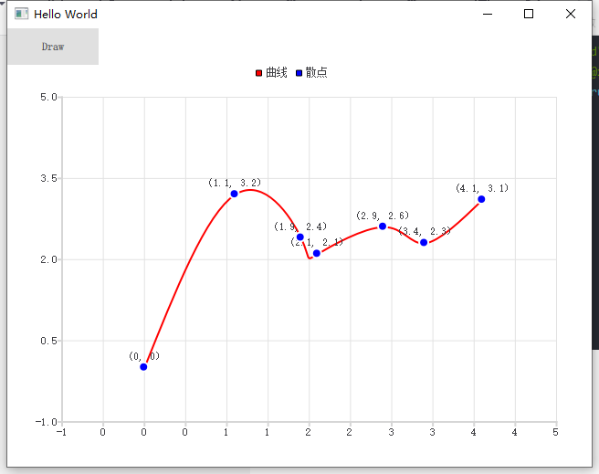

# Qt Charts

> [!warning|style:flat]
> 画静态图勉强，动态实时更新图性能烂得一批，最好别用，傻逼 `Qt Chart`。建议使用 `QQuickPaintedItem` 与 [qcustomplot](https://www.qcustomplot.com/) 替代。

# 介绍

`Qt Charts` 能够创建时尚、交互式、以数据为中心的用户界面。Qt Charts 基于QQuickPaintedItem `Graphics View Framework` 实现。图表组件可以用作 `QWidget`，`QGraphicsWidget`，`QML`。



`QChart` 管理图表相关的对象，例如图例、坐标轴等。QChart 是 `QGraphicScene` 的子类，可以在 `QGraphicsWidget` 中展示。
- 在使用上，`QChartView` 或 `ChartView` 比 `QChart` 更简单
- 使用 `QPolarChart` 或 `PolarChart`来展示极坐标图
- 可以通过 `QAbstractItemModel` 为图表提供数据

可绘制的[图表类型](https://blog.csdn.net/qq21497936/article/details/106528645)：
- 折线图
- 样条曲线图
- 面积图
- 散点图
- 条形图
- 饼图
- 方块胡须图
- 蜡烛图
- 极坐标图

# 规则


每一个图表类型都继承自 `QAbstractSeries` 与 `AbstractSeries`。图表创建的通用规则为： **`Series` 类实例化一个图表对象，然后放入 `QChar` 或 `CharView` 中进行渲染展示** 。


```qml
import QtQuick 2.0
import QtCharts 2.0

ChartView {
    width: 400
    height: 300
    theme: ChartView.ChartThemeBrownSand
    antialiasing: true

    PieSeries {
        id: pieSeries
        PieSlice { label: "eaten"; value: 94.9 }
        PieSlice { label: "not yet eaten"; value: 5.1 }
    }
}
```

> [!note]
> 由于 `ChartView` 会使用 `Graphics View Framework`，因此需要使用 `QApplication` 替换 `QGuiApplication`。


# 图表绘制

## 静态绘制

```qml
import QtQuick 2.12
import QtQuick.Window 2.12
import QtCharts 2.3

Window {
    visible: true
    width: 640
    height: 480
    title: qsTr("Hello World")

    ChartView {
        title: "Spline"
        anchors.fill: parent
        antialiasing: true

        // 直接定义
        SplineSeries {
            name: "SplineSeries"
            XYPoint { x: 0; y: 0.0 }
            XYPoint { x: 1.1; y: 3.2 }
        }
    }
}
```

## 动态绘制

```qml
import QtQuick 2.12
import QtQuick.Window 2.12
import QtCharts 2.3
import QtQuick.Controls 2.5

Window {
    visible: true
    width: 640
    height: 480
    title: qsTr("Hello World")

    ChartView {
        id: mychart
        anchors.fill: parent
        antialiasing: true
        theme:ChartView.ChartThemeBlueNcs
    }

    Button {
        text: "Draw"
        onClicked:
        {
            // 通过 createSeries 直接创建
            var spline = mychart.createSeries(ChartView.SeriesTypeSpline, "曲线");
            spline.color = 'red';
            spline.axisX.max=5;
            spline.axisX.min=-1;
            spline.axisY.max=5;
            spline.axisY.min=-1;
            spline.axisX.tickType = ValueAxis.TicksDynamic;
            spline.axisX.tickInterval = 0.5;
            spline.axisX.labelFormat = "%d";

            spline.append(0, 0);
            spline.append(1.1, 3.2);
            spline.append(1.9, 2.4);
            spline.append(2.1, 2.1);
            spline.append(2.9, 2.6);
            spline.append(3.4, 2.3);
            spline.append(4.1, 3.1);

            var scatter = mychart.createSeries(ChartView.SeriesTypeScatter, "散点");
            scatter.markerSize = 10;
            scatter.color = 'blue';
            scatter.axisX.max=5;
            scatter.axisX.min=-1;
            scatter.axisY.max=5;
            scatter.axisY.min=-1;
            scatter.axisX.tickType = ValueAxis.TicksDynamic;
            scatter.axisX.tickInterval = 0.5;
            scatter.axisX.labelFormat = "%d";

            // 坐标的绘制方式
            scatter.pointLabelsFormat = "(@xPoint, @yPoint)";
            scatter.pointLabelsVisible = true;

            scatter.append(0, 0);
            scatter.append(1.1, 3.2);
            scatter.append(1.9, 2.4);
            scatter.append(2.1, 2.1);
            scatter.append(2.9, 2.6);
            scatter.append(3.4, 2.3);
            scatter.append(4.1, 3.1);
        }
    }
}
```



# 组件

## 分类

| 类                  | 作用                         |
| ------------------- | ---------------------------- |
| `AbstractAxis`      | 所有坐标轴的基类             |
| `AbstractSeries`    | 所有图表类型的基类           |
| `AbstractBarSeries` | 所有条形图类型的基类         |
| `XYSeries`          | 直线、样条线、散点图的基类   |
| `***ModelMapper`    | `series` 数据提供器          |
| `XYPoint`           | 坐标点                       |
| `Legend`            | 图例                         |
| `ChartView`         | 管理所有坐标轴、图例、图表类 |
| `PolarChartView`    | `ChartView` 的特例，极坐标图 |


> [!note]
> - `ChartView` : 可以通过 `MouseArea` 接收鼠标事件
> - `**Series` : 有对应信号接收鼠标信号，不能设置 `MouseArea`

## ChartView

```qml
ChartView{
    // 图例
    legend

    // 语言
    locale

    // 主题
    theme

    // 标题
    title

    Component.onCompleted{
        // 将 series 坐标系中的 value 点转换到 ChartView 界面的像素点上
        mapToPosition(value, series)

        // 将 ChartView 界面的 pos 像素点转换到 series 的坐标系上
        mapToValue(pos, series)

        // 缩放
        zoomIn(factor)
        zoomIn(rect) // rect 的坐标系为 ChartView 的像素坐标
        zoomIn()
        zoomOut()
        zoomReset()
    }
}
```

## XYSeries

```qml
XYSeries{
    // 极坐标系
    axisAngular
    axisRadial

    // 笛卡尔坐标系
    axisX
    axisY
    axisXTop
    axisYRight

    // 坐标刻度
    pointLabels**
}
```