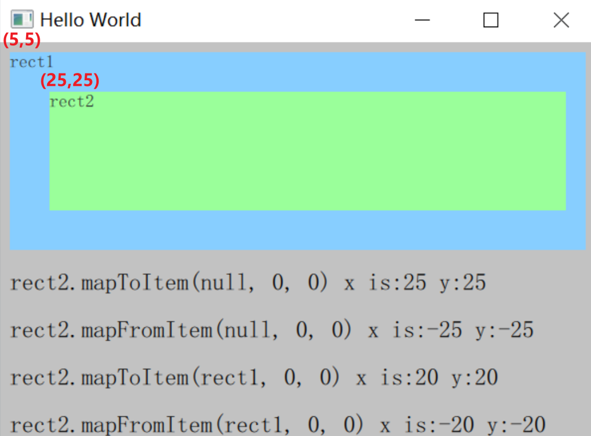

# 常用控件

# Item

## 基本属性

> [!note]
> 在 `qml` 中，所有可见控件均继承该控件

通常设置的控件属性均属于 `Item`
- anchors
- height
- width
- layer
- parent
- scale
- visible
- x
- y
- z
- .....


## 坐标转换




```cpp
// rect2 中的 (0,0) 点，转换到 rect1 的坐标体系中为 (20,20)
rect2.mapToItem(rect1, 0, 0);

// rect1 中的 (0,0) 点，转换到 rect2 的坐标体系中为 (-20,-20)
rect2.mapFromItem(rect1, 0, 0);

// 若目标为 null 坐标点的转换则基于根组件的坐标系
rect2.mapToItem(null, 0, 0);
rect2.mapFromItem(null, 0, 0);
```


# Rectangle

```qml
Rectangle{
    id: rect2
    width: 100
    height: 20
    // 旋转
    rotation: 90
    // 缩放
    scale: 3
    // 抗锯齿
    antialiasing: true
    // 边框，边框是在控件内部，不会修改控件的宽高
    border.width: 2 
    border.color: "green"
    // 圆角
    radius: 15 
}
```


# MouseArea

## 基本属性

```qml
MouseArea{
    id:mouse
    width: 100
    height: 100

    // 该控件默认只接收左键，其他按键需要手动添加
    acceptedButtons: Qt.LeftButton | Qt.RightButton

    // 将控件可视化，骚用法
    Rectangle{
        anchors.fill: parent
        color: "black"
    }

    onClicked:{} // 鼠标点击
    onReleased: {} // 鼠标释放
    onPressed:{ // 鼠标按下
        // 获取按下的按键
        var ret = pressedButtons
    } 

    // 当 hoverEnabled 设置 true，鼠标进入 MouseArea 就会触发 onContainsMouseChanged
    hoverEnabled: true
    onContainsMouseChanged:{}
    onMouseXChanged:{}
    onMouseYChanged:{}

    // 光标样式
    cursorShape: Qt.CrossCursor

    // 长按
    ressAndHoldInterval: 1000 // 长按时间, ms
    onPressAndHold:{} 
}
```

## 控件拖动

```qml
// 控件拖拽
Rectangle {
    id: container
    width: 600; height: 200

    Rectangle {
        id: rect
        width: 50; height: 50
        color: "red"
        opacity: (600.0 - rect.x) / 600

        MouseArea {
            anchors.fill: parent
            drag.target: rect
            drag.axis: Drag.XAxis // 可以拖拽 x 轴
            drag.minimumX: 0
            drag.maximumX: container.width - rect.width
        }
    }
}
```

## 事件穿透


### 鼠标点击事件

- **事件类型**
  - 基本：`pressed` 、`released`
  - 组合：`clicked`、`doubleClicked`、`pressAndHold`

- `propagateComposedEvents` : 组合的鼠标事件是否将自动传播到重合的底层 `MouseArea`，即当多个`MouseArea`在界面上重叠时，鼠标事件会从 `z` 值最大的 MouseArea 依次传播到 `z` 值最小的 MouseArea 停止。
- `mouse.accepted` : 控制是否接收处理该事件，默认 `true`。事件被接收，则停止传播

```qml
Rectangle {
    color: "yellow"
    width: 100; height: 100

    MouseArea {
        anchors.fill: parent
        onClicked: console.log("clicked yellow")
    }

    Rectangle {
        color: "blue"
        width: 50; height: 50

        // 虽然是子控件，但是显示在最上层
        MouseArea {
            anchors.fill: parent

            // 启动事件传递
            propagateComposedEvents: true 

            onClicked: {
                console.log("clicked blue")

                // 当前层级不处理事件，事件继续传播
                mouse.accepted = false 
            }
        }
    }
}
```


### 鼠标悬停

**事件类型**： `entered`、`exited`

```qml
Rectangle {
    color: "yellow"
    width: 100
    height: 100
 
    MouseArea {
        anchors.fill: parent
        onEntered: {}
        onExited: {}
 
        Rectangle {
            color: "blue"
            width: 50
            height: 50
 
            MouseArea {
                anchors.fill: parent
                onEntered: {}
                onExited: {}
            }
        }
    }
}
```


# Button

## 基础属性

```qml
Button{
    id: btn
    width: 80
    height: 30

    icon.source: "图标路径"
    text: "文本"

    // 修改 button 样式，background 的类型为 item
    background: Rectangle{
        anchors.fill: btn
        color: {
            if(btn.pressed){
                return "green"
            }else{
                return "blue"
            }
        }
    }

    // 按钮展示内容
    contentItem: Text{
        color:"transparent" // 颜色透明
    }
}
```

## 长按按钮

```qml
Button{
    id: btn
    width: 80
    height: 30

    autoRepeat: true // 按钮按住时，能持续激活事件
    autoRepeatDelay: 10 // 要按住多久，ms
    autoRepeatInterval: 10 // 事件的触发时间间隔, ms
}
```

## 选择按钮

```qml
Button{
    id: btn
    width: 80
    height: 30

    // 选择框
    checkable: true
}
```

## 互斥多选框

```qml
Item{
    Button{
        id: btn1
        width: 80
        height: 30
        x: 0

        checkable: true
        autoExclusive:true // 保证同级的Button只有一个能被选中
    }

    Button{
        id: btn2
        width: 80
        height: 30
        x: 100

        checkable: true
        autoExclusive:true
    }

    Button{
        id: btn3
        width: 80
        height: 30
        x: 200

        checkable: true
        autoExclusive:true
    }
}
```

# Checkbox

```qml

// ButtonGroup 将三个 checkbox 放到一组，实现 checkbox 互斥
ButtonGroup{
    id: checks
    exclusive: true
    buttons: col.children
}

// 布局
Column {
    id: col
    CheckBox {
        text: qsTr("Breakfast")
        checked: true
    }
    CheckBox {
        text: qsTr("Lunch")
    }
    CheckBox {
        text: qsTr("Dinner")
        checked: true
    }
}
```

# Text

```qml
Text{
    text: "文本"

    // 字体
    font.pixelSize: 12
    font.bold: true
    font.italic: true

    // 添加省略号
    elide: Text.ElideLeft

    // NOTE - 使用 wrap 必须明确指定 width 属性
    wrapMode: Text.Wrap
}
```

# Image

```qml
Image{
    source: "图片.jpg"
}
```

# Popup

> [!note]
> 1. `popup` 的 visible 不受父控件影响
> 2. `popup` 会优先覆盖其他控件，并且 `z` 只在 `popup` 之间有效


```qml
Button{
    height: 20
    width: 20
    onClicked:{
        // 打开
        popup.open()

        // 关闭
        popup.close()
    }
}

Popup{
    id:popup
    x: 100
    y: 100
    width: 128
    height: 30

    // 默认关闭事件 close() 与 esc 按键
    closePolicy: Popup.CloseOnEscape | Popup.CloseOnPressOutside

    // 模态与非模态
    modal: true
    dim: true // 非模态下popup的背景色
    Overlay.modal: Item // 自定义模态的背景
    Overlay.modalless: Item // 自定义非模态的背景

    // 动画控制
    enter : Transition
    exit : Transition

    // 绘制展示内容
    contentItem : Item
}
```
# Repeater

```qml
Repeater {
    // 数字： 生成几个
    model: 3
    Rectangle {
        // index: 控件索引
        y: index * 50
        width: 100; height: 40
        border.width: 1
        color: "yellow"
    }
}

Repeater {
    // 按照数组大小生成
    model: ["a","b","c"]
    Rectangle {
        // index: 控件索引
        y: index * 50
        width: 100; height: 40

        // 获取 model 数组里面的数据
        text: modelData
    }
}
```


# ListView

## 基本属性

```qml
ListView{
    width: 100; height: 300

    // ListView 的上方和下方添加内容
    header: Component
    footer : Component

    // 控制数据有多少
    model: 3

    // 控制每一项数据应该如何绘制
    delegate: Text{
        // index 获取 model 索引
        text: index

        // 控制当前激活项
        MouseArea{
            anchors.fill: parent
            onClicked:{
                // currentIndex: 当前选中项
                // index: 当前控件的索引
                currentIndex = index
            }
        }
    }

    // 高亮显示效果
    highlight: Text{

    }
}
```

>[!note]
> **在 `delegate` 中不能直接绑定 `parent` 属性以及数据存储**。因为 `delegate` 会根据可视状态动态生成和释放。

## 挂载属性

```qml
ListView{

    delegate: Text{
        id: itemRoot

        // delegate 的根组件会有 ListView 挂载属性
        ListView.view; // ListView 本身
        ListView.isCurrentItem; // 当前 delegate 是否选中

        Rectangle{
            // delegate 中的所有子组件必须通过根组件访问 ListView 挂载
            width: itemRoot.ListView.view.width
        }
    }

}
```

## 自定义选项

```qml
ListView{
    width: 100; height: 300

    // 通过 ListModel 来定义每一项
    model: ListModel {
      id: fruitModel

      ListElement {
          name: "Apple"
          cost: 2.45
      }
      ListElement {
          name: "Orange"
          cost: 3.25
      }
      ListElement {
          name: "Banana"
          cost: 1.95
      }
  }

    // 控制每一项数据应该如何绘制
    delegate: Text{
        // 直接访问 ListElement 的属性
        text: name
    }
}
```

## 分组

```qml
// 定义分组标题控件
Component {
    id: sectionHeading
    Rectangle {
        width: container.width
        height: childrenRect.height
        color: "lightsteelblue"

        Text {
            text: section
            font.bold: true
            font.pixelSize: 20
        }
    }
}
 
ListView {
    id: view
    anchors.top: parent.top
    anchors.bottom: buttonBar.top
    width: parent.width
    model: animalsModel
    delegate: Text { 
        text: name; font.pixelSize: 18 
    }

    // 分组
    section.property: "size" // 按照 ListElement 中的哪个属性来分组
    section.criteria: ViewSection.FullString
    section.delegate: sectionHeading
}
```


# TextField

```qml
    TextField{
        clip: true // 超出文本框内容会被隐藏
        autoScroll: true // 输入内容超出尺寸能滚动
        selectByMouse: true // 输入内容能被选中

        // NOTE - 只校验了输入结果，并未完成限制输入。例如，输入 300 也能正常展示
        validator: IntValidator{bottom:1;top:100;}
        onTextEdited:{
            // validtaor 的校验结果 
            console.log(acceptableInput)
        }
    }
```

# TextEdit

>[!warning|style:flat]
>  `Qt 6.3` 之前的所有版本，`TextEdit` 与 `TextArea` 存在内存泄漏问题


# ComboBox

##  基本属性

```qml
ComboBox{
    // ComboBox 可以输入
    editable: ture

    // 输入框进行正则限制
    validator: RegExpValidator{
        regExp: /[0-9]{1,2}/
    }
    onAcceptableInputChanged:{ // 校验是否满足正则限制
        console.log(acceptableInput)
    }

    // 控制输入框展示的内容
    displayText: currentIndex + " 额外展示内容"

    // 定义选项
    model: [
        { text: "Banana"; color: "Yellow" }
        { text: "Apple"; color: "Green" }
        { text: "Coconut"; color: "Brown" }
    ]

    // currentText 与 currentValue
    textRole: "text" // 指定 text 属性对应 model 中的属性
    valueRole: "color" // 指定 value 属性对应 model 中的属性
    onCurrentTextChanged: {
        console.log("text:",currentText)
    } 
    onCurrentValueChanged: {
        console.log("text:",currentValue)
    }
}
```

## 自定 ComboBox

```qml
ComboBox {
    id: control
    model: ["First", "Second", "Third"]

    // 控制各个选项绘制
    delegate: ItemDelegate {
        contentItem: Text {}
        // 高亮
        highlighted: control.highlightedIndex == index
    }

    // 定义上下箭头
    indicator: Rectangle{}

    // 控制 ComboBox 输入框前景
    contentItem: Text {}

    // 控制 ComboBox 输入框背景
    background: Rectangle {}

    // 控制 ComboBox 弹出框的展示样式
    popup: Popup {
    }
}
```


# Menu

```qml
Menu{
    // menu 中的选项
    MenuItem{
        text: "menu1"
        action: Action{
            // 激活快捷键
            shortcut: StandardKey.copy
            // 选项被点击
            onTriggered:{

            }
        }
    }
}
```


# Setting

可以将界面设置保存到本地，下一次打开界面会读取相应配置

```qml
 import QtQuick.Window 2.1
  import Qt.labs.settings 1.0

  Window {
      id: window

      width: 800
      height: 600

      Settings {
          id: ini
          fileName: "settings.ini"
          category: "ini group"
          property alias x: window.x
          property alias y: window.y
          property alias width: window.width
          property alias height: window.height
      }
      Button{
        onClicked:{
            // 直接访问
            ini.x;
            // 查找值
            ini.value("key");
            // 设置
            ini.setValue("key",value);
        }
      }
  }
```

# StackView

```qml
Item {
    width: 640
    height: 480
    visible: true

    StackView {
        id: stack
        initialItem: mainView
        anchors.fill: parent
    }

    Component {
        id: mainView
        
        Row {
            spacing: 10
            property int index: 0
            property string type: ""

            Component.onDestruction: console.log("Destroying second item", type, index)

            Button {
                text: "Push Temp"
                // stack 会根据 Component 创建一个实例，并在 pop 的时候直接释放
                // {"type":"temp", "index": stack.depth} : 修改 Component 显示内容的属性
                onClicked: stack.push(mainView,{"type":"temp", "index": stack.depth})
            }

            Button {
                text: "Push Obj"
                // 使用 Component.createObject 创建一个实例，并挂到 StackView 的对象树下
                // 该对象不会在 pop 的时候释放，只会在 StackView 被销毁后，一起删除
                onClicked: stack.push(mainView.createObject(stack,{"type":"obj", "index": stack.depth}))
            }

            Button {
                text: "Pop"
                enabled: stack.depth > 1
                onClicked: stack.pop()

            }

            Text { text: stack.depth }

            TextField{ width: 100 }
        }
    }
} 


```

# Canvas

`Canvas` 能渲染的目标主要有两个
- `Canvas.Image` : 本质是一个 `QImage` 对象，所有的 Qt Quick 都支持
- `Canvas.FramebufferObject` : 依赖 `OpenGL` 

在 Canvas 中可以绘制线条、形状、图片等二维图形，其绘制结果可以也能保存为图片或者 `URL`。Canvas 会渲染在 `onPain` 中创建的 `Context2D` 对象，然后显示到画布中。

```qml
import QtQuick 2.0

Canvas {
    id: mycanvas

    // 定义画布宽高
    width: 100
    height: 200

    // 渲染目标
    renderTarget: Canvas.Image

    // 渲染策略
    renderStrategy: Canvas.Immediate

    // 画布的绘制内容
    onPaint: {
        // 创建 Context2D 对象
        var ctx = getContext("2d");
        ctx.fillStyle = Qt.rgba(1, 0, 0, 1);
        ctx.fillRect(0, 0, width, height);
    }
}
```

Canvas 支持 `HTML5` 所有关于 Context2D 的 `Pixel Operations`，并且对于 `Canvas.Image` 性能最好（`Canvas.FramebufferObject` 需要进行显存与内存的数据交换，而且可能还需要通过垂直同步修复画面撕裂）。 Canvas 提供了 `HTML5-lick API`，但使用时需要替换一些 HTML 的特有 API：
- `DOM API` 使用 QML 属性进行替换
- `HTML Event` 使用 `MouseArea` 替换
- 定时器使用 `Timer` 或者 `requestAnimationFrame()`
- 绘制内容放入 `onPaint`，并且可以通过 `markDirty()` 或 `requestPaint()` 触发绘制事件
- 通过 `loadImage()` 加载图片，且通过 `onImageLoaded` 绘制

>[!tip]
> 不推荐使用 `Cavans.Image` 渲染复杂且庞大的图形、需要频繁刷新的界面、复杂动画。应当使用 `QQuickPaintedItem` 或者 `QPainter` 替换


# BusyIndicator

> [!warning|style:flat]
> `6.5` 之前的版本，会占用 CPU 与 GPU，并且隐藏后会继续运行。

```qml
BusyIndicator{
    width : 100
    height: 100
    // 是否启动等待组件
    running: true
}
```


# Flickable/ScrollView

`Flickable` 与 `ScrollView` 都可以实现界面拖拽效果，例如滚动滑动。区别是 `Flickable` 的控制参数比 `ScrollView` 多，可控性更高。

```qml
Flickable { 

    clip: true

    // 展示内容的宽高
    contentHeight: gridLayout.height
    contentWidth: gridLayout.width

    // 滚动条
    ScrollBar.vertical: ScrollBar{
        id:scrollbar
    }

    // 默认的 Flickable 会抢占 mouseMoveEvent 事件，导致子控件异常，这就需要自己实现滚动条交互
    interactive: false

    MouseArea{
        anchors.fill:parent
        preventStealing: true
        propagateComposedEvents: true
        onPressed: {
            mouse.accepted = false;
        }

        onWheel: {
            if(wheel.angleDelta.y > 0){
                scrollbar.decrease();
            }else{
                scrollbar.increase();
            }
        }
    }

    // 实际内容
    GridLayout{
        id: gridLayout
    }
}
```
