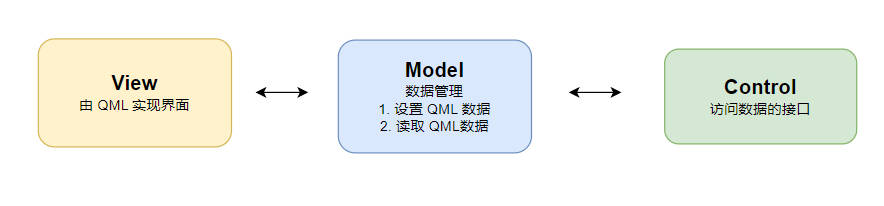

# QML 与 CPP

# MVC



# QML 加载

```cpp
#include <QGuiApplication>
#include <QQmlApplicationEngine>

int main(int argc, char *argv[])
{
    QGuiApplication app(argc, argv);

    QQmlApplicationEngine engine;
    engine.load(QUrl(QStringLiteral("qrc:/main.qml")));
    if (engine.rootObjects().isEmpty())
        return -1;

    return app.exec();
}
```


# CPP 注册

## 全局变量
- c++中定义

```cpp
#include <QGuiApplication>
#include <QQmlApplicationEngine>
#include <QQmlContext>

int main(int argc, char *argv[])
{
    QGuiApplication app(argc, argv);

    QQmlApplicationEngine engine;

    // 获取 qml 上下文
    QQmlContext * context = engine.rootContext();
    // 定义 qml 全局变量
    context->setContextProperty("VALUE", 200);

    engine.load(QUrl(QStringLiteral("qrc:/main.qml")));
    if (engine.rootObjects().isEmpty())
        return -1;

    return app.exec();
}
```
- qml 中使用

```qml
Button{
    width: VALUE // 在 qml 中直接使用
}
```

## 单例注册

- 定义

```cpp
#include <QObject>
#include <QtQml>

class MyValue : public QObject
{
    Q_OBJECT

    // 声明该 object 能被 qml 访问
    QML_ELEMENT
public:
    MyValue();

    // 定义 set/get
    int getVal(){ return m_nVal;}
    void setVal(int val) {m_nVal = val;}

    // 将函数暴露给 QML
    Q_INVOKABLE void fcn();

signals:
    void sig_valChanged();

private:
    int m_nVal;

    // int nVal : qml 中能访问的名字
    // READ getVal ：读取函数
    // WRITE setVal ：写出函数
    // NOTIFY sig_valChanged ： 值改变时，通知的信号
    Q_PROPERTY(int nVal READ getVal WRITE setVal NOTIFY sig_valChanged)

    // 上面的简写
    Q_PROPERTY(int nVal MEMBER m_nVal NOTIFY sig_valChanged)
};
```

- 注册

```cpp
#include <QGuiApplication>
#include <QQmlApplicationEngine>
#include <QQmlContext>

int main(int argc, char *argv[])
{
    QGuiApplication app(argc, argv);

    QQmlApplicationEngine engine;

    MyValue * val = new Myvalue();

    // 注册到 qml 中
    // 优于 context->setContextProperty 注册
    qmlRegisterSingletonInstance("MyObject", 1,0,"MyValue", val);

    engine.load(QUrl(QStringLiteral("qrc:/main.qml")));
    if (engine.rootObjects().isEmpty())
        return -1;

    return app.exec();
}
```

- QML使用

```qml
import MyObject 1.0

Item{
    function Test(){
        // 直接访问注册成功的全局单例
        MyValue.fcn();
    } 
}

```

> [!tip] 
> 通过 `context->setContextProperty` 也能直接将 `MyValue` 单例放入 QML ，不过还是使用 `qmlRegisterSingletonInstance` 更加规范


## 模块注册

- 定义

```cpp
#include <QObject>
#include <QtQml>

class MyValue : public QObject
{
    Q_OBJECT

    // 声明该 object 能被 qml 访问
    QML_ELEMENT
public:
    MyValue();

    // 定义 set/get
    int getVal(){ return m_nVal;}
    void setVal(int val) {m_nVal = val;}

    // 将函数暴露给 QML
    Q_INVOKABLE void fcn();

signals:
    void sig_valChanged();

private:
    int m_nVal;

    // int nVal : qml 中能访问的名字
    // READ getVal ：读取函数
    // WRITE setVal ：写出函数
    // NOTIFY sig_valChanged ： 值改变时，通知的信号
    Q_PROPERTY(int nVal READ getVal WRITE setVal NOTIFY sig_valChanged)

    // 上面的简写
    Q_PROPERTY(int nVal MEMBER m_nVal NOTIFY sig_valChanged)
};
```

- 注册

```cpp
#include <QGuiApplication>
#include <QQmlApplicationEngine>
#include <QQmlContext>

int main(int argc, char *argv[])
{
    QGuiApplication app(argc, argv);

    QQmlApplicationEngine engine;

    // 注册
    qmlRegisterType<MyValue>("MyObject", 1,0,"MyValue");

    engine.load(QUrl(QStringLiteral("qrc:/main.qml")));
    if (engine.rootObjects().isEmpty())
        return -1;

    return app.exec();
}
```

- qml 使用

```qml
import MyObject 1.0


MyValue{
    id: obj
    nVal: 100

    Component.onCompleted:{
        obj.fcn()
    }
}
```

# 属性系统

## 格式

`Q_PROPERTY` 作为 Qt 的属性系统，在 `Qt Quick` 框架下，注册的属性可以直接在 `.qml` 中使用。

```cpp
Q_PROPERTY(
    // 在属性系统中标记名, qml 中访问数据的变量名
    type name
    // 数据读写接口
    (READ getFunction [WRITE setFunction] | MEMBER memberName [(READ getFunction | WRITE setFunction)])
    // 默认赋值
    [RESET resetFunction]
    // 属性改变时，应当触发的信号
    [NOTIFY notifySignal]
    // 版本号
    [REVISION int]
    // 该属性在GUI设计器是否可见，例如 Qt Designer
    [DESIGNABLE bool]
    [SCRIPTABLE bool]
    // 该属性是否是独立存在的,还是依赖于其它属性
    [STORED bool]
    // 是否被设计为用户可见和可编辑的
    [USER bool]
    [CONSTANT]
    // 属性的出现表明属性不能被派生类所重写
    [FINAL])
```


## 数据类定义

- **方法一**

```cpp
#include <QtQml>
#include <QObject>

class Data : public QObject{
    Q_OBJECT
public:
    Data(QObject* parent=nullptr) : QObject(parent){}

signals:
    void valChanged();

private:
    int m_val;
private:
    // 通过 属性系统 添加属性，添加的属性能直接在 qml 中使用
    Q_PROPERTY(int valname  MEMBER m_val NOTIFY  valChanged)
};
```

- **方法二**

```cpp
class Data : public QObject{
    Q_OBJECT
public:
    Data(QObject* parent=nullptr) : QObject(parent){}

    QString getName() const;
    void setName(const QString &newName);

signals:
    void nameChanged();

private:
    QString m_name; // 命名

    Q_PROPERTY(QString name READ getName WRITE setName NOTIFY nameChanged FINAL)
};
```

## 使用

> [!note]
> 继承了 `QObject` 的类型，会自动屏蔽拷贝语义，**因此，引入属性系统的类，都应采用指针的方式**

- 带有 `Q_PROPERTY` 数据类的 cpp 模块

```cpp
class MyModel : public QObject{
    Q_OBJECT
    QML_ELEMENT
public:
    MyModel(QObject* parent=nullptr) : QObject(parent){}

    void setData(Data * data) { m_data = data; }

private:
    Data * m_data; // Q_PROPERTY 数据类，指针形式

signals:
    void dataChanged();

private:
    Q_PROPERTY(Data* data  MEMBER m_data NOTIFY  valChanged)
};

```

- 注册类型

```cpp
int main(int argc, char *argv[])
{
    QGuiApplication app(argc, argv);

    // 注册
    MyModel* m = new MyModel();

    // NOTE -  Q_PROPERTY 数据类
    m->setData(new MyModel(m) );

    qmlRegisterSingletonInstance("MyObject", 1,0,"MyModel", m);

    QQmlApplicationEngine engine;

    engine.load(QUrl(QStringLiteral("qrc:/main.qml")));
    if (engine.rootObjects().isEmpty())
        return -1;

    return app.exec();
}
```

- `qml` 访问

```qml
import MyObject 1.0

Item{
    Component.onCompleted:{
        // 访问  Q_PROPERTY 数据类
        console.log(MyModel.data)

        // 访问数据类的属性
        console.log(MyModel.data.name)
    }
}
```


# 信号与槽

## QML信号Qt槽

```cpp
#include <QObject>
#include <QtQml>

class MyValue : public QObject
{
    Q_OBJECT

    // 声明该 object 能被 qml 访问
    QML_ELEMENT
public:
    MyValue();

// NOTE - 与 QML 信号相关的信号和槽，形参都是 QVariant
public slots:
    void slotTest(QVariant a, QVariant b){}
signals:
    void sigTest(QVariant a, QVariant b){}
};
```

- 直接当函数调用

```qml
import MyObject 1.0

window{
    id:wind

    signal sigTest(int a, int b)

    MyValue{
        id: obj
    }

    Connections{
        target: wind
        function onSigTest(a,b){
            obj.slotTest(a,b)
        }
    }
}
```

- qml绑定

```qml
//  需要先注册 qmlRegisterType<MyValue>("MyObject", 1,0,"MyValue");
import MyObject 1.0

window{
    id:wind

    signal sigTest(int a, int b)

    MyValue{
        id: obj
        objectName: myval
    }

    Component.onCompleted:{
        // 绑定信号与槽
        sigTest.connect(obj.slotTest)
    }
}
```


- Qt绑定

```cpp
#include <QGuiApplication>
#include <QQmlApplicationEngine>
#include <QQmlContext>

int main(int argc, char *argv[])
{
    QGuiApplication app(argc, argv);

    QQmlApplicationEngine engine;


    engine.load(QUrl(QStringLiteral("qrc:/main.qml")));
    if (engine.rootObjects().isEmpty())
        return -1;

    // 获取所有 qml QObject
    QList<QObject*> lstObjs = engine.rootObjects();

    // 第一个元素是 Window
    QObject* pWindow = lstObjs.list();

    // 元素名
    pWindow->objectName();

    // 获取子元素
    pWindow->findChild<QObject*>("myval");

    auto pVal = new MyValue();

    // 绑定信号
    connect(pWindow, SIGNAL(sigTest(QVariant,QVariant)), pVal, SLOT(slotTest(QVariant,QVariant)))

    return app.exec();
}
```

## Qt信号QML槽

```cpp
#include <QGuiApplication>
#include <QQmlApplicationEngine>
#include <QQmlContext>

int main(int argc, char *argv[])
{
    QGuiApplication app(argc, argv);

    QQmlApplicationEngine engine;

    // 按照单例的形式，在QML中注册一个全局的QObject 对象
    auto pVal = new MyValue();
    qmlRegisterSingletonInstance("MyObject", 1,0,"MyValue",pVal);

    engine.load(QUrl(QStringLiteral("qrc:/main.qml")));
    if (engine.rootObjects().isEmpty())
        return -1;


    return app.exec();
}
```

```qml
import MyObject 1.0

// 直接绑定全局对象 MyValue
Connections{
    target: MyValue
    function onSigTest(a,b){
        
    }
}
```

# Qt调用QML函数

```qml
window{
    id:wind

    function Func(a,b){
        return a + b;
    }
}
```

```cpp
#include <QGuiApplication>
#include <QQmlApplicationEngine>
#include <QQmlContext>

int main(int argc, char *argv[])
{
    QGuiApplication app(argc, argv);

    QQmlApplicationEngine engine;

    engine.load(QUrl(QStringLiteral("qrc:/main.qml")));
    if (engine.rootObjects().isEmpty())
        return -1;

    // 获取所有 qml QObject
    QList<QObject*> lstObjs = engine.rootObjects();

    // 第一个元素是 Window
    QObject* pWindow = lstObjs.list();

    // 调用 qml 中的函数
    QVariant res;
    QVariant a = 1;
    QVariant b = 2;
    QMetaObject::invokeMethod(pWindow, "Func", 
                              Q_RETURN_ARG(QVariant,res),
                              Q_ARG(QVariant,a),
                              Q_ARG(QVariant,b));

    return app.exec();
}
```

