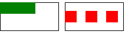
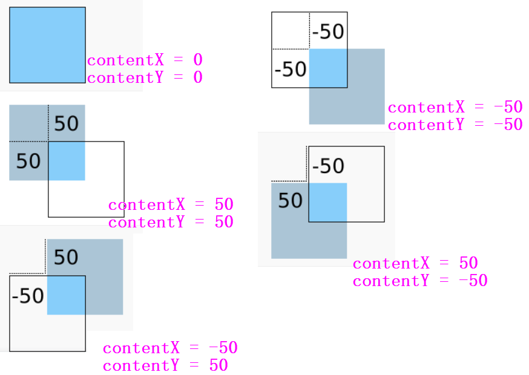

# 布局

# 元素排列

## Column

```qml
    Column{
        spacing: 20 // 控件间间隔
        xxxPadding: 20 // 外围填充
        Button{
            width:100
            height:20
        }
        Button{
            width:100
            height:20
        }
        Button{
            width:100
            height:20
        }
    }
```

## Row

```qml
    Row{
        layoutDirection: Qt.RightToLeft // 排列方向
        Button{
            width:100
            height:20
        }
        Button{
            width:100
            height:20
        }
        Button{
            width:100
            height:20
        }
    }
```

## Grid

```qml
    Grid{
        columns: 3 // 列数，会自动换行
    }
```

# 元素布局

## RowLayout

```qml
    RowLayout{
        Rectangle{
            Layout.fillWidth:true  // 当前 Item 宽度按照最大允许值填充 Layout
            Layout.fillHeight:true // 当前 Item 高度按照最大允许值填充 Layout
        }
        Rectangle{
            Layout.preferredWidth:20   // 当前 Item 宽度度参考给定值填充 Layout
            Layout.preferredHeight:10  // 当前 Item 高度参考给定值填充 Layout
        }
    }
```

>[!note]
> 在启用 `anchors.fill:parent`后，`Row` 只是紧挨着排列元素，而 `RowLayout` 则会调整间距，效果比较接近 `QWidget` 中的布局




## ColumnLayout

```qml
    ColumnLayout{
        Rectangle{
            Layout.fillWidth:true  // 当前 Item 宽度按照最大允许值填充 Layout
            Layout.fillHeight:true // 当前 Item 高度按照最大允许值填充 Layout
        }
        Rectangle{
            Layout.preferredWidth:20   // 当前 Item 宽度度参考给定值填充 Layout
            Layout.preferredHeight:10  // 当前 Item 高度参考给定值填充 Layout
        }
    }
```

## GridLayout

```qml
    GridLayout{

    }
```

# Flow

```qml
    Rectangle{
        width: 100
        height : 50

        // 会根据控件尺寸调整内部控件布局
        Flow{
            flow: Flow.TopToBottom // 方向
            anchors.fill: parent
            Text{
                text: "aaaaaaa"
            }
            Text{
                text: "bbbbbbbb"
            }
        }
    }
```

# Flickable


`Flickable` 可以实现子控件的拖拽与滚动。

```qml
Flickable{
    id: flick

    // Flickable 的宽高，即显示窗口的大小
    width: 100
    height:100

    // contentItem 展示内容的宽高，即哆啦A梦图片的实际大小
    contentHeight: img.height
    contentWidth: img.width

    clip:true // 允许 contentItem 能截取展示
    ScrollBar.vertical: ScrollBar{} // 为 contentItem 添加滚动条

    boundsMovement: Flickable.StopAtBounds // 控制拖动、轻弹功能
    boundsMovement:Flickable.StopAtBounds // 控制移动

    Rectangle{
        // 这里的 parent 并不是 Flickable，的使用 id: flick 才能访问 Flickable
        anchors.fill:parent 
    }
}

```

>[!tip]
> 子控件中使用 `parent` 指代的是 `Flickable.contentItem`，而非`Flickable`。`contentItem` 的大小由 `contentWidth` 和 `contentHeight` 决定

通过属性 `contentX` 与 `contentY` 可以访问控件被拖拽的坐标。以控件初始位置的左上角为坐标原点，x 轴向左为整，y轴向上为正。




# OpacityMask

```qml
    OpacityMask{
        source: src_id // 要展示的图层
        maskSource: mask_id // 遮罩图层
    }
```


